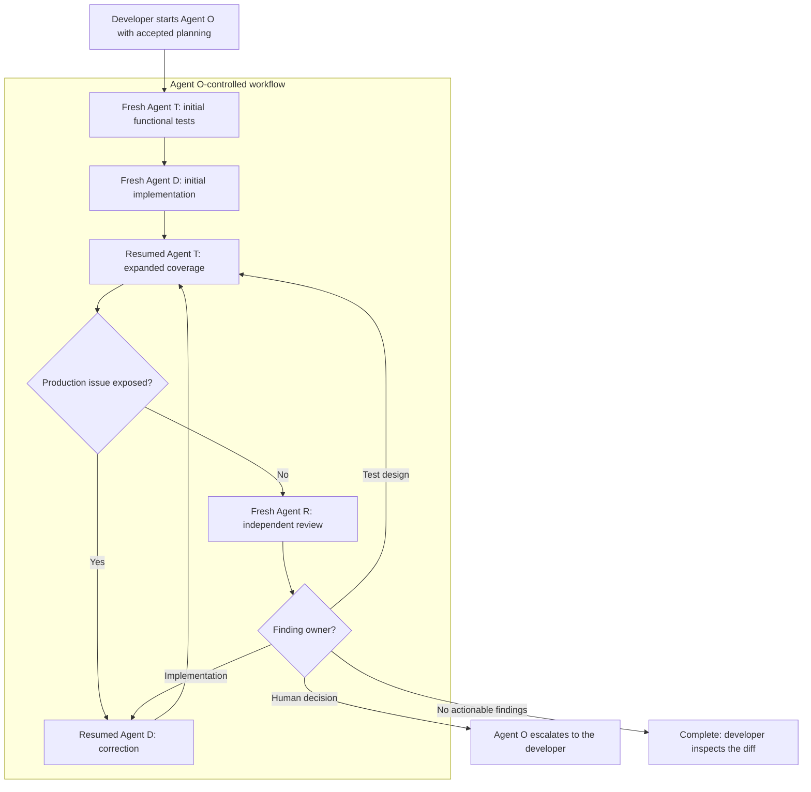

# GAM agent workflow

This is the human-readable overview of the GAM agent workflow. It explains how
the developer starts, observes, and completes the workflow; it is not a
normative source for agent behavior.

## Authority

| Concern | Authoritative source |
|---|---|
| Cross-role state, ownership, results, transitions, and T/D loop completion | [`$gam-agent-workflow`](../../.agents/skills/gam-agent-workflow/SKILL.md) and its [`references/`](../../.agents/skills/gam-agent-workflow/references/) |
| Agent O native orchestration | [`$gam-orchestration`](../../.agents/skills/gam-orchestration/SKILL.md) |
| Role-local work | [`$gam-planning`](../../.agents/skills/gam-planning/SKILL.md), [`$gam-test-design`](../../.agents/skills/gam-test-design/SKILL.md), [`$gam-implementation`](../../.agents/skills/gam-implementation/SKILL.md), and [`$gam-review`](../../.agents/skills/gam-review/SKILL.md) |
| Native Agent O assignments | [`$gam-agent-handoff`](../../.agents/skills/gam-agent-handoff/SKILL.md) |
| Developer-managed copy-and-paste handoffs | [`$gam-human-handoff`](../../.agents/skills/gam-human-handoff/SKILL.md) |
| Native agent definitions and shared defaults | [`.codex/agents/`](../../.codex/agents/) and [`.codex/config.toml`](../../.codex/config.toml) |

Requirement Specifications, the global ubiquitous language, ADRs, OpenAPI, and
supporting documentation remain the durable sources for product behavior and
project decisions. See the
[source-of-truth priority](../documentation-guidelines/source-of-truth.md).

## Prepare and start

1. Complete Agent P planning and resolve blocking questions.
2. Accept the Requirement Specifications, ADRs, and diagrams needed to define
   the implementation.
3. Open a fresh Codex task for the trusted project with permissions that allow
   Agent T and Agent D to modify the workspace.
4. Explicitly invoke `$gam-orchestration` and identify the accepted planning
   artifacts.

Codex loads project `.codex` configuration only for trusted projects. Start a
new task after changing `.codex/config.toml` or `.codex/agents/`; an existing
task may retain its previously loaded configuration.

## Native workflow

Agent O owns the root task. It validates planning readiness, creates structured
assignments, starts or resumes the configured role agents, validates each
structured result, and applies the single legal transition. It does not perform
planning, testing, implementation, or review work.

The diagram is illustrative. The legal-transition table in
`$gam-agent-workflow` is authoritative.

## Role lifecycle

| Role | Lifecycle |
|---|---|
| Agent P | Developer-started planning before orchestration |
| Agent O | Developer-started root task for the complete native workflow |
| Agent T | Fresh initial thread, then resumed for expanded coverage and corrections |
| Agent D | Fresh initial thread, then resumed for production corrections |
| Agent R | Fresh independent thread for every review pass |

Agent T and Agent D run sequentially and retain their role for their entire
thread. Agent T alone declares the T/D loop complete. Agent R reports findings;
Agent O owns all routing.

Before each Agent R turn, Agent O records the repository state. Ignored
verification outputs may change, but a staged, unstaged, or non-ignored
untracked change caused by Agent R invalidates the result and returns control to
the developer.

## Configuration

`.codex/config.toml` owns shared subagent defaults and the thread limit. The
role-specific files under `.codex/agents/` own identity, instructions, and
sandbox intent. Omitting `model` and `model_reasoning_effort` from those files
causes all standard role agents to inherit the shared defaults.

The live permission mode of the Agent O task can supersede a custom agent's
sandbox default. The Agent R repository-state check therefore enforces the
source-edit prohibition even when Agent R inherits workspace-write access.

## Completion and escalation

Agent O completes the workflow only after a valid Agent R result reports no
actionable findings. It then summarizes scope, authoritative artifacts,
verification evidence, review results, and residual risks. The developer
inspects the diff and decides whether to commit or open a pull request.

Agent O stops and returns control to the developer when safe continuation
requires a human decision, a role result is invalid, permissions are
insufficient, native continuation is unreliable, or the correction-cycle limit
is reached.

## Manual fallback

`$gam-human-handoff` is the developer-invoked fallback for moving context
between independent chats. It renders concise Markdown for copy and paste and
does not activate another role.

Native Agent O orchestration instead uses `$gam-agent-handoff` to construct
structured assignments. Do not mix the two handoff mechanisms in one workflow.
