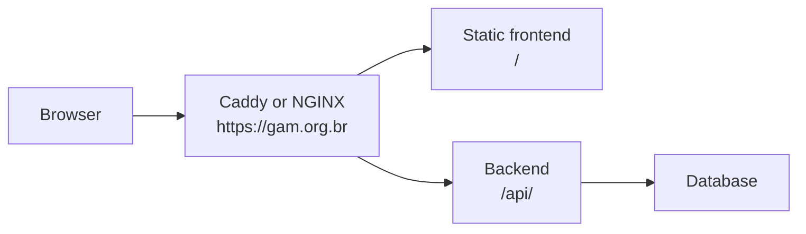
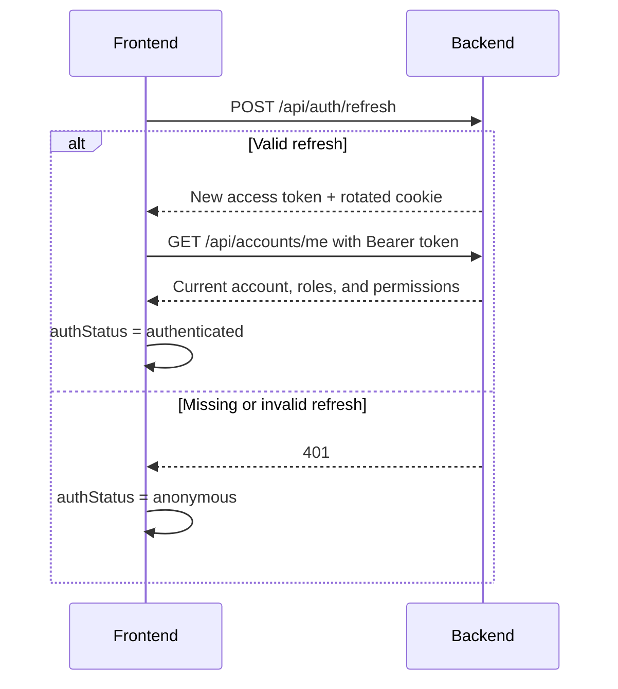

# Frontend–Backend Integration

This guide explains how the GAM frontend should communicate with the backend in a browser. It translates the accepted [Browser Session and Frontend Integration](../requirements/authentication/browser-session-and-frontend-integration.md) and [Web Delivery and Frontend Contract](../requirements/platform/web-delivery-and-frontend-contract.md) requirements into practical guidance for implementation, review, and troubleshooting.

This is a development guideline. It does not replace the OpenAPI contract or a Requirement Specification. When a rule becomes a mandatory product requirement, record it in the corresponding requirements document.

## 1. GAM deployment model

In the initial architecture, the frontend and backend may remain in separate repositories while being published under the same origin:

```text
Frontend: https://gam.org.br/
API:      https://gam.org.br/api/
```

A reverse proxy such as Caddy or NGINX serves the frontend files and forwards `/api/` to the backend container. The browser sees one origin.



Use relative URLs in the frontend:

```javascript
fetch('/api/accounts/me')
```

Avoid hard-coding `http://localhost:8080` or a separate production domain in frontend code. The development configuration should reproduce the same browser-facing model through the dev-server proxy.

## 2. What exactly is CSRF?

CSRF (*Cross-Site Request Forgery*) occurs when a malicious site tricks a user’s browser into sending an action to GAM. The browser may automatically attach a GAM cookie even though the user did not consciously initiate that GAM action.

The risk exists when authentication depends on something the browser sends automatically, especially cookies. CSRF is not about stealing the response: an attacker may be unable to read the response and still be able to cause a state-changing request.

For GAM, the relevant scenario is a refresh token in a cookie. Therefore, `SameSite=Lax`, origin validation, and—when appropriate—a CSRF token are complementary defenses. None replaces authentication, authorization, or XSS protection.

## 3. `Origin` versus `Referer`

`Origin` contains the protocol, host, and port, for example:

```http
Origin: https://gam.org.br
```

It is the first choice for checking whether a sensitive request came from the expected origin. The comparison must be exact; `https://gam.org.br.attacker.com` is not GAM.

`Referer` may contain the URL of the page that initiated the request, including its path, but browser privacy policies may reduce it or omit it. Use it as a fallback when `Origin` is absent.

For endpoints that use cookie-based authentication:

1. if `Origin` exists, require `https://gam.org.br`;
2. otherwise, carefully validate the origin in `Referer`;
3. if neither exists, block the request or, during an explicitly temporary observation phase, log and monitor it;
4. never accept an origin with a naive substring check such as `contains("gam.org.br")`.

These headers help defend against browser-based CSRF. They are not credentials: non-browser clients can forge them.

## 4. When should a CSRF token be used?

Use a CSRF token when an operation depends on a credential that the browser sends automatically, such as a session cookie or refresh-token cookie. The frontend sends an unpredictable value in a header, for example:

```http
X-XSRF-TOKEN: unpredictable-value
```

Normal requests use `Authorization: Bearer` and do not need a CSRF token merely because they use an access token in a header. The accepted browser contract requires cookie-to-header CSRF proof and origin validation for `login`, `refresh`, and `logout`. Public registration does not require that CSRF proof because it neither consumes nor establishes an authentication session.

If authentication later moves to cookies for all operations, apply CSRF protection to all state-changing operations (`POST`, `PUT`, `PATCH`, and `DELETE`). Spring Security provides `CookieCsrfTokenRepository`: the `XSRF-TOKEN` cookie can be read by the frontend and returned in the `X-XSRF-TOKEN` header. This cookie is not the refresh token and must not be treated as a secret.

## 5. What is an access token?

An access token is a temporary credential for accessing the API. The frontend sends it explicitly:

```http
Authorization: Bearer <access-token>
```

The backend validates the credential, identifies the account, and applies permissions to the requested resource. The token may be a JWT or an opaque value; the frontend must not depend on its format.

`Bearer` means that whoever possesses the value can use it. Therefore, do not log tokens, put them in URLs, or make them unnecessarily long-lived. An access token is a credential; a cookie is only a browser mechanism for storing and sending data. A cookie may carry a refresh token, but the concepts are not equivalent.

## 6. How can login be maintained without `localStorage`?

The recommended model is:

* keep the access token only in JavaScript memory (application state/context);
* keep the refresh token in an `HttpOnly`, `Secure`, `SameSite=Lax` cookie with a path restricted to `/api/auth` when compatible with the API contract.

During login, the backend returns the access token in the response body and sets the refresh cookie. The frontend keeps the access token in memory. A page reload therefore loses the access token, but the browser can still send the refresh cookie without exposing its value to JavaScript.

When a request receives `401` because the access token expired:

1. call `POST /api/auth/refresh`;
2. let the browser send the `HttpOnly` cookie;
3. accept the backend’s refresh-token rotation;
4. store the new access token in memory;
5. retry the original request at most once;
6. if refresh fails, clear authentication state and redirect to login.

The frontend must coordinate concurrent refreshes: multiple expired requests should await the same refresh operation rather than trigger simultaneous rotations.

This strategy reduces the exposure of persistent credentials to JavaScript. It does not remove the impact of XSS: malicious code can still use the session while the page is open.

## 7. What does “try refresh and then load `/accounts/me`” mean?

When the application opens, the frontend must not immediately assume that the user is authenticated or anonymous. Use an intermediate state such as `authStatus = "loading"`.



`/api/auth/refresh` rebuilds the credential using the `HttpOnly` cookie. Then `/api/accounts/me` confirms the session and loads current account data, including effective permissions used by the interface.

Do not treat the existence of an old token as proof of login. If refresh fails, or if `/accounts/me` returns `401`, treat the user as anonymous. The accepted bootstrap contract requires `/api/accounts/me` after refresh; do not omit it without changing the owning Requirement Specification.

## 8. What is CORS, and why does it become unnecessary?

CORS is the mechanism through which a backend authorizes JavaScript from another origin to read its responses. For example, `https://app.gam.org.br` and `https://api.gam.org.br` have different hosts, even though they belong to the same site, and would require CORS configuration and potentially an `OPTIONS` preflight.

Because GAM uses `https://gam.org.br` for the frontend and `/api/` for the backend, normal communication is same-origin. The browser does not need `Access-Control-Allow-Origin`, `Access-Control-Allow-Credentials`, or a CORS policy for this communication.

In development, the frontend and backend may run on different ports. Configure the Vite (or equivalent) proxy:

```text
Browser: localhost:5173/api
Development proxy: localhost:8080
```

The browser continues to communicate with one origin, and the setup stays close to production.

CORS is not CSRF protection. Preventing a response from being read does not necessarily prevent a malicious site from attempting to trigger a request. The application still needs correct authentication, authorization, `SameSite`, origin validation, and a CSRF token where applicable.

## References

* [OWASP — Cross-Site Request Forgery Prevention Cheat Sheet](https://cheatsheetseries.owasp.org/cheatsheets/Cross-Site_Request_Forgery_Prevention_Cheat_Sheet.html)
* [Spring Security — CSRF for single-page applications](https://docs.spring.io/spring-security/reference/servlet/exploits/csrf.html)
* [MDN — Cross-Origin Resource Sharing (CORS)](https://developer.mozilla.org/en-US/docs/Web/HTTP/Guides/CORS)
* [RFC 6750 — OAuth 2.0 Bearer Token Usage](https://www.rfc-editor.org/rfc/rfc6750)
