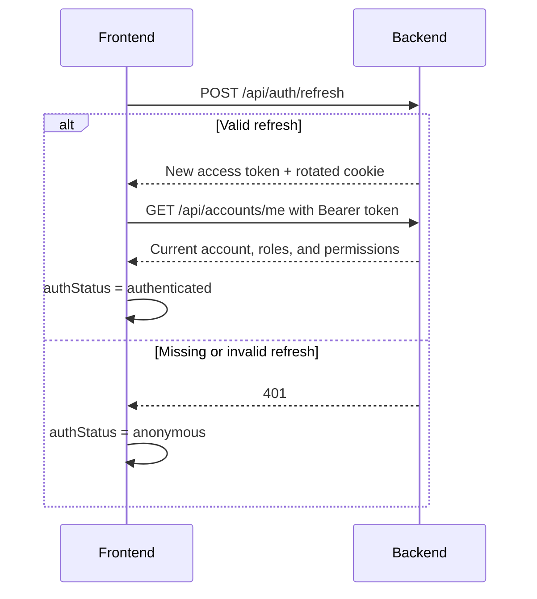

# Frontend–Backend Concepts

Use this reference when you need to understand the security and browser behavior behind GAM frontend integration.

## What exactly is CSRF?

CSRF (*Cross-Site Request Forgery*) occurs when a malicious site tricks a user’s browser into sending an action to GAM. The browser may automatically attach a GAM cookie even though the user did not consciously initiate the action.

The risk exists when authentication depends on something the browser sends automatically, especially cookies. An attacker may be unable to read the response and still cause a state-changing request.

For GAM, the relevant scenario is a refresh token in a cookie. `SameSite=Lax`, origin validation, and—when appropriate—a CSRF token are complementary defenses. None replaces authentication, authorization, or XSS protection.

## `Origin` versus `Referer`

`Origin` contains the protocol, host, and port:

```http
Origin: https://gam.org.br
```

For sensitive cookie-authenticated requests, compare it exactly. `https://gam.org.br.attacker.com` is not GAM.

`Referer` may contain the initiating page URL, but browser privacy policies may reduce or omit it. Use it as a fallback when `Origin` is absent.

For cookie-authenticated endpoints:

1. require the exact `https://gam.org.br` origin when `Origin` exists;
2. otherwise validate the origin in `Referer`;
3. block requests when neither header exists, unless a temporary, documented observation phase applies;
4. never use a substring check such as `contains("gam.org.br")`.

These headers help defend against browser-based CSRF. They are not credentials and can be forged by non-browser clients.

## When should a CSRF token be used?

Use a CSRF token when an operation depends on a credential that the browser sends automatically, such as a session or refresh-token cookie. The frontend returns the unpredictable cookie value in a header:

```http
X-XSRF-TOKEN: unpredictable-value
```

GAM requires cookie-to-header CSRF proof and origin validation for `login`, `refresh`, and `logout`. Public registration does not require this proof because it neither consumes nor establishes an authentication session.

If authentication later moves to cookies for all operations, apply CSRF protection to state-changing operations: `POST`, `PUT`, `PATCH`, and `DELETE`.

The `XSRF-TOKEN` cookie is not the refresh token and is not a secret. Do not log or treat it as an authentication credential.

## What is an access token?

An access token is a temporary credential for API access:

```http
Authorization: Bearer <access-token>
```

The backend validates it, identifies the account, and applies permissions. The token may be a JWT or an opaque value; frontend code must not depend on its format.

`Bearer` means whoever possesses the value can use it. Do not log tokens, put them in URLs, or make them unnecessarily long-lived. A cookie is a browser storage and transport mechanism; it is not equivalent to an access token.

## How can login be maintained without `localStorage`?

Use this model:

- keep the access token in JavaScript memory;
- keep the refresh token in an `HttpOnly`, `Secure`, `SameSite=Lax` cookie scoped to `/api/auth` when compatible with the API contract.

After login, the backend returns the access token in the response body and sets the refresh cookie. A page reload loses the access token, but the browser can still send the refresh cookie without exposing its value to JavaScript.

When a request receives `401` because the access token expired:

1. call `POST /api/auth/refresh`;
2. let the browser send the `HttpOnly` cookie;
3. accept refresh-token rotation;
4. store the new access token in memory;
5. retry the original request at most once;
6. clear authentication state if refresh fails.

Coordinate concurrent refreshes so multiple expired requests await one refresh operation. This reduces persistent credential exposure to JavaScript but does not remove the impact of XSS while the page is open.

## What does “try refresh and then load `/accounts/me`” mean?

On application startup, use an intermediate state such as `authStatus = "loading"`. Do not immediately assume authenticated or anonymous.



`/api/auth/refresh` rebuilds the credential from the `HttpOnly` cookie. `/api/accounts/me` confirms the session and loads current account data, including effective permissions.

If refresh fails or `/accounts/me` returns `401`, treat the user as anonymous. Do not omit `/accounts/me` without changing the owning Requirement Specification.

## What is CORS, and why does it become unnecessary?

CORS controls whether JavaScript from one origin may read responses from another origin. Different hosts or ports are different origins and may require CORS configuration and an `OPTIONS` preflight.

GAM uses `https://gam.org.br` for both the frontend and `/api/`, so normal production communication is same-origin. It does not need `Access-Control-Allow-Origin`, `Access-Control-Allow-Credentials`, or a CORS policy for that communication.

In development, the frontend and backend may use different ports while the browser still calls one origin through the frontend proxy:

```text
Browser:           localhost:5173/api
Development proxy: localhost:8080
```

CORS is not CSRF protection. Blocking a response from being read does not necessarily stop a malicious site from attempting a request.

## References

- [OWASP — Cross-Site Request Forgery Prevention Cheat Sheet](https://cheatsheetseries.owasp.org/cheatsheets/Cross-Site_Request_Forgery_Prevention_Cheat_Sheet.html)
- [Spring Security — CSRF for single-page applications](https://docs.spring.io/spring-security/reference/servlet/exploits/csrf.html)
- [MDN — Cross-Origin Resource Sharing (CORS)](https://developer.mozilla.org/en-US/docs/Web/HTTP/Guides/CORS)
- [RFC 6750 — OAuth 2.0 Bearer Token Usage](https://www.rfc-editor.org/rfc/rfc6750)
