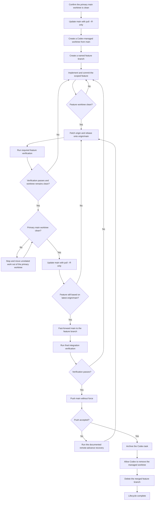

```mermaid
flowchart TD
    A["Confirm the primary main worktree is clean"] --> B["Update main with pull --ff-only"]
    B --> C["Create a Codex-managed worktree from main"]
    C --> D["Create a named feature branch"]
    D --> E["Implement and commit the scoped feature"]
    E --> F{"Feature worktree clean?"}
    F -- No --> E
    F -- Yes --> G["Fetch origin and rebase onto origin/main"]
    G --> H["Run required feature verification"]
    H --> I{"Verification passes and worktree remains clean?"}
    I -- No --> E
    I -- Yes --> J{"Primary main worktree clean?"}
    J -- No --> K["Stop and move unrelated work out of the primary worktree"]
    K --> J
    J -- Yes --> L["Update main with pull --ff-only"]
    L --> M{"Feature still based on latest origin/main?"}
    M -- No --> G
    M -- Yes --> N["Fast-forward main to the feature branch"]
    N --> O["Run final integration verification"]
    O --> P{"Verification passes?"}
    P -- No --> E
    P -- Yes --> Q["Push main without force"]
    Q --> R{"Push accepted?"}
    R -- No --> S["Run the documented remote-advance recovery"]
    S --> G
    R -- Yes --> T["Archive the Codex task"]
    T --> U["Allow Codex to remove the managed worktree"]
    U --> V["Delete the merged feature branch"]
    V --> W["Lifecycle complete"]
```
