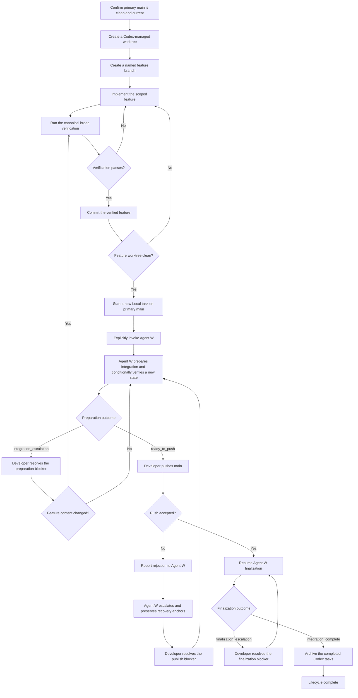

```mermaid
flowchart TD
    A["Confirm primary main is clean and current"] --> B["Create a Codex-managed worktree"]
    B --> C["Create a named feature branch"]
    C --> D["Implement the scoped feature"]
    D --> E["Run the canonical broad verification"]
    E --> F{"Verification passes?"}
    F -- No --> D
    F -- Yes --> G["Commit the verified feature"]
    G --> H{"Feature worktree clean?"}
    H -- No --> D
    H -- Yes --> I["Start a new Local task on primary main"]
    I --> J["Explicitly invoke Agent W"]
    J --> K["Agent W prepares integration and conditionally verifies a new state"]
    K --> L{"Preparation outcome"}
    L -- "integration_escalation" --> M["Developer resolves the preparation blocker"]
    M --> N{"Feature content changed?"}
    N -- Yes --> E
    N -- No --> K
    L -- "ready_to_push" --> O["Developer pushes main"]
    O --> P{"Push accepted?"}
    P -- No --> Q["Report rejection to Agent W"]
    Q --> V["Agent W escalates and preserves recovery anchors"]
    V --> W["Developer resolves the publish blocker"]
    W --> K
    P -- Yes --> R["Resume Agent W finalization"]
    R --> S{"Finalization outcome"}
    S -- "finalization_escalation" --> X["Developer resolves the finalization blocker"]
    X --> R
    S -- "integration_complete" --> T["Archive the completed Codex tasks"]
    T --> U["Lifecycle complete"]
```
