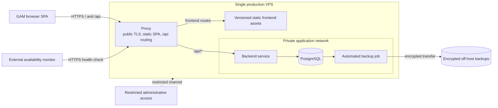

# Initial Production Topology

This diagram shows the accepted initial GAM delivery and operations boundary. The proxy label is intentionally product-neutral: Caddy, Nginx, or another implementation may be selected later if it satisfies the accepted responsibilities.

## Proxy goal in the GAM workflow

The proxy is the only public GAM application ingress. It gives the browser one canonical origin while routing two different workloads:

- frontend routes are served from the static SPA artifact;
- `/api/*` routes are forwarded to the private backend;
- HTTP is redirected to HTTPS and public TLS terminates at the proxy;
- original public scheme and host information is forwarded through a trusted boundary; and
- backend and database application ports remain unavailable from the public internet.

The proxy does not replace backend authentication, authorization, validation, or API error handling. Same-origin delivery also does not replace CSRF or XSS defenses.

## Accepted limitations

- The VPS is a single point of failure and compromise.
- Planned maintenance may make all GAM components unavailable.
- Backups and external monitoring reduce recovery risk but do not create high availability.
- The official domain, VPS provider, proxy product, and proxy packaging model remain open decisions.

## Related documentation

- [Web Delivery and Frontend Contract](../requirements/platform/web-delivery-and-frontend-contract.md)
- [Production Operations](../requirements/platform/production-operations.md)
- [Browser Session and Frontend Integration](../requirements/authentication/browser-session-and-frontend-integration.md)
- [ADR-0005: Keep Frontend and Backend in Separate Repositories](../decisions/0005-keep-frontend-and-backend-in-separate-repositories.md)
- [ADR-0006: Use a Single-VPS Same-Origin Proxy Topology](../decisions/0006-use-a-single-vps-same-origin-proxy-topology.md)
- [ADR-0007: Use Same-Origin Browser Sessions with Layered CSRF Protection](../decisions/0007-use-same-origin-browser-sessions-with-layered-csrf-protection.md)
