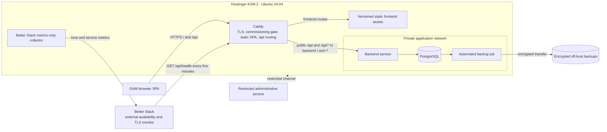
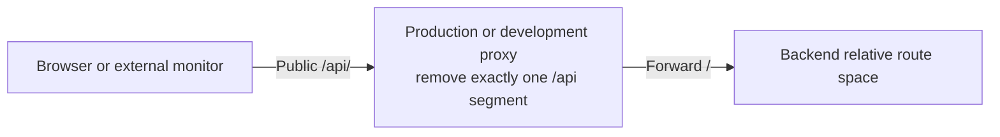

# Initial Production Topology

This diagram shows the accepted initial GAM delivery and operations boundary. ADR-0024 fixes Hostinger KVM 2, Ubuntu 24.04, and containerized Caddy for the first deployment while ADR-0028 fixes the external monitoring and commissioning boundaries.

```mermaid
flowchart LR
    Browser["GAM browser SPA"]
    Monitor["Better Stack<br/>external availability and TLS monitor"]
    Admin["Restricted administrative access"]
    BackupStore[("Encrypted off-host backups")]

    subgraph VPS["Hostinger KVM 2 - Ubuntu 24.04"]
        direction LR
        Proxy["Caddy<br/>TLS, commissioning gate, static SPA, /api routing"]
        Static["Versioned static frontend assets"]
        Collector["Better Stack metrics-only collector"]

        subgraph Private["Private application network"]
            Backend["Backend service"]
            Database[("PostgreSQL")]
            BackupJob["Automated backup job"]
        end

        Proxy -->|"frontend routes"| Static
        Proxy -->|"public /api and /api/* to backend / and /*"| Backend
        Backend --> Database
        Database --> BackupJob
    end

    Browser -->|"HTTPS / and /api"| Proxy
    Monitor -->|"GET /api/health every five minutes"| Proxy
    Collector -->|"host and service metrics"| Monitor
    Admin -. "restricted channel" .-> VPS
    BackupJob -->|"encrypted transfer"| BackupStore
```

## Proxy goal in the GAM workflow

The proxy is the only public GAM application ingress. It gives the browser one canonical origin while routing two different workloads:

- frontend routes are served from the static SPA artifact;
- `/api` and `/api/*` routes have exactly one leading `/api` segment removed
  before they are forwarded to the private backend;
- HTTP is redirected to HTTPS and public TLS terminates at the proxy;
- original public scheme and host information is forwarded through a trusted boundary; and
- backend and database application ports remain unavailable from the public internet.

The proxy does not replace backend authentication, authorization, validation, or API error handling. Same-origin delivery also does not replace CSRF or XSS defenses.

## API path transformation

[ADR-0030](../decisions/0030-remove-the-public-api-prefix-at-the-proxy-boundary.md)
defines the accepted transformation from the public `/api` routing boundary to
the backend-relative route space.

```mermaid
flowchart LR
    Client["Browser or external monitor"]
    Proxy["Production or development proxy<br/>remove exactly one /api segment"]
    Backend["Backend relative route space"]

    Client -->|"Public /api/<relative-path>"| Proxy
    Proxy -->|"Forward /<relative-path>"| Backend
```

Examples of the accepted mapping:

| Public path | Backend-relative path |
| --- | --- |
| `/api/members` | `/members` |
| `/api/auth/login` | `/auth/login` |
| `/api/health` | `/health` |
| `/api/docs` | `/docs` |
| `/api/openapi.json` | `/openapi.json` |

Public `Location` response headers remain application-owned and begin with
`/api`; the proxy transformation does not rewrite them.

## Accepted limitations

- The VPS is a single point of failure and compromise.
- Planned maintenance may make all GAM components unavailable.
- Backups and external monitoring reduce recovery risk but do not create high availability.
- The official GAM-controlled domain remains an open decision.
- KVM 2 procurement facts must still be reverified at purchase and renewal.

## Related documentation

- [Web Delivery and Frontend Contract](../requirements/platform/web-delivery-and-frontend-contract.md)
- [Production Operations](../requirements/platform/production-operations.md)
- [Browser Session and Frontend Integration](../requirements/authentication/browser-session-and-frontend-integration.md)
- [ADR-0005: Keep Frontend and Backend in Separate Repositories](../decisions/0005-keep-frontend-and-backend-in-separate-repositories.md)
- [ADR-0006: Use a Single-VPS Same-Origin Proxy Topology](../decisions/0006-use-a-single-vps-same-origin-proxy-topology.md)
- [ADR-0007: Use Same-Origin Browser Sessions with Layered CSRF Protection](../decisions/0007-use-same-origin-browser-sessions-with-layered-csrf-protection.md)
- [ADR-0024: Deploy Production Directly to Hostinger KVM 2](../decisions/0024-deploy-production-directly-to-hostinger-kvm-2.md)
- [ADR-0025: Use AWS São Paulo for Immutable Encrypted Production Backups](../decisions/0025-use-aws-sao-paulo-for-immutable-encrypted-production-backups.md)
- [ADR-0028: Complete the Initial Production Commissioning and Release Contracts](../decisions/0028-complete-initial-production-commissioning-and-release-contracts.md)
- [ADR-0030: Remove the Public API Prefix at the Proxy Boundary](../decisions/0030-remove-the-public-api-prefix-at-the-proxy-boundary.md)
- [Public API Prefix Routing](../requirements/platform/public-api-prefix-routing.md)
