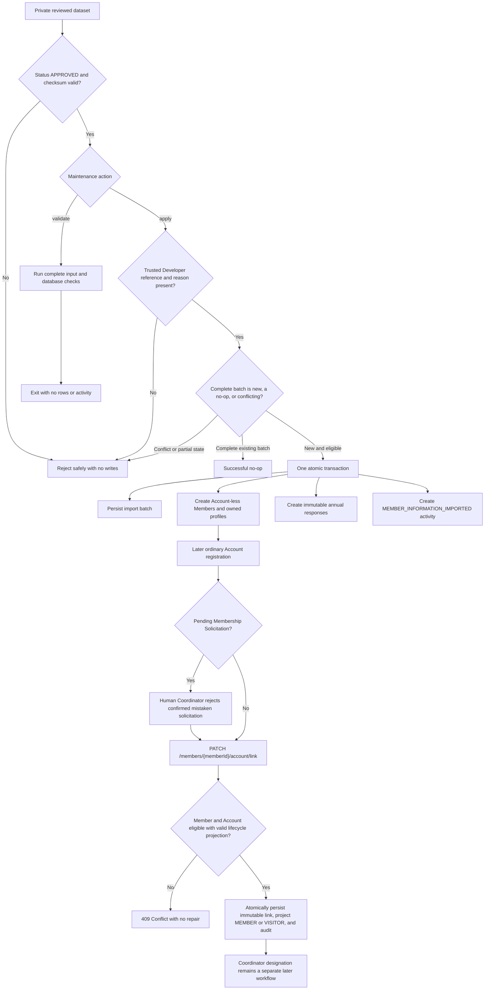

# Member Information Import and Account Linking

This diagram supports the accepted Member Information Import and Account
Linking Requirement Specification and ADR-0026. It does not supersede their
written rules.

