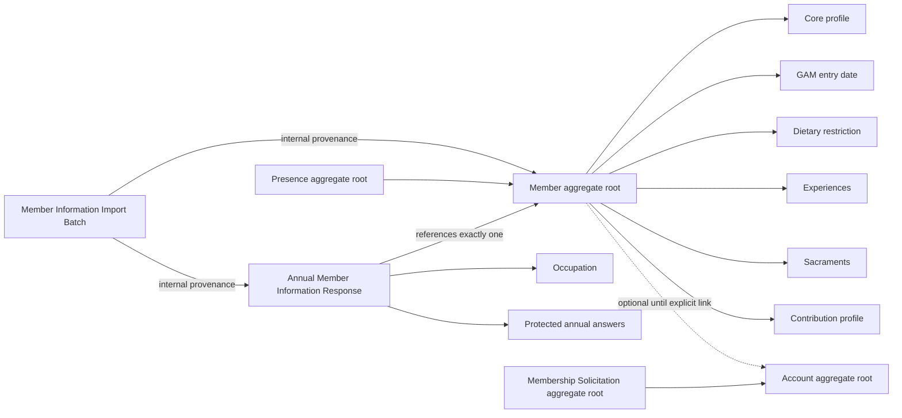

# Member Information Ownership

This diagram supports the accepted Member Information and Member Information
Import and Account Linking Requirement Specifications. It does not supersede
their written rules.

