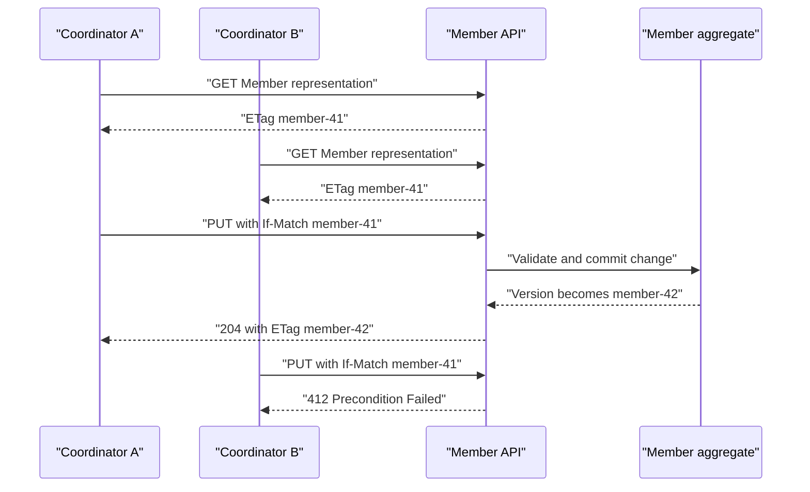

# Member Information Update Concurrency

This diagram supports the accepted Member Information Requirement
Specification and ADR-0027. It illustrates the shared Member aggregate ETag
without replacing the written concurrency and error rules.

