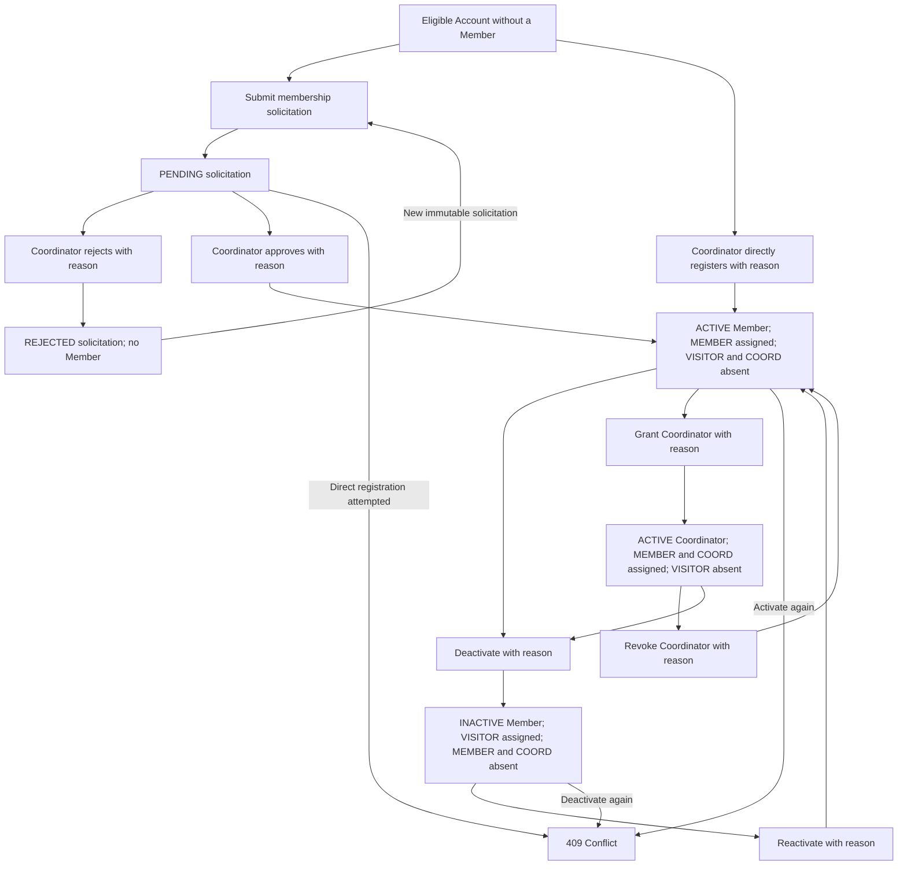

# Member Lifecycle and Membership Solicitation

This diagram supports the Member Records and Lifecycle and Membership Solicitations Requirement Specifications. Written requirements remain authoritative.

## Related requirements

* [Member Records and Lifecycle](../requirements/members/member-records-and-lifecycle.md)
* [Membership Solicitations](../requirements/members/membership-solicitations.md)

## Related ADRs

* [ADR-0013: Make Member lifecycle own Coordinator designation](../decisions/0013-make-member-lifecycle-own-coordinator-designation.md)
