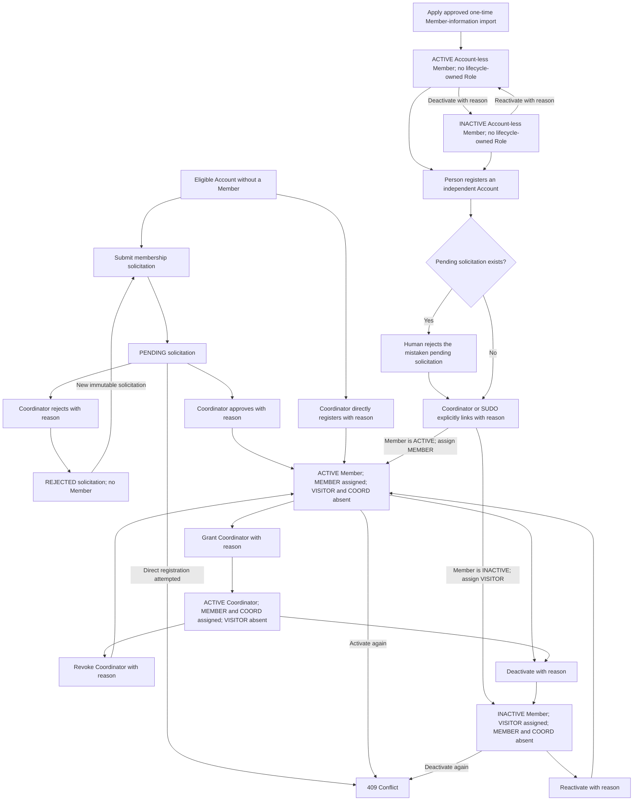

# Member Lifecycle and Membership Solicitation

This diagram supports the Member Records and Lifecycle and Membership Solicitations Requirement Specifications. It includes the accepted one-time Account-less import exception and the later explicit Account-linking path. Written requirements remain authoritative.

```mermaid
flowchart TD
    Eligible["Eligible Account without a Member"]
    Submit["Submit membership solicitation"]
    Pending["PENDING solicitation"]
    Reject["Coordinator rejects with reason"]
    Rejected["REJECTED solicitation; no Member"]
    Approve["Coordinator approves with reason"]
    Direct["Coordinator directly registers with reason"]
    Active["ACTIVE Member; MEMBER assigned; VISITOR and COORD absent"]
    Import["Apply approved one-time Member-information import"]
    AccountlessActive["ACTIVE Account-less Member; no lifecycle-owned Role"]
    AccountlessInactive["INACTIVE Account-less Member; no lifecycle-owned Role"]
    RegisterAccount["Person registers an independent Account"]
    PendingCheck{"Pending solicitation exists?"}
    ResolveSolicitation["Human rejects the mistaken pending solicitation"]
    Link["Coordinator or SUDO explicitly links with reason"]
    GrantCoord["Grant Coordinator with reason"]
    Coordinator["ACTIVE Coordinator; MEMBER and COORD assigned; VISITOR absent"]
    RevokeCoord["Revoke Coordinator with reason"]
    Deactivate["Deactivate with reason"]
    Inactive["INACTIVE Member; VISITOR assigned; MEMBER and COORD absent"]
    Reactivate["Reactivate with reason"]
    Blocked["409 Conflict"]

    Eligible --> Submit --> Pending
    Pending --> Reject --> Rejected
    Rejected -->|"New immutable solicitation"| Submit
    Pending --> Approve --> Active
    Eligible --> Direct --> Active
    Import --> AccountlessActive
    AccountlessActive -->|"Deactivate with reason"| AccountlessInactive
    AccountlessInactive -->|"Reactivate with reason"| AccountlessActive
    AccountlessActive --> RegisterAccount
    AccountlessInactive --> RegisterAccount
    RegisterAccount --> PendingCheck
    PendingCheck -->|"Yes"| ResolveSolicitation --> Link
    PendingCheck -->|"No"| Link
    Link -->|"Member is ACTIVE; assign MEMBER"| Active
    Link -->|"Member is INACTIVE; assign VISITOR"| Inactive
    Pending -->|"Direct registration attempted"| Blocked
    Active --> Deactivate --> Inactive
    Active --> GrantCoord --> Coordinator
    Coordinator --> RevokeCoord --> Active
    Coordinator --> Deactivate
    Inactive --> Reactivate --> Active
    Active -->|"Activate again"| Blocked
    Inactive -->|"Deactivate again"| Blocked
```

## Related requirements

* [Member Records and Lifecycle](../requirements/members/member-records-and-lifecycle.md)
* [Membership Solicitations](../requirements/members/membership-solicitations.md)
* [Member Information Import and Account Linking](../requirements/members/member-information-import-and-account-linking.md)

## Related diagrams

* [Member Information Import and Account Linking](member-information/import-and-account-linking.md)

## Related ADRs

* [ADR-0013: Make Member lifecycle own Coordinator designation](../decisions/0013-make-member-lifecycle-own-coordinator-designation.md)
* [ADR-0026: Use an isolated atomic Member-information import with explicit later Account linking](../decisions/0026-use-isolated-member-information-import-with-explicit-account-linking.md)
