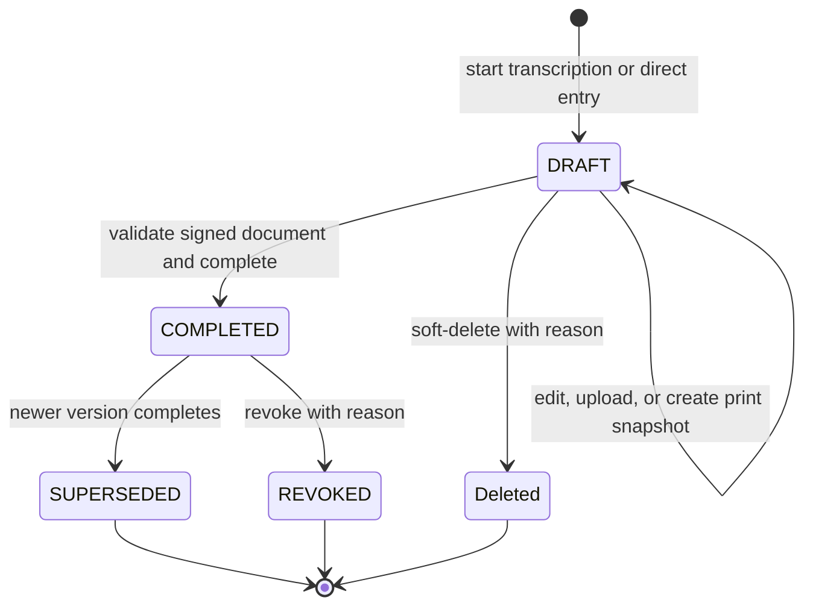
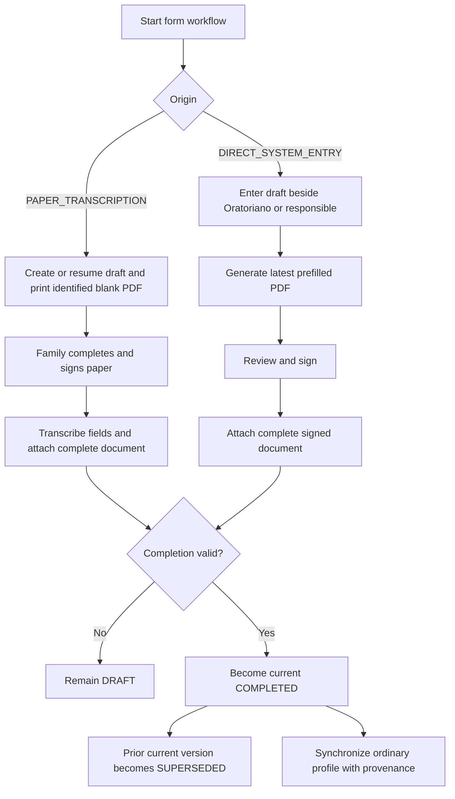

# Oratoriano Additional Form Lifecycle

Completion requires all structured and conditional data, affirmative declarations and image-and-voice authorization, a valid `signedOn`, and the complete signed attachment. `COMPLETED`, `SUPERSEDED`, and `REVOKED` are immutable; only `DRAFT` may be soft-deleted.

## Related requirements

- [Oratoriano Additional Forms](../requirements/oratorianos/oratoriano-additional-forms.md)
- [Oratoriano Records](../requirements/oratorianos/oratoriano-records.md)

## Related ADRs

- [ADR-0016: Store signed Oratoriano form attachments in PostgreSQL](../decisions/0016-store-signed-oratoriano-form-attachments-in-postgresql.md)
