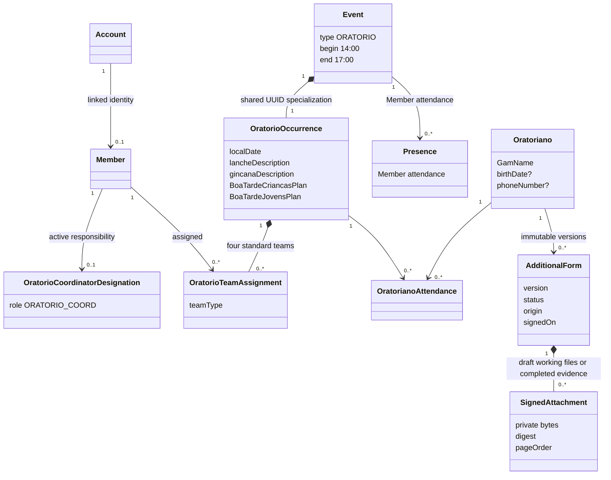

# Oratorio Module Domain

This diagram summarizes the planned module boundaries and relationships. Requirements remain authoritative for behavior and cardinality details.

## Related requirements

- [Oratorio Coordinator Designation](../requirements/oratorio/oratorio-coordinator-designation.md)
- [Oratorio Occurrences and Planning](../requirements/oratorio/oratorio-occurrences-and-planning.md)
- [Oratorio Attendance Tracker](../requirements/oratorio/oratorio-attendance-tracker.md)
- [Oratoriano Records](../requirements/oratorianos/oratoriano-records.md)
- [Oratoriano Additional Forms](../requirements/oratorianos/oratoriano-additional-forms.md)
- [Draft Signed-Attachment Collection Management](../requirements/oratorianos/incremental-signed-attachment-uploads.md)

## Related ADRs

- [ADR-0034: Treat signed attachments as transient until form completion](../decisions/0034-treat-signed-attachments-as-transient-until-form-completion.md)
