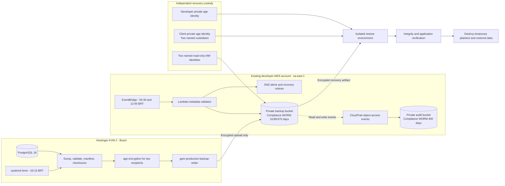

# Production Backup and Recovery

This diagram supports the accepted production backup requirements and AWS backup ADR. It distinguishes write-only production automation, independent monitoring, immutable audit, and human recovery custody.

Related documentation:

- [Production Backup and Recovery Requirement Specification](../requirements/platform/production-backup-and-recovery.md)
- [ADR-0025: Use AWS São Paulo for immutable encrypted production backups](../decisions/0025-use-aws-sao-paulo-for-immutable-encrypted-production-backups.md)
