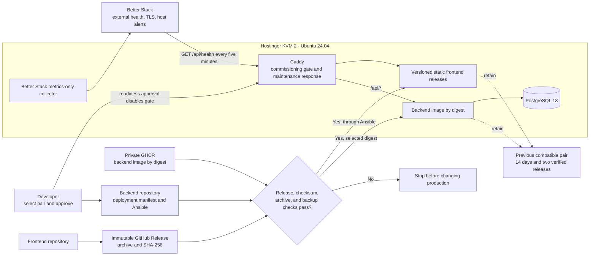

# Production Release and Commissioning

This diagram shows the accepted cross-repository artifact, approval, commissioning, verification, and rollback boundaries. It supplements the written requirements; it does not replace their exact status, checksum, timing, or access rules.

Related documentation:

- [Web Delivery and Frontend Contract](../requirements/platform/web-delivery-and-frontend-contract.md)
- [Production Operations](../requirements/platform/production-operations.md)
- [ADR-0028: Complete the Initial Production Commissioning and Release Contracts](../decisions/0028-complete-initial-production-commissioning-and-release-contracts.md)
