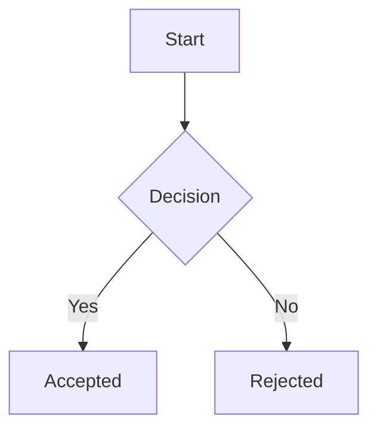
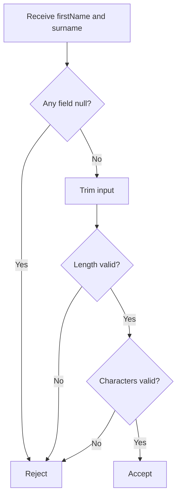
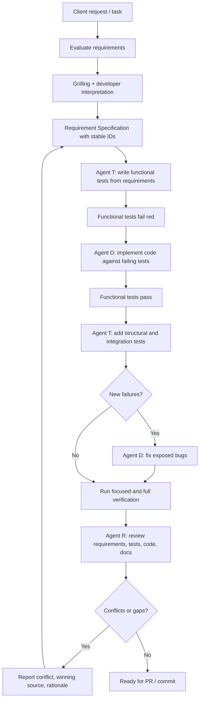

# Documentation Guidelines

This project uses lightweight documentation as code.

The goal is to make requirements, architecture decisions, diagrams, API behavior, and implementation rationale clear enough for both humans and LLM agents.

Documentation must be simple, versioned, easy to review in pull requests, and stored in the GitHub repository.

---

## Core decisions

This project uses:

* Requirement Specifications
* ADRs: Architecture Decision Records
* Mermaid diagrams
* Swagger/OpenAPI for backend API documentation
* Videos only as supplemental explanation

---

## Documentation language

Use this vocabulary consistently:

* Requirement Specification: a Markdown document under `docs/requirements/` that describes expected behavior and business rules for one feature, concept, or domain rule group.
* Requirement: an individual rule inside a Requirement Specification, identified by a stable `REQ-<AREA>-<NUMBER>` ID.
* ADR: an Architecture Decision Record under `docs/decisions/` that documents an architecture or design decision.
* Diagram: a Mermaid diagram that supports a Requirement Specification, ADR, or API behavior description.
* OpenAPI contract: the externally visible backend API contract.

Example relationships:

---

## Repository structure

```text
docs/
  requirements/
    common/
      name.md
    users/
      create-user.md

  decisions/
    0001-use-adrs.md
    0002-use-mermaid.md
    0003-video-documentation-policy.md

  diagrams/
    name-validation-flow.md
    backend-overview.md

  api/
    openapi.md

  testing/
    traceability/
      name-test-matrix.md
```

---

## General documentation rules

1. Requirements must be written before implementation or testing whenever possible.
2. Business rules must not be inferred from the current implementation.
3. If a requirement is missing, unclear, or contradictory, the agent or developer must stop and ask for clarification.
4. Requirements must use stable IDs.
5. Requirements must include valid and invalid examples when applicable.
6. Architecture and design decisions must be documented as ADRs.
7. Diagrams must be written using Mermaid.
8. Videos may be used only as additional explanation.
9. Videos must be linked as YouTube videos inside the official documentation.
10. Video documentation must not replace written requirements, ADRs, or diagrams.

---

# Requirement Specifications

## Purpose

Describe what the system must do, are not responsible for defining test classes, test methods, or test implementation details. Testing documentation may reference Requirement Specifications and requirement IDs, but Requirement Specifications should remain focused on expected behavior and business rules.

---

## Requirement Specification file naming

Use one file per feature, concept, or domain rule group. Examples:

```text
docs/requirements/common/name.md
docs/requirements/users/create-user.md
docs/requirements/authentication/login.md
```

---

## Requirement ID format

Recommended format:

```text
REQ-<AREA>-<NUMBER>
```

Examples:

```text
REQ-NAME-001
REQ-NAME-002
REQ-USER-001
REQ-AUTH-001
```

Rules:

* IDs must not be reused.
* Deprecated requirements should remain documented.
* If a requirement changes meaning significantly, create a new requirement ID.
* Code, commits, PRs, tests, and ADRs may reference requirement IDs.

---

## Requirement statuses

```text
Draft
Accepted
Deprecated
Superseded
```

* `Draft`: not final; implementation should not depend on it without confirmation.
* `Accepted`: approved source of truth.
* `Deprecated`: no longer valid, but kept for history.
* `Superseded`: replaced by another requirement.

---

## Requirement Specification structure template

````md
# Requirement: <Name>

## Status
Draft | Accepted | Deprecated | Superseded

## Context
Explain why this requirement exists.

## Glossary
- `<term>`: Definition.
- `<term>`: Definition.

## Functional requirements

### REQ-AREA-001: <Requirement title>
The `<system/component>` shall `<required behavior>`.

Rationale:
Explain why this rule exists.

Valid examples:
- Example 1
- Example 2
...

Invalid examples:
- Example 1
- Example 2
...

---

### REQ-AREA-002: <Requirement title>
The `<system/component>` shall `<required behavior>`.

Rationale:
Explain why this rule exists.

Valid examples:
- Example 1

Invalid examples:
- Example 1

## Acceptance scenarios

```gherkin
Scenario: <Scenario name>
  Given <initial condition>
  When <action happens>
  Then <expected result>
````

## Diagrams



## Open questions

* Question 1
* Question 2

## Related ADRs

* ADR-0001: <Decision title>

## Related videos

* YouTube: <link>

---

## Requirement writing style

Prefer clear, testable statements.

Good:

```text
The Name value object shall reject null firstName and null surname.
````

Bad:

```text
The Name should probably have valid data.
```

Good:

```text
The Name value object shall reject names made only of separators.
```

Bad:

```text
Names should look normal.
```

Avoid vague words unless they are explicitly defined:

* valid
* normal
* proper
* reasonable
* user-friendly
* secure
* fast
* simple

If these words are necessary, define them in the requirement.

---

## Markdown requirement example

```text
docs/requirements/common/name.md
```

Content:

````md
# Requirement: Name

## Status
Accepted

## Context
The system stores personal names. Name validation must be centralized so that all parts of the application apply the same rules.

The `Name` value object is responsible for validating and normalizing personal names.

## Glossary
- `firstName`: The person's given name.
- `surname`: The person's family name or last name.
- `separator`: A space, hyphen, or apostrophe used inside a name.

## Functional requirements

### REQ-NAME-001: Required fields
The `Name` value object shall reject null `firstName` and null `surname`.

Rationale:
A persisted name must always have both required components.

Valid examples:
- `new Name("Eduardo", "Ferraz")`

Invalid examples:
- `new Name(null, "Ferraz")`
- `new Name("Eduardo", null)`

---

### REQ-NAME-002: Length limits
The `Name` value object shall reject `firstName` values shorter than 2 characters or longer than 32 characters.

The `Name` value object shall reject `surname` values shorter than 2 characters or longer than 64 characters.

Rationale:
Name fields must have explicit domain limits instead of relying only on database column limits.

Valid examples:
- `"Jo"`
- `"Ana Maria"`

Invalid examples:
- `"A"`
- `firstName` with 33 characters
- `surname` with 65 characters

---

### REQ-NAME-003: Allowed characters
The `Name` value object shall accept Unicode letters, spaces, hyphens, and apostrophes.

The `Name` value object shall reject numbers, symbols, repeated separators, and names made only of separators.

Rationale:
The system must support real names with accents and common separators while rejecting invalid formats.

Valid examples:
- `"José"`
- `"Anne-Marie"`
- `"O'Connor"`

Invalid examples:
- `"------------"`
- `"$%&%@#Y("`
- `"John123"`
- `"Jo--ao"`

---

### REQ-NAME-004: Normalization
The `Name` value object shall trim leading and trailing whitespace before validation.

Rationale:
User input may contain accidental leading or trailing whitespace.

Valid examples:
- `" Eduardo "` becomes `"Eduardo"`
- `" Ferraz "` becomes `"Ferraz"`

Invalid examples:
- A name that becomes empty after trimming

## Acceptance scenarios

```gherkin
Scenario: Reject name made only of separators
  Given the first name is "------------"
  And the surname is "Ferraz"
  When a Name value object is created
  Then the creation should fail

Scenario: Accept name with accent
  Given the first name is "José"
  And the surname is "Ferraz"
  When a Name value object is created
  Then the creation should succeed
````

## Diagrams



## Open questions

* Should single-letter surnames ever be allowed?
* Should multiple internal spaces be normalized or rejected?

## Related ADRs

* ADR-0001: Use value objects for domain validation

## Related videos

*  Video link

---

# ADR documentation

## Purpose

ADRs document architecture and design decisions. Use ADRs when a decision has meaningful consequences, tradeoffs, or future maintenance impact. Examples of decisions that deserve ADRs:

* Using value objects for domain validation
* Using Java records for immutable domain objects
* Choosing layered architecture
* Choosing a persistence strategy
* Choosing validation boundaries
* Choosing Mermaid for diagrams

Do not create ADRs for trivial implementation details.

---

## ADR file naming

```text
docs/decisions/0001-use-value-objects.md
docs/decisions/0002-use-mermaid.md
docs/decisions/0003-video-documentation-policy.md
```

* Use sequential numbers.
* Do not rename old ADRs casually.
* Do not delete old ADRs just because the decision changed.
* If a decision changes, create a new ADR that supersedes the previous one.

---

## ADR statuses

* `Proposed`: under discussion.
* `Accepted`: current decision.
* `Deprecated`: no longer recommended.
* `Superseded`: replaced by a newer ADR.
* `Rejected`: considered but intentionally not chosen.

---

## ADR template

```md
# ADR-0000: <Decision title>

## Status
Proposed | Accepted | Deprecated | Superseded | Rejected

## Context
What problem are we solving?

What constraints, requirements, or forces influenced this decision?

## Decision
What did we decide?

## Alternatives considered
### Option 1: <Name>
Pros:
- ...

Cons:
- ...

### Option 2: <Name>
Pros:
- ...

Cons:
- ...

## Consequences
Positive consequences:
- ...

Negative consequences:
- ...

## Related requirements
- REQ-AREA-001

## Related diagrams
- `docs/diagrams/<diagram>.md`

## Related videos
- Video link
```

---

## ADR example

```text
docs/decisions/0001-use-value-objects.md
```

```md
# ADR-0001: Use value objects for domain validation

## Status
Accepted

## Context
The system contains domain concepts that have validation rules and normalization behavior.

For example, a personal name is not just a pair of strings. It has rules for required fields, length limits, allowed characters, and normalization.

If these rules are spread across controllers, services, DTOs, and persistence code, the system becomes harder to maintain and easier to misuse.

## Decision
Use value objects to represent domain concepts with their own validation and normalization rules.

The `Name` concept shall be represented as a value object.

## Alternatives considered

### Option 1: Validate only in controllers
Pros:
- Simple to implement initially.
- Keeps domain objects minimal.

Cons:
- Validation can be bypassed by non-controller code.
- Business rules become duplicated across endpoints.
- Tests may accidentally validate controller behavior instead of domain behavior.

### Option 2: Validate only with database constraints
Pros:
- Guarantees some persistence-level constraints.
- Useful as a final safety layer.

Cons:
- Database constraints do not clearly express domain intent.
- Error messages are usually less useful.
- Business rules are discovered too late.
- Some rules are difficult or inappropriate to enforce only in the database.

### Option 3: Use value objects
Pros:
- Centralizes validation.
- Makes invalid domain states harder to create.
- Makes domain rules easier to test.
- Makes requirements easier to map to code.

Cons:
- Requires more explicit modeling.
- Requires care when integrating with JPA.
- May require extra mapping between DTOs, entities, and domain objects.

## Consequences

Positive consequences:
- Domain validation is centralized.
- LLM agents and developers have a clear place to implement rules.
- Tests can focus directly on domain behavior.
- Invalid names cannot be created accidentally.

Negative consequences:
- More domain classes may be created.
- Persistence mapping may require additional configuration.
- Developers must understand the difference between DTOs, entities, and value objects.

## Related requirements
- `docs/requirements/common/name.md`
- `REQ-NAME-001`
- `REQ-NAME-002`
- `REQ-NAME-003`
- `REQ-NAME-004`

## Related diagrams
- `docs/diagrams/name-validation-flow.md`

## Related videos
- Video link
```

---

# Mermaid diagrams

## Purpose

Mermaid is used for diagrams stored as text inside Markdown files. Use Mermaid for:

* Validation flows
* Business workflows
* Sequence diagrams
* State diagrams
* Backend architecture overviews
* Request/response flows
* Decision flows

Mermaid diagrams must support the written documentation, not replace it.

---

## Mermaid file location

Small diagrams may live directly inside requirement or ADR files.

Larger diagrams should live in:

```text
docs/diagrams/
```

Example:

```text
docs/diagrams/name-validation-flow.md
docs/diagrams/backend-overview.md
```

---

## Mermaid flowchart example

````md
# Name Validation Flow

```mermaid
flowchart TD
    A[Receive firstName and surname] --> B{Any field null?}
    B -- Yes --> R[Reject]
    B -- No --> C[Trim input]
    C --> D{Length valid?}
    D -- No --> R
    D -- Yes --> E{Characters valid?}
    E -- No --> R
    E -- Yes --> F[Accept]
````

Rendered meaning:

```text
Receive input
  -> reject if null
  -> trim
  -> reject if length is invalid
  -> reject if characters are invalid
  -> accept
````

---

## Mermaid sequence diagram example

````md
# Create User Request Flow

```mermaid
sequenceDiagram
    participant Client
    participant Controller as UserController
    participant Service as UserService
    participant Name as Name Value Object
    participant Repository as UserRepository
    participant DB as Database

    Client->>Controller: POST /users
    Controller->>Service: createUser(request)
    Service->>Name: new Name(firstName, surname)

    alt Name is invalid
        Name-->>Service: validation error
        Service-->>Controller: error
        Controller-->>Client: 400 Bad Request
    else Name is valid
        Service->>Repository: save(user)
        Repository->>DB: insert user
        DB-->>Repository: success
        Repository-->>Service: saved user
        Service-->>Controller: response
        Controller-->>Client: 201 Created
    end
```
````

---

## Mermaid architecture overview example

```md
# Backend Overview

```mermaid
flowchart LR
    Client[API Client] --> API[Spring Boot API]
    API --> DB[(PostgreSQL Database)]

    subgraph Spring Boot API
        Controller[Controllers]
        Service[Services]
        Domain[Domain Objects]
        Repository[Repositories]

        Controller --> Service
        Service --> Domain
        Service --> Repository
    end

    Repository --> DB
````

---

# Swagger/OpenAPI documentation

## Purpose

Swagger/OpenAPI documents the backend API contract.

Use OpenAPI to document:

- Endpoints
- Request bodies
- Response bodies
- HTTP status codes
- Validation constraints visible to API consumers
- Authentication requirements
- Error response formats
- Examples

OpenAPI does not replace requirements. Requirements explain the business rule. OpenAPI exposes the API contract.

Example relationship:

```text
docs/requirements/common/name.md
    defines REQ-NAME-002 and REQ-NAME-003

Name.java
    implements the rule

NameFunctionalTest.java
    verifies the rule

OpenAPI schema
    documents the rule for API consumers
````

---

## OpenAPI documentation rule

Whenever an API request or response exposes a field governed by a requirement, the OpenAPI schema should reflect the externally visible rule. Example:

```yaml
firstName:
  type: string
  minLength: 2
  maxLength: 32
  example: Eduardo
  description: >
    Person's given name. Must follow REQ-NAME-002 and REQ-NAME-003.
```

---

# Video documentation

## Purpose

Videos are allowed only as supplemental explanation. Videos must never be the only source for a requirement, decision, or diagram. All official rules must be written in Markdown.

---

## Video rules

1. Videos must be linked from official documentation.
2. Videos must support written documentation.
3. Videos must not replace written documentation.
4. If a video contradicts written documentation, the written documentation is the source of truth.

Example:

```md
## Related videos
- YouTube: https://youtube.com/watch?v=<id>
```

---

# Instructions for LLM agents

Before implementing or testing any behavior:

1. Read the related requirement files in `docs/requirements`.
2. Read related ADRs in `docs/decisions` when architecture or design choices are involved.
3. Read related diagrams in `docs/diagrams` when flow or structure matters.
4. Do not infer business rules from the current implementation.
5. Do not assume missing requirements.
6. If a requirement is missing, unclear, or contradictory, ask for clarification.
7. If instructed to update documentation, update requirements before implementation.
8. If implementing an architectural decision, ensure an ADR exists or ask whether one should be created.
9. If using Mermaid diagrams, keep them readable as text.

---

# Agent implementation workflow

The standard agent-assisted implementation process is:



This workflow may be compressed for small or low-risk changes, but requirement clarity, test derivation, implementation, verification, and review must remain distinct concerns.

---

# Source of truth priority

When sources conflict the user must be notified, use this priority if the conflicts are not resolved:

```text
1. Accepted requirements
2. Accepted ADRs
3. OpenAPI contract
4. Mermaid diagrams
5. Testing documentation
6. Existing implementation
7. Supplemental YouTube videos
```

Existing implementation must not be treated as the source of truth for business rules unless explicitly documented.


