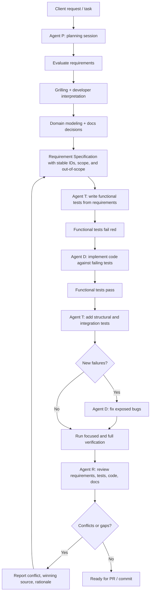

# Agent implementation workflow

The standard agent-assisted implementation process is:

This workflow may be compressed for small or low-risk changes, but requirement clarity, test derivation, implementation, verification, and review must remain distinct concerns.

---

## Agent responsibilities

### Agent P: planning

Agent P is responsible for the planning phase. It evaluates the request, grills the developer until shared understanding is reached, sharpens domain terminology, identifies ADR-worthy decisions, creates diagrams when useful, and produces Requirement Specifications with stable IDs, clear scope, and explicit out-of-scope boundaries.

Agent P ends with a planning synthesis that summarizes the problem, intended outcome, produced documentation, in-scope behavior, out-of-scope behavior, open questions, and pending decisions.

When useful after requirements are clear, Agent P may also propose internal implementation slices for Agent T and Agent D. These slices break the work into independently verifiable increments, list the requirement IDs covered, identify blockers, and describe the expected behavior for each increment. They are handoff notes only: they do not replace Requirement Specifications, do not authorize scope beyond the documented requirements, and are not published as issue-tracker items unless the developer explicitly asks for that workflow. Prefer vertical slices through the relevant backend layers; use expand-contract sequencing for wide refactors that cannot stay green as ordinary vertical slices.

Agent P stops before tests or implementation.

### Agent T: test design

Agent T is responsible for test design and test implementation. Its first pass writes functional tests from the Requirement Specifications and leaves them failing for the expected reasons. After Agent D implements the production code, Agent T resumes in the same testing context to add structural, integration, API, security, or persistence tests when the feature risk calls for them. Agent T does not implement production code.

### Agent D: implementation

Agent D is responsible for production implementation. It starts from the Requirement Specifications and Agent T's failing tests, implements the minimum production behavior needed to satisfy them, and follows `AGENTS.md` plus the relevant software guidelines. After Agent T adds structural or integration tests, Agent D resumes in the same implementation context to fix exposed bugs without weakening tests or inventing missing business rules.

### Agent R: review

Agent R is responsible for independent review. It reviews requirements, ADRs, diagrams, code, tests, and verification evidence against the documented behavior and project guidelines. Agent R leads with findings, reports conflicts or gaps, and does not implement fixes unless explicitly asked.

---

## Bug diagnosis mode

Bug diagnosis mode is a separate, exceptional workflow for rare hard bugs, flaky failures, or performance regressions. Regular Agent P / Agent T / Agent D / Agent R sessions must not read or invoke `$diagnosing-bugs` just because a task mentions a bug, failing test, or broken behavior.

Use `$diagnosing-bugs` only when the developer explicitly asks for that skill, diagnosis mode, deep bug diagnosis, or the separate diagnostic workflow.

The diagnosis output is not a source-of-truth artifact. To turn a diagnosis into a project change, return to the regular GAM workflow: document missing or changed behavior when needed, let Agent T design regression coverage from the documented defect or requirement, let Agent D implement the fix, and let Agent R review the result.

---

## Continuation notes

A continuation note is an ephemeral handoff aid for moving work to a fresh agent session. When the external `$handoff` skill is available, use it to create continuation notes for fresh agent sessions. The resulting handoff document remains ephemeral and non-authoritative.

Continuation notes are useful when context is long, when Agent T / Agent D / Agent R should resume in a separate chat, or when the developer wants a compact summary before pausing.

Continuation notes are not project documentation and are not a source of truth. They must reference durable artifacts such as Requirement Specifications, ADRs, diagrams, relevant files, diffs, test output, and commit references instead of duplicating them.

A useful continuation note includes:

- The intended next agent role and suggested skill, such as Agent T with `$gam-test-design`, Agent D with `$gam-implementation`, or Agent R with `$gam-review`.
- Current status and what has already been completed.
- Relevant durable artifacts by path or URL.
- Open questions, blockers, pending decisions, and known risks.
- Verification state, including tests run, expected failures, unexpected failures, and tests not run.
- Relevant changed files or diff references when local changes matter.

Continuation notes must redact secrets, credentials, tokens, private keys, and unnecessary personal data. They should be stored outside the repository unless the developer explicitly asks to version a durable project artifact.
