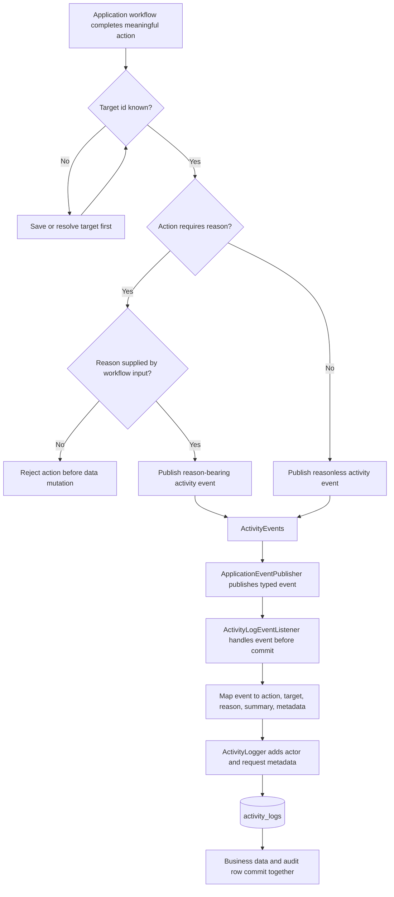

# Audit Log

Date: 2026-06-27

## 1. Purpose

This document defines the custom activity-log policy for the project.

Spring Data JPA Auditing remains responsible for persistence metadata such as:

```text
createdAt
createdBy
updatedAt
updatedBy
deletedAt
deletedBy
```

The custom activity log is responsible for business and security intent:

```text
who performed which action, against which target, for which reason, with which relevant metadata
```

The project will use Spring Data JPA Auditing plus a custom activity log. This is enough for the current goals. Envers and JaVers will not be added at this stage.

## 2. Main Rule

Audit user intent, not every database write.

Activity logs must be initiated from application workflows, not from repositories. Workflows publish explicit activity events for meaningful business actions, and a transactional activity-log listener translates those events into persisted audit rows. Repository-level auditing already records row metadata. The custom activity log must explain what happened and why it matters.

When one workflow causes multiple writes, prefer one high-level activity.

Example:

```text
MEMBER_ACTIVATED
```

This single activity can include the status transition and role changes in metadata:

```json
{
  "memberId": "...",
  "accountId": "...",
  "previousStatus": "PENDENT",
  "newStatus": "ACTIVE",
  "roleAdded": "MEMBER",
  "roleRemoved": "VISITOR"
}
```

Do not log the same workflow as unrelated `MEMBER_UPDATED`, `ACCOUNT_ROLE_ADDED`, and `ACCOUNT_ROLE_REMOVED` entries unless those role changes were triggered directly as independent actions.

## 3. Activity Record Shape

The activity log table must store enough information to support future investigation.

Target shape:

```text
id
occurredAt
actorAccountId
action
targetType
targetId
reason
summary
metadata
requestId
ipAddress
userAgent
```

Rules:

1. `action` must be a stable enum/string constant.
2. `targetType` must name the domain target, such as `MEMBER`, `EVENT`, or `ACCOUNT_ROLE`.
3. `targetId` must store the primary target id.
4. `reason` must be required for destructive, corrective, security-sensitive, and permission-related actions.
5. `metadata` must be JSON and must contain only useful context.
6. `summary` can be a short human-readable explanation generated by the application.
7. The activity log must be append-only.
8. Administrators must not be able to edit or delete activity-log records.

Do not store:

```text
passwords
JWTs
refresh tokens
full request bodies with sensitive data
unnecessary personal data
```

## 4. Action Naming

Action names must stay neutral.

Use:

```text
EVENT_DELETED
PRESENCE_REMOVED
MISSA_REMOVED
ORATORIO_REMOVED
```

Do not use:

```text
EVENT_DELETED_AS_MISTAKE
PRESENCE_REMOVED_AS_MISTAKE
MISSA_REMOVED_AS_MISTAKE
ORATORIO_REMOVED_AS_MISTAKE
```

The action name describes what happened. The reason and metadata explain why it happened.

Example:

```json
{
  "action": "PRESENCE_REMOVED",
  "reason": "Registered wrong person",
  "metadata": {
    "correctionType": "MISTAKE"
  }
}
```

## 5. Activity Reason Policy

The `activity_logs.reason` column is part of the generic activity-log shape, but not every activity event should carry a reason. A null reason is valid for ordinary actions whose purpose is already explained by the action and metadata. A non-null reason is required when the action is corrective, destructive, security-sensitive, or performed outside the normal public API.

Current implementation policy:

| Activity event                                  | Reason   | Rationale                                                                             |
|-------------------------------------------------|----------|---------------------------------------------------------------------------------------|
| `memberActivated(...)`                          | null     | Activation is a normal status transition; role side effects are captured as metadata. |
| `memberDeactivated(...)`                        | required | Deactivation removes active participation and deserves an explicit justification.     |
| `accountRoleAdded(...)`                         | required | Direct role grants change account authority.                                          |
| `accountRoleRemoved(...)`                       | required | Direct role removals change account authority.                                        |
| `eventCreated(...)`                             | null     | Creation intent is represented by the action and event metadata.                      |
| `missaCreated(...)`                             | null     | Creation intent is represented by the action and related event id.                    |
| `oratorioCreated(...)`                          | null     | Creation intent is represented by the action and related event id.                    |
| `presenceRegistered(...)`                       | null     | Presence registration is a normal attendance action.                                  |
| `developerMaintenance(...)` inspect             | null     | Inspection is traceable by table/count metadata but does not mutate data.             |
| `developerMaintenance(...)` restore/hard-delete | required | Restore and hard delete are exceptional maintenance actions.                          |

Reason-bearing activity events must receive the reason from the workflow input. The listener must not invent reasons. Internal helper calls that suppress auditing, such as role changes caused by member activation/deactivation, do not require a reason because they are metadata on the high-level member activity.

## 6. Activity Event Flow

Activity logging follows an explicit event-listener flow. The workflow decides that a meaningful business action happened. `ActivityEvents` publishes a typed activity event. `ActivityLogEventListener` translates that event into the stable audit-log shape. `ActivityLogger` adds actor/request metadata and persists the row.



Rendered meaning:

```text
business workflow
  -> validates required reason when the action needs one
  -> publishes a typed activity event
  -> Spring dispatches the event to the transactional listener
  -> listener maps the event to the audit-log row shape
  -> ActivityLogger enriches and saves the row
  -> audit row commits with the business transaction
```

The flow intentionally avoids repository-level auto-logging. Repositories know that rows changed, but workflows know which business action those writes represent.

## 7. Account Actions

| Action | Audit? | Rationale |
|---|---:|---|
| `ACCOUNT_REGISTERED` | yes | Creates an identity that can later receive roles and permissions. |
| `ACCOUNT_DISABLED` | yes | Changes whether a person can access the system. |
| `ACCOUNT_LOCKED` | yes | Security-sensitive access control action. |

Authentication/session actions are not audited at this stage.

Discarded for now:

```text
LOGIN_SUCCEEDED
LOGIN_FAILED
LOGOUT
REFRESH_TOKEN_ROTATED
ACCESS_DENIED
```

These can be revisited later if security monitoring becomes a priority.

## 8. Member Actions

| Action | Audit? | Rationale |
|---|---:|---|
| `MEMBER_REGISTERED` | yes | Creates a person record tied to account, presence history, and future participation. |
| `MEMBER_ACTIVATED` | yes | Changes member status and currently swaps roles. This is both domain and security-relevant. |
| `MEMBER_DEACTIVATED` | yes | Removes active participation without deleting historical records. |

Do not create a normal user-facing `MEMBER_DELETED` action unless the member deletion policy changes. Members should be deactivated instead of deleted through the UI.

## 9. Oratoriano Actions

`Oratoriano` represents a person who frequents the oratory.

An oratoriano does not require an account. An account can be linked optionally when the person also needs authentication identity.

Target model direction:

```text
Oratoriano
  id
  name
  birthDate
  phoneNumber
  status
  accountId nullable
```

The account link must be unique when present. One account should not represent multiple oratorianos by default. If guardians or parents later need access for multiple children, that must be modeled as a separate guardian relationship.

| Action | Audit? | Rationale |
|---|---:|---|
| `ORATORIANO_REGISTERED` | yes | Creates a person-like record that participates in oratory history. |
| `ORATORIANO_UPDATED` | yes | Changes personal or participation data. |
| `ORATORIANO_DEACTIVATED` | yes | Mirrors member deactivation and preserves historical participation. |
| `ORATORIANO_REACTIVATED` | yes | Restores active participation without pretending the person was recreated. |
| `ORATORIANO_ACCOUNT_LINKED` | yes | Links a person record to an authentication identity. |
| `ORATORIANO_ACCOUNT_UNLINKED` | yes | Removes the authentication identity link from a person record. |

Do not use:

```text
ORATORIANO_REMOVED
ORATORIANO_REMOVED_AS_MISTAKE
```

A real person must not be removed through the UI. If an oratoriano record was created incorrectly, correction must happen through developer-controlled soft delete or a future merge/deduplication workflow.

## 10. Event Actions

| Action | Audit? | Rationale |
|---|---:|---|
| `EVENT_CREATED` | yes | Creates a future or historical fact. |
| `EVENT_CANCELLED` | yes | Changes the public meaning of an event while preserving history. |
| `EVENT_DELETED` | yes | Dangerous correction action that removes the event from normal visibility. Requires reason. |

`EVENT_DELETED` must only be available when the event deletion policy allows it. Cancellation remains the correct action for real events that must stay in history.

## 11. Presence Actions

| Action | Audit? | Rationale |
|---|---:|---|
| `PRESENCE_REGISTERED` | yes | Records attendance, which is a historical fact. |
| `PRESENCE_REMOVED` | yes | Potentially changes attendance history. Requires reason. |

`PRESENCE_REMOVED` must be a correction action. It must not become a quiet way to rewrite historical participation.

## 12. Location Actions

| Action | Audit? | Rationale |
|---|---:|---|
| `LOCATION_CREATED` | yes | Affects event data and future scheduling. |
| `LOCATION_UPDATED` | yes | Can change the meaning of historical events if old events point to the same location. |
| `LOCATION_REMOVED` | yes | Can hide operational context for events. Requires reason. |

Location changes can have historical impact because events reference locations.

## 13. RBAC Actions

| Action | Audit? | Rationale |
|---|---:|---|
| `ACCOUNT_ROLE_ADDED` | yes | Grants authority to an account. |
| `ACCOUNT_ROLE_REMOVED` | yes | Removes authority from an account and can be abuse or correction. |
| `ROLE_CREATED` | yes | Creates a new authorization grouping. |
| `ROLE_UPDATED` | yes | Changes role meaning. |
| `ROLE_DISABLED` | yes | Security-sensitive role lifecycle action. |
| `ROLE_DELETED` | yes | Removes a custom role from normal use. Requires reason. |
| `PERMISSION_CREATED` | yes | Defines a new capability. |
| `PERMISSION_UPDATED` | yes | Changes capability meaning. |
| `PERMISSION_DISABLED` | yes | Security-sensitive permission lifecycle action. |
| `PERMISSION_DELETED` | yes | Removes a custom permission from normal use. Requires reason. |
| `ROLE_PERMISSION_ADDED` | yes | Grants a capability to a role. |
| `ROLE_PERMISSION_REMOVED` | yes | Removes a capability from a role and can affect access immediately. |

Seeded baseline roles and permissions must not be deletable by administrators. Only CRUD-created roles and permissions may be deleted through the UI, and only when the soft-delete/RBAC policies allow it.

Do not log seed no-op checks.

Discarded for now:

```text
SEED_ROLE_PERMISSION_CHANGED
```

If seed or migration code performs real security-sensitive data changes later, that decision can be revisited.

## 14. Missa Actions

| Action | Audit? | Rationale |
|---|---:|---|
| `MISSA_CREATED` | yes | Creates event-specific liturgical and operational history. |
| `MISSA_UPDATED` | yes | Changes member assignments and event-specific responsibilities. |
| `MISSA_REMOVED` | yes | Dangerous correction action. Requires reason. |

If `MISSA_CREATED` creates both an `Event` and a `Missa`, log one high-level `MISSA_CREATED` activity and include the created `eventId` in metadata.

## 15. Oratorio Actions

| Action | Audit? | Rationale |
|---|---:|---|
| `ORATORIO_CREATED` | yes | Creates event-specific operational history. |
| `ORATORIO_UPDATED` | yes | Changes member/oratoriano assignments and participation data. |
| `ORATORIO_REMOVED` | yes | Dangerous correction action. Requires reason. |

If `ORATORIO_CREATED` creates both an `Event` and an `Oratorio`, log one high-level `ORATORIO_CREATED` activity and include the created `eventId` in metadata.

## 16. Developer Maintenance Actions

Developer-only operations must also be audited.

| Action | Audit? | Rationale |
|---|---:|---|
| `DEVELOPER_RESTORE_EXECUTED` | yes | Restore is outside normal application behavior and must be accountable. |
| `DEVELOPER_HARD_DELETE_EXECUTED` | yes | Hard delete is exceptional and irreversible. |
| `DEVELOPER_VIEWED_SOFT_DELETED_RECORDS` | yes | Soft-deleted records are hidden even from administrators, so developer access must be traceable. |

These actions may not be emitted through the public API. They belong to developer-controlled maintenance tooling.

## 17. Non-Audited Actions

Do not audit these in the current project state:

```text
normal GET by id
search/list endpoints
internal loader calls
DTO validation failures
login success
login failure
logout
refresh token rotation
access denied
seed no-op execution
```

Rationale:

1. Read operations are too noisy for the current goals.
2. Authentication/session logs are not a priority at this stage.
3. Internal helper calls are implementation details, not user intent.
4. Validation failures usually do not represent completed business actions.

## 18. Refactor Instructions

Resolved implementation decisions:

1. The first implementation uses an append-only `activity_logs` table and an application-level `ActivityLogger`.
2. Workflows publish explicit activity events through `ActivityEvents`; repositories do not emit activity logs.
3. `ActivityLogEventListener` handles those events with `@TransactionalEventListener(phase = TransactionPhase.BEFORE_COMMIT)` and calls `ActivityLogger`.
4. `ActivityLogger` remains the low-level persistence adapter responsible for actor, request metadata, and saving `ActivityLogEntity`.
5. `MEMBER_ACTIVATED` and `MEMBER_DEACTIVATED` are high-level activities; account-role changes caused by activation are metadata on the member activity.
6. Direct account-role changes still emit `ACCOUNT_ROLE_ADDED` and `ACCOUNT_ROLE_REMOVED`.
7. `EVENT_CREATED`, `MISSA_CREATED`, `ORATORIO_CREATED`, and `PRESENCE_REGISTERED` are emitted during their application workflows.
8. Developer restore, hard delete, and soft-deleted record inspection are audited by the maintenance command-line job, not by public API endpoints.

Implement the activity log as an application-level service.

For each audited workflow:

1. publish the activity event from the application workflow, not from the repository;
2. log after the target entity id is known;
3. handle the event before transaction commit so the audit row is persisted with the business change;
4. use one high-level activity for multi-write workflows;
5. require a reason for corrective and security-sensitive actions;
6. store technical side effects in metadata;
7. avoid storing sensitive values;
8. keep action names stable.

## 19. Refactor Order

Apply audit logging in this order:

1. `MEMBER_ACTIVATED` and `MEMBER_DEACTIVATED`.
2. `ACCOUNT_ROLE_ADDED` and `ACCOUNT_ROLE_REMOVED`.
3. `PRESENCE_REGISTERED` and `PRESENCE_REMOVED`.
4. `EVENT_CREATED`, `EVENT_CANCELLED`, and `EVENT_DELETED`.
5. `MISSA_CREATED`, `MISSA_UPDATED`, and `MISSA_REMOVED`.
6. `ORATORIO_CREATED`, `ORATORIO_UPDATED`, and `ORATORIO_REMOVED`.
7. `ORATORIANO_REGISTERED`, `ORATORIANO_UPDATED`, `ORATORIANO_DEACTIVATED`, and `ORATORIANO_REACTIVATED`.
8. `ORATORIANO_ACCOUNT_LINKED` and `ORATORIANO_ACCOUNT_UNLINKED`.
9. `ROLE`, `PERMISSION`, and `ROLE_PERMISSION` actions.
10. Developer maintenance actions.
