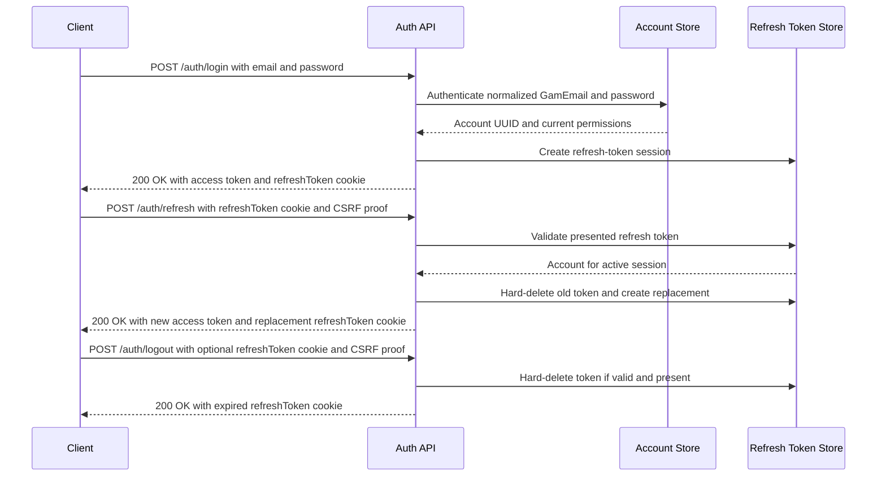

# Requirement: Authentication and Account Registration

## Status
Accepted

## Context
GAM needs a documented authentication contract for public account registration, login, refresh, logout, access tokens, refresh tokens, and refresh-token cookies.

The initial supported browser deployment is now same-origin. Browser cookie attributes, CSRF proof, origin validation, in-memory access-token handling, session bootstrap, and cross-tab coordination are governed by [Browser Session and Frontend Integration](browser-session-and-frontend-integration.md).

The historical cross-site requirements `REQ-AUTH-012` and `REQ-AUTH-013` are preserved in the Superseded [Cross-Site Refresh Cookie Compatibility](cross-site-refresh-cookie-compatibility.md) specification and must not be reused or interpreted as current behavior.

## Ubiquitous Language
- `access token`: A short-lived bearer token returned to the client and used to authenticate protected API requests.
- `refresh token`: An opaque, random, UUID v4 session secret stored only in an HTTP-only cookie and used to obtain a new access token.
- `authentication session`: One active login represented by one active refresh token for an Account.
- `CSRF protection`: A server-validated mechanism that prevents cross-site requests from using browser-sent cookies without an intentional client-provided proof, such as a signed double-submit token or equivalent framework-supported defense.

## Functional requirements

### REQ-AUTH-001: Public self-service registration
The system shall allow public self-service registration to create an unprivileged Account identity.

Newly registered Accounts shall not receive roles or permissions automatically.

Rationale:
Registration creates an identity only. Authorization remains a separate RBAC concern.

Valid examples:
- A public user registers an Account with email, password, and displayName.
- A newly registered Account cannot access protected capabilities until roles or permissions are granted through RBAC workflows.

Invalid examples:
- Registration automatically grants Coordinator permissions.
- Registration requires an invitation code as part of this requirement.

---

### REQ-AUTH-002: Registration input
Registration shall require a `GamEmail`, password, and displayName.

The displayName shall be required, trimmed, and between 1 and 50 characters after trimming.

Rationale:
An Account needs a stable email login identifier, a secret credential, and a lightweight display label without forcing a `GamName`.

Valid examples:
- `email = user@example.com`, `password = a valid password`, `displayName = "Eduardo"`
- `displayName = " Eduardo "` is stored as `"Eduardo"`.

Invalid examples:
- A missing email.
- A blank password.
- A blank displayName.
- A displayName with more than 50 characters after trimming.

---

### REQ-AUTH-003: Password policy and storage
Registration shall accept only passwords between 8 and 128 characters.

The system shall store only a one-way password hash.

The system shall never expose the raw password or password hash in API responses, activity-log metadata, logs, or documentation examples as real values.

Rationale:
Password handling must be explicit, minimally hostile to users, and safe at rest.

Valid examples:
- A password with 8 characters is accepted.
- A password with 128 characters is accepted.
- The registration response contains the Account identifier but no password fields.

Invalid examples:
- A 7-character password.
- A 129-character password.
- Returning `passwordHash` in an Account response.

---

### REQ-AUTH-004: Registration duplicate email conflict
Registration shall reject duplicate normalized `GamEmail` values with `409 Conflict`.

The duplicate-email response shall not expose Account details beyond the conflict.

Rationale:
Registration is creating a unique Account identity, so duplicate email is a resource conflict. Login remains enumeration-resistant separately.

Valid examples:
- Registering `USER@example.com` after `user@example.com` already exists fails with `409 Conflict`.

Invalid examples:
- Creating two active Accounts with the same normalized email.
- Returning the existing Account identifier in the duplicate-email response.

---

### REQ-AUTH-005: Registration response
Successful registration shall return `201 Created`, the new Account identifier, and an HTTP `Location` header pointing to the canonical public Account resource URI `/api/accounts/{accountId}`.

The HTTP `Location` header is HTTP vocabulary and is not the GAM Location domain concept.

Rationale:
Account creation should identify the created resource without starting an authentication session.

Valid examples:
- `POST /auth/register` returns `201 Created`, body `{ "id": "<account UUID>" }`, and `Location: /api/accounts/<account UUID>`.

Invalid examples:
- Registration automatically logs the user in.
- Registration returns a refresh-token cookie.
- Registration points the HTTP `Location` header to `/auth/register/{accountId}`.

---

### REQ-AUTH-006: Login identity and failure response
Login shall identify Accounts by normalized `GamEmail` and password.

Invalid email/password combinations shall return a generic authentication failure that does not reveal whether the email exists.

Rationale:
Login should use the same email primitive as registration while avoiding Account enumeration.

Valid examples:
- Login with `USER@example.com` authenticates the same Account as `user@example.com` when the password is correct.
- Login with an unknown email and login with a wrong password return the same failure shape.

Invalid examples:
- Login by displayName.
- Returning `email not found` for unknown emails.

---

### REQ-AUTH-007: Login token response
Successful login shall create a new authentication session for the Account.

Successful login shall return an access token in the JSON response body as `token`.

Successful login shall set the refresh token only in the `refreshToken` cookie and shall not expose the refresh token in the response body.

Rationale:
The client needs the access token for protected requests, while the refresh token should stay out of JavaScript-readable response data.

Valid examples:
- A login response body contains `{ "token": "<access token>" }`.
- The response sets a `refreshToken` cookie.

Invalid examples:
- Returning `refreshToken` in the JSON response body.
- Reusing an existing refresh token for a new login.

---

### REQ-AUTH-008: Multiple active sessions
An Account may have multiple active authentication sessions at the same time.

Login shall not revoke other active refresh tokens for the same Account.

Refresh and logout shall affect only the refresh token presented by the client.

Rationale:
Users may be signed in on multiple browsers or devices. Global session revocation is a separate capability.

Valid examples:
- Logging in from a phone and laptop creates two active refresh tokens.
- Logging out from the phone does not log out the laptop.

Invalid examples:
- Every login deletes all other refresh tokens for the Account.

---

### REQ-AUTH-009: Access token identity and authorization authorities
Access tokens shall be short-lived bearer tokens whose subject identifies the Account by UUID.

Protected requests shall authenticate the Account from the access token and resolve current permission authorities from the Account's current RBAC state.

Access tokens shall not rely on role authorities such as `ROLE_COORD`.

Refresh tokens shall not carry authorization claims.

Rationale:
Authentication identifies the Account. Authorization remains permission-based and reflects current RBAC state.

Valid examples:
- An access token subject is an Account UUID.
- A protected request receives permission authorities such as `MEMBER_GET`.

Invalid examples:
- An access token subject is the Account email.
- Authorization checks depend on `ROLE_COORD`.
- Refresh tokens include permission or role claims.

---

### REQ-AUTH-010: Token lifetimes
Access-token and refresh-token lifetimes shall be configurable operational settings.

Access tokens shall be short-lived relative to refresh tokens.

The refresh-token cookie `Max-Age` shall match the configured refresh-token lifetime.

Rationale:
Token lifetime policy may change by environment without changing the authentication contract.

Valid examples:
- A deployment configures access tokens for 1 hour and refresh tokens for 7 days.
- A different deployment uses different configured lifetimes while preserving the same behavior.

Invalid examples:
- The refresh-token cookie outlives the stored refresh token.
- Token lifetime values are hard-coded into the business requirement.

---

### REQ-AUTH-011: Refresh-token shape and secrecy
Refresh-token values shall be opaque, random UUID v4 values.

The refresh-token row identifier shall be a separate persisted-resource UUID and shall not be used as the refresh-token secret.

Refresh-token values shall be treated as secrets even though they are UUID-shaped.

Rationale:
Refresh tokens are security/session artifacts, not business identities.

Valid examples:
- A refresh token secret is a UUID v4 value.
- A refresh-token database row has its own UUID v7 resource identifier.

Invalid examples:
- Using the refresh-token row identifier as the cookie value.
- Logging a real refresh-token value.

---

### REQ-AUTH-014: Refresh input source
Refresh shall read the refresh-token value only from the HTTP-only `refreshToken` cookie.

Refresh shall not accept refresh tokens from JSON request bodies, query parameters, or custom headers.

Rationale:
Keeping refresh-token input cookie-only reduces accidental exposure in logs, URLs, and JavaScript-accessible storage.

Valid examples:
- `POST /auth/refresh` uses the `refreshToken` cookie.

Invalid examples:
- `POST /auth/refresh` accepts `{ "refreshToken": "..." }`.
- `POST /auth/refresh?refreshToken=...` is accepted.

---

### REQ-AUTH-015: Refresh-token rotation
Successful refresh shall be single-use.

The system shall consume and hard-delete the presented refresh token, create a new refresh token for the same Account, set a replacement `refreshToken` cookie, and return a new access token.

Rationale:
Single-use rotation limits the useful lifetime of a stolen refresh token.

Valid examples:
- A refresh request with a valid refresh cookie returns a new access token and a different refresh cookie.
- The old refresh token cannot be used again.

Invalid examples:
- Refreshing repeatedly with the same refresh token.
- Soft-deleting refresh tokens instead of hard-deleting them.

---

### REQ-AUTH-016: Refresh failure response
Missing, malformed, unknown, already-consumed, or expired refresh tokens shall fail with a generic refresh-token failure response that tells the client to sign in again.

Expired refresh tokens shall be hard-deleted when detected.

Rationale:
Refresh failures should not reveal token validity details and expired session artifacts should not remain active.

Valid examples:
- A reused refresh token fails and directs the client to sign in again.
- An expired refresh token is deleted and the refresh fails.

Invalid examples:
- Returning separate messages for unknown and already-consumed refresh tokens.

---

### REQ-AUTH-017: Logout input source
Logout shall read the refresh-token value only from the HTTP-only `refreshToken` cookie.

Logout shall not accept refresh tokens from JSON request bodies, query parameters, or custom headers.

Rationale:
Logout should follow the same token-handling contract as refresh.

Valid examples:
- `POST /auth/logout` uses the `refreshToken` cookie when present.

Invalid examples:
- `POST /auth/logout` accepts `{ "refreshToken": "..." }`.

---

### REQ-AUTH-018: Idempotent logout
Logout shall always expire the `refreshToken` cookie and return success.

If a valid stored refresh token is present, logout shall hard-delete it.

If the refresh token is missing, malformed, expired, unknown, or already consumed, logout shall still expire the cookie and return success.

Rationale:
Clients should be able to call logout repeatedly without learning token validity.

Valid examples:
- Logout with a valid refresh cookie deletes that token and expires the cookie.
- Logout without a refresh cookie expires the cookie and returns success.

Invalid examples:
- Logout fails because the refresh token was already consumed.

---

### REQ-AUTH-019: Public and protected endpoint boundary
The auth endpoints `/auth/register`, `/auth/login`, `/auth/refresh`, and `/auth/logout` shall be public in the HTTP routing sense.

Public auth endpoints shall still validate their own inputs, credentials, refresh tokens, CSRF proof, and cookies.

Endpoints are protected unless their own Requirement Specification or API contract explicitly declares them public.

Rationale:
GAM needs public auth endpoints and may later expose public informational or marketing content, while application capabilities remain protected by explicit requirements.

Valid examples:
- `/auth/login` is callable without an access token.
- A future public hero page endpoint is public only when its own requirement says so.

Invalid examples:
- Assuming every non-auth endpoint must be private without checking its requirement.
- Assuming every non-auth endpoint is public because auth endpoints are public.

---

### REQ-AUTH-020: Authentication flow auditing boundary
The system shall not emit custom activity-log events for login success, login failure, refresh-token rotation, or logout.

Account creation auditing is governed by the activity-audit-log policy for Account workflows and is not expanded by this authentication-session requirement.

Rationale:
Project audit-log guidelines exclude authentication and session flows from custom activity logging to avoid log bloat and sensitive metadata risks.

Valid examples:
- Login failure is handled as an authentication failure without a custom activity-log event.
- Refresh-token rotation does not write token details into activity-log metadata.

Invalid examples:
- Activity-log metadata contains refresh-token values.

## Acceptance scenarios

```gherkin
Scenario: Register an unprivileged Account
  Given a public user provides a normalized email, valid password, and displayName
  When the user registers an Account
  Then the system creates an Account with no roles or permissions
  And the response status is 201 Created
  And the response contains the Account identifier
  And the HTTP Location header points to /api/accounts/{accountId}

Scenario: Reject duplicate registration
  Given an active Account exists with email "user@example.com"
  When a public user registers with email "USER@example.com"
  Then registration fails with 409 Conflict
  And the response does not expose the existing Account identifier

Scenario: Login creates a new authentication session
  Given an Account exists with email "user@example.com"
  And the submitted password is correct
  When the Account logs in
  Then the response contains an access token as "token"
  And the response sets a refreshToken cookie
  And the refresh token is not present in the response body

Scenario: Failed login does not reveal account existence
  Given no Account exists with email "missing@example.com"
  When login is attempted with that email
  Then the response is the same generic authentication failure used for an incorrect password

Scenario: Refresh rotates the refresh token
  Given an Account has an active refresh token cookie
  And the request includes a valid CSRF proof
  When the client refreshes the session
  Then the old refresh token is hard-deleted
  And a new refresh token is set in the refreshToken cookie
  And a new access token is returned as "token"

Scenario: Reused refresh token fails generically
  Given a refresh token was already consumed by a successful refresh
  And the request includes that old refresh token cookie
  When the client refreshes the session again
  Then the refresh fails with a generic sign-in-again response

Scenario: Logout is idempotent
  Given the client may or may not have a valid refreshToken cookie
  And the request includes a valid CSRF proof when required
  When the client logs out
  Then the response succeeds
  And the refreshToken cookie is expired
  And any valid presented refresh token is hard-deleted

```

## Diagrams



## Open questions

* Should stored refresh-token secrets be hashed at rest instead of stored as raw UUID v4 values?
* What exact generic HTTP status and error code should refresh-token failures use?
* Should successful public Account registration emit a custom Account-created activity event, or is low-level row auditing enough for self-service registration?
* Documentation follow-up: define the GAM Location domain concept in `docs/ubiquitous-language.md` separately from the HTTP `Location` header.

## Out of scope

* Email verification.
* Invitation codes.
* Approval queues.
* Automatic role assignment during registration.
* Password reset and password change flows.
* Multi-factor authentication.
* "Log out everywhere" or user-facing session management.
* Public hero pages, informational pages, marketing pages, and public project content endpoints.
* Account deactivation, restoration, or soft-delete policy.

## Related ADRs

* [ADR-0007: Use Same-Origin Browser Sessions with Layered CSRF Protection](../../decisions/0007-use-same-origin-browser-sessions-with-layered-csrf-protection.md)
* [ADR-0001: Use Cross-Site-Compatible Refresh Cookies with CSRF Protection](../../decisions/0001-use-cross-site-compatible-refresh-cookies-with-csrf-protection.md) — superseded.

## Related requirements

* [Browser Session and Frontend Integration](browser-session-and-frontend-integration.md)
* [Cross-Site Refresh Cookie Compatibility](cross-site-refresh-cookie-compatibility.md) — superseded historical requirements.

## Related videos

* None.
