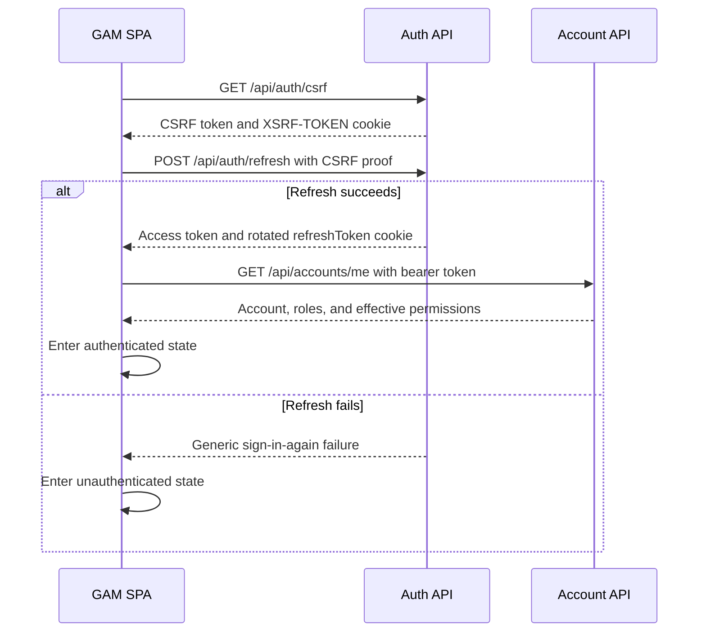

# Requirement: Browser Session and Frontend Integration

## Status
Accepted

## Context
GAM needs one browser authentication workflow that is safe, predictable, and easy for the separately versioned frontend to consume.

The initial supported client is the GAM static single-page application served from the same public origin as the API. The browser uses a short-lived bearer access token for protected API requests and a browser-managed refresh cookie only for authentication-session operations.

This specification defines the browser-facing integration contract. Registration, credential validation, token generation, refresh-token rotation, and idempotent logout remain governed by [Authentication and Account Registration](authentication-and-registration.md). The current Account response is governed by [Account Records](../accounts/account-records.md).

## Ubiquitous Language

- `authentication bootstrap`: The frontend startup sequence that determines whether the browser has a restorable authentication session and loads its current Account context.
- `browser authentication context`: The in-memory access token, current Account record, and effective permission codes held by one running frontend instance.
- `single-flight refresh`: Coordination that allows only one refresh operation to use a shared browser refresh session while other callers await its result.

## Functional requirements

### REQ-BROWSER-AUTH-001: Supported browser client boundary
The initial login, refresh, and logout workflow shall support the same-origin GAM browser frontend.

Native applications, third-party browser applications, cross-origin frontends, mobile applications, and CLI login shall not be supported by this workflow.

Rationale:
The cookie, CSRF, and origin-validation contract is designed for one controlled browser application. Additional client types need separate credential and threat-model decisions.

Valid examples:
- The GAM SPA loaded from the canonical public origin calls relative `/api/auth/*` routes.
- A future native application receives a separate Requirement Specification and architecture decision before using GAM authentication.

Invalid examples:
- Weakening browser origin checks so an undocumented third-party frontend can log in.
- Treating successful use from a CLI as part of the supported browser contract.

---

### REQ-BROWSER-AUTH-002: Production refresh-cookie contract
The production `refreshToken` cookie shall be host-only and shall use `HttpOnly`, `Secure`, `SameSite=Lax`, and `Path=/api/auth`.

The cookie shall omit the `Domain` attribute. Its `Max-Age` shall match the configured refresh-token lifetime.

The refresh token shall not be exposed in JSON, URLs, custom headers, or JavaScript-readable storage.

Rationale:
The host-only, path-limited cookie keeps the long-lived session secret outside frontend JavaScript and limits automatic transmission to the public authentication path. `SameSite=Lax` is defense in depth and is not the complete CSRF defense.

Valid examples:
- Login sets `refreshToken` with `HttpOnly; Secure; SameSite=Lax; Path=/api/auth` and no `Domain` attribute.
- Refresh replaces the cookie and preserves the same attributes.

Invalid examples:
- `SameSite=None` is used to support a cross-site frontend.
- The refresh cookie uses `Path=/`.
- The frontend copies the refresh token into `localStorage`.

---

### REQ-BROWSER-AUTH-003: CSRF bootstrap contract
The system shall expose public `GET /auth/csrf`, resolved under the public `/api` base as `GET /api/auth/csrf`, to establish CSRF proof before a protected authentication request.

The response shall use `Cache-Control: no-store` and this JSON shape:

```json
{
  "token": "<unpredictable token>",
  "headerName": "X-XSRF-TOKEN"
}
```

The response shall establish a matching host-only `XSRF-TOKEN` cookie. In production the cookie shall be JavaScript-readable, `Secure`, `SameSite=Lax`, `Path=/api/auth`, and shall omit `Domain`.

The token shall not be placed in a URL or log.

Rationale:
An explicit safe endpoint gives the SPA a deterministic CSRF handshake instead of requiring a deliberately rejected state-changing request to generate a token.

Valid examples:
- The SPA calls `GET /api/auth/csrf`, receives a token, and sends it as `X-XSRF-TOKEN` during login.
- The readable CSRF cookie and secret `refreshToken` cookie remain separate.

Invalid examples:
- The frontend submits an intentionally invalid login solely to obtain a CSRF cookie.
- The CSRF token is accepted from a query parameter.

---

### REQ-BROWSER-AUTH-004: CSRF and origin validation
`POST /auth/login`, `POST /auth/refresh`, and `POST /auth/logout` shall require a valid framework-supported CSRF cookie-to-header proof.

For those routes, the system shall compare a present `Origin` header exactly with the configured canonical public origin. When `Origin` is absent, the system shall compare the origin component of `Referer`. A request with a mismatched origin, an opaque or `null` origin, or neither header shall be rejected without creating, rotating, or deleting an authentication session.

Origin comparison shall use scheme, host, and effective port. It shall not use substring or suffix matching.

Public registration shall not require this CSRF proof because it neither consumes nor establishes an authentication session.

Rationale:
The CSRF token is the primary intentional-client proof. Exact origin validation and `SameSite=Lax` provide independent defense-in-depth layers, including protection against login CSRF and untrusted sibling origins.

Valid examples:
- `Origin: https://configured.example` matches `GAM_PUBLIC_ORIGIN=https://configured.example` exactly.
- A missing `Origin` with a same-origin `Referer` is accepted when the CSRF proof is valid.

Invalid examples:
- `https://configured.example.attacker.invalid` is accepted for `https://configured.example`.
- A request without `Origin` and `Referer` is accepted only because it has a refresh cookie.

---

### REQ-BROWSER-AUTH-005: In-memory access-token storage
The frontend shall keep the access token only in JavaScript memory.

The frontend shall not persist an access token in `localStorage`, `sessionStorage`, IndexedDB, or a JavaScript-readable cookie.

Losing the access token during reload, tab closure, or application restart shall be expected and shall trigger authentication bootstrap rather than being treated as definitive logout.

Rationale:
In-memory storage reduces persistent token exposure to injected or later-executed JavaScript while the refresh cookie provides controlled session restoration.

Valid examples:
- Each running tab holds its current access token in memory.
- Reloading a tab clears the access token and starts bootstrap.

Invalid examples:
- A frontend writes the bearer token to `localStorage` to survive reloads.
- The frontend treats the mere absence of an in-memory token as proof that no refresh session exists.

---

### REQ-BROWSER-AUTH-006: Authentication bootstrap
The frontend shall begin in an `initializing` authentication state and shall not render protected UI before bootstrap completes.

Bootstrap shall:

1. obtain CSRF proof from `GET /api/auth/csrf`;
2. call `POST /api/auth/refresh` with the CSRF proof and browser-sent refresh cookie;
3. store the returned access token in memory; and
4. call `GET /api/accounts/me` with that bearer token.

A generic refresh failure or an authentication failure from the current-Account lookup shall produce an unauthenticated frontend state.

Rationale:
The frontend must confirm the server-side session and load current Account and permission data instead of inferring authentication from browser storage.

Valid examples:
- A reload restores a valid session and loads the current Account before protected routes render.
- A missing refresh cookie results in the unauthenticated UI.

Invalid examples:
- Protected UI briefly renders before refresh finishes.
- The presence of a non-secret browser flag is treated as proof of authentication.

---

### REQ-BROWSER-AUTH-007: Single-flight refresh and bounded replay
The frontend shall coordinate refresh so only one refresh operation uses the shared browser authentication session at a time.

Requests in one frontend instance shall await one shared refresh result. Open GAM tabs shall coordinate through an ephemeral browser mechanism without persisting access or refresh tokens.

A protected API request may be replayed at most once after a successful refresh. `401 Unauthorized` may initiate refresh; `403 Forbidden` shall not.

Refresh failure shall terminate waiting retries and move the affected frontend context to unauthenticated state.

Rationale:
Refresh tokens are single-use and shared by tabs through the cookie jar. Uncoordinated requests can race, consume the same token, and create false logout behavior or retry loops.

Valid examples:
- Five simultaneous `401` responses cause one refresh and at most one replay per original request.
- Two tabs coordinate before rotating their shared refresh token.

Invalid examples:
- Every failed request independently rotates the refresh token.
- A replayed request that returns `401` starts an unlimited refresh loop.
- A `403` response is treated as token expiry.

---

### REQ-BROWSER-AUTH-008: Permission resynchronization
The frontend shall load `GET /api/accounts/me` after each successful refresh and shall use the returned effective permission codes for capability visibility.

The frontend shall not derive effective permissions from JWT claims or role names.

After an unexpected `403 Forbidden`, the frontend may reload `/api/accounts/me` once to update capability visibility, but shall preserve the forbidden outcome and shall not refresh the access token because of that response.

The backend shall remain the final authorization authority for every request.

Rationale:
RBAC state can change while a frontend instance is open. Refresh and forbidden outcomes provide bounded points to reconcile UI capability state without weakening server authorization.

Valid examples:
- A permission removed since the previous refresh disappears from the UI after resynchronization.
- The backend still rejects an unauthorized call even if stale UI displayed the control.

Invalid examples:
- The frontend grants a capability because the Account has a role named `COORD`.
- Reloading permissions turns a server `403` into apparent success.

---

### REQ-BROWSER-AUTH-009: Cross-tab logout propagation
After successful logout, every open GAM tab shall clear its in-memory access token, current Account, and permission state and shall enter the unauthenticated state.

Tabs shall propagate logout through an ephemeral browser channel without persisting tokens.

When logout cannot reach the backend, the initiating frontend shall clear its local authentication context but shall report server-side logout as unconfirmed. It shall not claim that the refresh session was revoked.

The frontend shall obtain fresh CSRF proof before a later login when required by the CSRF token lifecycle.

Rationale:
The refresh cookie is shared across tabs while bearer tokens are held independently in memory. Logout must reconcile both scopes.

Valid examples:
- Logging out in one tab immediately removes protected UI from another open tab.
- A network failure clears local state but warns that server logout was not confirmed.

Invalid examples:
- Another tab continues making authenticated requests after receiving a logout signal.
- The frontend claims successful session revocation after the logout request never reached GAM.

---

### REQ-BROWSER-AUTH-010: Same-origin CORS boundary
Production shall not enable CORS for the supported browser authentication workflow.

The supported development workflow shall preserve a single browser origin by routing relative `/api/*` requests through the frontend development proxy.

Rationale:
The selected deployment and development models do not cross browser origins. Enabling credentialed CORS would expand the trusted client surface without serving a supported workflow.

Valid examples:
- The production SPA calls `/api/auth/refresh` from the same public origin.
- A development server forwards `/api/auth/refresh` to the local backend.

Invalid examples:
- Production permits credentialed CORS from a configurable list of third-party origins.
- Local development requires the browser to call the backend port directly.

## Acceptance scenarios

```gherkin
Scenario: Restore a browser session after reload
  Given the browser has a valid refreshToken cookie
  And the frontend has no in-memory access token
  When authentication bootstrap runs
  Then the frontend obtains CSRF proof
  And refresh returns a new access token
  And GET /api/accounts/me returns the current Account context
  And protected UI renders only after bootstrap succeeds

Scenario: Reject forged refresh
  Given the browser sends a refreshToken cookie
  When POST /api/auth/refresh lacks valid CSRF proof or trusted origin evidence
  Then the system rejects the request
  And the refresh token is not consumed

Scenario: Coordinate concurrent refresh
  Given multiple requests and tabs share one refresh session
  When they require refresh concurrently
  Then only one refresh operation uses the shared session at a time
  And each waiting request is replayed at most once

Scenario: Resynchronize permissions without role-based authorization
  Given an authenticated Account's effective permissions changed
  When the frontend completes a later refresh
  Then it reloads GET /api/accounts/me
  And capability visibility uses the returned permission codes
  And role names are not used as authorization authorities

Scenario: Propagate logout to all tabs
  Given the Account has several open GAM tabs
  When logout succeeds in one tab
  Then every tab clears its browser authentication context
  And every tab enters the unauthenticated state
```

## Diagrams



## Open questions

* None.

## Out of scope

* Native, mobile, CLI, and third-party authentication clients.
* Cross-origin frontend deployment.
* Persistent browser storage of bearer tokens.
* Global server-side revocation of already-issued access tokens during logout.
* Choosing the frontend framework, browser coordination library, or development-server port.

## Related ADRs

* [ADR-0007: Use same-origin browser sessions with layered CSRF protection](../../decisions/0007-use-same-origin-browser-sessions-with-layered-csrf-protection.md)
* [ADR-0001: Use Cross-Site-Compatible Refresh Cookies with CSRF Protection](../../decisions/0001-use-cross-site-compatible-refresh-cookies-with-csrf-protection.md) — superseded.

## Related requirements

* [Authentication and Account Registration](authentication-and-registration.md)
* [Account Records](../accounts/account-records.md)
* [Web Delivery and Frontend Contract](../platform/web-delivery-and-frontend-contract.md)

## Related videos

* None.
