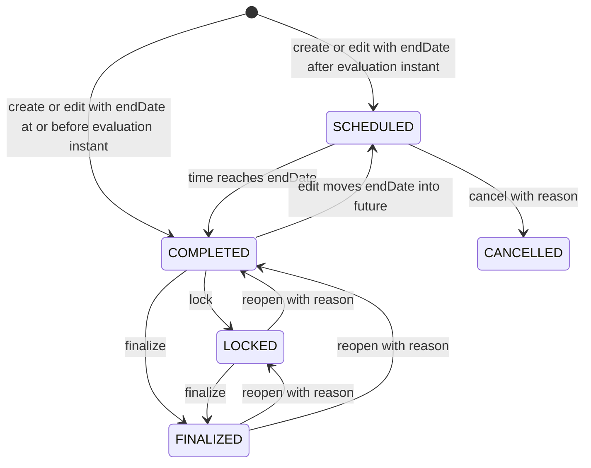

# Requirement: Event Records and Generic Event Lifecycle

## Status

Accepted

## Context

GAM needs one common Event representation for activities while allowing specialized workflows such as Oratorio and Missa to own their additional data. The common Event API must create and manage Generic Events, expose all Event types through consistent reads, enforce date and audience rules, and preserve attendance and activity history.

The implementation and tests for Events predate the Requirement Specification workflow. They were used only as discovery material and conversation prompts. This document records the behavior agreed during planning and does not treat legacy behavior as authoritative.

This specification owns Generic Event creation, editing, status commands, deletion, common get/search behavior, audience visibility, and activity auditing. Specialized mutation workflows remain owned by their future Requirement Specifications.

## Ubiquitous Language

- `audience permission`: The nullable Event relationship that makes the Event public when absent or requires the exact `EVENT_GET_MEMBER` or `EVENT_GET_COORD` permission when present.
- `effective status`: The Event status evaluated from its explicit lifecycle state and the request's single clock instant. An explicit `CANCELLED`, `LOCKED`, or `FINALIZED` state takes precedence; otherwise the end date determines `SCHEDULED` or `COMPLETED`.
- `administrative closure`: The progression from `COMPLETED` into `LOCKED` or `FINALIZED`, and any authorized reopening from those states.
- `normalized no-op`: A full-replacement update whose normalized mutable Event representation is identical to the current representation.

## Functional requirements

### REQ-EVENT-001: Shared Event identity and type model

Every Event shall use a UUID v7 identifier according to `REQ-GAM-ID-001` through `REQ-GAM-ID-003`.

The current Event type catalog shall contain exactly:

| Type | Meaning |
| --- | --- |
| `GENERIC` | An Event without type-specific data or a specialized creation workflow. |
| `ORATORIO` | An Event owned by the specialized Oratorio workflow. |
| `MISSA` | An Event owned by the specialized Missa workflow. |

An Event's type shall be assigned by its owning creation workflow and shall be immutable. Future Event types require an explicit Requirement Specification update; they shall not be inferred from new implementation enum values.

Valid examples:
- `POST /events` creates an Event with type `GENERIC`.
- A specialized Oratorio creation workflow creates an Event with type `ORATORIO`.

Invalid examples:
- A client changes an existing Event from `GENERIC` to `MISSA`.
- Adding an implementation enum value silently expands the accepted type catalog.

---

### REQ-EVENT-002: Common Event representation

Creation, get, search, update, and successful status-command responses shall use one common Event representation containing:

- `id`;
- normalized `title` and `description`;
- the complete embedded `GamLocation` representation;
- `requiredPermission`, which is `null` for a public Event or contains `id`, `code`, `label`, and `description` for a restricted Event;
- UTC `beginDate` and `endDate` instants;
- immutable `type`;
- effective `status`; and
- `cancellationReason`, which is non-null only when status is `CANCELLED`.

The embedded GamLocation shall follow the Event's audience visibility under `REQ-GAM-LOCATION-011`; it shall not require the direct `GAM_LOCATION_GET` permission. Permission metadata embedded in an authorized Event response shall not require the direct `PERMISSION_GET` catalog permission.

Persistence audit fields and soft-delete metadata shall not appear in the common Event representation.

---

### REQ-EVENT-003: Generic Event creation request

`POST /events` shall create only a Generic Event. The request shall contain:

| Field | Contract |
| --- | --- |
| `title` | Required string; trim surrounding whitespace; require 1 to 255 characters after trimming. |
| `description` | Optional string; missing or `null` becomes `""`; trim surrounding whitespace; allow at most 10,000 characters. |
| `gamLocationId` | Required UUID of an active GamLocation. |
| `requiredPermissionId` | Optional UUID; missing or `null` creates a public Event. |
| `beginDate` | Required valid instant. |
| `endDate` | Required valid instant strictly after `beginDate`. |

The workflow shall assign type `GENERIC`. A client-supplied `type`, `status`, or `cancellationReason` field shall return `400 Bad Request` rather than being ignored. Titles need not be unique, Unicode text is allowed, and internal whitespace is preserved.

The date range may be in the past, may include the request instant, or may be in the future. No minimum duration, maximum duration, or past/future horizon shall be imposed beyond `endDate > beginDate`.

Valid examples:
- A past Event with a one-hour range.
- A future Event with an empty description.
- Two different Events with the same normalized title.

Invalid examples:
- A blank or 256-character normalized title.
- `endDate` equal to or before `beginDate`.
- A payload that attempts to set `type` to `ORATORIO`.

---

### REQ-EVENT-004: Required active GamLocation

Generic Event creation and any update that links a GamLocation shall require the selected GamLocation to exist and be active. A missing or soft-deleted GamLocation shall return `404 RESOURCE_NOT_FOUND` for resource `GamLocation` without creating or changing the Event.

Event creation and relinking shall follow `REQ-GAM-LOCATION-013` and ADR-0010 so they cannot race GamLocation removal into a committed Event reference to a removed GamLocation.

Temporary free-text places and locationless Generic Events shall not be accepted.

---

### REQ-EVENT-005: Audience permission validation and creation authorization

A null `requiredPermissionId` shall create a public Event. A non-null value shall resolve to an active, current system permission whose code is exactly `EVENT_GET_MEMBER` or `EVENT_GET_COORD`.

A missing, soft-deleted, or stale permission identifier shall return `404 RESOURCE_NOT_FOUND`. An active current permission that is not an allowed Event audience permission shall return `400 Bad Request` with code `EVENT_AUDIENCE_PERMISSION_INVALID`.

Generic Event creation shall require `EVENT_CREATE`. When `requiredPermissionId` is non-null, the caller shall also hold the exact selected audience permission. A caller that has `EVENT_CREATE` but lacks the selected audience permission shall receive `403 Forbidden`. No Event shall be created and no activity shall be emitted on any failure.

Roles shall not substitute for either required permission.

---

### REQ-EVENT-006: Effective temporal status

The system shall capture one clock instant for each Event request and use it consistently for status evaluation, validation, filtering, sorting, response mapping, and activity metadata.

When the Event has no explicit `CANCELLED`, `LOCKED`, or `FINALIZED` state, its effective status shall be:

- `SCHEDULED` when `endDate` is after the evaluation instant; or
- `COMPLETED` when `endDate` is equal to or before the evaluation instant.

The `beginDate` shall not create a separate in-progress status. An Event that has begun but not ended remains `SCHEDULED` under the current catalog.

Time passage from `SCHEDULED` to `COMPLETED` shall not require a user command, persistence mutation, or activity event. Get and search shall not expose an Event as indefinitely `SCHEDULED` after its end instant.

Creating or editing an otherwise active Event with an ended range shall yield `COMPLETED`; an allowed edit that moves its end date into the future shall yield `SCHEDULED`.

---

### REQ-EVENT-007: Creation response and activity

Successful Generic Event creation shall return `201 Created`, the complete Event representation, and `Location: /api/events/{id}`.

Creation shall emit one `EVENT_CREATED` activity in the same transaction. The Event UUID shall be the activity target, the reason shall be `null`, and metadata shall contain `title`, `type`, initial effective `status`, `gamLocationId`, and nullable `requiredPermissionId`.

If activity persistence fails, Event creation shall roll back.

---

### REQ-EVENT-008: Get-by-identifier visibility

`GET /events/{id}` shall return `200 OK` and the complete common representation for an active visible Event of any accepted type.

Visibility shall follow `REQ-RBAC-011`:

- a public Event is visible anonymously;
- a restricted Event is visible only when the caller holds its exact audience permission; and
- roles or unrelated permissions shall not substitute for that exact permission.

A missing, soft-deleted, stale-permission-restricted, or audience-inaccessible Event shall return the same `404 RESOURCE_NOT_FOUND` response for resource `Event`. Get requests shall not emit activity events.

---

### REQ-EVENT-009: Structured search authorization and visibility

`POST /events/search` shall require `EVENT_SEARCH` and return a GAM-owned paged envelope of active Events of every accepted type.

The search shall apply audience visibility before returning results. An authorized search caller shall receive public Events plus restricted Events for which the caller holds the exact audience permission. Inaccessible and stale-permission-restricted Events shall be omitted rather than causing an error.

An unauthenticated caller shall receive `401 Unauthorized`. An authenticated caller without `EVENT_SEARCH` shall receive `403 Forbidden`. Search shall not emit activity events.

---

### REQ-EVENT-010: Event search filter and sorting contract

Event search shall expose only this public filter catalog:

| Public field | Allowed comparisons |
| --- | --- |
| `id` | `EQUALS`, `IN` |
| `title` | `EQUALS`, `LIKE` |
| `description` | `LIKE` |
| `gamLocationId` | `EQUALS`, `IN` |
| `requiredPermissionId` | `EQUALS`, `IN` |
| `requiredPermissionCode` | `EQUALS`, `IN` |
| `type` | `EQUALS`, `IN` |
| `status` | `EQUALS`, `IN` |
| `beginDate` | `GREATER_THAN_OR_EQUAL`, `LESS_THAN_OR_EQUAL` |
| `endDate` | `GREATER_THAN_OR_EQUAL`, `LESS_THAN_OR_EQUAL` |

Multiple filters shall combine with logical `AND`. `LIKE` shall be a case-insensitive substring match after trimming the submitted text; a blank `LIKE` value shall be invalid. UUIDs, instants, enum values, scalar values, and non-empty `IN` collections shall be parsed according to their public field types. The `status` filter shall evaluate effective status using the request's single clock instant.

An empty filter list shall apply no caller-supplied product filter while retaining audience visibility and active-record filtering.

Unknown fields, unsupported comparisons, malformed values, empty `IN` collections, and unsupported sort fields or directions shall return `400 Bad Request` without exposing internal persistence paths. Persistence audit fields such as `createdAt` and `updatedAt` shall not be searchable.

The default order shall be `beginDate` ascending and then Event UUID ascending. Clients may sort by `title`, `beginDate`, `endDate`, `type`, or effective `status`; the system shall append Event UUID ascending as a deterministic tie-breaker.

Pagination shall follow `REQ-OPENAPI-007`: zero-based pages, default size 20, maximum size 100, rejection above the maximum, repeatable sort parameters, and the GAM-owned paged response envelope.

---

### REQ-EVENT-011: Generic Event lifecycle transitions

The explicit Generic Event lifecycle shall allow exactly these command transitions:

| Source effective status | Target status | Command intent |
| --- | --- | --- |
| `SCHEDULED` | `CANCELLED` | Cancel |
| `COMPLETED` | `LOCKED` | Lock attendance |
| `COMPLETED` | `FINALIZED` | Finalize directly |
| `LOCKED` | `COMPLETED` | Reopen fully |
| `LOCKED` | `FINALIZED` | Finalize |
| `FINALIZED` | `LOCKED` | Reopen while keeping attendance locked |
| `FINALIZED` | `COMPLETED` | Reopen fully |

`LOCKED` means attendance or Presence changes are closed while authorized common Event-detail corrections remain possible. `FINALIZED` means the Event and its attendance are administratively complete and immutable through normal workflows until reopened. `CANCELLED` is terminal through ordinary status commands.

Lock and finalize commands shall not be accepted before the Event ends because their supported source statuses begin at `COMPLETED`. Cancellation remains allowed while the effective status is `SCHEDULED`, including after `beginDate` but before `endDate` under the current temporal model.

No-op commands and every source-target pair absent from the table shall return `409 Conflict` with code `EVENT_STATUS_TRANSITION_NOT_ALLOWED`. Structured details shall include the Event UUID, current effective status, and requested target status. Failure shall not mutate or audit the Event.

---

### REQ-EVENT-012: Status command API and authorization

Generic Event status commands shall use these intent-specific routes:

| Route | Request | Supported transitions |
| --- | --- | --- |
| `PATCH /events/{id}/lock` | No body | `COMPLETED -> LOCKED` |
| `PATCH /events/{id}/finalize` | No body | `COMPLETED -> FINALIZED`, `LOCKED -> FINALIZED` |
| `PATCH /events/{id}/reopen` | `targetStatus: LOCKED | COMPLETED`, required `reason` | `LOCKED -> COMPLETED`, `FINALIZED -> LOCKED`, `FINALIZED -> COMPLETED` |
| `PATCH /events/{id}/cancel` | Required `reason` | `SCHEDULED -> CANCELLED` |

Every command shall require `EVENT_MANAGE` and current audience visibility. Missing `EVENT_MANAGE` shall return `403 Forbidden`. A caller with `EVENT_MANAGE` that cannot view the Event shall receive `404 RESOURCE_NOT_FOUND`.

Success shall return `200 OK` and the complete updated Event representation. Missing or soft-deleted Events shall return `404 RESOURCE_NOT_FOUND`.

These routes shall manage only type `GENERIC`. Targeting any other type shall return `409 Conflict` with code `EVENT_TYPE_NOT_MANAGEABLE` and shall not mutate or audit the Event.

---

### REQ-EVENT-013: Status-command reason and activity contract

Cancellation and reopening reasons shall be trimmed and contain 1 to 2,000 characters. Missing, null, blank, oversized, or structurally invalid reasons shall return `400 Bad Request` before mutation.

Successful status commands shall emit exactly one activity in the same transaction:

| Command | Activity action | Activity reason | Metadata |
| --- | --- | --- | --- |
| Cancel | `EVENT_CANCELLED` | Required normalized cancellation reason | `fromStatus`, `toStatus` |
| Lock | `EVENT_LOCKED` | `null` | `fromStatus`, `toStatus` |
| Finalize | `EVENT_FINALIZED` | `null` | `fromStatus`, `toStatus` |
| Reopen | `EVENT_REOPENED` | Required normalized reopening reason | `fromStatus`, `toStatus` |

Cancellation shall also store the normalized reason as `cancellationReason`. Reopening reasons shall remain in the activity log and shall not be stored as Event fields. If activity persistence fails, the status mutation shall roll back.

---

### REQ-EVENT-014: Full-replacement Generic Event editing

`PUT /events/{id}` shall fully replace the mutable fields of an active Generic Event. It shall use the same normalization, validation, active GamLocation, audience-permission, and date rules as creation.

The request shall require `title`, `gamLocationId`, `beginDate`, and `endDate`; shall allow optional `description`, `requiredPermissionId`, and activity `reason`; and shall reject client-supplied `type`, `status`, or `cancellationReason`. The path UUID shall never change.

Editing shall be allowed in these states:

- `SCHEDULED` and `COMPLETED`: every mutable field may be replaced;
- `LOCKED`: mutable fields may be replaced only when the resulting `endDate` remains equal to or before the request evaluation instant; and
- `FINALIZED` and `CANCELLED`: editing is forbidden with `409 EVENT_STATUS_TRANSITION_NOT_ALLOWED`.

An allowed edit may change the effective status between `SCHEDULED` and `COMPLETED` through its date replacement. A finalized Event must be reopened before editing.

---

### REQ-EVENT-015: Editing authorization, audience reason, response, and activity

Editing shall require `EVENT_MANAGE` and visibility under the Event's current audience permission. A caller that lacks current visibility shall receive `404 RESOURCE_NOT_FOUND`.

When the replacement selects a non-null audience permission, the caller shall also hold that new exact permission. A caller that can view and manage the current Event but lacks the new audience permission shall receive `403 Forbidden` without mutation.

The optional update `reason`, when supplied, shall follow the normalized 1-to-2,000-character rule. A reason shall be mandatory when normalized `requiredPermissionId` changes, including public-to-restricted, restricted-to-public, and one restricted audience to another. Other changes shall not require a reason.

A changed update shall return `200 OK`, the complete Event representation, and one transactional `EVENT_UPDATED` activity. Metadata shall list the normalized mutable field names that changed; when date changes alter effective status, metadata shall also contain `fromStatus` and `toStatus`. The activity shall store the normalized reason when supplied.

A normalized no-op shall return `200 OK` and the complete current representation but shall perform no persistence mutation and emit no activity.

---

### REQ-EVENT-016: Protected Generic Event deletion

`DELETE /events/{id}` shall soft-delete an active Generic Event only when:

- its effective status is `SCHEDULED`, `COMPLETED`, or `CANCELLED`; and
- no active or soft-deleted Presence record references it.

A `LOCKED` or `FINALIZED` Event shall first be reopened to `COMPLETED`; otherwise deletion shall return `409 EVENT_STATUS_TRANSITION_NOT_ALLOWED`.

Any Presence reference shall return `409 Conflict` with code `EVENT_HAS_PRESENCES`. Structured details shall contain the Event UUID and total active-plus-soft-deleted Presence reference count.

Deletion shall require `EVENT_MANAGE`, current audience visibility, and a JSON body containing a normalized 1-to-2,000-character `reason`. Missing permission shall return `403`; missing visibility, a missing Event, or an already soft-deleted Event shall return `404 RESOURCE_NOT_FOUND`.

Successful deletion shall return `204 No Content` and emit one `EVENT_DELETED` activity in the same transaction. The activity shall target the Event UUID, store the required reason, and include `title`, `type`, prior effective `status`, and `gamLocationId` metadata. Activity failure shall roll back deletion.

A soft-deleted Event shall be excluded from common get and search. It shall continue to count as a historical GamLocation reference under `REQ-GAM-LOCATION-010`. Restoration and hard deletion remain developer-maintenance concerns.

---

### REQ-EVENT-017: Generic mutation boundary

`POST /events` and every mutation route defined by this specification shall own only Generic Events. `PUT`, `DELETE`, lock, finalize, reopen, or cancel against an `ORATORIO`, `MISSA`, or future specialized type shall return `409 EVENT_TYPE_NOT_MANAGEABLE`.

Specialized workflows shall own their linked data, mutation validation, lifecycle coordination, and activity semantics. Common `GET /events/{id}` and `POST /events/search` shall continue to expose visible Events of every accepted type.

---

### REQ-EVENT-018: Cross-workflow concurrency safety

Mutations targeting the same Event shall evaluate and commit against a serialized latest state. Editing, status changes, and deletion shall not lose one another's updates. Every successful committed mutation shall have exactly one matching activity.

Concurrent status commands may both succeed only when their serialized order forms allowed transitions. For example, concurrent lock and finalize may both commit as `COMPLETED -> LOCKED -> FINALIZED`; if finalize commits first, the lock command shall fail against `FINALIZED`.

Presence creation and Event deletion shall not both commit when racing for the same Event. After serialization:

- Presence creation may commit first, after which deletion fails with `EVENT_HAS_PRESENCES`; or
- deletion may commit first, after which Presence creation fails because the Event is no longer active.

A committed Presence shall never reference a soft-deleted Event. The coordination strategy is documented in Proposed ADR-0011.

Event creation and GamLocation relinking shall also retain the concurrency guarantees of `REQ-GAM-LOCATION-013` and ADR-0010.

## Acceptance scenarios

```gherkin
Scenario: Create a public future Generic Event
  Given the caller has EVENT_CREATE
  And an active GamLocation exists
  When the caller posts valid Event data with no requiredPermissionId
  Then the response is 201 Created
  And Location is /api/events/{id}
  And the Event type is GENERIC
  And the effective status is SCHEDULED
  And requiredPermission is null
  And one EVENT_CREATED activity is recorded

Scenario: Reject a client-selected Event type
  Given the caller has EVENT_CREATE
  When the caller posts to /events with type ORATORIO
  Then the response is 400 Bad Request
  And no Event or activity is created

Scenario: Create a retroactive completed Event
  Given the caller has EVENT_CREATE
  And beginDate and endDate are both before the request instant
  And endDate is after beginDate
  When the caller creates a public Generic Event
  Then the effective status is COMPLETED

Scenario: Restricted creation requires the selected audience permission
  Given the caller has EVENT_CREATE but lacks EVENT_GET_COORD
  And requiredPermissionId identifies EVENT_GET_COORD
  When the caller creates the Event
  Then the response is 403 Forbidden
  And no Event or activity is created

Scenario: Time completes an Event without an activity
  Given an active Generic Event has no explicit lifecycle state
  And its endDate passes
  When the Event is read
  Then its effective status is COMPLETED
  And no status mutation or activity was generated by time passage

Scenario: Anonymous caller reads a public Event
  Given an active Event has no required permission
  When an anonymous caller gets the Event by UUID
  Then the response is 200 OK
  And the complete Event representation is returned

Scenario: Inaccessible Event is hidden
  Given an active Event requires EVENT_GET_COORD
  And the caller lacks EVENT_GET_COORD
  When the caller gets the Event by UUID
  Then the response is 404 RESOURCE_NOT_FOUND

Scenario: Search omits inaccessible Events
  Given the caller has EVENT_SEARCH and EVENT_GET_MEMBER
  And public, member, and coordinator Events exist
  When the caller searches Events
  Then public and member Events may be returned
  And coordinator Events are omitted

Scenario: Effective status filter uses one request instant
  Given an Event endDate has passed and no explicit lifecycle state overrides it
  When an authorized caller searches with status EQUALS COMPLETED
  Then the Event is eligible for the result
  And its response status is also COMPLETED

Scenario: Completed Event is finalized directly
  Given a visible Generic Event is COMPLETED
  And the caller has EVENT_MANAGE
  When the caller finalizes the Event
  Then the Event becomes FINALIZED
  And one EVENT_FINALIZED activity is recorded

Scenario: Finalized Event is reopened fully
  Given a visible Generic Event is FINALIZED
  And the caller has EVENT_MANAGE
  When the caller reopens it to COMPLETED with a valid reason
  Then the Event becomes COMPLETED
  And one EVENT_REOPENED activity stores the reason

Scenario: Event cannot be locked before it ends
  Given a visible Generic Event is SCHEDULED
  And the caller has EVENT_MANAGE
  When the caller locks the Event
  Then the response is 409 EVENT_STATUS_TRANSITION_NOT_ALLOWED
  And no activity is recorded

Scenario: Audience-changing update requires a reason and new visibility
  Given a visible public Generic Event is editable
  And the caller has EVENT_MANAGE and EVENT_GET_COORD
  When the caller replaces requiredPermissionId with EVENT_GET_COORD and supplies a valid reason
  Then the response is 200 OK
  And one EVENT_UPDATED activity stores the reason

Scenario: Locked Event cannot be rescheduled
  Given a visible Generic Event is LOCKED
  And the caller has EVENT_MANAGE
  When the caller replaces endDate with a future instant
  Then the response is 409 EVENT_STATUS_TRANSITION_NOT_ALLOWED
  And the Event is unchanged

Scenario: Normalized no-op update is not audited
  Given a visible editable Generic Event exists
  And the caller has EVENT_MANAGE
  When the caller submits a full replacement that normalizes to the current values
  Then the response is 200 OK
  And no persistence mutation or EVENT_UPDATED activity occurs

Scenario: Historical Presence blocks deletion
  Given a visible Generic Event has a soft-deleted Presence reference
  And the caller has EVENT_MANAGE
  When the caller deletes the Event with a valid reason
  Then the response is 409 EVENT_HAS_PRESENCES
  And the Event remains active
  And no EVENT_DELETED activity is recorded

Scenario: Delete an eligible Generic Event
  Given a visible Generic Event is COMPLETED
  And no Presence references it
  And the caller has EVENT_MANAGE
  When the caller deletes the Event with a valid reason
  Then the response is 204 No Content
  And the Event is soft-deleted
  And one EVENT_DELETED activity stores the reason

Scenario: Specialized Event mutation is rejected
  Given a visible Event has type ORATORIO
  And the caller has EVENT_MANAGE
  When the caller tries to update, delete, lock, finalize, reopen, or cancel it through /events
  Then the response is 409 EVENT_TYPE_NOT_MANAGEABLE
  And neither the Event nor specialized data is mutated

Scenario: Presence creation and Event deletion do not race into invalid history
  Given Presence creation and Event deletion target the same active Generic Event concurrently
  When both transactions attempt to commit
  Then at most one conflicting outcome commits first
  And the other operation observes the committed state and fails as required
  And no committed Presence references a soft-deleted Event
```

## Diagrams



The command transitions in this diagram apply to Generic Events. `SCHEDULED -> COMPLETED` is time-derived and unaudited; date editing may change the effective temporal status only where editing is allowed.

## Open questions

* None.

## Out of scope

* Specialized Oratorio or Missa creation, editing, cancellation, closure, reopening, or deletion rules.
* Type-specific data returned by specialized endpoints.
* Addition of Event types beyond `GENERIC`, `ORATORIO`, and `MISSA`.
* Presence request shapes, permissions, and mutation contracts beyond the status-based closure, Event deletion protection, and concurrency safety stated here.
* Event restoration and developer hard deletion.
* Changing an Event's type.
* Temporary free-text Event places or locationless Generic Events.
* A separate in-progress temporal status.
* Backward-compatible aliases for legacy `locationId` or client-supplied Generic Event `type` fields.

## Related ADRs

* [ADR-0010: Serialize GamLocation Mutation and Event Linking](../../decisions/0010-serialize-gam-location-mutation-and-event-linking.md)
* [ADR-0011: Serialize Event Mutation and Presence Linking](../../decisions/0011-serialize-event-mutation-and-presence-linking.md) (Proposed)

## Related requirements

* [UUID](../common/uuid.md)
* [GamLocation Records](../gam-locations/gam-location-records.md)
* [RBAC Catalog](../rbac/rbac-catalog.md)
* [OpenAPI and Frontend API Documentation](../platform/openapi-and-frontend-api-documentation.md)

## Related videos

* None.
