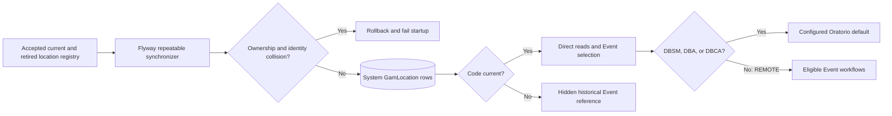

# Requirement: System GamLocation Catalog

## Status

Accepted

## Context

GAM Piracicaba depends on a small catalog of recurring institutional places
and one shared option for Events that have no physical venue. The three Dom
Bosco units and the Remote GamLocation shall be present in every applicable
runtime environment, retain stable identities when their descriptive metadata
changes, and remain protected from ordinary product mutations.

The São Mário unit is also the default place for Oratorio occurrences. Matching
that place by mutable normalized name is not a stable configuration contract.

This specification classifies the three units and the Remote GamLocation as
code-owned system reference data, defines their accepted values and lifecycle,
and specializes the
cross-domain synchronization policy in
[Database Reference Data and Enum Mirrors](../platform/database-reference-data-and-enum-mirrors.md).

## Ubiquitous Language

- `system GamLocation`: A `GamLocation` owned by the accepted application
  catalog and synchronized with `systemManaged: true`.
- `location code`: The immutable application-owned key of a system
  `GamLocation`, such as `DBSM`.
- `current system GamLocation`: A system `GamLocation` whose location code is
  in the current accepted catalog and is available to ordinary reads and
  configuration.
- `retired system GamLocation`: A preserved system `GamLocation` whose location
  code is retained in catalog history but is no longer current.

## Functional requirements

### REQ-GAM-LOCATION-CATALOG-001: Mandatory system location catalog

The application shall define exactly these current system `GamLocation`
records:

| Code | Name | Street | City | State | Postal code | Country code | Latitude | Longitude |
| --- | --- | --- | --- | --- | --- | --- | --- | --- |
| `DBSM` | `Dom Bosco São Mário` | `Av. Santa Rosa, 653 - Areião` | `Piracicaba` | `SP` | `13414-038` | `BR` | Absent | Absent |
| `DBA` | `Dom Bosco Assunção` | `Rua Boa Morte, 1835 - Centro` | `Piracicaba` | `SP` | `13400-140` | `BR` | Absent | Absent |
| `DBCA` | `Dom Bosco Cidade Alta` | `Rua Alfredo Guedes, 1199 - Bairro Alto` | `Piracicaba` | `SP` | `13419-080` | `BR` | Absent | Absent |
| `REMOTE` | `Remoto` | Absent | Absent | Absent | Absent | Absent | Absent | Absent |

All four records shall exist as current active system reference data in every
applicable runtime environment. Their accepted names, physical address values,
and absent values are application-owned metadata. `REMOTE` shall be the only
non-physical GamLocation. Its street, city, state, postal code, country code,
latitude, and longitude shall all be absent, and it shall not contain a meeting
URL.

Rationale:
These recurring GAM Piracicaba places and the singleton remote option are
baseline operational data rather than demonstration fixtures or independently
administered location records.

---

### REQ-GAM-LOCATION-CATALOG-002: Stable code, UUID, and ownership

Every system `GamLocation` shall have:

- its accepted uppercase location code;
- `systemManaged: true`; and
- one UUID identity that remains unchanged for the lifetime of that code.

A location code shall be unique across active and soft-deleted records. It
shall never be renamed, reassigned to another place, or reused after
retirement. A metadata correction, including a corrected name or address,
shall retain both the location code and UUID.

An ordinary user-managed `GamLocation` shall have `code: null` and
`systemManaged: false`. Product workflows shall not create a system-managed
record or allocate a location code.

The normalized `identityName`, `identityStreet`, `identityCity`,
`identityState`, `identityPostalCode`, and `identityCountryCode` values remain
duplicate-comparison keys governed by `REQ-GAM-LOCATION-007`; they are not
stable catalog identity.

Rationale:
Mutable names and addresses cannot safely identify code-owned reference data,
while a stable code and preserved UUID allow metadata correction without
breaking Event references.

---

### REQ-GAM-LOCATION-CATALOG-003: Read-only ownership representation

Every direct or embedded `GamLocation` response shall add these fields to the
representation defined by `REQ-GAM-LOCATION-014`:

| Field | Current system record | Retired system record embedded in historical data | Ordinary record |
| --- | --- | --- | --- |
| `code` | Accepted location code | Preserved location code | `null` |
| `systemManaged` | `true` | `true` | `false` |

`code` shall therefore be a nullable response string and `systemManaged` shall
be a required response boolean.

Current system records shall participate in ordinary direct get and list
operations. Retired system records shall be excluded from direct get, list,
and new configuration workflows, while an existing Event reference may still
embed the preserved record. A direct get for a retired system record shall
return the same `404 RESOURCE_NOT_FOUND` contract used for a missing or
soft-deleted `GamLocation`.

The Remote GamLocation shall be available to any Event workflow whose owning
Requirement Specification permits remote attendance. Membership in the system
catalog alone shall not override a specialized Event workflow's narrower
location rules. In particular, Oratorio shall continue to accept only `DBSM`,
`DBA`, and `DBCA` under `REQ-GAM-LOCATION-CATALOG-008` and
`REQ-ORATORIO-002`.

Create and update request bodies shall continue to accept only the eight
mutable location fields. Supplying `code`, `systemManaged`, or another unknown
property shall return `400 Bad Request`.

Rationale:
Clients need an explicit ownership signal to avoid inferring protection from a
name, while preserved Event history must remain readable after catalog
retirement.

---

### REQ-GAM-LOCATION-CATALOG-004: Product mutation protection

An authenticated caller with `GAM_LOCATION_MANAGE` shall not update or remove
a current or retired system `GamLocation` through the product API.

After ordinary authentication, authorization, and request-body validation, a
valid `PUT /gam-locations/{id}` or `DELETE /gam-locations/{id}` request shall
return `403 Forbidden` with `code: FORBIDDEN_OPERATION` when the target is a
current active system record. A retired or soft-deleted target shall remain
non-current and return `404 RESOURCE_NOT_FOUND` under
`REQ-GAM-LOCATION-CATALOG-003`. The failed operation shall not mutate the
record or emit a product activity event.

Ordinary user-managed locations shall continue to follow the update, duplicate,
reference, removal, authorization, and activity rules in
[GamLocation Records](gam-location-records.md).

Rationale:
Possessing general location-management permission does not transfer ownership
of application reference data to an ordinary product workflow.

---

### REQ-GAM-LOCATION-CATALOG-005: Repeatable catalog synchronization

The complete current and retired system `GamLocation` registry shall be
represented in application code and synchronized through the production-safe
Flyway Java repeatable mechanism selected by ADR-0021.

The synchronizer shall follow `REQ-DATA-002` through `REQ-DATA-006` and
`REQ-DATA-009`. In particular, it shall:

- expose a deterministic checksum derived from every accepted registry code,
  lifecycle state, and owned metadata value;
- preflight the complete registry before mutation;
- reconcile all current entries in one migration transaction;
- create a missing current record with a new UUID v7;
- preserve the UUID of a unique matching system-managed record;
- restore a unique soft-deleted system-managed match when its code is current;
- update only changed application-owned metadata;
- regenerate duplicate-comparison keys from the accepted metadata;
- preserve the accepted absent address and coordinate values of `REMOTE`;
- perform no write, timestamp change, or product activity emission when already
  converged; and
- fail migration and application startup when synchronization cannot complete.

After Flyway completes, read-only startup validation shall verify the complete
current registry, known retired codes, ownership, metadata, duplicate keys, and
configured Oratorio default. Persisted drift with an unchanged migration
checksum shall fail startup and require explicit Developer repair or deliberate
reapplication of the synchronizer; startup shall not mutate the catalog outside
Flyway.

Rationale:
The catalog must be ready before requests are served, while repeatability must
not manufacture audit history or replace referenced identities.

---

### REQ-GAM-LOCATION-CATALOG-006: Collision safety

Before mutation, synchronization shall inspect active and soft-deleted rows for
every accepted or retired location code and every current accepted duplicate
identity.

Synchronization shall fail atomically when:

- a reserved location code belongs to a user-managed record;
- more than one row has the same reserved location code;
- an ordinary user-managed record has the accepted duplicate identity of a
  current catalog entry;
- restoring or updating a system record would collide with another record's
  duplicate identity; or
- persisted ownership cannot be established uniquely.

The synchronizer shall not adopt, convert, overwrite, delete, or select an
arbitrary user-managed or ambiguous record. Collision resolution requires an
explicit Developer-controlled repair or one-time semantic data transformation.

A retired system record shall continue to reserve its location code and
duplicate identity. An ordinary create attempt for that same place shall remain
subject to the duplicate conflict in `REQ-GAM-LOCATION-007`.

Rationale:
Matching by physical-place similarity cannot prove application ownership, and
silent adoption could take control of a record created through an ordinary
business workflow.

---

### REQ-GAM-LOCATION-CATALOG-007: Metadata change and retirement lifecycle

Changing accepted descriptive metadata for the same institution shall update
the existing catalog entry under its original code and UUID.

Removing a location from the current catalog shall retain its code in the
accepted catalog history with retired state. The synchronizer shall preserve
the row, UUID, code, ownership, metadata, and Event references without
automatically soft-deleting, hard-deleting, converting, or reassigning it.

A retired entry shall be non-current under `REQ-GAM-LOCATION-CATALOG-003`. If
the same code later becomes current again, synchronization shall reuse the
unique preserved UUID, restore the record when necessary, and reconcile its
current accepted metadata.

Permanent cleanup requires an explicit Developer-controlled operation or
one-time semantic migration that preserves every Event reference and complies
with `REQ-GAM-LOCATION-010`. Cleanup behavior shall not be inferred by the
repeatable synchronizer.

Rationale:
Catalog evolution must not destroy historical Event meaning or allow a stable
code to acquire a different identity.

---

### REQ-GAM-LOCATION-CATALOG-008: Configured Oratorio default

The environment-wide Oratorio location setting shall be
`gam.oratorio.location-code` and shall default to `DBSM`.

The configured value shall be exactly one of the current physical system
GamLocation codes `DBSM`, `DBA`, or `DBCA`. Blank, unknown, `REMOTE`, retired,
soft-deleted, or user-managed values shall fail application startup before
requests are served. The application shall resolve the configured code to its
preserved UUID; it shall not match the default by mutable location name or
hard-code a database UUID.

`DBSM` shall therefore be the normal São Mário default. An intentional
deployment-wide override may select `DBA` or `DBCA`.

Rationale:
A stable semantic code supports safe configuration while retaining São Mário
as the ordinary Oratorio location.

---

### REQ-GAM-LOCATION-CATALOG-009: Migration-path isolation

The system location catalog shall not depend on `afterMigrate.sql`, a
development or test fixture location, an application startup writer outside
Flyway, or a human bootstrap Account.

Development fixtures may reference or supplement the synchronized current
catalog but shall not redefine its codes, ownership, or accepted metadata.
Production-safe synchronization shall not create Accounts, credentials,
secrets, tokens, sessions, or Account-role assignments.

Infrastructure migration history and operational logs shall provide
synchronization evidence. Catalog synchronization shall not fabricate an
Account actor or emit product-facing GamLocation activity solely because the
infrastructure created or reconciled a system record.

Rationale:
Mandatory locations must exist independently of demo data without allowing a
development callback or privileged test identity into the production-safe
migration path.

## Acceptance scenarios

```gherkin
Scenario: New database receives the complete system location catalog
  Given the production-safe migration path is configured
  When Flyway completes successfully
  Then current system GamLocations DBSM, DBA, DBCA, and REMOTE exist exactly once
  And each record has its accepted metadata
  And each record has systemManaged true and a stable UUID

Scenario: Remote is the single addressless system location
  Given the system location catalog is converged
  When an authorized caller lists GamLocations
  Then exactly one record has code REMOTE and name "Remoto"
  And its street, city, state, postalCode, countryCode, latitude, and longitude are null

Scenario: Repeated synchronization is a no-op
  Given the system location catalog is converged
  When the repeatable synchronizer is deliberately run again
  Then no identifier, value, timestamp, or duplicate key changes
  And no product activity is emitted

Scenario: Accepted metadata correction preserves identity
  Given a current system location has a preserved UUID
  And its accepted address changes without changing its code
  When the changed registry schedules synchronization
  Then the accepted address and duplicate keys are updated
  And the location retains its UUID

Scenario: Soft-deleted current system record is restored
  Given the unique system-managed row for DBA is soft-deleted
  When the DBA registry is deliberately synchronized
  Then that row is restored with its preserved UUID
  And no second DBA row is created

Scenario: Ordinary duplicate blocks synchronization
  Given an ordinary user-managed record has DBCA's accepted duplicate identity
  When system location synchronization runs
  Then synchronization fails without adopting either record
  And no partial catalog mutation commits

Scenario: Client distinguishes protected locations
  Given current system and ordinary GamLocations exist
  When an authorized caller lists GamLocations
  Then system records contain their codes and systemManaged true
  And ordinary records contain code null and systemManaged false

Scenario: Product API cannot mutate a system location
  Given the caller has GAM_LOCATION_MANAGE
  And DBSM is current and active
  When the caller updates or removes DBSM through the product API
  Then the response is 403 Forbidden with code FORBIDDEN_OPERATION
  And DBSM and its activity history remain unchanged

Scenario: Retired location remains historical
  Given an Event references a system GamLocation whose code becomes retired
  When an authorized caller reads ordinary location catalogs and the Event
  Then the retired location is absent from direct location reads
  And the Event retains its location UUID and embedded location representation

Scenario: Oratorio uses the São Mário default
  Given gam.oratorio.location-code is omitted
  And the system location catalog is converged
  When the application starts and an authorized caller creates an Oratorio
  Then startup selects DBSM as the configured location
  And the Oratorio Event references the DBSM UUID

Scenario: Invalid Oratorio location configuration blocks startup
  Given gam.oratorio.location-code identifies REMOTE, an unknown, retired, or ordinary location
  When the application starts
  Then startup fails before requests are served
```

## Diagrams



## Open questions

* None.

## Out of scope

* A separate `displayName`, `officialName`, alias, or alternate-name field.
* Separate neighborhood, building-number, complement, or address-line fields.
* Coordinates for DBSM, DBA, DBCA, or REMOTE.
* Per-occurrence Oratorio location selection.
* User-managed codes or custom system location registries.
* Production seeding of arbitrary convenient locations outside the accepted
  four-record catalog.
* Meeting URLs or provider-specific metadata for REMOTE.
* A product endpoint for retiring, restoring, or permanently cleaning up a
  system location.
* Compatibility adoption of the pre-production name-matched São Mário seed.
  Disposable pre-production databases may be rebuilt against the accepted
  catalog instead.
* Development fixture personas, credentials, and scenario contents.

## Related ADRs

* [ADR-0021: Use Flyway repeatable migrations for code-owned system reference data](../../decisions/0021-use-flyway-repeatable-migrations-for-system-reference-data.md)
* [ADR-0009: Enforce Active GamLocation Duplicate Identity in Persistence](../../decisions/0009-enforce-active-gam-location-duplicate-identity-in-persistence.md)
* [ADR-0010: Serialize GamLocation Mutation and Event Linking](../../decisions/0010-serialize-gam-location-mutation-and-event-linking.md)
* [ADR-0031: Model remote attendance as a single system GamLocation](../../decisions/0031-model-remote-attendance-as-a-single-system-gam-location.md)

## Related requirements

* [GamLocation Records](gam-location-records.md)
* [Database Reference Data and Enum Mirrors](../platform/database-reference-data-and-enum-mirrors.md)
* [Oratorio Occurrences and Planning](../oratorio/oratorio-occurrences-and-planning.md)
* [Event Records and Generic Event Lifecycle](../events/event-records-and-generic-lifecycle.md)
* [Persistence Auditing and Soft Delete](../platform/persistence-auditing-and-soft-delete.md)

## Related videos

* None.
