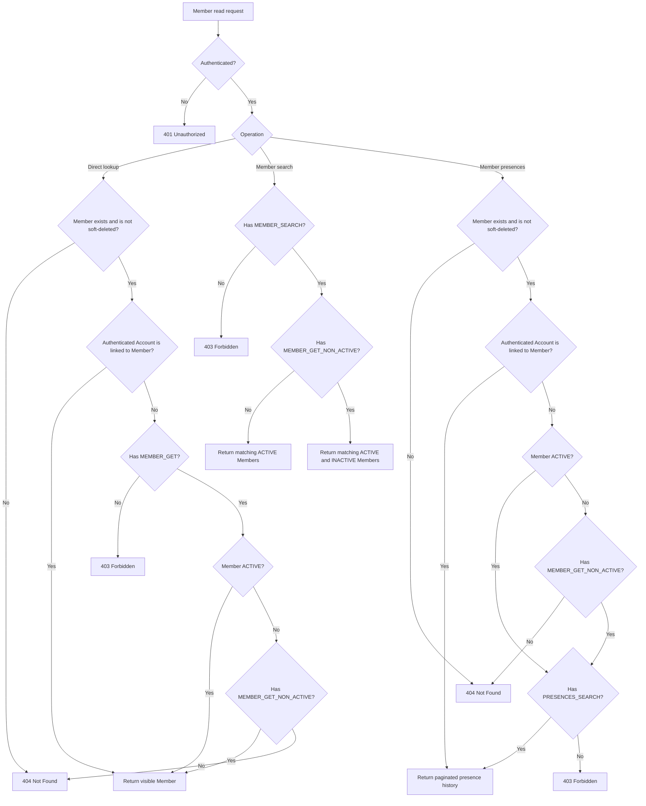

# Requirement: Member Records and Lifecycle

## Status
Accepted

## Context
GAM needs a durable contract for registering lifetime Members, reading and searching Member records, reading a Member's presence history, changing a Member between active and inactive participation, and granting or revoking Coordinator responsibility.

Account registration creates an identity only. It does not create membership. A Coordinator may register a Member directly, while an Account may separately use the membership-solicitation workflow. Both paths must preserve one lifetime Member per Account and keep Member status and Coordinator designation synchronized with the Account's lifecycle-owned authorization Roles.

The current implementation and tests predate this Requirement Specification and were used only as discovery material and conversation prompts. This document defines the intended behavior.

## Ubiquitous Language
- `direct Member registration`: A Coordinator-authorized workflow that creates an active Member for an existing Account without a membership solicitation.
- `Member status`: The Member's current participation state, either `ACTIVE` or `INACTIVE`.
- `linked-Account access`: Access to a Member's own record or presence history granted because the authenticated Account is the Account immutably linked to that Member.
- `activation reason`: The Coordinator-supplied reason for directly registering or reactivating a Member, or the approval reason that establishes membership through a solicitation.
- `deactivation reason`: The Coordinator-supplied reason for changing an active Member to inactive.
- `Coordinator lifecycle operation`: A grant or revoke of Coordinator designation for an active Member, synchronized with the linked Account's `COORD` Role.

## Functional requirements

### REQ-MEMBER-001: Lifetime Member identity and Account linkage
Each Member shall have a UUID v7 identifier in accordance with `REQ-GAM-ID-001` through `REQ-GAM-ID-003`.

Each Member shall be linked to exactly one existing, non-soft-deleted Account. One Account shall be linked to at most one lifetime Member.

The Member-to-Account linkage shall be immutable. Deactivation shall not remove or release the linkage, and a previously linked Account shall not be eligible for another Member registration.

Rationale:
Membership is lifelong even when participation becomes inactive. An immutable one-to-one link prevents two people from sharing one Account identity or one person from gaining multiple Member identities through lifecycle changes.

Valid examples:
- An eligible Account is linked to one newly registered Member.
- An inactive Member remains linked to the same Account.

Invalid examples:
- Registering a second Member for an Account that already has a Member.
- Moving a Member record from one Account to another.
- Treating deactivation as removal of membership.

---

### REQ-MEMBER-002: Required Member information and age eligibility
A Member shall have a `GamName`, birth date, and `GamPhoneNumber`.

The name shall satisfy the accepted GamName requirements. The phone number shall satisfy the accepted GamPhoneNumber requirements and shall be exposed in its canonical E.164 representation.

The birth date shall not be in the future. The person shall be at least 17 years old on the date of direct Member registration. A person is eligible on their seventeenth birthday.

Rationale:
GAM needs consistent identity and contact information and has an explicit minimum membership age.

Valid examples:
- A person registering on their seventeenth birthday.
- A valid international phone number supplied with its country code.

Invalid examples:
- A person who is 16 years old on the registration date.
- A future birth date.
- A name or phone number that violates the accepted common primitive requirements.

---

### REQ-MEMBER-003: Direct Member registration
The system shall expose `POST /members` for direct Member registration. The route shall require authentication and the `MEMBER_MANAGE` permission.

The request shall require:

```json
{
  "accountId": "<account UUID>",
  "firstName": "Ana",
  "surname": "Silva",
  "birthDate": "2000-01-01",
  "phoneNumber": "+5519998877665",
  "reason": "Accepted as a GAM Member"
}
```

The Account shall be existing and non-soft-deleted, shall not already be linked to a Member, and shall not have a pending membership solicitation. Rejected solicitation history shall not prevent direct registration.

Successful direct registration shall create an `ACTIVE` Member, return `201 Created`, set `Location` to `/api/members/{memberId}`, and return the Member record defined by `REQ-MEMBER-009`.

Rationale:
Direct registration supports a Coordinator-confirmed path while keeping public Account registration and self-solicitation separate.

Valid examples:
- A Coordinator with `MEMBER_MANAGE` directly registers an eligible Account and supplies an activation reason.
- An Account with only rejected solicitation history is directly registered.

Invalid examples:
- Public Account registration automatically creates a Member.
- An Account registers itself through `POST /members`.
- Direct registration bypasses a pending solicitation for the same Account.

---

### REQ-MEMBER-004: Member status model and transitions
Member status shall contain exactly `ACTIVE` and `INACTIVE`.

Direct registration and approved membership solicitation shall create an `ACTIVE` Member. The only later valid transitions shall be:

- `ACTIVE` to `INACTIVE` through deactivation; and
- `INACTIVE` to `ACTIVE` through reactivation.

Activating an already active Member or deactivating an already inactive Member shall return `409 Conflict` without changing data, roles, or activity logs.

`PENDING` shall not be a Member status. Pending review belongs to the membership-solicitation lifecycle, and an Account does not become a Member until approval.

Rationale:
Separating application review from Member state preserves the domain rule that only accepted people are Members.

Valid examples:
- An active Member becomes inactive and later becomes active again.
- A pending solicitation exists without a Member record.

Invalid examples:
- A `PENDING` Member record represents an applicant.
- A repeated same-status command silently succeeds.

---

### REQ-MEMBER-005: Lifecycle-owned Account roles (superseded)

This requirement is superseded by `REQ-MEMBER-016`. The replacement adds `COORD` to Member lifecycle ownership and removes the earlier rule that COORD remains unchanged during Member transitions.

Member lifecycle workflows shall exclusively manage the `MEMBER` and `VISITOR` system Roles for a Member's linked Account.

The required projection shall be:

| Member state | Required active role | Role that shall not remain active |
| --- | --- | --- |
| `ACTIVE` | `MEMBER` | `VISITOR` |
| `INACTIVE` | `VISITOR` | `MEMBER` |

Direct registration, solicitation approval, reactivation, and deactivation shall change Member state and synchronize these role assignments in one transaction. Other Account roles, including `COORD`, shall remain unchanged.

Generic Account-role management shall reject attempts to add or drop `MEMBER` or `VISITOR`. The Account Role Management Requirement Specification defines that API boundary.

Rationale:
Authorization-facing membership must not drift from Member lifecycle state, while unrelated responsibilities remain independent.

Valid examples:
- Approving a solicitation creates an active Member, assigns `MEMBER`, and removes `VISITOR` atomically.
- Deactivating a Coordinator's Member record replaces `MEMBER` with `VISITOR` while preserving `COORD`.

Invalid examples:
- An Account is an active Member but has only the `VISITOR` role.
- Generic role administration assigns `MEMBER` without creating an active Member.
- A lifecycle transition emits separate low-level Account-role activity events.

---

### REQ-MEMBER-006: Required and bounded lifecycle reasons
Direct registration, solicitation approval, reactivation, and deactivation shall require a Coordinator-supplied reason.

The system shall trim leading and trailing whitespace before validation and audit logging. After trimming, a reason shall contain between 1 and 2,000 characters.

A null, empty, whitespace-only, or over-2,000-character reason shall return `400 Bad Request` before Member, role, or activity-log mutation.

For solicitation approval, the Coordinator's review reason shall also be the Member's initial activation reason.

Rationale:
Every operation that establishes or changes Member participation also changes authorization-facing lifecycle roles and therefore requires explicit human intent.

Valid examples:
- `" Returning to weekly activities "` is stored and audited as `"Returning to weekly activities"`.
- An approval reason containing exactly 2,000 characters after trimming.

Invalid examples:
- A missing direct-registration reason.
- A blank deactivation reason.
- A reason containing 2,001 characters after trimming.

---

### REQ-MEMBER-007: Reactivation and deactivation API (role effects superseded)

This requirement's routes, permission, required reason, and success status remain accepted. Its lifecycle Role effects are superseded by `REQ-MEMBER-020`, which removes Coordinator designation during deactivation and does not restore it during reactivation.

The system shall expose:

| Method | Route | Required permission | Valid transition |
| --- | --- | --- | --- |
| `PATCH` | `/members/{memberId}/activate` | `MEMBER_ACTIVATION` | `INACTIVE` to `ACTIVE` |
| `PATCH` | `/members/{memberId}/deactivate` | `MEMBER_ACTIVATION` | `ACTIVE` to `INACTIVE` |

Each request shall contain a `reason` satisfying `REQ-MEMBER-006`. A successful transition shall return `204 No Content` after the Member state, lifecycle roles, and activity event commit together.

Rationale:
Activation authority is distinct from general record management, while both transition directions require the same explicit capability.

Valid examples:
- An authorized Coordinator reactivates an inactive Member with a reason.
- An authorized Coordinator deactivates an active Member with a reason.

Invalid examples:
- A caller with only `MEMBER_GET` changes Member status.
- A transition returns success before its role synchronization commits.

---

### REQ-MEMBER-008: Member record authorization and status visibility (superseded)
This requirement is superseded by `REQ-MEMBER-013`, `REQ-MEMBER-014`, and `REQ-MEMBER-015`.

The superseded rule required `MEMBER_GET` for every direct Member lookup, required `MEMBER_SEARCH` for Member search, and allowed only callers with `MEMBER_GET_NON_ACTIVE` to see inactive Members. It did not provide linked-Account access to the Member record and did not define Member presence-history visibility.

Rationale for supersession:
An authenticated Account must retain access to its own lifetime Member record and presence history after deactivation replaces its `MEMBER` Role with `VISITOR`. Collection discovery and access to other Members remain permission-gated.

---

### REQ-MEMBER-009: Member record response
Member lookup, search, and successful direct registration shall return this Member record shape:

```json
{
  "id": "<member UUID>",
  "firstName": "Ana",
  "surname": "Silva",
  "birthDate": "2000-01-01",
  "phoneNumber": "+5519998877665",
  "status": "ACTIVE",
  "account": {
    "id": "<account UUID>",
    "email": "ana@example.com",
    "displayName": "Ana"
  }
}
```

The response shall not expose Account roles, credentials, tokens, authentication sessions, soft-delete fields, or row audit metadata.

The authorization path that makes a Member visible shall not change the response fields.

Rationale:
Member records need contact and linked identity information without exposing authorization internals or low-level persistence metadata.

Valid examples:
- A visible active Member response includes canonical phone number and an Account summary.
- Search and direct lookup use the same Member record shape.

Invalid examples:
- A Member response embeds the Account's role collection.
- A response contains `createdBy`, `deletedAt`, password hashes, or sessions.

---

### REQ-MEMBER-010: Member search contract
`POST /members/search` shall accept only these public filter fields and comparison methods:

| Public field | Allowed comparison methods |
| --- | --- |
| `id` | `EQUALS`, `IN` |
| `name` | `LIKE` across `firstName` and `surname` |
| `birthDate` | `EQUALS`, `GREATER_THAN_OR_EQUAL`, `LESS_THAN_OR_EQUAL` |
| `phoneNumber` | `EQUALS`, `LIKE` |
| `status` | `EQUALS`, `IN` |
| `accountId` | `EQUALS` |
| `email` | `EQUALS`, `LIKE` |
| `role` | `EQUALS`, `IN` |
| `createdAt` | `GREATER_THAN_OR_EQUAL`, `LESS_THAN_OR_EQUAL` |
| `updatedAt` | `GREATER_THAN_OR_EQUAL`, `LESS_THAN_OR_EQUAL` |

Empty filters shall return a paginated page of all Members visible to the caller. Search shall apply the status visibility from `REQ-MEMBER-014` in addition to caller-supplied filters.

Unsupported methods and invalid filter values shall identify the public field. Unknown fields shall return the generic message `Unknown filter field.` and shall not expose submitted field names or persistence paths.

Rationale:
Member search needs a stable public vocabulary and must not permit filters to bypass status visibility.

Valid examples:
- Searching `name LIKE "Silva"` matches the first name or surname.
- A caller with non-active visibility searches `status IN ["ACTIVE", "INACTIVE"]`.

Invalid examples:
- Filtering by an internal path such as `account.accountRoles.role.name`.
- A status filter exposes inactive Members to a caller without non-active visibility.

---

### REQ-MEMBER-011: Member API error semantics
Member registration, lookup, search, Member status, and Coordinator lifecycle routes shall use these outcomes:

| Condition | Response |
| --- | --- |
| Malformed or invalid fields, underage person, or invalid reason | `400 Bad Request` |
| Unauthenticated protected request | `401 Unauthorized` |
| Authenticated caller lacks the required permission | `403 Forbidden` |
| Required Account or Member is missing or soft-deleted, or Member is status-hidden | `404 Not Found` |
| Account already has a Member, pending solicitation blocks direct registration, same-status or same-designation transition, invalid lifecycle Role projection, or concurrent lifecycle loss | `409 Conflict` |
| Non-SUDO operation would remove the final current Coordinator | `403 Forbidden` |

Failed requests shall not create or change Members, lifecycle roles, solicitations, or activity logs.

Rationale:
Clients need stable distinctions between invalid input, authorization failure, hidden resources, and conflicting lifecycle state.

---

### REQ-MEMBER-012: Member lifecycle activity audit
Successful Member workflows shall emit exactly one high-level activity event:

| Workflow | Activity action |
| --- | --- |
| Direct registration | `MEMBER_REGISTERED` |
| Reactivation | `MEMBER_ACTIVATED` |
| Deactivation | `MEMBER_DEACTIVATED` |

Each event shall capture the actor Account, Member identifier, linked Account identifier, relevant previous and new status, lifecycle roles added and removed, normalized reason, and request metadata according to the activity-audit policy.

The business mutation, role synchronization, and activity-log row shall commit together. The workflow shall not emit additional `ACCOUNT_ROLE_ADDED` or `ACCOUNT_ROLE_REMOVED` events for its internal role changes. Failed operations shall emit no activity event.

Rationale:
The audit history should represent one business intention rather than every database write caused by that intention.

---

### REQ-MEMBER-013: Direct Member lookup visibility
The system shall expose `GET /members/{memberId}` for authenticated direct Member lookup.

An authenticated Account shall be allowed to read the Member record linked to that same Account regardless of whether the Member is `ACTIVE` or `INACTIVE`. Linked-Account access shall not require `MEMBER_GET` or `MEMBER_GET_NON_ACTIVE`.

For a Member linked to another Account:

- reading an `ACTIVE` Member shall require `MEMBER_GET`; and
- reading an `INACTIVE` Member shall require both `MEMBER_GET` and `MEMBER_GET_NON_ACTIVE`.

`MEMBER_GET_NON_ACTIVE` shall be an additional status-visibility permission and shall not grant direct lookup without `MEMBER_GET`.

Eligibility for linked-Account access shall be determined only by the immutable Member-to-Account linkage from `REQ-MEMBER-001`. Matching email addresses, names, Roles, permissions, or historical associations shall not establish linked-Account access.

A lookup for a missing or soft-deleted Member shall return `404 Not Found`. A caller whose Account is not linked to the target Member and who has `MEMBER_GET` but not `MEMBER_GET_NON_ACTIVE` shall receive `404 Not Found` when requesting an inactive Member. Pending and rejected membership solicitations shall never appear as Member records.

Rationale:
A Member must retain access to their own lifetime membership information after deactivation removes ordinary Member permissions. Access to another person's inactive membership remains restricted operational information.

Valid examples:
- An authenticated Account with only `VISITOR` reads its own linked inactive Member record.
- A caller with `MEMBER_GET` reads another active Member.
- A caller with `MEMBER_GET` and `MEMBER_GET_NON_ACTIVE` reads another inactive Member.

Invalid examples:
- An Account claims linked-Account access because its email matches data associated with another Member.
- A caller uses `MEMBER_GET_NON_ACTIVE` without `MEMBER_GET` to read another inactive Member.
- Linked-Account access exposes a soft-deleted Member.

---

### REQ-MEMBER-014: Member search authorization and status visibility
The system shall expose `POST /members/search` for authenticated paginated Member search. Search shall require `MEMBER_SEARCH` for every caller.

Linked-Account access from `REQ-MEMBER-013` shall not grant Member search. `MEMBER_GET`, `MEMBER_GET_NON_ACTIVE`, or knowledge of the caller's own Member identifier shall not substitute for `MEMBER_SEARCH`.

A caller with `MEMBER_SEARCH` but without `MEMBER_GET_NON_ACTIVE` shall receive only `ACTIVE` Members. A caller with both permissions may receive `ACTIVE` and `INACTIVE` Members. `MEMBER_GET_NON_ACTIVE` shall not grant search without `MEMBER_SEARCH`.

Status visibility shall be applied in addition to every caller-supplied filter. A filter requesting inactive Members shall not bypass the permission boundary. Status-hidden Members shall be omitted from the page rather than causing the search to fail.

The accepted public filter vocabulary and comparison methods are defined by `REQ-MEMBER-010`.

Rationale:
Direct self-access is not collection discovery. Search remains a separately granted capability, and inactive membership remains restricted within search results.

Valid examples:
- A caller with only `MEMBER_SEARCH` receives active Members when searching with empty filters.
- A caller with `MEMBER_SEARCH` and `MEMBER_GET_NON_ACTIVE` searches active and inactive Members.

Invalid examples:
- An Account without `MEMBER_SEARCH` searches only for its own Member record.
- A caller with only `MEMBER_GET_NON_ACTIVE` performs Member search.
- A status filter exposes inactive Members to a caller without non-active visibility.

---

### REQ-MEMBER-015: Member presence-history visibility
The system shall expose `GET /members/{memberId}/presences` for authenticated paginated access to a Member's presence history.

The Presence response representation, active-only visibility, ordering, client-selectable sorting, and absence of product filters shall follow `REQ-PRESENCE-007` and `REQ-PRESENCE-010`.

An authenticated Account shall be allowed to read the presence history of its own linked Member regardless of Member status. Linked-Account access shall not require `PRESENCES_SEARCH` or `MEMBER_GET_NON_ACTIVE`.

For a Member linked to another Account:

- reading an `ACTIVE` Member's presence history shall require `PRESENCES_SEARCH`; and
- reading an `INACTIVE` Member's presence history shall require both `PRESENCES_SEARCH` and `MEMBER_GET_NON_ACTIVE`.

`MEMBER_GET` and `MEMBER_SEARCH` shall not substitute for `PRESENCES_SEARCH`. `MEMBER_GET_NON_ACTIVE` shall expand which Member statuses are visible but shall not independently grant presence-history access.

The system shall return:

- `401 Unauthorized` when the request is unauthenticated;
- `403 Forbidden` when the target Member is visible but the authenticated caller has neither linked-Account access nor `PRESENCES_SEARCH`; and
- `404 Not Found` when the target Member is missing or soft-deleted, or when the target Member is inactive, the authenticated Account is not linked to that Member, and the caller lacks `MEMBER_GET_NON_ACTIVE`.

Eligibility for linked-Account access shall use only the immutable Member-to-Account linkage from `REQ-MEMBER-001`. A failed visibility or authorization check shall expose no presence data.

Rationale:
Members need access to their own participation history, while presence history belonging to other Members is operational information. Applying inactive visibility to the parent Member prevents the presence endpoint from bypassing Member status privacy.

Valid examples:
- An authenticated Account with only `VISITOR` reads its own inactive Member's presence history.
- A caller with `PRESENCES_SEARCH` reads an active Member's presence history.
- A caller with `PRESENCES_SEARCH` and `MEMBER_GET_NON_ACTIVE` reads an inactive Member's presence history.

Invalid examples:
- A caller uses `MEMBER_GET` as a substitute for `PRESENCES_SEARCH`.
- A caller with `PRESENCES_SEARCH` but without `MEMBER_GET_NON_ACTIVE` reads an inactive Member's presence history.
- Linked-Account access exposes the presence history of a soft-deleted Member.

---

### REQ-MEMBER-016: Member lifecycle owns MEMBER, VISITOR, and COORD

This requirement supersedes `REQ-MEMBER-005`.

Member lifecycle workflows shall exclusively manage the `MEMBER`, `VISITOR`, and `COORD` system Roles for a Member's linked Account. The valid current projections shall be:

| Member lifecycle state | Required active Roles | Roles that shall not remain active |
| --- | --- | --- |
| Active Member without Coordinator designation | `MEMBER` | `VISITOR`, `COORD` |
| Active Coordinator | `MEMBER`, `COORD` | `VISITOR` |
| Inactive Member | `VISITOR` | `MEMBER`, `COORD` |

Direct registration and membership-solicitation approval shall create an active Member without Coordinator designation. Reactivation shall restore `MEMBER` and remove `VISITOR`, but shall not restore a previously revoked or deactivation-removed `COORD` assignment. Deactivation shall remove both `MEMBER` and `COORD` and assign `VISITOR`.

Before direct registration or membership-solicitation approval, an Account without a Member shall have no active `MEMBER`, `VISITOR`, or `COORD` assignment. Any such assignment shall be treated as an inconsistent pre-existing projection and shall return `409 Conflict` without repair, Member creation, Role mutation, or activity logging.

Each lifecycle workflow shall synchronize Member state and all affected lifecycle-owned Role assignments in one transaction while preserving every active custom Role. Generic Account-role administration shall reject direct addition or removal of every system-managed Role under `REQ-ACCOUNT-ROLE-016` through `REQ-ACCOUNT-ROLE-018`.

Rationale:
A Coordinator is an active Member with current coordination responsibility. Authorization-facing system Roles must not drift from Member state or bypass that responsibility through generic Account administration.

Valid examples:
- Deactivating a Coordinator removes MEMBER and COORD, assigns VISITOR, and preserves custom Roles.
- Reactivating a former Coordinator assigns MEMBER but leaves COORD absent.

Invalid examples:
- An inactive Member retains COORD.
- Direct Member registration automatically grants COORD.
- Generic Account-role administration grants COORD to an Account without an active Member.

---

### REQ-MEMBER-017: Coordinator identity, authorization, and routes

A current Coordinator shall be an active Member whose linked active Account has active assignments to the current `MEMBER` and `COORD` system Roles and no active assignment to `VISITOR`. Coordinator designation shall not create a separate Coordinator entity or a third Member status.

The system shall expose:

| Method | Route | Required permission | Purpose |
| --- | --- | --- | --- |
| `PATCH` | `/members/{memberId}/coordinator/grant` | `COORDINATOR_MANAGE` | Grant Coordinator designation to an active Member. |
| `PATCH` | `/members/{memberId}/coordinator/revoke` | `COORDINATOR_MANAGE` | Revoke Coordinator designation while preserving active membership. |

`COORDINATOR_MANAGE` shall be sufficient on its own. The routes shall not additionally require `MEMBER_MANAGE`, `MEMBER_ACTIVATION`, `MEMBER_GET`, or `ACCOUNT_ROLE_MANAGE`. The baseline `COORD` bundle shall include `COORDINATOR_MANAGE`; SUDO shall receive it as part of the complete system permission registry. Baseline `MEMBER` and `VISITOR` shall not receive it.

Both routes shall accept `{ "reason": "..." }` under `REQ-MEMBER-018`. A successful transition shall return `204 No Content` after the Role projection and activity event commit together.

An unauthenticated request shall return `401 Unauthorized`. An authenticated caller without `COORDINATOR_MANAGE` shall return `403 Forbidden`. A missing or soft-deleted Member or linked Account shall return `404 Not Found` under ordinary lifecycle visibility.

Rationale:
Coordinator designation is a Member-domain responsibility and needs dedicated authority distinct from general Member editing, Member activation, and custom Role administration.

---

### REQ-MEMBER-018: Coordinator transition, reason, and audit contract

Coordinator grant shall require an active Member whose linked active Account has active `MEMBER`, no active `VISITOR`, and no active `COORD`. On success, the system shall create one active COORD assignment while preserving Member status and all custom Roles.

Coordinator revoke shall require an active Coordinator with active `MEMBER`, active `COORD`, and no active `VISITOR`. On success, the system shall soft-delete the active COORD assignment while preserving active Member status, `MEMBER`, and all custom Roles.

Granting Coordinator designation when COORD is already active, revoking when COORD is absent, or granting to an inactive Member shall return `409 Conflict`. Any other inconsistent `MEMBER`/`VISITOR`/`COORD` projection shall also return `409 Conflict`; the Coordinator routes shall not repair inconsistent data.

The `reason` field shall be required. The system shall trim leading and trailing whitespace and require between 1 and 2,000 characters after trimming. A missing, null, empty, whitespace-only, or over-2,000-character reason shall return `400 Bad Request` before Member, Account, Role, assignment, or activity-log loading for mutation.

Each successful transition shall emit exactly one high-level activity event:

| Transition | Activity action |
| --- | --- |
| Coordinator grant | `COORDINATOR_GRANTED` |
| Coordinator revoke | `COORDINATOR_REVOKED` |

The event target type and identifier shall be the affected `MEMBER` and Member UUID. The event shall capture the actor Account, linked Account identifier, COORD Role identifier, Role change, normalized reason, and request metadata according to the activity-audit policy. The business mutation and activity-log row shall commit together. The workflow shall not emit `ACCOUNT_ROLE_ADDED` or `ACCOUNT_ROLE_REMOVED`. Failed transitions shall emit no activity event.

Rationale:
Coordinator changes are security-sensitive Member lifecycle decisions whose human intent and atomic authorization effect must be explicit.

Valid examples:
- A grant reason of `" New event responsibility "` is audited as `"New event responsibility"`.
- Revoking Coordinator designation preserves MEMBER and an unrelated custom Role.

Invalid examples:
- Repeating a grant silently succeeds.
- Grant repairs an active Member that is missing MEMBER.
- One revoke emits both COORDINATOR_REVOKED and ACCOUNT_ROLE_REMOVED.

---

### REQ-MEMBER-019: Coordinator lockout and concurrent lifecycle consistency

A Coordinator revoke or Member deactivation shall not remove the final active Coordinator unless the authenticated actor's active Account has an active current `SUDO` assignment. A violation shall return `403 Forbidden`, preserve Member state and all Role assignments, and emit no activity event.

The final-Coordinator decision shall count only current Coordinators under `REQ-MEMBER-017`. Soft-deleted Accounts, Members, Roles, or assignments and stale system Roles shall not satisfy the invariant.

Coordinator grant, Coordinator revoke, Member activation, and Member deactivation affecting the same Member and linked Account shall serialize their lifecycle decision. The committed result shall satisfy one projection from `REQ-MEMBER-016`.

Concurrent grants for the same Member shall produce exactly one successful transition and one `409 Conflict`. Concurrent revokes shall produce exactly one successful transition and one `409 Conflict`. Concurrent removals that could each observe another Coordinator shall serialize the final-Coordinator decision so that a non-SUDO outcome leaves at least one current Coordinator.

Each committed transition shall emit exactly one corresponding high-level activity event. A losing or forbidden request shall emit none.

Rationale:
Coordinator authority needs the same fail-safe recovery protection as the prior COORD rule while lifecycle concurrency must not create impossible role projections or duplicate audit history.

---

### REQ-MEMBER-020: Member activation and deactivation Role effects

This requirement supersedes the lifecycle Role effects in `REQ-MEMBER-007`; its routes, `MEMBER_ACTIVATION` permission, required reason, and `204 No Content` success response remain unchanged.

Reactivation shall require the valid inactive projection: active `VISITOR`, no active `MEMBER`, and no active `COORD`. It shall change the Member to `ACTIVE`, assign `MEMBER`, remove `VISITOR`, leave `COORD` absent, preserve custom Roles, and emit exactly one `MEMBER_ACTIVATED` event.

Deactivation shall require either valid active projection from `REQ-MEMBER-016`. It shall change the Member to `INACTIVE`, remove `MEMBER`, remove `COORD` when present, assign `VISITOR`, preserve custom Roles, and emit exactly one `MEMBER_DEACTIVATED` event. Removing COORD shall not emit a separate `COORDINATOR_REVOKED` or `ACCOUNT_ROLE_REMOVED` event.

Deactivation of the final current Coordinator shall enforce `REQ-MEMBER-019`. Activation or deactivation against an inconsistent lifecycle Role projection shall return `409 Conflict` without repair, mutation, or activity logging.

Rationale:
Member status transitions must keep Coordinator authority consistent without treating deactivation as a separate Coordinator revocation decision.

## Acceptance scenarios

```gherkin
Scenario: Coordinator directly registers an eligible Member
  Given an existing Account has no Member and no pending membership solicitation
  And the person is at least 17 years old
  And the caller has MEMBER_MANAGE
  When the caller submits valid Member data and an activation reason
  Then the system creates an ACTIVE Member linked permanently to the Account
  And the Account has MEMBER and does not have VISITOR
  And the response is 201 Created with Location /api/members/{memberId}
  And exactly one MEMBER_REGISTERED activity event is recorded

Scenario: Pending solicitation blocks direct registration
  Given an Account has a PENDING membership solicitation
  And the caller has MEMBER_MANAGE
  When the caller tries to register a Member directly for that Account
  Then the system returns 409 Conflict
  And no Member, role change, or activity event is created

Scenario: Direct registration rejects an inconsistent lifecycle Role projection
  Given an Account has no Member but has MEMBER, VISITOR, or COORD
  And the caller has MEMBER_MANAGE
  When the caller submits valid Member data and an activation reason
  Then the system returns 409 Conflict
  And no Role is repaired or mutated
  And no Member or activity event is created

Scenario: Deactivate an active Member
  Given an ACTIVE Member is linked to an Account with MEMBER and COORD
  And the caller has MEMBER_ACTIVATION
  When the caller deactivates the Member with a valid reason
  Then the Member becomes INACTIVE
  And MEMBER is removed and VISITOR is assigned
  And COORD is removed
  And exactly one MEMBER_DEACTIVATED activity event is recorded
  And no COORDINATOR_REVOKED or ACCOUNT_ROLE_REMOVED event is recorded

Scenario: Reject repeated deactivation
  Given a Member is already INACTIVE
  And the caller has MEMBER_ACTIVATION
  When the caller tries to deactivate the Member with a valid reason
  Then the system returns 409 Conflict
  And no role or activity-log change occurs

Scenario: Hide inactive Member without non-active visibility
  Given an INACTIVE Member exists
  And the caller has MEMBER_GET but not MEMBER_GET_NON_ACTIVE
  When the caller requests GET /members/{memberId}
  Then the system returns 404 Not Found

Scenario: Inactive Member reads own record without general Member permissions
  Given an INACTIVE Member is linked to the authenticated Account
  And the Account has neither MEMBER_GET nor MEMBER_GET_NON_ACTIVE
  When the Account requests GET /members/{memberId} for its own linked Member
  Then the system returns the Member record

Scenario: Search cannot bypass status visibility
  Given active and inactive Members exist
  And the caller has MEMBER_SEARCH but not MEMBER_GET_NON_ACTIVE
  When the caller searches with empty filters
  Then the response contains active Members only

Scenario: Linked-Account access does not grant Member search
  Given a Member is linked to the authenticated Account
  And the Account does not have MEMBER_SEARCH
  When the Account searches with a filter for its own Member identifier
  Then the system returns 403 Forbidden

Scenario: Inactive Member reads own presence history
  Given an INACTIVE Member is linked to the authenticated Account
  And the Account has neither PRESENCES_SEARCH nor MEMBER_GET_NON_ACTIVE
  When the Account requests GET /members/{memberId}/presences for its own linked Member
  Then the system returns the paginated presence history

Scenario: Presence search cannot bypass inactive Member visibility
  Given an INACTIVE Member is linked to another Account
  And the caller has PRESENCES_SEARCH but not MEMBER_GET_NON_ACTIVE
  When the caller requests GET /members/{memberId}/presences
  Then the system returns 404 Not Found

Scenario: Deny another visible Member's presence history without permission
  Given an ACTIVE Member is linked to another Account
  And the caller does not have PRESENCES_SEARCH
  When the caller requests GET /members/{memberId}/presences
  Then the system returns 403 Forbidden

Scenario: Grant Coordinator designation to an active Member
  Given an ACTIVE Member's linked active Account has MEMBER and no VISITOR or COORD
  And the caller has COORDINATOR_MANAGE
  When the caller grants Coordinator designation with a valid reason
  Then the system returns 204 No Content
  And COORD is assigned while MEMBER and custom Roles are preserved
  And exactly one COORDINATOR_GRANTED activity event is recorded

Scenario: Revoke Coordinator designation while preserving membership
  Given a current Coordinator has MEMBER and COORD and no VISITOR
  And another current Coordinator exists
  And the caller has COORDINATOR_MANAGE
  When the caller revokes Coordinator designation with a valid reason
  Then the system returns 204 No Content
  And COORD is removed while MEMBER and custom Roles are preserved
  And exactly one COORDINATOR_REVOKED activity event is recorded

Scenario: Reactivation does not restore Coordinator designation
  Given an INACTIVE Member previously held COORD
  And the linked Account has VISITOR and no MEMBER or COORD
  And the caller has MEMBER_ACTIVATION
  When the caller reactivates the Member with a valid reason
  Then the Member becomes ACTIVE
  And MEMBER is assigned and VISITOR is removed
  And COORD remains absent

Scenario: Non-SUDO caller cannot remove the final Coordinator
  Given exactly one current Coordinator exists
  And the caller has COORDINATOR_MANAGE but no active SUDO assignment
  When the caller revokes that Coordinator or deactivates that Member
  Then the system returns 403 Forbidden
  And Member state and all Role assignments remain unchanged
  And no activity event is recorded

Scenario: SUDO caller may remove the final Coordinator
  Given exactly one current Coordinator exists
  And the caller's active Account has active SUDO
  When the caller revokes that Coordinator with a valid reason
  Then the system returns 204 No Content
  And the COORD assignment is soft-deleted
  And exactly one COORDINATOR_REVOKED activity event is recorded

Scenario: Concurrent Coordinator grants have one winner
  Given an active Member has a valid non-Coordinator Role projection
  And two authorized callers concurrently grant Coordinator designation
  When both transitions attempt to commit
  Then exactly one request succeeds
  And the other returns 409 Conflict
  And one active COORD assignment and one COORDINATOR_GRANTED event exist

Scenario: Coordinator management fails closed on inconsistent projection
  Given an ACTIVE Member's linked Account is missing MEMBER or has VISITOR
  And the caller has COORDINATOR_MANAGE
  When the caller grants or revokes Coordinator designation
  Then the system returns 409 Conflict
  And no Role is repaired or mutated
  And no activity event is recorded
```

## Diagrams

* [Member Lifecycle and Membership Solicitation](../../diagrams/member-lifecycle-and-solicitation.md)



## Open questions

* None.

## Out of scope

* Editing Member name, birth date, phone number, or Account linkage.
* Deleting, soft-deleting, restoring, or merging Members.
* Creating an Account through Member registration.
* Account deactivation, deletion, or restoration workflows.
* Manually adding or dropping lifecycle-owned `MEMBER`, `VISITOR`, and `COORD` Roles outside their Member lifecycle workflows.
* A separate Coordinator entity, Coordinator Member status, or automatic restoration of a former Coordinator designation.
* Repair or reconciliation of inconsistent historical lifecycle Role projections.
* Reading activity-log history through Member endpoints.
* Event-centric presence visibility, including `GET /events/{eventId}/presences`.
* Presence registration, editing, removal, response-field definition, or other presence lifecycle behavior.
* Test structure or implementation strategy.

## Related ADRs

* [ADR-0013: Make Member lifecycle own Coordinator designation](../../decisions/0013-make-member-lifecycle-own-coordinator-designation.md)

## Related requirements

* [Membership Solicitations](membership-solicitations.md)
* [GamName](../common/gam-name.md)
* [GamPhoneNumber](../common/gam-phone-number.md)
* [UUID Identity](../common/uuid.md)
* [Account Role Management](../rbac/account-role-management.md)
* [RBAC Catalog](../rbac/rbac-catalog.md)
* [Member Event Presences](../presences/member-event-presences.md)

## Related videos

* None.
