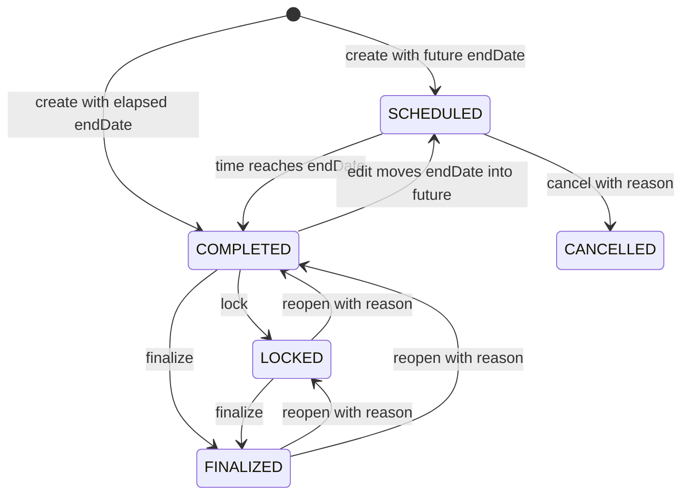
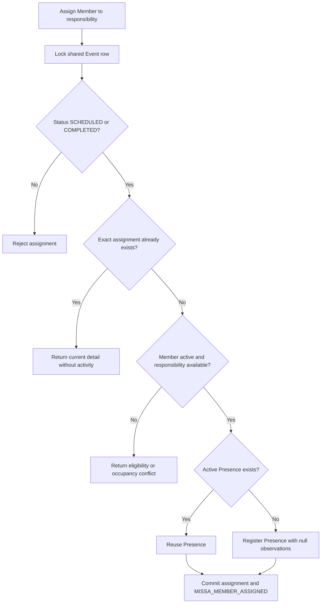

# Requirement: Missa Workflow and Liturgical Assignments

## Status

Accepted

## Context

GAM needs a complete specialized Missa workflow that reuses the common Event
identity, location, audience, visibility, temporal status, and discovery
contracts while owning Missa creation, editing, lifecycle, deletion, and
liturgical responsibility planning.

Missa assignments are coordinator-managed service plans. They are distinct
from confirmed Member Presence, but creating an assignment also confirms that
Member's Presence for the Missa. Missa creation and assignment management are
separate workflows.

The implementation and tests for Missa predate the Requirement Specification
workflow. They were used only as discovery material and conversation prompts.
This specification records the behavior agreed during planning and is the
authoritative source for the specialized workflow.

## Ubiquitous Language

- `liturgical responsibility`: One standardized service responsibility in a
  Missa plan.
- `single-member responsibility`: A liturgical responsibility that may contain
  zero or one assigned Member.
- `multi-member responsibility`: A liturgical responsibility that may contain
  zero or more assigned Members without an artificial maximum.
- `Comentários`: The responsibility identified by `COMENTARIOS`; its assigned
  Member serves as the `comentarista`.

## Functional requirements

### REQ-MISSA-001: Shared Event identity and specialized ownership

Each Missa shall specialize exactly one Event of immutable type `MISSA`. The
Missa and Event shall share the same UUID as their public identity.

The specialized workflow shall create, edit, transition, delete, and read the
Event and Missa data atomically. Generic Event mutation routes shall continue
to reject the specialized Event under `REQ-EVENT-017`.

Multiple active Missas may have the same title, local date, GamLocation, or
overlapping time ranges. No duplicate identity shall be inferred from those
fields.

---

### REQ-MISSA-002: Specialized creation request and response

`POST /missas` shall create one Missa without assignments. The request shall
contain:

| Field | Contract |
| --- | --- |
| `title` | Required string; trim surrounding whitespace; require 1 to 255 characters after trimming. |
| `description` | Optional string; missing or `null` becomes `""`; trim surrounding whitespace; allow at most 10,000 characters. |
| `gamLocationId` | Required UUID of an active eligible GamLocation under `REQ-EVENT-004`. |
| `requiredPermissionId` | Optional UUID; missing or `null` creates a public Event; a non-null value follows `REQ-EVENT-005`. |
| `beginDate` | Required valid instant. |
| `endDate` | Required valid instant strictly after `beginDate`. |

The request shall reject `type`, `status`, `cancellationReason`, assignments,
responsibility codes, or Member identifiers rather than ignoring them. The
workflow shall assign type `MISSA` and derive effective status under
`REQ-EVENT-006`. Past, present, and future ranges are accepted without an
artificial horizon or duration beyond `endDate > beginDate`.

Creation shall require `MISSA_CREATE`, current eligibility for the selected
GamLocation, and the exact selected Event audience permission when restricted.
It shall not additionally require `EVENT_CREATE`.

Successful creation shall return `201 Created`,
`Location: /api/missas/{missaId}`, and the complete specialized detail from
`REQ-MISSA-011` with every responsibility empty.

---

### REQ-MISSA-003: Common discovery and specialized read

Common Missa discovery shall remain available through `POST /events/search`,
including filtering by Event type `MISSA`. No `/missas/search` endpoint shall
be added.

`GET /missas/{missaId}` shall return the specialized detail. It shall require
`MISSA_GET` and visibility under the Event's exact audience permission. An
unauthenticated caller shall receive `401 Unauthorized`; an authenticated
caller without `MISSA_GET` shall receive `403 Forbidden`; and a missing,
soft-deleted, or audience-hidden Missa shall receive `404 RESOURCE_NOT_FOUND`.

A public Missa remains protected by `MISSA_GET`; public Event visibility shall
not make its specialized plan anonymous.

---

### REQ-MISSA-004: Closed responsibility catalog and cardinality

Every Missa shall expose exactly this ordered responsibility catalog:

| Order | Responsibility code | Display responsibility | Cardinality |
| --- | --- | --- | --- |
| 1 | `COMENTARIOS` | Comentários | Zero or one Member |
| 2 | `PRIMEIRA_LEITURA` | Primeira Leitura | Zero or one Member |
| 3 | `SALMO` | Salmo | Zero or one Member |
| 4 | `SEGUNDA_LEITURA` | Segunda Leitura | Zero or one Member |
| 5 | `PRECES` | Preces | Zero or one Member |
| 6 | `ACOLHIDA` | Acolhida | Zero or more Members |
| 7 | `BANDA` | Banda | Zero or more Members |

No responsibility is mandatory for creation, cancellation, locking, or
finalization. A Member may hold multiple responsibilities in the same Missa
but may appear at most once within each responsibility.

An unknown responsibility code shall return `400 Bad Request` without
mutation or activity.

---

### REQ-MISSA-005: Member eligibility and retained assignments

Only an active Member may receive a new assignment. An active Account-less
Member is eligible; a linked Account is not required.

A missing or soft-deleted Member shall return `404 RESOURCE_NOT_FOUND`. An
existing inactive Member targeted for a new assignment shall return
`409 MISSA_MEMBER_NOT_ACTIVE` with `missaId`, `memberId`, and current Member
status.

If an assigned Member later becomes inactive, the assignment shall remain and
the specialized detail shall show the current inactive status. Repeating that
same retained assignment shall remain an idempotent no-op even though the
Member is now inactive. A coordinator may deliberately remove the assignment.

---

### REQ-MISSA-006: Assignment addition and occupied responsibilities

`PUT /missas/{missaId}/assignments/{responsibility}/members/{memberId}` shall
assign one Member.

For a single-member responsibility:

- an empty responsibility shall accept an eligible Member;
- repeating the current Member shall return an idempotent `200 OK` no-op; and
- assigning a different Member while occupied shall return
  `409 MISSA_RESPONSIBILITY_ALREADY_ASSIGNED` with `missaId`,
  `responsibility`, and `currentMemberId`.

The current assignment must be removed before a different Member can be
assigned. The operation shall not replace the current Member implicitly.

For a multi-member responsibility, adding an absent eligible Member shall
change the set. Adding a Member already in the set shall return an idempotent
`200 OK` no-op. Acolhida and Banda shall have no artificial capacity.

A changed assignment and its automatic Presence effect shall commit
atomically. Success, including an idempotent no-op, shall return `200 OK` with
the complete specialized detail. A normalized no-op shall not persist or emit
an activity.

---

### REQ-MISSA-007: Automatic Presence registration

Creating a Missa assignment shall require one active common Presence for the
same Missa Event and Member pair.

If an active Presence already exists, the assignment shall reuse it. Otherwise
the assignment workflow shall atomically register a new Presence with
`observations: null`. The specialized workflow shall require only
`MISSA_MANAGE`; it shall not additionally require `PRESENCE_REGISTER`.

The automatic registration remains a confirmed attendance fact under
`REQ-PRESENCE-017`. It shall not create an RSVP, reservation, planned-attendance,
or tentative state.

The combined business operation shall emit only the high-level
`MISSA_MEMBER_ASSIGNED` activity from `REQ-MISSA-017`. It shall not emit a
separate `PRESENCE_REGISTERED` activity. Failure to create or reuse the
required Presence shall roll back the assignment and every activity.

---

### REQ-MISSA-008: Assignment removal and independent Presence

`DELETE /missas/{missaId}/assignments/{responsibility}/members/{memberId}`
shall remove only the matching current assignment. It shall not remove or edit
the Member's Presence.

Removing an absent assignment shall be an idempotent `204 No Content` no-op.
For a single-member responsibility, a request naming a Member other than the
current assignee shall also be an absent-pair no-op and shall not remove the
current assignee. A changed removal shall return `204 No Content`.

Removed assignments shall have no independent UUID, read, history, or restore
workflow. Their history shall be preserved by `MISSA_MEMBER_ASSIGNED` and
`MISSA_MEMBER_REMOVED` activities. Re-adding a previously removed relationship
creates the current aggregate-owned relationship again rather than restoring
an assignment resource.

---

### REQ-MISSA-009: Assignment lifecycle and reason policy

Assignment addition and removal shall follow this matrix:

| Effective status | Addition | Removal | Reason for an actual change |
| --- | --- | --- | --- |
| `SCHEDULED` | Allowed | Allowed | Optional |
| `COMPLETED` | Allowed | Allowed | Required |
| `LOCKED` | Rejected | Rejected | Not applicable |
| `FINALIZED` | Rejected | Rejected | Not applicable |
| `CANCELLED` | Rejected | Rejected | Not applicable |

A locked or finalized Missa must be reopened before assignment correction.
Cancelled assignments remain frozen as the preserved service plan.

Assignment request bodies may be omitted or may contain only optional
`reason`. A supplied reason shall follow the Unicode whitespace normalization
and 1-to-2,000-code-point limit in `REQ-ACTIVITY-008`. While `COMPLETED`, the
reason is required only when the latest serialized assignment state will
actually change. An idempotent no-op requires no reason and emits no activity.

An assignment operation rejected by lifecycle shall return
`409 MISSA_ASSIGNMENT_NOT_ALLOWED` with `missaId`, `responsibility`, effective
status, and evaluation instant.

---

### REQ-MISSA-010: Assignment mutation authority and visibility

Every assignment addition or removal shall require `MISSA_MANAGE` and current
visibility under the Missa Event's exact audience permission.

An unauthenticated request shall return `401 Unauthorized`. An authenticated
caller missing `MISSA_MANAGE` shall receive `403 Forbidden`. A caller with
`MISSA_MANAGE` that cannot view the Event shall receive
`404 RESOURCE_NOT_FOUND` without learning its assignment state.

A missing or soft-deleted Missa shall also return `404 RESOURCE_NOT_FOUND`.

`PRESENCE_REGISTER`, `PRESENCE_REMOVE`, `EVENT_MANAGE`, Member-read
permissions, and Role names shall not substitute for or supplement
`MISSA_MANAGE`.

---

### REQ-MISSA-011: Specialized detail representation

The specialized detail shall contain the shared Missa UUID, the complete
common Event representation from `REQ-EVENT-002`, and an `assignments`
collection containing all seven responsibility entries in the fixed order from
`REQ-MISSA-004`.

Each entry shall have this shape:

```json
{
  "responsibility": "COMENTARIOS",
  "members": [
    {
      "id": "<member UUID>",
      "firstName": "Ana",
      "surname": "Silva",
      "status": "ACTIVE"
    }
  ]
}
```

Every responsibility shall always use a `members` collection. Empty
responsibilities shall use an empty collection. Single-member responsibilities
shall contain at most one entry.

Members inside Acolhida and Banda shall order by `firstName` ascending, then
`surname` ascending, then Member UUID ascending as a deterministic tie-breaker.

The specialized detail shall not include the general Presence roster, Account
data, contact details, birth date, contribution information, Event audience
internals beyond the common Event representation, row-audit fields, or
soft-delete metadata.

---

### REQ-MISSA-012: Specialized permission registry and baseline bundles

The RBAC registry shall define:

| Permission code | Label | Description |
| --- | --- | --- |
| `MISSA_GET` | `View Missas` | `Allows viewing specialized Missa details` |
| `MISSA_CREATE` | `Create Missas` | `Allows creating Missas` |
| `MISSA_MANAGE` | `Manage Missas` | `Allows managing Missa details, assignments, lifecycle, and deletion` |

Baseline `MEMBER` and `COORD` shall receive `MISSA_GET`. Baseline `COORD` shall
also receive `MISSA_CREATE` and `MISSA_MANAGE`. `SUDO` shall receive every new
accepted system permission automatically. `VISITOR` and the
`ORATORIO_COORD` bundle shall receive no Missa permission directly.

An Account that independently holds both `MEMBER` and `ORATORIO_COORD` still
receives `MISSA_GET` through its `MEMBER` bundle. No runtime Role inheritance
shall be introduced.

---

### REQ-MISSA-013: Full-replacement Event editing

`PUT /missas/{missaId}` shall fully replace only the mutable common Event
fields. It shall use the creation normalization, GamLocation, audience, and
date rules from `REQ-MISSA-002`; require `title`, `gamLocationId`, `beginDate`,
and `endDate`; allow optional `description`, `requiredPermissionId`, and
activity `reason`; and reject assignments, `type`, `status`, or
`cancellationReason`.

Editing shall be allowed under the common matrix:

- `SCHEDULED` and `COMPLETED`: every mutable Event field may be replaced;
- `LOCKED`: fields may be replaced only when the resulting `endDate` remains
  equal to or before the request evaluation instant; and
- `FINALIZED` and `CANCELLED`: editing is rejected with
  `409 EVENT_STATUS_TRANSITION_NOT_ALLOWED`.

Editing shall require `MISSA_MANAGE`, current audience visibility, and the new
exact audience permission when selecting a restriction. An audience change
shall require a reason; other changed edits allow an optional reason under
`REQ-EVENT-015`. `EVENT_MANAGE` is not additionally required.

A changed edit shall return `200 OK` with complete specialized detail and emit
one `MISSA_UPDATED` activity. A normalized no-op shall return the current
detail without persistence or activity.

---

### REQ-MISSA-014: Specialized lifecycle transitions

Missa lifecycle commands shall support exactly the common transition matrix:

| Source effective status | Target status | Command |
| --- | --- | --- |
| `SCHEDULED` | `CANCELLED` | Cancel |
| `COMPLETED` | `LOCKED` | Lock |
| `COMPLETED` | `FINALIZED` | Finalize directly |
| `LOCKED` | `COMPLETED` | Reopen fully |
| `LOCKED` | `FINALIZED` | Finalize |
| `FINALIZED` | `LOCKED` | Reopen while keeping attendance locked |
| `FINALIZED` | `COMPLETED` | Reopen fully |

No responsibility is required to lock or finalize a Missa. No-op commands and
every absent transition shall return
`409 EVENT_STATUS_TRANSITION_NOT_ALLOWED` without mutation or activity.

Lifecycle commands shall require `MISSA_MANAGE` and current audience
visibility, not `EVENT_MANAGE`. Cancellation and reopening shall require a
normalized reason under `REQ-ACTIVITY-008`; lock and finalize shall accept no
reason. Success shall return `200 OK` with complete specialized detail.

---

### REQ-MISSA-015: Cancellation behavior

Cancellation shall preserve and freeze existing assignments and Presences. It
shall reject new assignments, assignment removals, and new Presence
registration.

The common Presence workflow may still edit observations or remove a mistaken
Presence while the Missa is `CANCELLED`. Presence removal shall retain the
common required-reason contract in `REQ-PRESENCE-013` even when a frozen Missa
assignment remains. No assignment shall be removed automatically.

This cancelled-state correction is the exception to the active assignment
dependency in `REQ-MISSA-019`.

---

### REQ-MISSA-016: Protected soft deletion

`DELETE /missas/{missaId}` shall soft-delete a Missa only while its effective
status is `SCHEDULED`, `COMPLETED`, or `CANCELLED`; when no active Presence
references the Event; and with a required normalized reason under
`REQ-ACTIVITY-008`.

`LOCKED` and `FINALIZED` Missas shall be reopened to `COMPLETED` before
deletion. Active Presences shall return `409 EVENT_HAS_PRESENCES` with the
Missa UUID and active Presence count. Removed Presences shall not block
deletion and shall remain preserved history.

Deletion shall require `MISSA_MANAGE` and current audience visibility. Success
shall return `204 No Content` and atomically remove the Event, Missa, and its
aggregate-owned current assignments from ordinary visibility while preserving
the shared UUID, removed Presence rows, and append-only activity history.

Ordinary Missa restoration, deleted-record inspection, and physical deletion
shall remain developer-maintenance concerns.

---

### REQ-MISSA-017: Closed Missa activity contract

Every actual state change shall emit exactly one high-level activity in the
same transaction. Every action shall use an `ACCOUNT` actor and a resource
target with `targetType: MISSA`, `targetId` equal to the shared Missa/Event
UUID, and no `targetScope`.

| Action | Reason mode | Exact metadata schema |
| --- | --- | --- |
| `MISSA_CREATED` | `NONE` | `type`, `status`, `gamLocationId`, `requiredPermissionId` |
| `MISSA_UPDATED` | `CONDITIONAL`: `REQUIRED` for audience changes; `OPTIONAL` otherwise | `changedFields`; plus `fromStatus` and `toStatus` only when both are present because a date change altered effective status |
| `MISSA_MEMBER_ASSIGNED` | `CONDITIONAL`: `OPTIONAL` while `SCHEDULED`; `REQUIRED` while `COMPLETED` | `responsibility`, `memberId`, `presenceId`, `presenceCreated` |
| `MISSA_MEMBER_REMOVED` | `CONDITIONAL`: `OPTIONAL` while `SCHEDULED`; `REQUIRED` while `COMPLETED` | `responsibility`, `memberId`, `presenceId` |
| `MISSA_CANCELLED` | `REQUIRED` | `fromStatus`, `toStatus` |
| `MISSA_LOCKED` | `NONE` | `fromStatus`, `toStatus` |
| `MISSA_FINALIZED` | `NONE` | `fromStatus`, `toStatus` |
| `MISSA_REOPENED` | `REQUIRED` | `fromStatus`, `toStatus` |
| `MISSA_DELETED` | `REQUIRED` | `type`, `fromStatus`, `gamLocationId` |

`changedFields` shall use stable common Event field names. Assignment metadata
shall not copy Member names, status, contact information, or Presence
observations. No action shall copy Event title or description. A normalized or
idempotent no-op shall emit no activity.

The specialized workflow shall not emit duplicate `EVENT_*` or
`PRESENCE_REGISTERED` activities for the same high-level Missa operation.

---

### REQ-MISSA-018: Cross-workflow concurrency safety

Missa creation shall enforce the one-to-one Event specialization. Missa
editing, lifecycle, deletion, assignment addition, assignment removal, and
coordinated Presence removal shall evaluate and commit against a serialized
latest state under ADR-0032.

The workflow shall guarantee:

- concurrent assignment of different Members to one empty single-member
  responsibility produces one assignment and one stable occupied conflict;
- concurrent repeated assignment leaves one relationship and at most one
  active Presence for the Event and Member pair;
- concurrent assignment and Member deactivation serialize so assignment
  either commits first and is then retained after deactivation, or observes
  the inactive Member and fails with `MISSA_MEMBER_NOT_ACTIVE`;
- assignment creation and lifecycle closure serialize so the assignment
  either commits while open or fails against the closed state;
- Presence removal cannot commit against an active assignment while the Missa
  is `SCHEDULED` or `COMPLETED`;
- deletion cannot commit with an active Presence; and
- every committed change has exactly one matching high-level activity.

Rejected operations shall return domain errors rather than locking,
constraint, or persistence failures.

---

### REQ-MISSA-019: Assignment-dependent Presence removal

While a Missa is `SCHEDULED` or `COMPLETED`, common Presence removal shall
reject removing a Presence when the Member holds one or more active Missa
assignments. It shall return
`409 MISSA_ASSIGNMENT_REQUIRES_PRESENCE` with only `missaId` and `memberId`.
The error shall not disclose responsibility codes to a caller that may lack
`MISSA_GET`.

The coordinator must first remove every assignment for that Member and may
then remove the Presence explicitly. Assignment removal itself shall never
remove Presence.

While `CANCELLED`, the common Presence workflow may remove a mistaken Presence
despite frozen assignments under `REQ-MISSA-015`. While `LOCKED` or
`FINALIZED`, the common Presence lifecycle already rejects removal.

---

### REQ-MISSA-020: Specialized route catalog

The specialized API shall expose exactly:

| Method | Route | Purpose |
| --- | --- | --- |
| `POST` | `/missas` | Create a Missa without assignments |
| `GET` | `/missas/{missaId}` | Read specialized detail |
| `PUT` | `/missas/{missaId}` | Fully replace mutable Event fields |
| `PUT` | `/missas/{missaId}/assignments/{responsibility}/members/{memberId}` | Add one assignment idempotently |
| `DELETE` | `/missas/{missaId}/assignments/{responsibility}/members/{memberId}` | Remove one assignment idempotently |
| `PATCH` | `/missas/{missaId}/lock` | Lock attendance |
| `PATCH` | `/missas/{missaId}/finalize` | Finalize |
| `PATCH` | `/missas/{missaId}/reopen` | Reopen with required reason and target status |
| `PATCH` | `/missas/{missaId}/cancel` | Cancel with required reason |
| `DELETE` | `/missas/{missaId}` | Protected soft deletion with required reason |

Common `GET /events/{id}`, `POST /events/search`, and Presence routes remain
available under their owning specifications. Generic Event mutation routes
shall not manage Missas.

## Acceptance scenarios

```gherkin
Scenario: Create an empty Missa specialization
  Given the caller has MISSA_CREATE and can select the requested audience
  When the caller creates a Missa with valid common Event fields
  Then one MISSA Event and one Missa share one UUID
  And the response is 201 Created with all seven responsibilities empty
  And one MISSA_CREATED activity commits

Scenario: Creation rejects assignments
  Given the caller submits valid Event fields and an initial Member assignment
  When the caller creates the Missa
  Then the response is 400 Bad Request
  And no Event, Missa, assignment, Presence, or activity is created

Scenario: Assign an active Account-less Member
  Given a visible SCHEDULED Missa has an empty PRIMEIRA_LEITURA responsibility
  And an active Account-less Member has no Presence for the Missa
  And the caller has MISSA_MANAGE
  When the caller assigns the Member
  Then the assignment and one Presence with null observations commit atomically
  And one MISSA_MEMBER_ASSIGNED activity states that Presence was created
  And no separate PRESENCE_REGISTERED activity exists

Scenario: Reuse an existing Presence
  Given an active Member already has an active Presence for a visible Missa
  When an authorized coordinator assigns the Member to PRECES
  Then the assignment reuses that Presence
  And one MISSA_MEMBER_ASSIGNED activity states that Presence was not created

Scenario: Reject replacement of an occupied responsibility
  Given COMENTARIOS is assigned to one Member
  When an authorized coordinator assigns a different Member to COMENTARIOS
  Then the response is 409 MISSA_RESPONSIBILITY_ALREADY_ASSIGNED
  And the current assignment and both Members' Presence states remain unchanged

Scenario: Repeat the same assignment idempotently
  Given a Member already holds SALMO
  When an authorized coordinator assigns the same Member to SALMO again
  Then the response is 200 OK with current Missa detail
  And no persistence or activity changes

Scenario: Assign one Member to several responsibilities
  Given an active Member has no Missa assignment
  When an authorized coordinator assigns that Member to ACOLHIDA and BANDA in separate requests
  Then the Member appears once in each responsibility
  And only one active Presence exists for the Missa and Member

Scenario: Retain an assignment after Member deactivation
  Given an active Member holds PRIMEIRA_LEITURA
  When the Member becomes inactive
  Then the assignment and Presence remain
  And Missa detail shows the Member as inactive

Scenario: Remove assignment without removing Presence
  Given an active Member holds PRECES and has Presence
  When an authorized coordinator removes the assignment
  Then the response is 204 No Content
  And the Presence remains active
  And one MISSA_MEMBER_REMOVED activity commits

Scenario: Completed assignment correction requires a reason
  Given a visible Missa is COMPLETED
  When an authorized coordinator performs an actual assignment change without a reason
  Then the response is 400 Bad Request
  And no assignment or activity changes

Scenario: Completed idempotent retry requires no reason
  Given a visible Missa is COMPLETED and a Member already holds BANDA
  When an authorized coordinator repeats that assignment without a reason
  Then the response is 200 OK
  And no persistence or activity changes

Scenario: Active assignment blocks Presence removal while open
  Given a Member holds ACOLHIDA in a SCHEDULED Missa
  When an authorized caller attempts common Presence removal
  Then the response is 409 MISSA_ASSIGNMENT_REQUIRES_PRESENCE
  And error details omit responsibility codes

Scenario: Cancelled Missa permits attendance correction
  Given a cancelled Missa retains frozen assignments and active Presences
  When an authorized caller removes one mistaken Presence with a valid reason
  Then the Presence is removed
  And the frozen assignments remain

Scenario: Finalized Missa must reopen before correction
  Given a visible Missa is FINALIZED
  When an authorized coordinator attempts Event-field or assignment correction
  Then the operation is rejected
  When the coordinator reopens it to COMPLETED with a valid reason
  Then Event fields and assignments become editable

Scenario: Protected deletion preserves history
  Given a CANCELLED Missa has no active Presence
  And it retains frozen assignments and removed Presence history
  When an authorized coordinator deletes it with a valid reason
  Then the Event, Missa, and current assignments leave ordinary visibility
  And removed Presence rows and Missa activities remain preserved

Scenario: Concurrent singleton assignment has one winner
  Given an empty single-member responsibility
  When two authorized requests assign different Members concurrently
  Then exactly one assignment and its required Presence commit
  And the losing request returns MISSA_RESPONSIBILITY_ALREADY_ASSIGNED
```

## Diagrams





## Open questions

* None.

## Out of scope

* Member self-service assignment claiming or attendance intention.
* Bulk assignment replacement or bulk assignment mutation.
* Arbitrary, custom, or user-defined responsibility types.
* Assignment-specific notes, ordering, or independent assignment resources.
* Banda instruments, vocal functions, repertoire, or performance planning.
* Acolhida sub-roles or per-Member functions.
* Artificial capacity limits for Acolhida or Banda.
* A separate Missa search endpoint.
* A specialized Missa attendance tracker or second attendance resource.
* Ordinary restoration, deleted-record browsing, or physical deletion.
* A development-fixture Missa dataset.

## Related ADRs

* [ADR-0032: Serialize Event, Presence, and Missa Assignment Mutations](../../decisions/0032-serialize-event-presence-and-missa-assignment-mutations.md)
* [ADR-0018: Standardize persistence auditing, soft deletion, and relationship enforcement](../../decisions/0018-standardize-persistence-auditing-soft-deletion-and-relationship-enforcement.md)
* [ADR-0019: Model activity history as typed append-only entries](../../decisions/0019-model-activity-history-as-typed-append-only-entries.md)

## Related requirements

* [Event Records and Generic Event Lifecycle](../events/event-records-and-generic-lifecycle.md)
* [Member Event Presences](../presences/member-event-presences.md)
* [Member Records and Lifecycle](../members/member-records-and-lifecycle.md)
* [GamLocation Records](../gam-locations/gam-location-records.md)
* [RBAC Catalog](../rbac/rbac-catalog.md)
* [Activity Audit Log](../platform/activity-audit-log.md)
* [Persistence Auditing and Soft Delete](../platform/persistence-auditing-and-soft-delete.md)
* [OpenAPI and Frontend API Documentation](../platform/openapi-and-frontend-api-documentation.md)

## Related videos

* None.
