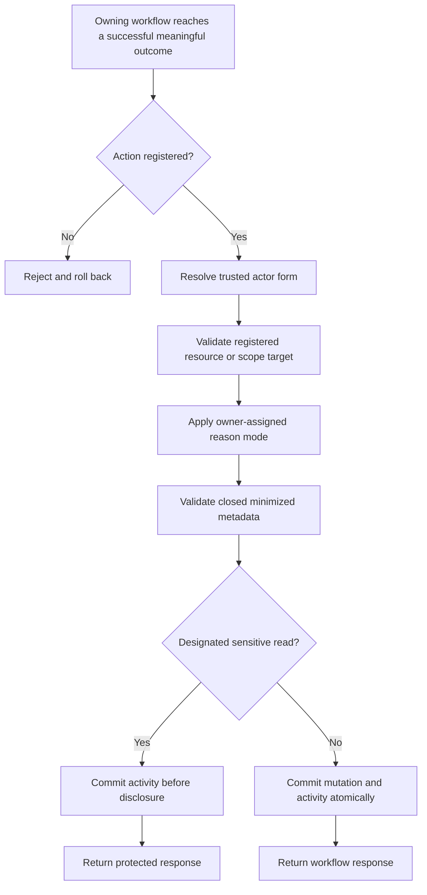

# Requirement: Activity Audit Log

## Status

Accepted

## Context

GAM needs one durable contract for activity entries that record meaningful business and security intent without turning every database write or read into an activity.

The implementation and tests for the activity log predate the Requirement Specification workflow. They were used only as discovery material and conversation prompts. This specification records the behavior agreed during planning and does not treat legacy behavior as authoritative.

This specification owns the cross-domain activity envelope, append-only behavior, actor attribution, target forms, reason modes, request correlation, metadata safety, and the closed action and target-type registries. Owning feature Requirement Specifications remain responsible for:

- deciding which of their workflows emit an activity;
- assigning an action to an allowed target type and target form;
- assigning the action's reason mode and any condition;
- defining the exact closed metadata keys and value types; and
- defining any feature-specific authorization or response behavior.

This responsibility split follows the same pattern as the persistence requirements: the platform specification owns common invariants, while feature specifications own business meaning.

The registry links do not imply that this platform specification has filled every feature owner's historical documentation gap. Feature-specific target allocations, reason conditions, and metadata schemas that are not already explicit remain work for that feature's own planning process. This planning effort changes only the approved cross-feature corrections called out in the affected owner specifications.

## Ubiquitous Language

- `action registry`: The closed catalog of stable activity action identifiers and their owning Requirement Specifications.
- `target-type registry`: The closed catalog of domain resource types that may be identified by an activity.
- `resource target`: A target consisting of a registered target type and the real UUID of one persisted domain resource.
- `scope target`: A target consisting of a registered target type and a documented, stable, non-secret scope reference when the activity applies to a collection or maintenance scope rather than one resource.
- `actor kind`: One of `ACCOUNT`, `ANONYMOUS`, `SYSTEM`, or `DEVELOPER`, identifying how the activity actor is attributed.
- `actor reference`: A stable, non-secret identifier supplied by trusted server-side execution context for a `SYSTEM` or `DEVELOPER` actor, such as `oratorio-scheduler` or `eduardo`.
- `reason mode`: One of `NONE`, `OPTIONAL`, `REQUIRED`, or `CONDITIONAL`, defining whether an activity reason may or must be supplied.
- `closed metadata schema`: The action-specific set of metadata keys and value types explicitly allowed by the owning Requirement Specification.
- `designated sensitive read`: A read whose owning Requirement Specification requires an activity to commit before protected data is disclosed.

## Functional requirements

### REQ-ACTIVITY-001: Cross-domain ownership boundary

Every activity entry shall satisfy this specification. An owning feature Requirement Specification shall define the business rules listed in the Context section before its action is considered completely specified.

An implementation enum, existing listener, database row, or test shall not independently expand the action registry, target-type registry, reason policy, or metadata contract.

When a feature requirement and this specification apply together, the feature requirement may be stricter but shall not weaken the cross-domain invariants in this specification.

Rationale:

The platform contract should prevent divergent audit mechanics without absorbing feature-specific lifecycle and authorization policy.

---

### REQ-ACTIVITY-002: Audited and unaudited boundary

The system shall create activity entries only for:

- successful, meaningful business or security state changes designated by an owning Requirement Specification;
- designated sensitive reads; and
- exceptional Developer maintenance designated by a Requirement Specification.

The system shall not create activity entries for:

- ordinary get, list, search, or helper operations;
- login success or failure, refresh-token rotation, logout, or other authentication-session activity;
- validation or authorization failures;
- failed or rolled-back commands; or
- normalized no-ops.

One high-level workflow shall emit one activity representing its business intent even when it changes multiple rows. An owning feature specification may require more than one high-level activity only when the workflow deliberately represents multiple independently meaningful outcomes.

Rationale:

The activity log records deliberate outcomes, not request volume or low-level persistence mechanics.

---

### REQ-ACTIVITY-003: Activity entry envelope

Every committed activity entry shall contain:

| Field | Contract |
| --- | --- |
| `id` | Required immutable UUID identifying the entry and its recorded operation. |
| `occurredAt` | Required immutable instant from the trusted application clock. |
| `action` | Required identifier from the action registry. |
| `actorKind` | Required actor kind. |
| `actorAccountId` | Present only and always when `actorKind` is `ACCOUNT`. |
| `actorReference` | Present only and always when `actorKind` is `SYSTEM` or `DEVELOPER`. |
| `targetType` | Required identifier from the target-type registry. |
| `targetId` | Present only for a resource target. |
| `targetScope` | Present only for a scope target. |
| `reason` | Normalized string or `null`, according to the action's reason mode. |
| `metadata` | Required JSON object satisfying the action's closed metadata schema; an empty object is valid. |
| `requestId` | HTTP request correlation UUID when the entry belongs to an HTTP request; otherwise `null`. |

Exactly one of `targetId` and `targetScope` shall be present.

The persisted activity contract shall not contain a free-text summary, raw network address, or User-Agent. Human-readable descriptions shall be derived and localized at display time from the typed entry. Network addresses and User-Agent values may exist only in separately governed operational security logs with their own access and retention policy.

---

### REQ-ACTIVITY-004: Closed action registry

Only an identifier registered in the Action Registry section may be persisted as `action`.

Each registered action shall declare one owning Requirement Specification and its allowed actor kind or kinds. When an action supports more than one actor kind because it is shared by product and Developer-maintenance workflows, the owner shall assign the exact actor kind per workflow. The owner shall also define its workflow trigger, target assignment, reason mode, and closed metadata schema.

An operation shall fail atomically when it attempts to persist an unregistered action or uses an actor kind outside the action's registered set.

No action is currently registered for `SYSTEM`. A future background or integration workflow shall add an explicit registered action before it may emit a System activity.

---

### REQ-ACTIVITY-005: Typed resource and scope targets

A resource target shall use the real UUID of a persisted resource whose type is registered. It shall not use a placeholder UUID, synthetic UUID, database-table identifier, or generic maintenance-record type.

A scope target shall use a registered domain resource type and a stable, documented, non-secret scope reference defined by the owning Requirement Specification. It shall not pretend that a collection or query is one persisted resource.

Developer restoration and physical deletion shall target the actual affected resource type and UUID. Developer inspection of soft-deleted records shall use a scope target for the inspected domain resource type.

The owning feature specification shall define which registered target type and target form each action permits. This specification does not assign feature actions to targets.

---

### REQ-ACTIVITY-006: Actor attribution

Actor attribution shall satisfy exactly one of these forms:

| Actor kind | `actorAccountId` | `actorReference` |
| --- | --- | --- |
| `ACCOUNT` | Required Account UUID from authenticated server-side security context | Absent |
| `ANONYMOUS` | Absent | Absent |
| `SYSTEM` | Absent | Required trusted server-side reference |
| `DEVELOPER` | Absent | Required trusted Developer reference |

The application shall not accept an actor Account UUID or actor reference from arbitrary client payload, activity metadata, activity reason, or untrusted request headers.

When an action requires an Account, System, or Developer actor and the application cannot resolve the required trusted identity, the business operation and activity shall fail atomically.

Physical deletion or ordinary invisibility of an Account shall not erase or change a previously recorded activity or its actor Account UUID. Activity-actor retention shall not require the Account row to remain physically present.

---

### REQ-ACTIVITY-007: HTTP request correlation modes

Every HTTP response shall expose an `X-Request-Id` UUID, and every activity produced by that request shall store the same UUID.

The backend shall support exactly these explicitly configured modes:

| Mode | Behavior |
| --- | --- |
| `APPLICATION_GENERATED` | Ignore any inbound `X-Request-Id`, generate a UUID version 7, return it in the response, and use it for every activity produced by the request. This is the default for local development and tests without a trusted proxy. |
| `TRUSTED_PROXY` | Accept `X-Request-Id` only from the documented trusted proxy boundary and only when it is a syntactically valid UUID. Use the accepted value, or generate a UUID version 7 when the value is absent or invalid. Return and persist the resulting value. |

Request-correlation mode shall be deployment configuration. The backend shall not infer proxy trust from client-controlled forwarding headers.

In `TRUSTED_PROXY` mode, the proxy shall strip or overwrite client-supplied `X-Request-Id` before forwarding the request. Direct untrusted clients shall not be able to choose a persisted request identifier.

Non-HTTP System or Developer activities shall use `requestId = null`; the activity entry `id` shall identify the recorded operation.

---

### REQ-ACTIVITY-008: Reason modes and normalization

Every registered action's owning Requirement Specification shall assign one reason mode:

| Mode | Contract |
| --- | --- |
| `NONE` | A reason shall not be accepted or persisted. |
| `OPTIONAL` | A reason may be omitted; a supplied reason shall normalize successfully. |
| `REQUIRED` | A reason shall be supplied and normalize successfully. |
| `CONDITIONAL` | The owner shall define the exact condition under which the reason is required or absent. |

Every non-null reason shall be normalized by trimming surrounding Unicode whitespace and shall contain from 1 through 2,000 Unicode code points after trimming. Blank or overlong values shall be rejected whenever a reason is supplied.

The system shall persist the normalized reason once. When the same reason also belongs to a domain record, the workflow shall reuse the same normalized value rather than independently normalizing divergent copies.

The system shall not invent a reason.

---

### REQ-ACTIVITY-009: Closed and minimized metadata

Activity metadata shall follow the exact closed schema defined by the owning Requirement Specification. Arbitrary additional keys shall be rejected or omitted before persistence according to the owner's input contract; they shall never become an undocumented extension mechanism.

Metadata may contain only documented, non-sensitive values needed to interpret the activity, such as:

- related resource UUIDs;
- stable catalog codes or enum states;
- changed-field names;
- booleans; and
- counts; and
- an explicitly approved bounded text snapshot under the rules below.

User-authored text shall be prohibited by default. An owning feature Requirement Specification may permit one or more named text-snapshot fields only when it defines:

- the historical interpretation purpose that cannot be met adequately by identifiers, codes, or the activity reason;
- the exact metadata key and its value type;
- the source domain field whose already-normalized value is copied, rather than accepting separate audit-only text;
- normalization and a maximum length no greater than the source domain field's maximum;
- why the value is non-sensitive and proportionate for append-only retention; and
- snapshot semantics making clear that the value reflects the resource at the time of the action and will not change later.

The metadata key shall communicate those snapshot semantics, such as `eventTitleAtTimeOfAction`, rather than ambiguously suggesting a current value.

Metadata shall not contain:

- passwords, tokens, cookies, authorization or CSRF values, cryptographic keys, or credentials;
- binary content, signed-form contents, attachments, or full resource snapshots;
- arbitrary or undocumented user-authored text;
- sensitive personal text, including Presence observations, form answers, health or family information, contact information, or personal-profile values;
- explanations, justifications, reasons, or general-purpose notes that belong in the top-level `reason` field;
- raw network addresses or User-Agent values; or
- duplicates of the top-level entry id, action, primary target, actor, reason, occurrence time, or request id.

Related resource identifiers are allowed when the owning Requirement Specification requires them and they do not merely duplicate the primary target.

The `reason` field shall remain the standard deliberate free-text explanation. An approved metadata text snapshot shall provide historical identification context only; it shall not become a second reason or an arbitrary commentary field.

---

### REQ-ACTIVITY-010: Transactional atomicity

For a state-changing workflow, the business mutation and its activity entry shall commit in one transaction. Activity validation or persistence failure shall roll back the business mutation.

A failed, rejected, or rolled-back transaction shall leave no committed activity entry for the attempted outcome.

An activity shall represent the final normalized outcome of its workflow. Internal row changes, lifecycle-owned Role synchronization, and helper operations shall not emit duplicate lower-level activities when the owner specifies one high-level activity.

---

### REQ-ACTIVITY-011: Audit before sensitive disclosure

A designated sensitive read shall persist its required activity before returning protected form details, generated documents, or attachment bytes.

If the activity cannot be validated or persisted, the system shall not disclose the protected response. The owning Requirement Specification shall define the sensitive resource, authorization, action, target, reason mode, and minimized metadata.

Ordinary reads remain unaudited under `REQ-ACTIVITY-002`.

---

### REQ-ACTIVITY-012: Append-only lifecycle

After an activity transaction commits, no ordinary application, administration, or feature workflow shall edit, soft-delete, or physically delete the entry.

A correction shall append a new activity defined by an owning Requirement Specification; it shall not rewrite the original entry.

Append-only behavior also means:

- an activity in a rolled-back transaction never becomes part of history;
- actor Account deletion does not erase or rewrite a committed entry; and
- concurrent entries need not have a strict total order beyond their immutable identifiers and recorded timestamps.

Append-only behavior does not by itself claim cryptographic tamper evidence, write-once storage, external notarization, or protection from privileged database or infrastructure compromise.

---

### REQ-ACTIVITY-013: Registry evolution

Registered action and target-type identifiers shall be immutable and shall never be renamed, reused for different semantics, or silently removed.

When semantics materially change, the system shall introduce a new identifier. An identifier no longer used by new workflows shall remain readable and shall be marked `Deprecated` in its registry rather than removed.

Adding or deprecating an identifier shall update this specification and the owning feature specification together.

---

### REQ-ACTIVITY-014: Developer inspection and maintenance

Developer inspection of soft-deleted records shall require a normalized reason, a `DEVELOPER` actor with a trusted actor reference, and a scope target identifying the inspected domain resource type. The inspection activity shall commit before records are disclosed.

Developer restoration and physical deletion shall require a normalized reason, a `DEVELOPER` actor with a trusted actor reference, and a resource target using the affected domain resource type and real UUID. The maintenance activity and mutation shall commit atomically.

The maintenance command, endpoint, or interface shape remains owned by the persistence requirements or a future dedicated maintenance specification.

## Action Registry

All identifiers below have status `Registered`. Action-to-target assignment, reason mode, and metadata schema remain in the linked owner. Registration establishes the stable name and allowed actor kinds; it does not silently complete missing feature-specific requirements.

| Action identifiers | Allowed actor kind or kinds | Owning Requirement Specification |
| --- | --- | --- |
| `ACCOUNT_REGISTERED` | `ANONYMOUS` | [Authentication and Registration](../authentication/authentication-and-registration.md) |
| `ACCOUNT_ROLE_ADDED`, `ACCOUNT_ROLE_REMOVED` | `ACCOUNT` for direct Account-role workflows; `DEVELOPER` for SUDO maintenance | [Account Role Management](../rbac/account-role-management.md) |
| `EVENT_CREATED`, `EVENT_UPDATED`, `EVENT_CANCELLED`, `EVENT_LOCKED`, `EVENT_FINALIZED`, `EVENT_REOPENED`, `EVENT_DELETED` | `ACCOUNT` | [Event Records and Generic Lifecycle](../events/event-records-and-generic-lifecycle.md) |
| `GAM_LOCATION_CREATED`, `GAM_LOCATION_UPDATED`, `GAM_LOCATION_REMOVED` | `ACCOUNT` | [GamLocation Records](../gam-locations/gam-location-records.md) |
| `MEMBER_REGISTERED`, `MEMBER_ACTIVATED`, `MEMBER_DEACTIVATED`, `COORDINATOR_GRANTED`, `COORDINATOR_REVOKED` | `ACCOUNT` | [Member Records and Lifecycle](../members/member-records-and-lifecycle.md) |
| `ORATORIO_COORDINATOR_GRANTED`, `ORATORIO_COORDINATOR_REVOKED` | `ACCOUNT` | [Oratorio Coordinator Designation](../oratorio/oratorio-coordinator-designation.md) |
| `MEMBERSHIP_SOLICITATION_SUBMITTED`, `MEMBERSHIP_SOLICITATION_APPROVED`, `MEMBERSHIP_SOLICITATION_REJECTED` | `ACCOUNT` | [Membership Solicitations](../members/membership-solicitations.md) |
| `ORATORIO_CREATED`, `ORATORIO_PLANNING_UPDATED`, `ORATORIO_TEAM_MEMBER_ASSIGNED`, `ORATORIO_TEAM_MEMBER_REMOVED`, `ORATORIO_CANCELLED`, `ORATORIO_LOCKED`, `ORATORIO_FINALIZED`, `ORATORIO_REOPENED`, `ORATORIO_DELETED` | `ACCOUNT` | [Oratorio Occurrences and Planning](../oratorio/oratorio-occurrences-and-planning.md) |
| `ORATORIO_MEMBER_ATTENDANCE_REGISTERED`, `ORATORIO_MEMBER_ATTENDANCE_REMOVED`, `ORATORIANO_ATTENDANCE_REGISTERED`, `ORATORIANO_ATTENDANCE_REMOVED`, `ORATORIANO_REGISTERED_AND_MARKED_PRESENT` | `ACCOUNT` | [Oratorio Attendance Tracker](../oratorio/oratorio-attendance-tracker.md) |
| `ORATORIANO_REGISTERED`, `ORATORIANO_UPDATED`, `ORATORIANO_DELETED`, `ORATORIANO_RESTORED` | `ACCOUNT` | [Oratoriano Records](../oratorianos/oratoriano-records.md) |
| `ORATORIANO_FORM_DRAFT_CREATED`, `ORATORIANO_FORM_DRAFT_UPDATED`, `ORATORIANO_FORM_DRAFT_DELETED`, `ORATORIANO_FORM_COMPLETED`, `ORATORIANO_FORM_REVOKED`, `ORATORIANO_FORM_PRINT_SNAPSHOT_CREATED`, `ORATORIANO_FORM_PDF_RENDERED`, `ORATORIANO_FORM_DETAIL_READ`, `ORATORIANO_FORM_ATTACHMENTS_REPLACED`, `ORATORIANO_FORM_ATTACHMENT_DOWNLOADED` | `ACCOUNT` | [Oratoriano Additional Forms](../oratorianos/oratoriano-additional-forms.md) |
| `PRESENCE_REGISTERED`, `PRESENCE_UPDATED`, `PRESENCE_REMOVED` | `ACCOUNT` | [Member Event Presences](../presences/member-event-presences.md) |
| `DEVELOPER_RESTORE_EXECUTED`, `DEVELOPER_HARD_DELETE_EXECUTED`, `DEVELOPER_VIEWED_SOFT_DELETED_RECORDS` | `DEVELOPER` | [Persistence Auditing and Soft Delete](persistence-auditing-and-soft-delete.md) |

`MISSA_CREATED` is not registered. Specialized Missa creation and its auditing remain deferred until a Missa owning Requirement Specification is planned.

No ordinary Role, Permission, or Role-Permission mutation action is registered because no accepted owning product mutation workflow currently requires one.

## Target-Type Registry

All identifiers below have status `Registered`. Registration does not assign any particular action to the target type.

| Target type | Meaning and owning domain |
| --- | --- |
| `ACCOUNT` | An Account resource. |
| `ACCOUNT_ROLE_ASSIGNMENT` | One Account-to-Role assignment resource. |
| `EVENT` | An Event resource. |
| `GAM_LOCATION` | A GamLocation resource. |
| `MEMBER` | A Member resource. |
| `MEMBERSHIP_SOLICITATION` | A Membership Solicitation resource. |
| `ORATORIO` | An Oratorio occurrence resource. |
| `ORATORIANO` | An Oratoriano resource. |
| `ORATORIANO_ATTENDANCE` | An Oratoriano attendance resource. |
| `ORATORIANO_FORM` | An Oratoriano additional-form resource. |
| `ORATORIANO_FORM_PRINT_SNAPSHOT` | An immutable Oratoriano form print-snapshot resource. |
| `PRESENCE` | A Member Presence resource. |
| `ROLE` | A Role resource, available for typed Developer maintenance. |
| `PERMISSION` | A Permission resource, available for typed Developer maintenance. |
| `ROLE_PERMISSION_ASSIGNMENT` | One Role-to-Permission assignment resource, available for typed Developer maintenance. |

`MISSA` and `MAINTENANCE_RECORD` are not registered target types. Missa is deferred, and Developer maintenance shall identify the real affected resource or resource scope.

## Acceptance scenarios

```gherkin
Scenario: Commit one high-level activity with a business mutation
  Given an owning requirement designates a successful state change for auditing
  When the workflow commits
  Then one activity satisfying the registered action, actor, target, reason, and metadata contracts commits in the same transaction

Scenario: Roll back when activity persistence fails
  Given a state-changing workflow requires an activity
  When activity persistence fails before commit
  Then the business mutation is rolled back
  And no activity for the attempted outcome is committed

Scenario: Do not audit a normalized no-op
  Given a workflow normalizes its request to the current state
  When the workflow returns its documented no-op response
  Then no business mutation occurs
  And no activity is committed

Scenario: Attribute public Account registration anonymously
  Given a visitor submits a valid public Account registration
  When the Account and activity commit
  Then the activity action is ACCOUNT_REGISTERED
  And actorKind is ANONYMOUS
  And actorAccountId and actorReference are absent

Scenario: Reject a missing required actor
  Given a registered action requires an ACCOUNT actor
  And no authenticated Account can be resolved from trusted security context
  When the workflow attempts to commit
  Then the workflow and activity fail atomically

Scenario: Attribute SUDO maintenance to a Developer
  Given a Developer invokes an accepted SUDO maintenance workflow
  When its Account-role mutation and activity commit
  Then actorKind is DEVELOPER
  And actorReference contains the trusted Developer reference

Scenario: Correlate a direct local-development request
  Given the backend uses APPLICATION_GENERATED request-correlation mode
  When a client supplies any X-Request-Id
  Then the backend ignores it and generates a UUID version 7
  And the response and every activity from the request contain the generated UUID

Scenario: Prevent request-id spoofing behind the trusted proxy
  Given the backend uses TRUSTED_PROXY request-correlation mode
  When an internet client sends its own X-Request-Id
  Then the proxy strips or overwrites the client value
  And only the validated proxy value or a backend-generated UUID version 7 is returned and persisted

Scenario: Withhold a sensitive response when auditing fails
  Given an authorized Account requests a designated sensitive attachment
  When its required read activity cannot commit
  Then no attachment bytes are returned

Scenario: Inspect soft-deleted records as a Developer
  Given a Developer supplies a trusted actor reference and valid reason
  When soft-deleted records of a registered domain resource type are disclosed
  Then a DEVELOPER_VIEWED_SOFT_DELETED_RECORDS activity commits first
  And it uses a scope target for that domain resource type

Scenario: Preserve an entry after actor deletion
  Given a committed activity records an actor Account UUID
  When that Account is later physically deleted through an allowed workflow
  Then the activity and recorded actor UUID remain unchanged

Scenario: Persist only an explicitly approved text snapshot
  Given an owning feature requirement permits one named bounded text-snapshot metadata field
  When the activity copies the normalized source-domain value
  Then the immutable value is identified as a snapshot at the time of the action
  And undocumented text keys, separate audit-only text, and sensitive personal text are rejected
```

## Diagrams



## Open questions

* None.

## Out of scope

* A generic activity-history HTTP, search, or administration API.
* Activity retention periods, legal erasure, archive tiers, or export policy.
* Cryptographic hash chaining, immutable external storage, or tamper notarization.
* Operational security-log schemas and retention.
* Specialized Missa workflows and `MISSA_CREATED`.
* Ordinary Role, Permission, or Role-Permission mutation workflows.
* Feature-specific Oratorio or Oratoriano action-to-target allocations not already owned by their Requirement Specifications.
* Developer maintenance command, endpoint, or user-interface design.

## Related ADRs

* [ADR-0018: Standardize persistence auditing, soft deletion, and relationship enforcement](../../decisions/0018-standardize-persistence-auditing-soft-deletion-and-relationship-enforcement.md)
* [ADR-0019: Model activity history as typed append-only entries](../../decisions/0019-model-activity-history-as-typed-append-only-entries.md)

## Related requirements

* [Persistence Auditing and Soft Delete](persistence-auditing-and-soft-delete.md)
* [Web Delivery and Frontend Contract](web-delivery-and-frontend-contract.md)
* [Authentication and Registration](../authentication/authentication-and-registration.md)
* [Account Role Management](../rbac/account-role-management.md)
* [Event Records and Generic Lifecycle](../events/event-records-and-generic-lifecycle.md)
* [GamLocation Records](../gam-locations/gam-location-records.md)
* [Member Records and Lifecycle](../members/member-records-and-lifecycle.md)
* [Membership Solicitations](../members/membership-solicitations.md)
* [Member Event Presences](../presences/member-event-presences.md)

## Related documentation

* [Activity Audit Log Guidelines](../../software-guidelines/activity-audit-log.md)
* [GAM Ubiquitous Language](../../ubiquitous-language.md)

## Related videos

* None.
