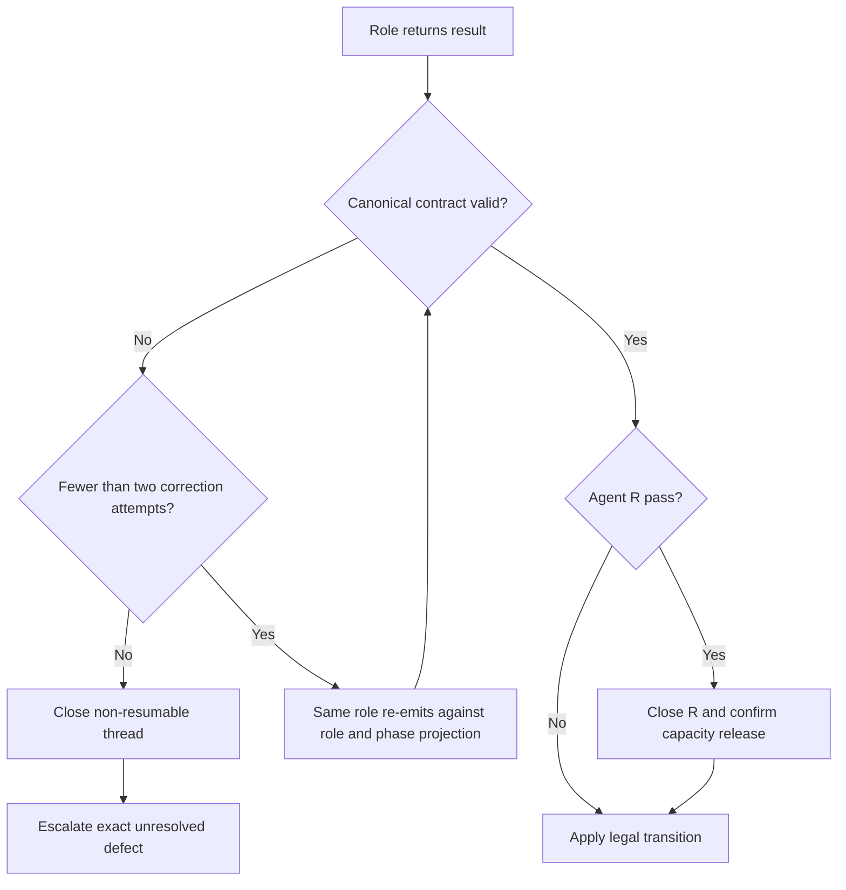

# Requirement: Agent Orchestration Workflow

## Status

Draft

## Context

GAM uses a developer-started Agent O session to coordinate specialized Agent T,
Agent D, and Agent R threads. The workflow must preserve independent review,
test and implementation ownership, authoritative project behavior, and useful
human control without turning routine orchestration or mechanical result errors
into developer work.

The workflow currently depends on prose-only result contracts and native agent
thread lifecycle operations. A completed or interrupted agent thread may remain
open, malformed role results may use plausible but invalid vocabulary, and all
validation failures may be routed through the same human-escalation path. These
conditions can exhaust the native thread limit and make obvious corrections as
expensive as genuine requirement or architecture decisions.

This specification defines the required orchestration behavior. Once accepted,
the agent skills, custom-agent prompts, assignments, and validation mechanisms
are executable implementations of these requirements rather than independent
sources of workflow truth.

## Ubiquitous Language

- `mechanical result defect`: A role-result shape, vocabulary, identity, or
  reference error that can be corrected without changing reported engineering
  facts or selecting a substantive project decision.
- `substantive blocker`: A missing or conflicting decision whose resolution
  changes accepted requirement, domain, architecture, scope, permission, or
  verification authority.
- `open agent thread`: A spawned agent thread that still occupies native
  session capacity, regardless of whether its most recent turn is active or
  completed.
- `closed agent thread`: A spawned agent thread whose native lifecycle is
  confirmed closed and no longer occupies session capacity.
- `interrupted agent`: An agent whose active turn was stopped. Interruption does
  not imply that its thread is closed.
- `unreliable continuation`: An agent continuation for which native state and
  repeated progress checks show that safe role completion or resumption can no
  longer be relied upon.

## Functional requirements

### REQ-AGENT-001: Requirements govern orchestration behavior

Accepted Requirement Specifications shall be the highest project authority for
the behavior they define, including agent-orchestration behavior. Agent skills,
custom-agent prompts, assignments, tests, and existing workflow state shall
conform to the accepted requirements.

When a lower-priority artifact conflicts with an Accepted Requirement, Agent O
shall apply the requirement for routine routing when the resolution is
unambiguous and shall preserve the artifact mismatch for correction. Agent O
shall escalate when accepted authoritative artifacts conflict or the accepted
behavior remains ambiguous.

Rationale:
Executable prompts and existing tests can become stale. They must not override
the behavior they are intended to implement and protect.

Valid examples:
- An outdated skill instruction is reported for correction while the accepted
  orchestration requirement governs the current route.
- Two accepted requirements appear to prescribe incompatible behavior, so
  Agent O requests a developer decision.

Invalid examples:
- Agent O preserves a stale test solely because it already exists.
- A custom-agent prompt silently overrides an Accepted Requirement.

---

### REQ-AGENT-002: Resolve unambiguous obsolete-test conflicts automatically

When an Accepted Requirement explicitly changes, supersedes, or removes the
rule asserted by an existing test, Agent O shall authorize Agent T to correct,
replace, or delete the obsolete test without requesting repeated developer
approval.

The correction shall preserve or strengthen coverage of every behavior that
remains required. A test may be deleted without replacement only when its
assertion exclusively protects behavior that the accepted requirements
explicitly removed and no remaining requirement depends on that coverage.

Requirement silence shall not be interpreted as removal. Agent O shall escalate
when deletion would depend on silence, inference, conflicting accepted
artifacts, or a material reduction in required coverage.

Rationale:
An obsolete test has no authority over an explicit current requirement, but
automatic deletion must not hide a genuine coverage or requirements gap.

Valid examples:
- A requirement changes a maximum length from 500 to 2,000 characters; Agent O
  authorizes Agent T to replace the stale 500-character assertion.
- A requirement explicitly removes a legacy compatibility alias; Agent T may
  delete the test that exists only to require that alias.

Invalid examples:
- A test is deleted because the current requirement does not mention its
  behavior.
- Agent D deletes a conflicting test during production implementation.

---

### REQ-AGENT-003: Reserve human escalation for substantive blockers

Agent O shall automatically perform routine routing, unambiguous
requirement-directed test correction, mechanical result recovery, and native
thread cleanup. These conditions shall not independently require human
intervention.

Agent O shall request human intervention only when:

- a substantive blocker has no single accepted authoritative resolution;
- a required platform permission or lifecycle capability remains unavailable
  after safe native handling;
- role-result correction attempts are exhausted or reveal inconsistent facts;
- sticky T/D continuation recovery fails;
- the correction-cycle limit is reached; or
- another requirement explicitly reserves the decision for the developer.

The escalation shall identify the exact unresolved decision and the evidence
that prevented automatic continuation.

Rationale:
Human attention is most valuable for decisions, not for mechanical transport or
format correction.

---

### REQ-AGENT-004: Keep platform approval separate from Agent O authority

Agent O's automatic authority shall apply only to GAM workflow decisions that
can be resolved from accepted repository artifacts. Codex Auto-review or the
active native permission policy shall remain responsible for sandbox,
filesystem, network, application, and tool-boundary approval requests.

Agent O shall not claim to approve a native platform action. If native approval
is denied and no materially safe alternative exists, Agent O shall return the
precise permission blocker.

Rationale:
Workflow authority cannot expand the sandbox or replace the platform's approval
reviewer.

---

### REQ-AGENT-005: Use one machine-readable role-result contract

The workflow shall have one machine-readable `gam-role-result/v1` contract as
the canonical definition of result shape, common fields, role identities,
phases, allowed outcomes, required details, and cross-field invariants.

Human-readable documentation, custom-agent prompts, role assignments, and
validators shall consume or project that contract without independently
redefining it. Repository verification shall fail when a consuming artifact
drifts from the canonical contract.

The corrected v1 contract shall replace the defective definition in place. The
workflow shall introduce no compatibility, migration, legacy-result, or dual
contract behavior for the replaced definition.

Rationale:
Duplicated prose vocabularies permit role-specific rules to drift and give an
agent several plausible but incompatible result forms.

---

### REQ-AGENT-006: Constrain results by role and phase

Every role assignment shall expose only the result outcomes and required detail
shape valid for its target role and phase. A role result shall be rejected when
its role, phase, outcome, details, blockers, or human-intervention flag violates
the canonical contract.

`human_intervention_required` shall be the only common human-status field.
`human_decision_required` shall not be an allowed field or outcome.

Agent R shall use distinct blocker outcomes for:

- requirement or domain ambiguity;
- an architecture decision;
- a scope decision;
- a permission blocker; and
- a verification blocker.

Each blocker outcome shall identify the evidence and the exact unresolved
decision. Normal review findings shall continue to route to Agent T, Agent D,
or completion without human intervention.

Rationale:
Role- and phase-specific vocabularies prevent a plausible outcome belonging to
one role from leaking into another role's result.

---

### REQ-AGENT-007: Prevent and investigate invalid role results

The role-result design shall address the causes of invalid results rather than
relying only on downstream retries. It shall:

- provide each role with its exact role/phase contract projection;
- use names that do not ambiguously duplicate a common field;
- validate representative results for every role and phase;
- preserve regression examples for previously observed mechanical defects,
  including a role-incompatible outcome, a missing required verification
  field, an inconsistent human-intervention flag, and an invalid artifact
  reference; and
- make contract drift detectable by automated repository verification.

Rationale:
Retries contain an isolated generation error. They do not correct an ambiguous
or unverified contract that repeatedly produces the same error.

---

### REQ-AGENT-008: Recover mechanical result defects through re-emission

When Agent O receives a mechanically invalid result, it shall ask the same role
thread to re-emit a complete corrected result without changing the role's
engineering facts. Agent O shall allow at most two re-emission attempts after
the original invalid result.

Agent O shall provide the validation errors and the exact role/phase contract
projection. It shall not fabricate missing evidence, rewrite substantive role
findings, or silently treat an invalid result as valid.

Agent O shall escalate only when both correction attempts fail, the role thread
cannot be recovered, or the attempted corrections expose inconsistent facts or
a substantive blocker.

Rationale:
A bounded same-role correction preserves evidence ownership while avoiding a
developer interruption for a field name or reporting typo.

---

### REQ-AGENT-009: Track every spawned thread lifecycle explicitly

Agent O shall record every spawned agent's exact native identity, role, current
phase, resumability, latest native status, and lifecycle state. Lifecycle state
shall distinguish at least active, completed, interrupted, and confirmed
closed.

A completed or interrupted agent shall remain open until native closure is
confirmed. Agent O shall not infer closure from a completed result, an
interruption response, disappearance from an active list, or its own prior
cleanup request.

Rationale:
Accurate capacity accounting requires native lifecycle evidence rather than
conversation wording.

---

### REQ-AGENT-010: Close every completed Agent R pass

After Agent R returns a result that is either validated or has exhausted its
allowed correction attempts, Agent O shall close that Agent R thread and
confirm closure before applying the next transition, completing the workflow,
or reporting an escalation.

An active unreliable Agent R shall first be interrupted when necessary and then
closed. Interruption alone shall never satisfy this requirement.

Every subsequent independent review shall use a fresh Agent R thread. A prior
completed reviewer shall not be reused as a capacity workaround.

Rationale:
Review passes are independent and non-resumable, so retaining their completed
threads consumes capacity without serving a legal transition.

---

### REQ-AGENT-011: Preserve sticky T/D threads only while resumable

Agent T and Agent D shall retain their original thread identities while a legal
current or future transition can resume them, including during a resolvable
workflow escalation. They shall be closed when the workflow completes, is
explicitly abandoned, or reaches a state in which the role can no longer be
legally resumed.

Agent O shall perform and confirm terminal T/D cleanup before declaring the
native workflow lifecycle complete.

Rationale:
T/D continuity preserves accumulated role context, while terminal cleanup
prevents completed workflows from retaining unnecessary capacity.

---

### REQ-AGENT-012: Do not classify legitimate quiet work as stale

Elapsed time or lack of streamed output alone shall not make an agent stale.
Before declaring a continuation unreliable, Agent O shall determine whether a
native command, tool call, Maven verification, infrastructure startup, or role
turn is still active and shall request bounded progress checkpoints.

An agent may be classified as an unreliable continuation only when native state
shows no live work capable of completing the turn and repeated progress checks
fail to produce a trustworthy result or status.

Rationale:
Long Maven, Docker, Spring, and infrastructure operations may be legitimately
quiet and must not be duplicated or interrupted merely because they take time.

---

### REQ-AGENT-013: Recover unreliable continuations by role

When Agent T or Agent D becomes an unreliable continuation, Agent O shall
interrupt the active turn when necessary and attempt one recovery on the same
sticky role thread with the preserved assignment and workflow state. Agent O
shall escalate if that same-thread recovery fails.

When Agent R becomes an unreliable continuation, Agent O shall interrupt and
close it, then start one fresh independent Agent R pass with the same validated
review assignment. Agent O shall escalate if the reviewer cannot be closed or
the replacement cannot be started safely.

Rationale:
Writer roles require continuity; independent reviewer passes require freshness.

---

### REQ-AGENT-014: Verify capacity before spawning

Before spawning an agent, Agent O shall reconcile its lifecycle record with
native thread state and close every open thread that has no legal future use.
Agent O shall not increase the configured thread limit or reuse a completed
reviewer to compensate for missing cleanup.

If Codex exposes no actual close operation, a close request fails, or released
capacity cannot be confirmed, Agent O shall return a platform lifecycle blocker
with the affected thread identities and observed native state.

Rationale:
Capacity failure should identify the missing lifecycle capability instead of
misrepresenting completed agents as an unavoidable lifetime task limit.

## Acceptance scenarios

```gherkin
Scenario: Close a completed reviewer before the next correction cycle
  Given Agent R returned a valid test-design finding
  When Agent O routes the finding to Agent T
  Then Agent O closes the completed Agent R thread first
  And confirms that the reviewer no longer occupies native thread capacity
  And a later review uses a fresh Agent R thread

Scenario: Do not confuse interruption with closure
  Given an Agent R turn was interrupted
  When Agent O reconciles thread lifecycle
  Then the Agent R thread remains open until native closure is confirmed

Scenario: Correct a test after an explicit requirement change
  Given an Accepted Requirement explicitly replaces a legacy rule
  And an existing test asserts only the legacy rule
  When Agent D reports a test-authority conflict
  Then Agent O authorizes Agent T to replace or delete the obsolete assertion
  And Agent O does not request developer approval for that routine correction

Scenario: Preserve a test when requirements are silent
  Given an existing test asserts behavior not mentioned by current requirements
  When removing the test would depend on interpreting that silence
  Then Agent O requests the missing authoritative decision

Scenario: Recover a role-incompatible result outcome
  Given Agent T returns an outcome allowed only for Agent R
  When Agent O validates the result
  Then Agent O requests a corrected result from the same Agent T thread
  And supplies only the valid Agent T outcomes for the active phase
  And does not escalate before the bounded correction attempts are exhausted

Scenario: Escalate repeated invalid results
  Given the original role result is mechanically invalid
  And two same-role correction attempts are also invalid
  When Agent O applies the result contract
  Then Agent O reports the exact repeated validation errors
  And sets human_intervention_required to true

Scenario: Preserve a legitimately quiet verification
  Given Agent D is running a live Maven verification
  And no output has streamed during a bounded interval
  When Agent O checks the native execution state
  Then Agent O keeps the existing Agent D turn active
  And does not duplicate, interrupt, or classify it as stale based on time alone

Scenario: Recover an unreliable sticky writer
  Given Agent T has no live work and repeated progress checks produce no result
  When Agent O classifies the continuation as unreliable
  Then Agent O attempts one recovery on the same Agent T thread
  And preserves the workflow assignment and state

Scenario: Report unavailable close capability
  Given a completed Agent R thread remains open
  And Codex provides no successful native close operation
  When Agent O prepares another fresh review
  Then Agent O reports a platform lifecycle blocker
  And does not reuse the completed reviewer

Scenario: Keep native approvals outside Agent O
  Given a required action crosses a sandbox boundary
  When the native permission system evaluates the request
  Then Codex Auto-review or the developer owns the approval
  And Agent O does not claim to grant platform permission
```

## Diagrams



## Open questions

None.

## Out of scope

- Increasing or dynamically bypassing Codex's configured native thread limit.
- Reusing a completed Agent R as a substitute for a fresh independent review.
- Replacing Codex native orchestration with an external orchestrator.
- Changing Codex Auto-review, sandbox, filesystem, network, or organization
  permission policy.
- Inferring removal of test-protected behavior from requirement silence.
- Supporting or migrating the defective role-result contract as a legacy
  version.
- Changing GAM application behavior, API contracts, or production runtime
  behavior.

## Related ADRs

- [ADR-0033: Use a Machine-Readable Agent Workflow Contract and Verified Thread Lifecycle](../../decisions/0033-use-a-machine-readable-agent-workflow-contract-and-verified-thread-lifecycle.md)

## Related requirements

- None.

## Related diagrams

- Inline role-result validation and lifecycle flow above.

## Related videos

- None.
