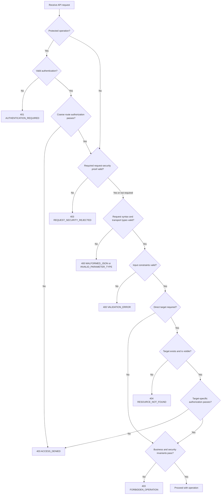

# Requirement: API Error and Authorization Contract

## Status
Accepted

## Context
GAM API clients need predictable error responses without depending on backend
framework behavior, parsing human-readable messages, or learning whether a
protected resource exists.

`REQ-OPENAPI-006` defines the common five-field JSON error envelope. This
Requirement Specification elaborates that envelope for request validation,
authentication, authorization, missing resources, soft-deleted resources, and
resources deliberately hidden by visibility rules.

This specification defines cross-cutting defaults. An owning Accepted
Requirement Specification may define a more specific status, code, or safe
details contract for a feature. Such an override must be explicit and must not
weaken the common envelope or non-disclosure rules.

## Ubiquitous Language

- `coarse route authorization`: Permission evaluation that determines whether
  an authenticated caller may invoke an operation without loading its target
  resource or parsing its request parameters or body.
- `target-specific authorization`: Authorization that depends on a visible
  target resource or its relationship to the authenticated caller.
- `hidden resource`: An existing resource that a visibility rule deliberately
  represents as not found to the caller.
- `validation violation`: One structured description of a well-formed,
  correctly typed client input that fails a request or domain input constraint.

## Functional requirements

### REQ-API-ERROR-001: Covered common error envelope

Every error covered by this specification shall use the exact common envelope
from `REQ-OPENAPI-006`:

```json
{
  "timestamp": "2026-07-26T17:30:00Z",
  "status": 400,
  "code": "VALIDATION_ERROR",
  "message": "The request contains invalid input.",
  "details": {}
}
```

`details` shall always be a JSON object, including when it is empty. The
response shall not add a redundant HTTP reason phrase or another top-level
field.

The defaults in this specification apply unless an owning Accepted Requirement
Specification explicitly defines a more specific feature behavior.

Rationale:
One envelope and explicit override rule keep client behavior predictable without
silently replacing already accepted feature semantics.

Valid examples:
- A feature-specific search error uses `400 INVALID_SEARCH_FILTER` because its
  Accepted Requirement Specification explicitly defines that semantic error.
- A protected endpoint with no feature-specific override uses the common `401`,
  `403`, and `404` behavior from this specification.

Invalid examples:
- A controller returns an ad hoc error document.
- Current framework behavior is treated as an undocumented feature override.

---

### REQ-API-ERROR-002: Invalid-request classification

Invalid client requests shall use these default categories:

| Failure category | HTTP status and code |
| --- | --- |
| Invalid JSON syntax, unknown JSON property, or incompatible JSON value type | `400 Bad Request`, `MALFORMED_JSON` |
| Path, query, header, or cookie parameter cannot be converted to its documented transport type | `400 Bad Request`, `INVALID_PARAMETER_TYPE` |
| Well-formed and correctly typed input violates requiredness, size, range, format, allowed-value, or relational constraints | `400 Bad Request`, `VALIDATION_ERROR` |

Expected client input failures shall not expose broad implementation-derived
codes such as `INVALID_REQUEST` or input-type-specific top-level codes when the
failure is only a validation violation.

An owning Accepted Requirement Specification may define a more specific
semantic `400` code. Business-state conflicts shall not be classified as input
validation merely because the client initiated the operation.

Rationale:
Stable categories let clients distinguish malformed transport data from
actionable validation and feature-specific semantics.

Valid examples:
- A required `displayName` supplied as `null` produces `VALIDATION_ERROR`.
- An unknown JSON property produces `MALFORMED_JSON`.
- An unknown structured-search field produces `INVALID_SEARCH_FILTER` under
  `REQ-SEARCH-009`.

Invalid examples:
- An invalid phone number receives a special top-level code solely because one
  backend exception class exists for phone numbers.
- A repeated lifecycle transition is reported as `VALIDATION_ERROR` instead of
  the conflict defined by its owning feature.

---

### REQ-API-ERROR-003: Validation-error details

A `VALIDATION_ERROR` response shall contain a `details.violations` array. Each
entry shall contain exactly:

```json
{
  "location": "body",
  "field": "/displayName",
  "code": "SIZE",
  "message": "must contain between 3 and 50 characters"
}
```

The response shall include all detected validation violations. Violations shall
be deduplicated and returned deterministically by `location`, then `field`, then
`code`. Clients shall identify a violation by its structured fields and shall
not depend on array order or exact message wording.

The allowed `location` values are:

- `body`;
- `path`;
- `query`;
- `header`; and
- `cookie`.

Rationale:
One structured array supports forms, nested requests, and non-body inputs
without requiring message parsing.

Valid examples:
- One response identifies independent violations for `/firstName` and
  `/surname`.
- Two constraints on the same field remain separate violations with distinct
  codes.

Invalid examples:
- Validation failures appear only in the top-level message.
- A map keyed by field silently loses multiple violations for the same field.

---

### REQ-API-ERROR-004: Public validation paths and violation codes

For a body violation, `field` shall be a JSON Pointer composed only from
documented public JSON property names and submitted collection indexes, such as
`/member/name/firstName` or `/filters/2/value`.

For a path, query, header, or cookie violation, `field` shall be the documented
external parameter name. A request-wide or cross-field violation that cannot be
assigned to one public field shall use `$`.

The validation-violation `code` shall be one of:

| Code | Meaning |
| --- | --- |
| `REQUIRED` | A required value is absent or `null`. |
| `NOT_BLANK` | An empty or whitespace-only textual value is prohibited. |
| `SIZE` | A string or collection length is outside its bounds. |
| `RANGE` | A numeric, date, or time value is outside its bounds. |
| `FORMAT` | A correctly typed value has invalid syntax or representation. |
| `ALLOWED_VALUE` | A typed value is outside an accepted set. |
| `RELATION` | Multiple fields or items violate a relationship. |
| `INVALID_VALUE` | A documented input constraint fits none of the other categories. |

The response shall not expose Java property paths, Bean Validation annotation
names, DTO or entity class names, persistence paths, converter names, exception
text, or submitted values.

Rationale:
Public paths and semantic codes expose only the API contract already available
to clients and prevent backend implementation details from becoming contract.

Valid examples:
- A nested body violation uses `/filters/2/value`.
- A relationship between `beginDate` and `endDate` uses `field: "$"` and
  `code: RELATION`.

Invalid examples:
- A violation exposes `registerMemberDTO.name.firstName`.
- A code exposes the backend annotation name `NotBlank`.

---

### REQ-API-ERROR-005: Malformed-JSON details

A `MALFORMED_JSON` response shall contain:

- `details.reason`, using one of `SYNTAX_ERROR`, `UNKNOWN_FIELD`, or
  `TYPE_MISMATCH`;
- `details.location` with the value `body`; and
- `details.field` only when the failure can be mapped safely to a known public
  JSON Pointer.

An unknown submitted property name shall not be echoed. Syntax errors and
unmappable paths shall omit `field`.

The response shall not contain a rejected value, raw parser message, Java type,
DTO class, stack detail, or unknown submitted property name.

Rationale:
Clients need to distinguish malformed input categories without turning parsing
errors into an implementation or data-disclosure channel.

Valid examples:
- A known `/birthDate` property containing an incompatible JSON value type
  reports `TYPE_MISMATCH` and that public pointer.
- Invalid JSON punctuation reports `SYNTAX_ERROR` without a field.

Invalid examples:
- An unknown submitted property is copied into `details.field`.
- The message contains a Jackson exception or Java target type.

---

### REQ-API-ERROR-006: Invalid-parameter-type details

An `INVALID_PARAMETER_TYPE` response shall contain exactly:

- `details.location`, using `path`, `query`, `header`, or `cookie`;
- `details.field`, containing the documented external parameter name; and
- `details.expectedType`, using the applicable public transport type.

The common public transport-type vocabulary shall be:

- `UUID`;
- `INTEGER`;
- `DECIMAL`;
- `BOOLEAN`;
- `DATE`;
- `DATE_TIME`; and
- `ENUM`.

The response shall not echo the submitted value or expose a Java type,
converter, or exception.

Rationale:
The public parameter and transport type give the client actionable information
already present in OpenAPI without exposing conversion internals.

Valid examples:
- A non-UUID `memberId` path parameter identifies `path`, `memberId`, and
  `UUID`.

Invalid examples:
- The response contains the rejected identifier.
- `expectedType` contains `java.util.UUID`.

---

### REQ-API-ERROR-007: Authentication, authorization, and validation precedence

A request covered by this specification shall be evaluated in this outcome
order:

1. A protected operation shall require valid authentication.
2. Coarse route authorization shall be evaluated without parsing the request
   parameters or body and without loading the target resource.
3. Required CSRF or canonical-origin proof shall be evaluated.
4. Request parameters and body shall be parsed and validated.
5. A referenced target shall be resolved and its visibility evaluated.
6. Target-specific authorization shall be evaluated for a visible target.
7. Business and security invariants shall be evaluated.

Therefore:

- an unauthenticated protected request with invalid input shall return `401`;
- an authenticated caller lacking coarse route permission shall receive
  `403 ACCESS_DENIED` even when the request input is also invalid;
- an authorized caller with invalid input shall receive the applicable `400`;
- an absent or hidden target shall receive `404 RESOURCE_NOT_FOUND`; and
- a visible target that the caller may not operate on shall receive
  `403 ACCESS_DENIED`.

An owning Accepted Requirement Specification may explicitly override a later
feature-specific visibility or authorization outcome. It shall not make an
unauthenticated protected request disclose validation or resource state.

Rationale:
One precedence prevents ambiguous responses and stops callers who cannot invoke
an operation from probing its validation or resource state.

Valid examples:
- An unauthenticated request with malformed JSON receives `401`, not
  `MALFORMED_JSON`.
- An authenticated caller lacking the route permission receives `403` for a
  missing target without learning whether the identifier exists.

Invalid examples:
- Request validation runs before authentication on a protected route.
- A missing-resource response reveals existence to a caller who lacks coarse
  route permission.

---

### REQ-API-ERROR-008: Authentication-failure conventions

Authentication failures shall use these `401 Unauthorized` codes:

| Code | Condition |
| --- | --- |
| `AUTHENTICATION_REQUIRED` | A protected request has no valid bearer authentication, including a missing, malformed, invalid, expired, or unavailable-Account token. |
| `INVALID_CREDENTIALS` | Login fails for either an unknown email or an incorrect password. |
| `INVALID_REFRESH_TOKEN` | Refresh fails for a missing, malformed, unknown, consumed, or expired refresh token. |

Each category shall use one generic message for all of its listed conditions and
an empty `details` object.

`AUTHENTICATION_REQUIRED` shall include the HTTP header
`WWW-Authenticate: Bearer`. `INVALID_CREDENTIALS` and
`INVALID_REFRESH_TOKEN` shall not include that header because login and refresh
do not authenticate with a bearer token.

The idempotent logout behavior in `REQ-AUTH-018` remains unchanged and shall not
be converted into a `401` response for an invalid refresh token.

Rationale:
Distinct stable codes support correct client recovery while generic responses
prevent Account, token, and session-state enumeration.

Valid examples:
- Unknown-email and wrong-password login attempts have the same status, code,
  message, and details.
- An expired bearer token on a protected resource returns
  `401 AUTHENTICATION_REQUIRED` with the bearer challenge.
- A consumed refresh token returns `401 INVALID_REFRESH_TOKEN` and directs the
  client to sign in again.

Invalid examples:
- A login response reveals that the email exists.
- A refresh failure uses `403 Forbidden`.
- A `403` response includes a bearer challenge.

---

### REQ-API-ERROR-009: Forbidden-response conventions

Forbidden requests shall use these `403 Forbidden` codes:

| Code | Condition |
| --- | --- |
| `ACCESS_DENIED` | The authenticated caller lacks coarse route permission or target-specific authority for a visible operation. |
| `FORBIDDEN_OPERATION` | The caller may invoke the operation, but a business or security invariant prohibits this particular transition. |
| `REQUEST_SECURITY_REJECTED` | Required CSRF or canonical-origin proof fails. |

`ACCESS_DENIED` and `REQUEST_SECURITY_REJECTED` shall have empty `details`.
Every CSRF and canonical-origin failure shall use the same
`REQUEST_SECURITY_REJECTED` message and details so that the response does not
identify which proof failed.

An owning Accepted Requirement Specification may add safe, structured details
to `FORBIDDEN_OPERATION`. Such details shall be explicitly defined by that
specification and shall not expose hidden resources, internal authorization
rules, or submitted secrets.

No `403` response shall include `WWW-Authenticate`.

Rationale:
The three categories distinguish missing authority, prohibited state
transitions, and request-security rejection without requiring message parsing.

Valid examples:
- An authenticated caller without `MEMBER_MANAGE` receives
  `403 ACCESS_DENIED`.
- A non-SUDO attempt to remove the final Coordinator receives
  `403 FORBIDDEN_OPERATION`.
- A CSRF mismatch and canonical-origin mismatch receive indistinguishable
  `403 REQUEST_SECURITY_REJECTED` responses.

Invalid examples:
- A missing permission is reported as `401`.
- A CSRF failure reveals whether the token, Origin, or Referer check failed.

---

### REQ-API-ERROR-010: Missing, soft-deleted, and hidden resources

A directly referenced resource that is missing, soft-deleted, or deliberately
hidden by an ownership, status, or other visibility rule shall return an
indistinguishable `404 Not Found` response with:

- `code: RESOURCE_NOT_FOUND`;
- the same generic message for every hidden, deleted, and absent state;
- `details.resource` containing the public resource name; and
- `details.identifier` containing only the public identifier already supplied
  by the client.

The response shall not state or imply whether the resource exists, is
soft-deleted, belongs to another Account, has a hidden status, or failed another
visibility rule.

This rule applies after the caller passes authentication, coarse route
authorization, and request validation under `REQ-API-ERROR-007`.

Rationale:
Identical not-found responses preserve ordinary client diagnostics while
preventing protected-resource existence probing.

Valid examples:
- The same Member identifier produces the same error shape when the Member is
  absent and when an Accepted Member visibility rule hides it.
- Echoing the requested UUID does not disclose information the client did not
  already provide.

Invalid examples:
- A hidden resource returns `403` while a missing one returns `404`, unless an
  owning Accepted Requirement Specification explicitly defines that feature
  behavior.
- `details` contains `softDeleted: true` or `hiddenByStatus: true`.

---

### REQ-API-ERROR-011: Safe diagnostic messages

Top-level and validation-violation messages shall be concise, non-localized
English diagnostics.

Clients shall use top-level `code`, validation-violation `code`, and structured
`details` for behavior. They shall not parse or require exact message wording.
Safe message wording may change without being considered a breaking API change.

Messages and details shall never contain submitted passwords, credentials,
access tokens, refresh tokens, secrets, unknown submitted properties, rejected
values, persistence constraints, database content, stack details, or internal
exception text.

Rationale:
Stable structured data supports frontend behavior while safe diagnostics remain
useful to Developers without creating a localization or disclosure contract.

Valid examples:
- The frontend translates `REQUIRED` into its own user-facing language.
- A safe English message becomes clearer without changing its code or details.

Invalid examples:
- Frontend behavior matches the sentence `Access denied`.
- A malformed request returns the rejected token in its message.

---

### REQ-API-ERROR-012: Error transport and caching

Every `400`, `401`, `403`, and `404` response covered by this specification
shall:

- use `Content-Type: application/json`;
- use the GAM envelope from `REQ-OPENAPI-006`, not RFC Problem Details;
- not use `application/problem+json`; and
- include `Cache-Control: no-store`.

The `WWW-Authenticate` header shall follow only the bearer-authentication rule
in `REQ-API-ERROR-008`.

Rationale:
One media type preserves the accepted envelope, and `no-store` prevents
validation, authentication, authorization, and visibility responses from being
cached by browsers or intermediaries.

Valid examples:
- A hidden-resource `404` is a non-cacheable GAM JSON error.
- A bearer-authentication failure includes both `Cache-Control: no-store` and
  `WWW-Authenticate: Bearer`.

Invalid examples:
- One endpoint returns Problem Details while another returns the GAM envelope.
- A protected-resource `404` is cacheable.

## Acceptance scenarios

```gherkin
Scenario: Return multiple safe validation violations
  Given an authenticated and authorized caller submits a well-formed request
  And two public body fields violate documented input constraints
  When the API validates the request
  Then the response is 400 Bad Request with code VALIDATION_ERROR
  And details.violations contains both violations in deterministic order
  And each violation contains only location, field, code, and message
  And no submitted value or internal property path is returned

Scenario: Hide an unknown JSON property
  Given an authenticated and authorized caller submits a body with an unknown property
  When the API parses the request
  Then the response is 400 Bad Request with code MALFORMED_JSON
  And details.reason is UNKNOWN_FIELD
  And the unknown property name is not returned

Scenario: Authentication precedes malformed input
  Given a protected operation receives no valid bearer authentication
  And its request body is malformed
  When the request is evaluated
  Then the response is 401 Unauthorized with code AUTHENTICATION_REQUIRED
  And the response includes WWW-Authenticate with value Bearer

Scenario: Coarse authorization precedes validation and lookup
  Given an authenticated caller lacks the operation's coarse route permission
  And the request body is invalid
  And the referenced identifier may or may not exist
  When the request is evaluated
  Then the response is 403 Forbidden with code ACCESS_DENIED
  And the response does not reveal validation or resource state

Scenario: Missing and hidden resources are indistinguishable
  Given an authenticated caller passes coarse route authorization
  When the caller requests an absent resource
  Then the response is 404 Not Found with code RESOURCE_NOT_FOUND
  And when the same route hides an existing resource under its accepted visibility rule
  Then the response has the same status, code, message, and details topology
  And neither response identifies the resource state

Scenario: Login failure prevents Account enumeration
  Given one login request uses an unknown email
  And another login request uses a known email with an incorrect password
  When the requests are evaluated
  Then both responses are 401 Unauthorized with code INVALID_CREDENTIALS
  And both responses have the same message and empty details

Scenario: Invalid refresh authentication requires sign-in
  Given a refresh token is missing, malformed, unknown, consumed, or expired
  When the client requests a refresh
  Then the response is 401 Unauthorized with code INVALID_REFRESH_TOKEN
  And the response uses a generic sign-in-again message
  And the response does not include WWW-Authenticate

Scenario: Reject request-security proof generically
  Given an authentication operation requires CSRF and canonical-origin proof
  When either proof fails
  Then the response is 403 Forbidden with code REQUEST_SECURITY_REJECTED
  And the response does not identify which proof failed

Scenario: Distinguish missing authority from a forbidden transition
  Given one authenticated caller lacks authority for a visible operation
  When that caller invokes the operation
  Then the response is 403 Forbidden with code ACCESS_DENIED
  Given another caller may invoke an operation but a business invariant prohibits its transition
  When that caller invokes the operation
  Then the response is 403 Forbidden with code FORBIDDEN_OPERATION

Scenario: Prevent covered error caching
  Given a request produces a covered 400, 401, 403, or 404 response
  When the API returns the error
  Then Content-Type is application/json
  And Cache-Control contains no-store
```

## Diagrams



## Open questions

* None.

## Out of scope

* Feature-specific `409 Conflict` codes and details.
* Rate-limiting responses.
* Common contracts for `405 Method Not Allowed`, `406 Not Acceptable`, and
  `415 Unsupported Media Type`.
* Introducing or standardizing `422 Unprocessable Content`.
* `5xx` diagnostics, observability identifiers, and retry policy.
* Backend localization of error messages.
* Frontend rendering, translation, and form-component implementation.
* Test structure and backend implementation strategy.

## Related requirements

* [OpenAPI and Frontend API Documentation](openapi-and-frontend-api-documentation.md)
* [Search and Filter Framework](search-and-filter-framework.md)
* [Authentication and Registration](../authentication/authentication-and-registration.md)
* [Browser Session and Frontend Integration](../authentication/browser-session-and-frontend-integration.md)
* [Account Records](../accounts/account-records.md)
* [Member Records and Lifecycle](../members/member-records-and-lifecycle.md)
* [Membership Solicitations](../members/membership-solicitations.md)
* [Account Role Management](../rbac/account-role-management.md)
* [RBAC Catalog](../rbac/rbac-catalog.md)

## Related ADRs

* None.

## Related videos

* None.
