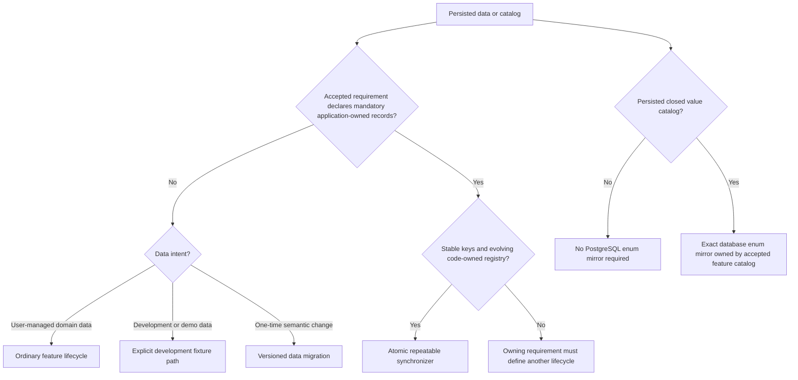

# Requirement: Database Reference Data and Enum Mirrors

## Status

Accepted

## Context

GAM needs one cross-domain policy for mandatory persisted reference data,
repeatable synchronization, migration-environment isolation, and PostgreSQL
enum types that mirror closed domain catalogs.

The implementation and tests for migrations, RBAC seeding, and enum
persistence predate the Requirement Specification workflow. They were used
only as discovery material and conversation prompts. This document records the
behavior agreed during planning and does not make existing code or tests
authoritative.

Owning Accepted Requirement Specifications remain authoritative for the
contents and lifecycle of their catalogs. This specification defines the
cross-domain defaults and links those owners rather than duplicating their
catalog values.

## Ubiquitous Language

- `repeatable synchronizer`: A production-safe migration that reconciles one
  evolving, code-owned system reference catalog whenever its accepted
  definition changes.
- `converged reference data`: Persisted system reference data whose required
  records, application-owned metadata, and relationships match the current
  accepted registry.
- `reference-data collision`: A reserved stable key with ambiguous persisted
  ownership, multiple persisted matches, or a user-managed match that the
  application must not take over.
- `reference-data drift`: A disagreement among an accepted catalog, its
  application representation, and its persisted system records or database
  enum mirror.

## Functional requirements

### REQ-DATA-001: System reference data authority and classification

Persisted records shall be classified as system reference data only when an
Accepted Requirement Specification declares that:

- the records are mandatory for application operation;
- the application, rather than an ordinary product workflow, owns them;
- each record has a stable domain key; and
- the records must exist in every applicable runtime environment.

System reference data shall remain distinct from user-managed domain records,
development or demonstration fixtures, and one-time semantic data
transformations.

The current system reference dataset is:

| Dataset | Stable keys | Authoritative behavior |
| --- | --- | --- |
| System Roles, system Permissions, and their baseline links | Role name, Permission code, and Role-Permission pair | [`REQ-RBAC-001` through `REQ-RBAC-005`](../rbac/rbac-catalog.md) |
| System GamLocations | Location code | [`REQ-GAM-LOCATION-CATALOG-001` through `REQ-GAM-LOCATION-CATALOG-009`](../gam-locations/system-gam-location-catalog.md) |

A future dataset shall not become system reference data merely because an
implementation seeds it.

Rationale:

Mandatory application-owned records need stronger lifecycle guarantees than
fixtures or ordinary domain data, while feature owners must remain
authoritative for catalog contents.

Valid examples:

- The Accepted RBAC role and permission registry is system reference data.
- A future Accepted requirement may declare another stable catalog mandatory.

Invalid examples:

- A demonstration Account becomes system reference data because a development
  callback creates it.
- A commonly used GamLocation becomes mandatory because a repeatable migration
  currently inserts it.

---

### REQ-DATA-002: Migration mechanism follows data intent

An evolving, code-owned system reference catalog shall use a repeatable
synchronizer.

A repeatable synchronizer shall expose a deterministic migration checksum
derived from its complete accepted registry. An accepted registry change shall
change that checksum and cause Flyway to schedule the synchronizer again. An
unchanged registry shall retain the same checksum.

A one-time semantic transformation of existing records shall use a versioned
data migration. Development and demonstration fixtures shall use only an
explicitly isolated development fixture path.

Mandatory production reference data shall not depend on a Flyway lifecycle
callback, development fixture location, or application startup initializer
outside the production migration lifecycle.

Database enum types and their labels are schema constraints. They shall be
created or changed through the schema migration path rather than through a
reference-data synchronizer.

Rationale:

Migration behavior should communicate whether data must continuously converge,
change once, or exist only for local development.

---

### REQ-DATA-003: Atomic and observably idempotent convergence

A repeatable synchronizer shall reconcile its complete accepted registry in
one transaction.

It shall:

- preserve the identifier of every unique matching application-owned record;
- create missing current records and relationships exactly once;
- update only application-owned fields whose accepted values changed;
- create no duplicate current records or relationships; and
- perform no writes, including timestamp changes, when the reference data is
  already converged.

Running the same synchronizer repeatedly against the same accepted registry
shall leave identifiers, values, relationships, and audit metadata unchanged
after the first converged run.

Rationale:

Repeatability must repair drift without manufacturing history or changing
stable identities on every application start.

Valid examples:

- A changed Permission description is synchronized once while its UUID remains
  unchanged.
- A second run against the same registry changes no row.

Invalid examples:

- Every run advances `updatedAt` even though accepted metadata is unchanged.
- A missing relationship is repaired by creating duplicate active links.

---

### REQ-DATA-004: Explicit ownership and collision safety

When one table contains both system reference records and user-managed records,
persisted ownership shall be explicit.

Ordinary product workflows shall not edit, delete, convert, or take ownership
of system reference records. User-managed records may coexist only under keys
that are not reserved by a current system reference registry.

Before committed mutation, a repeatable synchronizer shall search all matches
for each reserved stable key, including soft-deleted records when the table
supports soft deletion.

The synchronizer may reuse a unique application-owned match. It shall treat
each of the following as a reference-data collision:

- a user-managed match for a reserved key, whether active or soft-deleted;
- more than one persisted match for one reserved key; or
- more than one persisted match for one required relationship.

A collision shall fail the entire synchronization without converting,
overwriting, deleting, or partially reconciling the conflicting records.

Restoration of a unique soft-deleted application-owned match shall occur only
when the owning Accepted Requirement Specification authorizes restoration.

Rationale:

Stable-key matching must never silently convert user-managed data or choose an
arbitrary identity.

---

### REQ-DATA-005: Explicit removal and rename lifecycle

A repeatable synchronizer shall not infer destructive cleanup when a stable key
is removed from or renamed in an accepted registry.

The owning Accepted Requirement Specification shall define whether the former
record or relationship is:

- retained as non-authoritative history;
- soft-deleted;
- transformed through an explicit one-time migration; or
- removed through an explicit maintenance operation.

Until that lifecycle is accepted and implemented, the synchronizer shall
preserve the persisted record without treating it as current reference data.
It shall not create an undocumented compatibility alias.

The RBAC-specific stale and fail-closed lifecycle remains owned by
[`REQ-RBAC-005`](../rbac/rbac-catalog.md#req-rbac-005-non-destructive-registry-changes).

Rationale:

Automatic cleanup can destroy references or silently preserve unintended
authority. The owning feature must decide the semantic outcome.

---

### REQ-DATA-006: Mandatory synchronization and startup safety

System reference synchronization is a prerequisite for serving application
requests.

After Flyway migration completes, the application shall validate the complete
current system reference catalog without mutation on every startup. The
validation shall detect missing current records or relationships, unexpected
current application-owned records or relationships, ownership mismatches,
metadata drift, and database enum-mirror drift.

Persisted drift without an accepted registry change shall not cause hidden
startup mutation outside Flyway. It shall fail startup and require an explicit
Developer-controlled repair or deliberate reapplication of the synchronizer.

A reference-data collision, invalid registry definition, missing migration
dependency, database error, or other synchronization failure shall:

- roll back the complete synchronization transaction;
- leave no partially reconciled catalog; and
- prevent that application instance from serving requests.

The system shall not continue with a warning when mandatory reference data
failed to synchronize.

Rationale:

Serving requests with a partially initialized mandatory catalog makes
authorization and persisted references unpredictable.

---

### REQ-DATA-007: Migration-location isolation

The default production-safe migration path shall contain only:

- production schema migrations;
- versioned production data transformations; and
- mandatory system reference synchronizers.

Development or demonstration fixture locations shall require an explicit
development profile. Integration tests shall use the production-safe migration
path by default and may opt into dedicated test fixtures only deliberately.

A production runtime shall refuse to start when a development or test fixture
location is configured.

Rationale:

Positive environment isolation prevents sample identities and data from
becoming production state through configuration error.

---

### REQ-DATA-008: No seeded privileged identities or secrets

A production-safe system reference synchronizer shall not create:

- a human Account;
- a credential or reusable password;
- an authentication token or session;
- a secret; or
- an Account-to-Role assignment intended to bootstrap privileged access.

Privileged Account creation and SUDO assignment shall remain explicit,
Developer-controlled maintenance operations governed by the Accepted RBAC
requirements.

Rationale:

Mandatory reference catalogs may define authorization capabilities, but they
must not manufacture an identity capable of exercising those capabilities.

---

### REQ-DATA-009: Infrastructure maintenance and audit boundary

Reference synchronization shall be treated as infrastructure maintenance, not
as a product-facing business or security activity.

Migration history and operational logs shall provide synchronization evidence.
The synchronizer shall not fabricate an Account actor or emit a product
activity entry solely because it created or reconciled mandatory reference
data.

When synchronized records use row-audit metadata, actor fields may remain null
because no authenticated Account performed the operation. Update metadata
shall change only when an application-owned value actually changes, in
accordance with `REQ-DATA-003`.

An owning Accepted Requirement Specification may define additional audit
behavior for a future dataset.

Rationale:

Infrastructure convergence should remain observable without pretending that a
User performed a business action.

---

### REQ-DATA-010: Database enum mirror qualification and ownership

A PostgreSQL enum type shall be used as a database enum mirror only for a
persisted, closed value catalog explicitly defined by an Accepted Requirement
Specification.

A Java or framework enum alone shall not create, expand, or redefine a
database enum mirror.

The current database enum mirrors and their owning requirements are:

| Database enum mirror | Owning accepted catalog |
| --- | --- |
| `member_status_enum` | [`REQ-MEMBER-004`](../members/member-records-and-lifecycle.md#req-member-004-member-status-model-and-transitions) |
| `event_type_enum` | [`REQ-EVENT-001`](../events/event-records-and-generic-lifecycle.md#req-event-001-shared-event-identity-and-type-model) |
| `event_status_enum` | [`REQ-EVENT-006`](../events/event-records-and-generic-lifecycle.md#req-event-006-effective-temporal-status) and [`REQ-EVENT-011`](../events/event-records-and-generic-lifecycle.md#req-event-011-generic-event-lifecycle-transitions) |
| `membership_solicitation_status_enum` | [`REQ-MEMBER-SOL-003`](../members/membership-solicitations.md#req-member-sol-003-solicitation-status-and-immutability) |
| `member_information_status_enum` | [`REQ-MEMBER-INFO-004`](../members/member-information.md#req-member-info-004-information-status-fields-and-creation-defaults) and [`REQ-MEMBER-INFO-014`](../members/member-information.md#req-member-info-014-annual-response-contract-and-answer-catalogs) |
| `member_experience_type_enum` | [`REQ-MEMBER-INFO-005`](../members/member-information.md#req-member-info-005-member-experience-and-sacrament-catalogs) |
| `member_sacrament_type_enum` | [`REQ-MEMBER-INFO-005`](../members/member-information.md#req-member-info-005-member-experience-and-sacrament-catalogs) |
| `member_contribution_area_enum` | [`REQ-MEMBER-INFO-006`](../members/member-information.md#req-member-info-006-member-contribution-profile) |
| `member_occupation_enum` | [`REQ-MEMBER-INFO-014`](../members/member-information.md#req-member-info-014-annual-response-contract-and-answer-catalogs) |
| `member_mass_attendance_frequency_enum` | [`REQ-MEMBER-INFO-014`](../members/member-information.md#req-member-info-014-annual-response-contract-and-answer-catalogs) |
| `member_coordination_interest_enum` | [`REQ-MEMBER-INFO-014`](../members/member-information.md#req-member-info-014-annual-response-contract-and-answer-catalogs) |
| `oratorio_team_type_enum` | [`REQ-ORATORIO-006`](../oratorio/oratorio-occurrences-and-planning.md#req-oratorio-006-standard-member-teams) and [`REQ-ORATORIO-012`](../oratorio/oratorio-occurrences-and-planning.md#req-oratorio-012-specialized-route-catalog) |
| `oratoriano_form_status_enum` | [`REQ-ORATORIANO-FORM-002`](../oratorianos/oratoriano-additional-forms.md#req-oratoriano-form-002-lifecycle-and-current-authority) |
| `oratoriano_form_origin_enum` | [`REQ-ORATORIANO-FORM-001`](../oratorianos/oratoriano-additional-forms.md#req-oratoriano-form-001-optional-versioned-form) |
| `oratoriano_form_print_mode_enum` | [`REQ-ORATORIANO-FORM-011`](../oratorianos/oratoriano-additional-forms.md#req-oratoriano-form-011-print-snapshots-and-generated-pdf-modes) |

Adding another database enum mirror shall update this ownership registry and
link its Accepted catalog.

Rationale:

The database may enforce a closed catalog, but it does not own the catalog's
business meaning.

---

### REQ-DATA-011: Exact enum-mirror invariant and drift failure

Each database enum mirror shall contain exactly the persisted values accepted
by its owning Requirement Specification and represented by the corresponding
application/domain catalog.

Persisted labels, spelling, and case shall match exactly. Missing values, extra
values, undocumented aliases, ordinal persistence, and implicit case
conversion shall constitute reference-data drift.

Automated verification shall compare the accepted, application, and database
value sets. Detected drift shall block release or application startup rather
than being tolerated.

Rationale:

Exact mirroring prevents application code, database constraints, and public
contracts from assigning different meanings to the same persisted field.

Valid examples:

- `member_status_enum` contains exactly the values accepted by
  `REQ-MEMBER-004`.
- Adding a Java enum constant without an Accepted requirement update fails
  verification instead of expanding the persisted catalog.

Invalid examples:

- The database accepts a legacy label absent from the accepted catalog.
- An enum is persisted by ordinal position.

---

### REQ-DATA-012: Coordinated enum changes and stored-data disposition

Adding, removing, renaming, or changing the meaning of a persisted catalog
value shall update, in the same change:

- the owning Requirement Specification;
- the application/domain representation;
- the PostgreSQL enum mirror;
- affected development and test fixtures; and
- any externally visible contract that exposes the value.

Removing or renaming a value shall additionally define one of:

- a semantic transformation for existing rows;
- an explicit reset of disposable pre-production data; or
- proof that no stored row uses the former value.

The database shall not silently coerce the former value, substitute a default,
or retain an undocumented compatibility alias.

Rationale:

A closed persisted catalog cannot change safely while existing data and other
representations retain the former contract.

## Acceptance scenarios

```gherkin
Scenario: Repeated synchronization is a complete no-op
  Given the system reference data is converged
  When its repeatable synchronizer runs again with the same accepted registry
  Then identifiers, values, relationships, and audit metadata remain unchanged
  And no duplicate record or relationship is created

Scenario: Changed owned metadata converges once
  Given one application-owned metadata value differs from its accepted registry value
  And the accepted registry change produces a new deterministic migration checksum
  When the repeatable synchronizer succeeds
  Then the accepted value replaces the stale value without changing the record identifier
  And a later run with the same registry performs no write

Scenario: Accepted registry change schedules repeatable synchronization
  Given the accepted code-owned registry changes
  When Flyway resolves the repeatable synchronizer
  Then the deterministic migration checksum differs from the previously applied checksum
  And Flyway schedules the synchronizer

Scenario: Unexplained persisted drift blocks startup without hidden repair
  Given the accepted registry and its deterministic checksum are unchanged
  And a mandatory current reference record is missing from the database
  When application startup validates the current catalog
  Then startup fails
  And no startup initializer silently recreates the missing record
  And repair requires an explicit Developer-controlled action

Scenario: User-managed stable-key collision blocks startup
  Given a user-managed record uses a stable key reserved by system reference data
  When the repeatable synchronizer runs
  Then the complete synchronization is rolled back
  And the user-managed record is not converted or overwritten
  And the application instance does not serve requests

Scenario: Removed reference key requires an owning lifecycle
  Given a persisted application-owned key is absent from the current accepted registry
  And no Accepted requirement defines its removal lifecycle
  When the repeatable synchronizer runs
  Then the persisted record is preserved
  And it is not treated as current reference data

Scenario: Production rejects a development fixture location
  Given a production runtime is configured with a development fixture migration location
  When application startup validates migration locations
  Then startup fails before fixture data is applied

Scenario: Production reference synchronization creates no identity
  Given mandatory roles and permissions require synchronization
  When the production-safe synchronizer succeeds
  Then the required catalog records and links are converged
  And no Account, credential, secret, session, token, or privileged Account assignment is created

Scenario: Database enum mirror matches its accepted catalog
  Given an Accepted requirement owns a persisted closed value catalog
  When enum-mirror verification runs
  Then the accepted, application, and PostgreSQL value sets match exactly

Scenario: Implementation enum cannot expand the accepted catalog
  Given a new application enum value has no Accepted requirement
  When enum-mirror verification runs
  Then verification fails
  And the database contract is not treated as expanded

Scenario: Enum removal has no stored-data disposition
  Given a persisted enum value is proposed for removal
  And no transformation, disposable-data reset, or proof of non-use is defined
  When the coordinated contract change is evaluated
  Then the change is rejected
```

## Diagrams



## Open questions

* None.

## Out of scope

* The RBAC role, Permission, bundle, stale-record, and stale-link catalogs owned
  by the RBAC Requirement Specifications.
* Development fixture personas, credentials, scenario coverage, and concrete
  fixture contents.
* Rebuilding or consolidating the pre-production versioned migration history.
* Production zero-downtime migration sequencing, rollback compatibility, and
  preservation of unreleased legacy formats.
* A product API for inspecting or mutating system reference data.
* Test class, fixture-builder, or implementation structure.

## Related ADRs

* [ADR-0021: Use Flyway repeatable migrations for code-owned system reference data](../../decisions/0021-use-flyway-repeatable-migrations-for-system-reference-data.md)
* [ADR-0003: Keep stale RBAC registry data fail-closed](../../decisions/0003-keep-stale-rbac-registry-data-fail-closed.md)
* [ADR-0015: Compose Oratorio permission bundles in code](../../decisions/0015-compose-oratorio-permission-bundles-in-code.md)
* [ADR-0027: Model Member information as normalized components and immutable annual responses](../../decisions/0027-model-member-information-as-normalized-components-and-immutable-annual-responses.md)

## Related requirements

* [RBAC Catalog](../rbac/rbac-catalog.md)
* [System GamLocation Catalog](../gam-locations/system-gam-location-catalog.md)
* [Member Records and Lifecycle](../members/member-records-and-lifecycle.md)
* [Member Information](../members/member-information.md)
* [Member Information Import and Account Linking](../members/member-information-import-and-account-linking.md)
* [Event Records and Generic Lifecycle](../events/event-records-and-generic-lifecycle.md)
* [Membership Solicitations](../members/membership-solicitations.md)
* [Oratorio Occurrences and Planning](../oratorio/oratorio-occurrences-and-planning.md)
* [Oratoriano Additional Forms](../oratorianos/oratoriano-additional-forms.md)
* [Persistence Auditing and Soft Delete](persistence-auditing-and-soft-delete.md)

## Related videos

* None.
