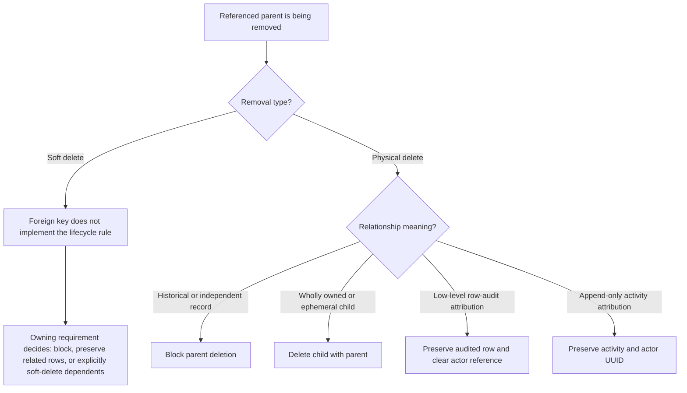

# Requirement: Persistence Auditing and Soft Delete

## Status

Accepted

## Context

GAM needs one cross-domain contract for row audit metadata, deleted-row visibility, uniqueness after soft deletion, relationship integrity, restoration, and exceptional physical deletion.

This specification defines defaults for persisted resources. An owning Accepted Requirement Specification may define an explicit feature-specific exception. The owning specification remains authoritative for the exceptional business rule and shall be linked rather than duplicated here.

The current implementation and tests predate this Requirement Specification and were used only as discovery material and conversation prompts. This document defines the intended behavior.

## Ubiquitous Language

- `ordinary persistence path`: A repository, query, relationship traversal, or application workflow that is not explicitly authorized to inspect or restore soft-deleted rows.
- `full row-audit record`: A mutable, soft-deletable record with creation, latest non-deletion update, and deletion metadata.
- `relationship audit record`: A rich relationship with its own identity or history and with creation and deletion metadata, but no ordinary content-update lifecycle.
- `active-only uniqueness`: A uniqueness rule under which only non-deleted rows reserve the business identity.
- `reserved uniqueness`: A uniqueness rule under which active and soft-deleted rows continue reserving the business identity.
- `physical deletion`: Removal of a persisted row rather than retention through soft deletion.

## Functional requirements

### REQ-PERSISTENCE-001: Cross-domain default and feature ownership

The rules in this specification shall apply to persisted resources unless an owning Accepted Requirement Specification defines an explicit exception.

Soft deletion shall remain distinct from domain lifecycle states. Deactivation, cancellation, completion, revocation, and similar business states shall use their owning domain lifecycle. Soft deletion shall be used only when the owning workflow deliberately removes a record from ordinary identity and visibility.

Feature-specific deletion eligibility, reasons, authorization, response codes, historical projections, reserved identities, and restoration capabilities shall remain owned by their Requirement Specifications.

Rationale:

A shared default prevents each feature from inventing persistence behavior while preserving deliberate domain exceptions.

Valid examples:

- Presence removal uses soft deletion because `REQ-PRESENCE-001` defines removed Presence history and active-only uniqueness.
- Member deactivation changes the Member lifecycle state without soft-deleting the lifetime Member.
- `REQ-ORATORIANO-002` keeps an Oratoriano name reserved after soft deletion as an explicit exception to active-only uniqueness.

Invalid examples:

- A feature silently treats cancellation as soft deletion without documenting that lifecycle choice.
- A cross-domain persistence rule overrides an explicit Accepted feature requirement.

---

### REQ-PERSISTENCE-002: Audit-field classification

A full row-audit record shall contain:

- `createdAt`;
- `createdBy`;
- `updatedAt`;
- `updatedBy`;
- `deletedAt`; and
- `deletedBy`.

A relationship audit record shall contain:

- `createdAt`;
- `createdBy`;
- `deletedAt`; and
- `deletedBy`.

A simple aggregate-owned join without independent identity, lifecycle, correction history, authorization meaning, or business meaning shall not receive generic row-audit or soft-delete fields. Its mutations shall be represented by the owning aggregate's activity when that aggregate action requires auditing.

Append-only activity entries and ephemeral security artifacts shall use the lifecycle defined by their owning requirements instead of receiving generic soft-delete fields.

Rationale:

Audit metadata should match the record's actual lifecycle rather than adding meaningless update or deletion fields to every table.

Valid examples:

- A mutable domain record uses full row-audit metadata.
- A rich Account-to-Role assignment uses creation and deletion metadata because re-adding the relationship creates a new historical assignment.
- A RefreshToken follows its security lifecycle and is physically removed rather than soft-deleted.

Invalid examples:

- A simple join row receives a UUID and soft-delete metadata despite having no independent behavior or history.
- An editable domain record omits update metadata.

---

### REQ-PERSISTENCE-003: Audit-field semantics and invariants

`createdAt` and `createdBy` shall describe creation and shall never change afterward.

`updatedAt` and `updatedBy` shall describe the latest committed non-deletion version. Creation shall initialize them with the same values as creation metadata. A later committed content update or restoration shall replace them.

Soft deletion shall set only `deletedAt` and `deletedBy`; it shall not change update metadata. Failed operations, rejected concurrency attempts, and normalized no-ops shall not change audit metadata.

An active row shall have both deletion fields null. A deleted row shall have a non-null `deletedAt`. `deletedBy` shall contain the authenticated actor UUID when one existed and otherwise may be null. `deletedBy` shall never be populated while `deletedAt` is null.

Rationale:

Separate update and deletion metadata preserve the latest ordinary record version while representing current deletion state unambiguously.

Valid examples:

- A newly created row initially has matching creation and update metadata.
- Deleting a row preserves the timestamp and actor of its last content update.
- A trusted system deletion has `deletedAt` populated and `deletedBy` null because no Account actor existed.

Invalid examples:

- Soft deletion overwrites `updatedAt`.
- A failed update advances `updatedAt`.
- An active row contains `deletedBy`.

---

### REQ-PERSISTENCE-004: Trusted audit source and transaction atomicity

The system shall assign row-audit timestamps from a trusted server-side clock as absolute instants. Clients shall not supply row-audit timestamps or actor identifiers.

An authenticated Account actor shall be captured when one exists. Actor fields may be null only when no authenticated Account performed the operation; the system shall never invent an actor.

The state mutation and its row-audit metadata shall commit in the same transaction. A rollback shall leave both unchanged.

Any deliberately exposed audit timestamp shall use the project's standard UTC RFC 3339 representation. The system shall not promise strict timestamp ordering between unrelated concurrent transactions.

Rationale:

Trusted, atomic metadata prevents clients or partial failures from creating false audit history.

---

### REQ-PERSISTENCE-005: Ordinary deleted-row invisibility

An ordinary persistence path shall exclude soft-deleted rows from:

- direct identifier lookup;
- search and listing;
- relationship traversal;
- ordinary active-only duplicate detection; and
- mutation target resolution.

A missing row and a soft-deleted row shall be indistinguishable through ordinary reads and shall follow the owning feature's missing-resource contract.

The system shall not expose a generic `includeDeleted` search option, unrestricted deleted-row repository, or generic deleted-record HTTP API.

Only an explicitly documented historical view, restoration workflow, or developer-maintenance operation may access a soft-deleted row. That workflow shall define its own authorization and representation.

A reserved-uniqueness rule is an explicit exception to ordinary duplicate detection and shall inspect deleted identity only through its owning persistence path.

Rationale:

Central invisibility makes soft deletion a safety mechanism rather than an accidental alternate data surface.

Valid examples:

- Direct lookup does not return a soft-deleted Account.
- An occurrence history explicitly defined by its owning requirement may display preserved attendance linked to a deleted Oratoriano.

Invalid examples:

- A normal search exposes deleted rows when a client adds `includeDeleted=true`.
- A relationship loader silently returns a soft-deleted target through an ordinary API.

---

### REQ-PERSISTENCE-006: Soft-deletion behavior

Soft deletion shall affect only the target row by default. It shall not automatically soft-delete, physically delete, restore, or detach related rows.

The owning Requirement Specification shall explicitly choose when a related record:

- remains preserved as history;
- blocks deletion; or
- is soft-deleted atomically because its lifecycle is owned by the target.

The first successful soft deletion shall commit its deletion metadata and any required activity atomically. A repeated ordinary deletion request shall be unable to resolve the already deleted target, shall follow the owning feature's missing-resource contract, and shall emit no additional activity.

Generic row-audit metadata shall not contain a `deletionReason`. A required reason belongs in the immutable activity entry or in an owning domain record when that feature defines a separate reason concept.

Rationale:

Explicit dependency policy prevents accidental historical loss and duplicate deletion activities.

---

### REQ-PERSISTENCE-007: Uniqueness with soft deletion

Business uniqueness shall be active-only by default. An owning Accepted Requirement Specification may instead define reserved uniqueness when identity must remain unavailable after deletion.

The authoritative persistence boundary shall enforce the selected uniqueness scope atomically. Application-only duplicate prechecks shall not be sufficient.

When active-only uniqueness is released by soft deletion, reusing the value shall create a new row and UUID. It shall not restore, overwrite, or reuse the deleted row.

When concurrent requests compete for one unique identity, at most one may commit. Every losing request shall receive the owning feature's documented domain conflict, normally `409 Conflict`, without exposing a constraint name, SQL statement, or persistence exception. A losing request shall leave no partial state or audit activity.

Rationale:

Database-backed uniqueness protects every application instance while feature ownership preserves deliberate lifetime identities.

Valid examples:

- A removed Presence releases the active Event-and-Member pair, and re-registration creates a new Presence UUID.
- A soft-deleted Oratoriano continues reserving its human-equivalent name under `REQ-ORATORIANO-002`.
- An Account remains linked to at most one lifetime Member under `REQ-MEMBER-001`.

Invalid examples:

- Reusing a released value silently reactivates the old row.
- Two concurrent requests both commit the same active-only identity.

---

### REQ-PERSISTENCE-008: Relationship target activity

A new or changed relationship shall reference a target that exists and is active at commit time unless an owning Accepted Requirement Specification explicitly permits a historical target.

A later soft deletion of the target shall not automatically invalidate or remove an existing relationship. The owning feature shall decide whether that relationship remains historical, blocks deletion, or participates in an explicit cascade.

When relationship creation or reassignment races with target soft deletion, the workflow shall serialize or revalidate the target so that a new relationship cannot commit to a concurrently deleted row.

Rationale:

A physical foreign key proves row existence but cannot prove active soft-delete state.

---

### REQ-PERSISTENCE-009: Physical deletion and relationship preservation

Ordinary application workflows shall not physically delete soft-deletable domain or historical records.

Physical deletion shall be limited to:

- explicitly authorized developer-maintenance operations;
- ephemeral security or session artifacts whose owning requirement mandates physical deletion; and
- transient aggregate-owned working records whose owning Accepted Requirement defines both their hard-delete conditions and the lifecycle transition at which retained records gain historical meaning; and
- aggregate-owned dependents with no independent historical meaning when their owner is legitimately physically deleted.

Physical deletion shall be prevented by default while an independent domain or historical record references the target.

When an owned child has no independent historical meaning before a documented lifecycle transition, the owning requirement may require the child to be physically deleted when it is discarded while the owner remains active or is soft-deleted. Once that transition gives the retained child historical meaning, ordinary physical deletion shall be prohibited.

When an owned or ephemeral child never has independent historical meaning, the owning requirement may require the child to be physically deleted with its owner.

Low-level row-audit actor references may become null when the actor Account is physically deleted. The audited row and its timestamps shall remain preserved. Domain relationships shall not use this attribution exception.

An append-only activity entry shall retain its recorded actor UUID as immutable historical data even when the actor Account is no longer ordinarily visible or is physically removed.

Rationale:

Foreign-key behavior should preserve independent history, remove only true dependents, and distinguish low-level attribution from domain ownership.

---

### REQ-PERSISTENCE-010: Explicit restoration

Restoration shall be unavailable through ordinary repositories and generic HTTP APIs. Only an owning Accepted Requirement Specification or an explicitly authorized developer-maintenance operation may define restoration.

A successful restoration shall:

- reuse the same row and UUID;
- preserve creation metadata;
- clear `deletedAt` and `deletedBy`;
- record the restoration as the latest non-deletion version in `updatedAt` and `updatedBy`; and
- append the owning workflow's immutable restoration activity in the same transaction.

The earlier deletion activity shall remain unchanged. The activity history, rather than the row's current-state deletion fields, shall preserve prior delete-and-restore cycles.

If restoration would violate current uniqueness or relationship rules, it shall fail until the conflict is deliberately resolved. A failed restoration shall change neither the row nor its activity history.

Rationale:

Restoration returns the same identity to active use without erasing the immutable history of why its lifecycle changed.

---

### REQ-PERSISTENCE-011: External row-audit visibility

Ordinary API representations, searches, filters, and sorting shall not expose `createdBy`, `updatedBy`, `deletedAt`, or `deletedBy`.

An owning Requirement Specification may deliberately expose user-relevant `createdAt` or `updatedAt` values. Those fields shall not become generically searchable or visible merely because they exist in persistence.

A future cross-domain audit-inspection capability shall require a separate Requirement Specification defining authorization, endpoint shape, data minimization, and the relationship between row metadata and activity history.

Rationale:

Persistence metadata is not automatically part of the product-facing contract.

---

### REQ-PERSISTENCE-012: Activity-history and maintenance boundary

Row audit metadata shall describe low-level persisted state and shall not substitute for an activity entry that records business or security intent, reason, and relevant non-sensitive context.

The system shall not create a generic activity entry for every database write. Owning Requirement Specifications shall identify meaningful business and security actions.

Any developer-controlled restoration or physical deletion of a soft-deletable domain record shall require an explicit reason and append an immutable maintenance activity in the same transaction. The maintenance command or interface shape shall remain outside this specification.

Any Developer inspection that deliberately bypasses ordinary deleted-row filtering shall require an explicit reason and a trusted Developer actor reference. Each invocation shall inspect one registered domain resource type and shall emit one `DEVELOPER_VIEWED_SOFT_DELETED_RECORDS` activity with:

- `actorKind` equal to `DEVELOPER` and the trusted Developer reference in top-level `actorReference`;
- the inspected domain resource type in top-level `targetType`;
- no `targetId`;
- top-level `targetScope` equal to the exact stable value `SOFT_DELETED_RECORDS`;
- a `REQUIRED` top-level reason normalized under `REQ-ACTIVITY-008`; and
- metadata containing exactly `count`, whose value is a non-negative integer equal to the number of soft-deleted records disclosed.

The activity shall not contain a database table name or other persistence identifier. An inspection that finds zero records shall still record `count` as `0`. The activity shall commit before any matching deleted records are disclosed; if activity validation or persistence fails, no deleted record shall be disclosed.

Restoration and physical-deletion maintenance activities shall target the actual domain resource type and real UUID rather than a database table or generic maintenance record. Actor, target, reason, metadata, and append-only behavior shall follow the Activity Audit Log Requirement Specification.

Rationale:

Separating row state from business intent keeps each audit mechanism meaningful and prevents noisy or incomplete activity history.

## Acceptance scenarios

```gherkin
Scenario: Create a full row-audit record
  Given a mutable soft-deletable record is created by an authenticated Account
  When the transaction commits
  Then creation and update timestamps contain the same trusted instant
  And creation and update actors contain the Account UUID
  And both deletion fields are null

Scenario: Soft deletion preserves the latest content update
  Given an active row has creation and update metadata
  When the row is soft-deleted
  Then deletedAt records the trusted deletion instant
  And deletedBy records the authenticated actor when one exists
  And updatedAt and updatedBy remain unchanged

Scenario: Ordinary reads hide a deleted row
  Given a row is soft-deleted
  When an ordinary direct lookup, search, or relationship traversal runs
  Then the row is absent
  And the result does not reveal whether the row is missing or deleted

Scenario: Repeated deletion does not create another activity
  Given a target has already been soft-deleted
  When ordinary deletion is requested again
  Then the request follows the owning feature's missing-resource contract
  And no row or activity entry changes

Scenario: Reuse an active-only unique value
  Given a row reserving an active-only unique value is soft-deleted
  When the same value is used for a new valid resource
  Then a new row with a new UUID is created
  And the deleted row remains preserved

Scenario: Concurrent duplicate creation has one winner
  Given two valid requests compete for one active-only unique identity
  When both transactions attempt to commit
  Then exactly one transaction succeeds
  And every loser receives the owning domain conflict
  And no persistence details or partial audit activity are exposed

Scenario: Historical relationship prevents physical deletion
  Given an independent historical record references a parent
  When maintenance attempts to physically delete the parent
  Then the deletion is rejected
  And both records remain stored

Scenario: Ephemeral child follows its owner
  Given an owner has an ephemeral child with no independent history
  When the owner is legitimately physically deleted
  Then the child is physically deleted
  And no orphan row remains

Scenario: Transient owned record is discarded before its historical boundary
  Given an owning Accepted Requirement classifies a working record as transient
  And defines the lifecycle transition at which a retained record gains historical meaning
  When the transient record is discarded before that transition
  Then the owning workflow physically deletes it
  But a retained record that crossed the transition remains protected from ordinary physical deletion

Scenario: Physical actor deletion preserves low-level audited data
  Given a row records an Account UUID in a row-audit actor field
  When that actor Account is physically deleted
  Then the audited row and timestamps remain stored
  And the row-audit actor field becomes null

Scenario: Soft deletion does not cascade implicitly
  Given a parent has related historical records
  When the parent is soft-deleted under its owning requirement
  Then the related records remain unchanged
  Unless that owning requirement explicitly defines an atomic soft-delete cascade

Scenario: New relationship cannot race with target deletion
  Given one transaction creates a relationship to an active target
  And another transaction attempts to soft-delete that target
  When both operations complete
  Then the relationship transaction cannot commit based on a target deletion that already committed
  And a deletion that commits later evaluates the newly committed relationship under its owning policy

Scenario: Restore while preserving lifecycle history
  Given a feature explicitly permits restoration
  And a soft-deleted row has an immutable deletion activity
  When an authorized actor restores the row with a valid reason
  Then the same UUID becomes active
  And deletion fields are cleared
  And update metadata records the restoration
  And the deletion and restoration activities both remain immutable

Scenario: Exceptional maintenance requires accountability
  Given a Developer is authorized to physically delete a soft-deletable domain record
  When the Developer supplies a valid reason and the operation commits
  Then one immutable maintenance activity records the actual resource target, required Developer actor reference, time, and reason
  And the physical deletion and activity commit atomically

Scenario: Inspect soft-deleted records with a reason
  Given a Developer is authorized to inspect one domain resource type outside ordinary deleted-row filtering
  When the Developer supplies a valid reason and trusted actor reference
  Then one DEVELOPER_VIEWED_SOFT_DELETED_RECORDS activity commits before any deleted record is disclosed
  And its targetType is the inspected domain resource type
  And its targetScope is SOFT_DELETED_RECORDS
  And it has no targetId
  And its metadata contains exactly the non-negative count of disclosed records
  And it contains no database table name

Scenario: Empty deleted-record inspection remains accountable
  Given a Developer is authorized to inspect one domain resource type outside ordinary deleted-row filtering
  And that resource type has no soft-deleted records
  When the Developer supplies a valid reason and trusted actor reference
  Then one DEVELOPER_VIEWED_SOFT_DELETED_RECORDS activity commits with count 0
  And no deleted record is disclosed
```

## Diagrams



The diagram distinguishes application-level soft-delete policy from database physical-delete behavior. A foreign key protects physical relationships but cannot determine whether a soft-deleted target is active.

## Open questions

* None.

## Out of scope

* Feature-specific deletion eligibility, authorization, response codes, and reason validation.
* A generic row-audit or activity-history HTTP API.
* The command syntax or user interface for developer maintenance.
* Retention or legal-erasure policy for append-only activity history.
* Backup restoration and disaster recovery.
* Domain lifecycle rules such as Member activation or Event cancellation.

## Related ADRs

* [ADR-0018: Standardize persistence auditing, soft deletion, and relationship enforcement](../../decisions/0018-standardize-persistence-auditing-soft-deletion-and-relationship-enforcement.md)
* [ADR-0019: Model activity history as typed append-only entries](../../decisions/0019-model-activity-history-as-typed-append-only-entries.md)
* [ADR-0034: Treat signed attachments as transient until form completion](../../decisions/0034-treat-signed-attachments-as-transient-until-form-completion.md)

## Related requirements

* [`REQ-MEMBER-001`: Lifetime Member identity and Account linkage](../members/member-records-and-lifecycle.md#req-member-001-lifetime-member-identity-and-account-linkage)
* [`REQ-ORATORIANO-002`: Unique human-equivalent names](../oratorianos/oratoriano-records.md#req-oratoriano-002-unique-human-equivalent-names)
* [`REQ-ORATORIANO-010`: Restoration](../oratorianos/oratoriano-records.md#req-oratoriano-010-restoration)
* [`REQ-PRESENCE-001`: Presence identity, relationships, and active uniqueness](../presences/member-event-presences.md#req-presence-001-presence-identity-relationships-and-active-uniqueness)
* [Activity Audit Log](activity-audit-log.md)
* [`REQ-GAM-LOCATION-007`: Active duplicate prevention](../gam-locations/gam-location-records.md#req-gam-location-007-active-duplicate-prevention)
* [`REQ-GAM-LOCATION-010`: Protected removal](../gam-locations/gam-location-records.md#req-gam-location-010-protected-removal)

## Related videos

* None.
