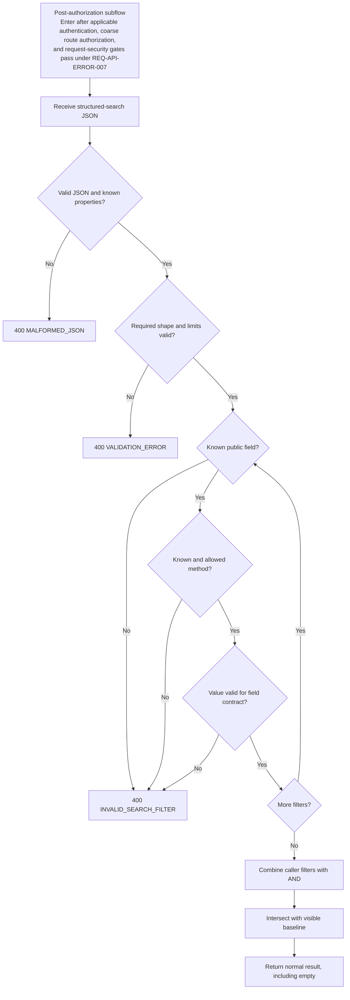

# Requirement: Search and Filter Framework

## Status

Accepted

## Context

GAM exposes structured search for several resources. Those endpoints need one
predictable request grammar without exposing persistence paths or forcing every
resource to support the same fields and value semantics.

The implementation and tests for the current search framework predate the
Requirement Specification workflow. They were used only as discovery material
and conversation prompts. This specification records the behavior explicitly
approved during planning.

This specification owns the shared structured-search request grammar,
comparison-method catalog, composition rules, complexity limits, and semantic
filter errors. Each resource Requirement Specification remains authoritative for
its public filter fields, field value types and normalization, visibility,
pagination, and sorting.

## Ubiquitous Language

- `structured search`: A resource search operation whose JSON body contains a
  list of filters governed by this specification.
- `filter`: One public field, one comparison method, and one submitted value.
- `public filter field`: The one canonical client-facing name through which a
  resource exposes a searchable concept while hiding persistence structure.
- `comparison method`: A member of the closed shared catalog that declares how
  one filter compares its submitted value with its public field.
- `visible baseline`: The resource collection that remains after the owning
  endpoint applies authorization, ownership, lifecycle, soft-deletion, audience,
  and other mandatory visibility rules before caller filters narrow it.

## Functional requirements

### REQ-SEARCH-001: Shared grammar and resource-owned field contracts

Every endpoint that declares itself a structured-search operation shall use the
shared request grammar, comparison-method catalog, composition rules,
complexity limits, and semantic error contract defined by this specification.

The owning resource Requirement Specification shall define:

- its complete public filter-field catalog;
- the comparison methods allowed for each field;
- each field's accepted value type;
- equality, partial-match, and other field-specific normalization;
- the product meaning of every public-field mapping;
- mandatory visibility rules;
- pagination and sorting behavior; and
- any resource-specific restriction stronger than this shared contract.

A resource shall not expose a field whose type, normalization, mapping, or
allowed methods remain implicit. Missing behavior is a planning gap and shall
not be decided by a parser, database mapping, implementation enum, test, or
current implementation behavior.

The shared grammar shall not create a universal filter-field catalog. A field
accepted by one resource shall not become valid for another resource unless the
other resource's accepted Requirement Specification explicitly exposes it.

Rationale:
Clients need one stable request shape, while each domain resource must retain
control over what can be searched and what its public fields mean.

Valid examples:

- Account and Event search both use the shared filter object but expose
  different field catalogs.
- A Member `name` field maps to a searchable full name without exposing its
  internal component structure.

Invalid examples:

- Adding a persistence property automatically makes it searchable.
- Agent T or Agent D copies an undocumented converter rule into expected
  behavior.

---

### REQ-SEARCH-002: Required request shape and canonical property names

A structured-search request body shall be a required JSON object with exactly
this shape:

```json
{
  "filters": [
    {
      "field": "status",
      "value": "ACTIVE",
      "comparisonMethod": "EQUALS"
    }
  ]
}
```

`filters` shall be required, non-null, and contain between zero and twenty
elements. An empty array shall mean that the caller supplied no product filter.

Every filter element shall be a non-null JSON object containing exactly:

- required nonblank string `field`;
- required non-null `value`; and
- required nonblank string `comparisonMethod`.

Blank textual `value` values shall fail structural validation. Method-specific
and field-specific value-shape rules apply after the shared structure is valid.

The request object and each filter object shall reject unknown properties.
`comparisonMethod` shall be the only accepted comparison-property name. The
legacy misspelling `comparationMethod` shall be rejected as an unknown property
without a compatibility alias.

Property names and public filter-field names shall use their documented
lower-camel-case spelling. Comparison-method values shall use their documented
uppercase spelling. Property names, field names, and comparison-method values
shall be case-sensitive and shall not be trimmed or otherwise normalized.

Rationale:
One strict shape produces accurate generated client types and prevents several
ambiguous representations of an empty or incomplete search.

Valid examples:

- `{ "filters": [] }`
- A filter using `comparisonMethod: "IN"`.

Invalid examples:

- An omitted request body.
- `{}` or `{ "filters": null }`.
- `{ "filters": [null] }`.
- A filter missing `field`, `value`, or `comparisonMethod`.
- A filter using `comparationMethod`, `ComparisonMethod`, `Email`, or
  `equals`.

---

### REQ-SEARCH-003: Filter composition and visible baseline

Every caller-supplied filter shall combine with every other caller-supplied
filter through logical `AND`, including repeated filters for the same public
field.

Repeated fields may express inclusive ranges. Individually valid filters that
contradict one another shall be a valid search that matches no result.

The public grammar shall not expose general `OR`, `NOT`, negation, nested
groups, or client-selected predicate trees. `IN` shall provide any-of matching
within one filter.

One resource-defined public field may internally require `OR` or another
compound predicate to deliver its documented product meaning. That internal
composition shall not change how separate caller filters combine and shall not
expose persistence structure.

Caller filters shall only narrow the visible baseline. They shall never expand
or bypass authorization, ownership, lifecycle, soft-deletion, audience, or
other mandatory visibility rules. Empty filters shall return the owning
endpoint's visible baseline rather than unrestricted persistence data.

Rationale:
Conjunctive composition keeps requests predictable while allowing a resource to
hide the internal complexity of one public concept.

Valid examples:

- Two bounds for `beginDate` form an inclusive date range.
- A public `name` field searches one canonical full-name representation.
- An Event status field evaluates a derived effective status.

Invalid examples:

- Repeated `status` filters are silently interpreted as `OR`.
- A client submits a persistence predicate tree.
- Filtering by a hidden status makes an otherwise invisible record visible.

---

### REQ-SEARCH-004: Closed comparison-method catalog and value shapes

The initial comparison-method catalog shall contain exactly:

| Comparison method | Shared meaning | Required JSON value shape |
| --- | --- | --- |
| `EQUALS` | Field-defined canonical equality | One non-null scalar |
| `LIKE` | Case-insensitive literal substring under `REQ-SEARCH-007` | One nonblank string |
| `IN` | Match any submitted element using the field's equality parsing | Array containing 1 to 100 non-null values |
| `GREATER_THAN_OR_EQUAL` | Inclusive lower bound | One non-null scalar valid for the field's ordered type |
| `LESS_THAN_OR_EQUAL` | Inclusive upper bound | One non-null scalar valid for the field's ordered type |

Every `IN` element shall have the one value type documented for the public
field and shall pass that field's scalar equality parsing. Heterogeneous arrays
shall be invalid. Duplicate values shall be valid, shall not change matching
semantics, and shall count toward the one-hundred-value limit. Element order
shall not change matching semantics.

Objects, arrays supplied to scalar methods, scalars supplied to `IN`, empty
`IN` arrays, null elements, and over-one-hundred-value `IN` arrays shall be
invalid filter values.

`NOT_EQUALS`, strict greater-than or less-than methods, `BETWEEN`, `IS_NULL`,
and every other unlisted method shall remain out of scope until an accepted
Requirement Specification explicitly expands this catalog.

Rationale:
A closed catalog keeps the public API intentional and prevents implementation
capabilities from silently becoming product behavior.

---

### REQ-SEARCH-005: Equality and field-owned normalization

Textual values used by `EQUALS` shall have surrounding whitespace trimmed before
the owning field's parsing and canonicalization. Equality shall not be
universally case-insensitive, diacritic-insensitive, or punctuation-insensitive.

Every public filter field supporting `EQUALS` or `IN` shall document:

- its scalar value type;
- its canonicalization and validation;
- whether comparison is case-sensitive or diacritic-sensitive when relevant;
  and
- the public product concept being compared.

`IN` shall apply the same scalar parsing and canonical equality to every
element.

An implementation parser, database collation, persistence converter, or enum
conversion shall not decide undocumented equality behavior.

Rationale:
UUIDs, canonical email and phone values, enum-like catalogs, ordinary text, and
human-equivalent names require different equality rules.

---

### REQ-SEARCH-006: Reusable scalar representations

Unless an owning resource requirement explicitly imposes a stronger rule,
current structured-search fields shall use these reusable representations:

| Value kind | Accepted filter representation |
| --- | --- |
| UUID | A trimmed JSON string containing a valid UUID; equality is by UUID value and does not require version 7 |
| Calendar date | A trimmed JSON string containing a valid ISO `YYYY-MM-DD` date |
| Absolute instant | A trimmed JSON string containing a valid RFC 3339 UTC timestamp ending in `Z` |
| Closed catalog value | A trimmed JSON string using the exact documented uppercase value; lowercase, mixed case, numeric ordinals, unknown values, and implementation-only constants are invalid |
| Role name or permission code | A trimmed nonblank JSON string compared exactly and case-sensitively; an unknown but well-formed value matches nothing rather than being invalid |

Calendar-date and instant bounds shall use inclusive chronological comparison.
Timezone-less timestamps and timestamps using an offset other than the
canonical UTC `Z` representation shall be invalid.

A well-formed UUID, date, instant, Role name, or permission code that matches no
visible record shall produce an empty search result rather than an invalid
filter error.

---

### REQ-SEARCH-007: Literal substring semantics

`LIKE` shall:

- trim surrounding whitespace;
- reject an empty or whitespace-only value;
- perform a case-insensitive literal substring match;
- treat `%`, `_`, and `\` as submitted literal characters rather than
  client-controlled pattern syntax; and
- preserve diacritics and punctuation by default.

This shared rule shall impose no minimum length beyond nonblank input. An owning
resource field may explicitly define stronger minimum length, whitespace,
diacritic, punctuation, or canonicalization behavior.

Rationale:
Clients need predictable substring search without gaining access to database
pattern syntax. Resource-specific concepts such as human-equivalent names may
still require stronger documented normalization.

Valid examples:

- `LIKE "Silva"` may match a documented full-name field containing `Silva`.
- `LIKE "50%"` searches for the literal text `50%`.

Invalid examples:

- A blank value is treated as an unfiltered request.
- `%` matches every value solely because it is a database wildcard.

---

### REQ-SEARCH-008: Canonical public filter fields

Each searchable concept shall expose one exact, case-sensitive public
filter-field name. A public field may represent:

- one direct resource property;
- a relationship identifier or stable public code;
- a canonical value owned by another accepted common requirement;
- a canonical full-name representation;
- a derived value; or
- another custom product predicate.

Internal persistence paths, joins, table or column names, and framework
property paths shall remain hidden and shall never be accepted as fallback
filter names.

Alternative, legacy, translated, or compatibility field names shall be invalid
unless the owning accepted Requirement Specification explicitly lists them.
Requirements shall describe the product meaning of a mapping rather than its
JPA path or implementation class.

Rationale:
Public fields must remain stable when persistence structures change and must
not expose sensitive internal topology.

---

### REQ-SEARCH-009: Structural and semantic error categories

Every invalid structured-search request shall use the common error envelope
from `REQ-OPENAPI-006` and one of these categories:

| Failure category | HTTP status and code |
| --- | --- |
| Invalid JSON syntax, unknown JSON property, or wrong JSON type for the shared request structure | `400 Bad Request`, `MALFORMED_JSON` |
| Missing, null, or blank required structural member; null filter element; or more than twenty filters | `400 Bad Request`, `VALIDATION_ERROR` |
| Unknown public filter field, unknown or unsupported comparison method, invalid method value shape, or value that fails the field's documented type and normalization | `400 Bad Request`, `INVALID_SEARCH_FILTER` |

An unknown comparison-method string in an otherwise complete filter shall be a
semantic `INVALID_SEARCH_FILTER`, not a malformed-JSON error.

This specification owns the exact semantic-filter contract under
`REQ-SEARCH-010`. The project-wide topology of generic `MALFORMED_JSON` and
`VALIDATION_ERROR` details remains outside this specification.

---

### REQ-SEARCH-010: Safe semantic-filter errors

Every `INVALID_SEARCH_FILTER` response shall include the zero-based
`filterIndex` in `details`.

When the submitted public field is known, `details` shall also contain its
canonical `field`. When a recognized comparison method is unsupported for that
field, `details` shall also contain `comparisonMethod`. Invalid values for a
known field and method may include both known identifiers.

An unknown field shall return the exact message `Unknown filter field.` and
shall include only `filterIndex` in `details`. The response shall not echo the
submitted unknown field.

An unknown comparison-method token shall not be echoed. Semantic errors shall
never return:

- the submitted filter value;
- an unknown submitted field or method token;
- an internal property or persistence path;
- a parser, Java, database, or framework type; or
- an implementation exception or database error.

The human-readable message may identify a known canonical public field.
Frontend behavior shall rely on the stable error `code` and structured
`details`, not message parsing.

Rationale:
Clients need actionable safe errors without turning validation into a
persistence-topology or sensitive-value disclosure channel.

---

### REQ-SEARCH-011: Deterministic fail-fast processing

The system shall validate the complete shared request structure before
evaluating semantic filters.

Semantic filters shall then be processed in array order. For each filter, the
system shall validate in this order:

1. public filter field;
2. comparison-method token;
3. whether the known field allows the recognized method; and
4. value shape, type, parsing, and normalization.

The first semantic failure shall be returned. If any filter is invalid, the
system shall execute no resource search query, ignore no invalid filter, and
apply no valid subset of the request.

Rationale:
Deterministic fail-fast behavior prevents partial searches and produces one
stable error location without examining values for unknown fields.

---

### REQ-SEARCH-012: Empty results and contract documentation

A structurally and semantically valid search that matches no visible records
shall succeed with the owning endpoint's normal empty collection or empty paged
response. This includes:

- well-formed values that do not exist;
- contradictory valid filters; and
- matches removed by mandatory visibility rules.

The outcome shall not become `404 Not Found`, `INVALID_SEARCH_FILTER`, or
another response that reveals whether a hidden record matched.

The generated OpenAPI contract for every structured-search operation shall:

- require the request body and `filters`;
- show `filters` as a non-null array with zero to twenty elements;
- require `field`, `value`, and `comparisonMethod`;
- expose only the five accepted comparison-method values;
- reject additional properties;
- use `comparisonMethod` in schemas and examples; and
- document or link the resource's public filter-field catalog and
  field-specific value semantics.

Pagination and sorting shall remain owned by the endpoint and
`REQ-OPENAPI-007`; this specification does not make either concern part of the
filter body.

## Acceptance scenarios

```gherkin
Scenario: Empty filters preserve the visible baseline
  Given a structured-search caller is authorized
  When the caller submits a request with filters equal to an empty array
  Then the search succeeds
  And every mandatory resource visibility rule still applies

Scenario: Repeated fields form an inclusive range
  Given a resource exposes an ordered instant field
  When the caller supplies inclusive lower and upper bounds for that field
  Then both filters combine with AND
  And only visible values inside both bounds may match

Scenario: Resource-defined internal OR remains one public filter
  Given a resource exposes a public full-name filter
  When the caller searches that field
  Then the resource may use a compound internal predicate
  And the client does not receive a general OR grammar

Scenario: Reject the legacy comparison-property spelling
  Given a request uses comparationMethod
  When the structured-search request is validated
  Then the response is 400 MALFORMED_JSON
  And comparationMethod is not treated as an alias

Scenario: Reject an unknown field without disclosure
  Given the first filter submits an unknown or persistence-like field
  When the request is validated
  Then the response is 400 INVALID_SEARCH_FILTER
  And the message is "Unknown filter field."
  And details contains filterIndex 0
  And the response does not echo the submitted field

Scenario: Reject an unsupported method for a known field
  Given a public UUID field allows EQUALS and IN
  When the caller uses LIKE for that field
  Then the response is 400 INVALID_SEARCH_FILTER
  And details identifies the filter index, canonical field, and comparison method

Scenario: Reject an invalid IN collection before querying
  Given a public UUID field allows IN
  When the caller supplies an empty, heterogeneous, or over-one-hundred-value array
  Then the response is 400 INVALID_SEARCH_FILTER
  And no resource search query executes

Scenario: Contradictory filters return an empty result
  Given two individually valid filters cannot both match one visible record
  When the caller submits both filters
  Then the search succeeds
  And the normal empty result representation is returned

Scenario: LIKE treats pattern characters literally
  Given a public text field allows LIKE
  When the caller searches for a value containing percent or underscore
  Then those characters are matched literally
  And they do not become database wildcards
```

## Diagrams



## Open questions

* None.

## Out of scope

- A universal filter-field catalog.
- Client-defined `OR`, `NOT`, negation, or nested predicate groups.
- Null predicates such as `IS_NULL` or `IS_NOT_NULL`.
- Comparison methods outside the accepted five-value catalog.
- Pagination, sorting, default ordering, or response envelopes.
- Resource-specific authorization and visibility rules.
- The project-wide details topology for generic malformed-JSON and validation
  errors.
- Persistence, JPA, parser, converter, or database-query implementation.
- Generic request-body size, rate-limiting, or abuse-protection policy outside
  the agreed filter and `IN` limits.

## Related ADRs

- [ADR-0020: Use shared search grammar with resource-specific public fields](../../decisions/0020-use-shared-search-grammar-with-resource-specific-public-fields.md)

## Related requirements

- [API Error and Authorization Contract](api-error-and-authorization-contract.md)
- [OpenAPI and Frontend API Documentation](openapi-and-frontend-api-documentation.md)
- [Account Records](../accounts/account-records.md)
- [Member Records and Lifecycle](../members/member-records-and-lifecycle.md)
- [Membership Solicitations](../members/membership-solicitations.md)
- [Event Records and Generic Event Lifecycle](../events/event-records-and-generic-lifecycle.md)
- [Oratoriano Records](../oratorianos/oratoriano-records.md)

## Related videos

* None.
