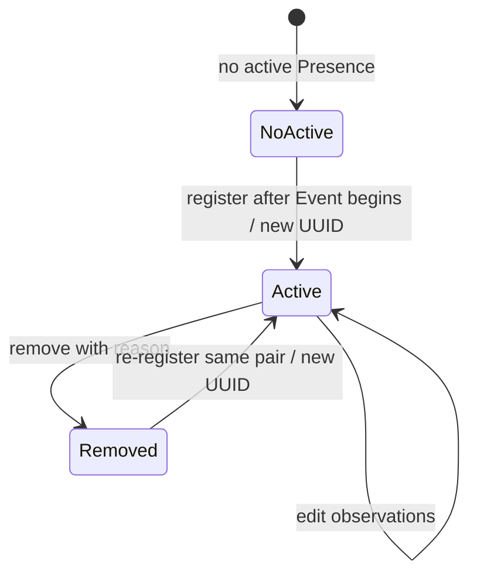

# Requirement: Member Event Presences

## Status

Accepted

## Context

GAM needs a durable contract for recording confirmed Member attendance at Events, correcting attendance observations, removing mistaken attendance, and retrieving attendance through Event and Member workflows.

The implementation and tests for Presences predate the Requirement Specification workflow. They were used only as discovery material and conversation prompts. This specification records the behavior agreed during planning and does not treat legacy behavior as authoritative.

This specification owns Member Presence identity, registration, observation editing, removal, Event-based retrieval, and the Presence-specific shape and ordering of Member history. Member-history authorization remains owned by `REQ-MEMBER-015`. Event lifecycle and deletion remain owned by the Event Requirement Specification.

## Ubiquitous Language

- `active Presence`: A Presence that has not been removed and is available through normal application workflows.
- `removed Presence`: A soft-deleted Presence retained for history but excluded from normal reads and active duplicate identity.
- `registration-eligible Event`: An active Event whose `beginDate` has been reached and whose effective status is `SCHEDULED` or `COMPLETED`.

## Functional requirements

### REQ-PRESENCE-001: Presence identity, relationships, and active uniqueness

Every Presence shall use a UUID v7 identifier according to `REQ-GAM-ID-001` through `REQ-GAM-ID-003`.

Each Presence shall identify exactly one Member and exactly one Event. The Member and Event relationships shall be immutable. Correcting either relationship shall require removing the mistaken Presence and registering a new Presence for the correct pair.

At most one active Presence shall exist for the same Event and Member. A removed Presence shall not reserve that active duplicate identity. Registering the same pair after removal shall create a new Presence with a new UUID while retaining the removed row as history.

Member Presence shall apply to Events of type `GENERIC`, `ORATORIO`, and `MISSA`. It records GAM Member attendance and shall not represent specialized Oratoriano attendance.

A Member's current `ACTIVE` or `INACTIVE` status shall not invalidate or hide the Member's historical attendance fact. Missing or soft-deleted Members shall not be eligible for new registration.

Rationale:
A Presence is an independently auditable historical fact. Active-only uniqueness prevents two coexisting attendance records for one pair while soft deletion permits correction and deliberate re-registration without erasing history.

Valid examples:
- An inactive Member receives a Presence for an Event attended before or after becoming inactive.
- A removed Presence is followed by a new Presence for the same Event and Member with a different UUID.

Invalid examples:
- Two active Presences coexist for the same Event and Member.
- Observation editing changes the Presence to another Event or Member.
- A Member Presence is used as an Oratoriano attendance record.

---

### REQ-PRESENCE-002: Observation contract

`observations` shall be an optional, non-confidential operational note about the attendance record.

The system shall trim a supplied observation. An omitted, explicit `null`, blank, or whitespace-only observation shall normalize to `null`. A non-null normalized observation shall contain at most 2,000 characters. An oversized or structurally invalid observation shall return `400 Bad Request`.

Observation text shall be visible wherever the owning Presence is authorized for retrieval. Confidential pastoral, safeguarding, medical, or personal notes shall not be stored as Presence observations.

Valid examples:
- `"  Arrived after the opening prayer  "` normalizes to `"Arrived after the opening prayer"`.
- `null`, an omitted creation property, and `"   "` normalize to `null`.

Invalid examples:
- An observation longer than 2,000 characters.
- A confidential pastoral note stored as an attendance observation.

---

### REQ-PRESENCE-003: Registration eligibility

The system shall capture one clock instant for a registration request and use it consistently for Event timing and effective-status evaluation.

A Presence may be registered only when:

- the Event exists, is active, and has type `GENERIC`, `ORATORIO`, or `MISSA`;
- the evaluation instant is equal to or after the Event's `beginDate`;
- the Event's effective status is `SCHEDULED` or `COMPLETED`; and
- the Member exists and is not soft-deleted, regardless of whether the Member is `ACTIVE` or `INACTIVE`.

Registration before `beginDate` or against a `CANCELLED`, `LOCKED`, or `FINALIZED` Event shall return `409 Conflict` with code `PRESENCE_REGISTRATION_NOT_ALLOWED`. Structured details shall include `eventId`, effective Event `status`, `beginDate`, and `evaluationInstant`.

A missing or soft-deleted Event or Member shall return `404 RESOURCE_NOT_FOUND` for the corresponding resource.

Rationale:
Presence confirms attendance rather than advance intent. Attendance can be recorded during an Event or entered later until administrative closure.

Valid examples:
- A Coordinator records attendance after a scheduled Event has begun but before it ends.
- A Coordinator enters late attendance while the Event is `COMPLETED`.

Invalid examples:
- Attendance is recorded before the Event begins.
- Attendance is recorded after the Event is locked or finalized.
- Attendance is recorded for a cancelled Event.

---

### REQ-PRESENCE-004: Registration API and authorization

`POST /events/{eventId}/presences` shall register one Member Presence. The JSON request shall contain required `memberId` and optional `observations`; it shall not contain a second `eventId`.

Registration shall require `PRESENCE_REGISTER` and current visibility under the Event's exact audience permission, following the permission-matching pattern established by `REQ-EVENT-005`. A public Event requires no audience permission in addition to `PRESENCE_REGISTER`. A restricted Event requires the caller to hold both `PRESENCE_REGISTER` and the exact permission referenced by the Event.

`EVENT_GET_PRESENCES`, `MEMBER_GET`, `MEMBER_SEARCH`, `MEMBER_GET_NON_ACTIVE`, and `PRESENCES_SEARCH` shall not be additional registration prerequisites. Roles shall not substitute for `PRESENCE_REGISTER` or the exact Event audience permission.

An unauthenticated request shall return `401 Unauthorized`. An authenticated caller missing `PRESENCE_REGISTER` shall receive `403 Forbidden`. A caller with `PRESENCE_REGISTER` that cannot view the Event shall receive `404 RESOURCE_NOT_FOUND` without learning whether a Presence already exists.

---

### REQ-PRESENCE-005: Duplicate registration and concurrent uniqueness

When an active Presence already exists for the Event and Member, registration shall return `409 Conflict` with code `PRESENCE_ALREADY_REGISTERED`. Structured details shall include `eventId`, `memberId`, and the existing active `presenceId`.

A removed Presence for the same pair shall not cause this conflict.

When concurrent requests attempt to register the same Event and Member, exactly one request may create the active Presence. Every losing request shall return `409 PRESENCE_ALREADY_REGISTERED`; no database constraint or persistence error shall leak through the API. Only the successful request shall emit `PRESENCE_REGISTERED`.

---

### REQ-PRESENCE-006: Registration response and activity

Successful registration shall return `201 Created`, the complete Presence representation from `REQ-PRESENCE-007`, and `Location: /api/events/{eventId}/presences/{memberId}`.

Successful registration shall emit exactly one `PRESENCE_REGISTERED` activity targeting the new Presence UUID. The activity shall use a `null` reason and include `memberId`, `eventId`, and the normalized `observations`, including `null`, as metadata.

Presence persistence and activity persistence shall commit in one transaction. Activity failure shall roll back registration. A failed request shall emit no activity.

---

### REQ-PRESENCE-007: Presence response representation

Registration and every Presence retrieval route shall return this compact representation:

```json
{
  "id": "<presence UUID>",
  "member": {
    "id": "<member UUID>",
    "firstName": "Ana",
    "surname": "Silva",
    "status": "ACTIVE"
  },
  "event": {
    "id": "<event UUID>",
    "title": "Saturday Oratorio",
    "beginDate": "2026-07-18T17:00:00Z",
    "endDate": "2026-07-18T20:00:00Z",
    "type": "ORATORIO",
    "status": "COMPLETED"
  },
  "observations": "Arrived after the opening prayer",
  "registeredAt": "2026-07-18T17:12:00Z"
}
```

`registeredAt` shall be the instant at which this Presence UUID was created and shall not change when observations are edited. Event `status` shall be the effective status evaluated using one clock instant for the request according to `REQ-EVENT-006`.

The representation shall not expose Member Account data, birth date, phone number, Event description, Event audience-permission metadata, GamLocation internals, Event cancellation reason, soft-delete fields, or low-level row-audit fields.

---

### REQ-PRESENCE-008: Event-based Presence retrieval authorization

The system shall expose:

- `GET /events/{eventId}/presences` for a paged Event roster; and
- `GET /events/{eventId}/presences/{memberId}` for the active Presence identified by the Event and Member pair.

Both routes shall require `EVENT_GET_PRESENCES` and current Event audience visibility. Public Event attendance shall not become public merely because the Event is public.

An unauthenticated request shall return `401 Unauthorized`. An authenticated caller missing `EVENT_GET_PRESENCES` shall receive `403 Forbidden`. A missing, soft-deleted, or audience-hidden Event shall return `404 RESOURCE_NOT_FOUND` for resource `Event`.

After Event visibility succeeds, an individual lookup with no active matching Presence shall return `404 RESOURCE_NOT_FOUND` for resource `Presence` with identifier `{eventId}:{memberId}`. The endpoint shall not separately reveal whether the Member exists.

An Event roster shall include active Presences for both active and inactive Members. `MEMBER_GET_NON_ACTIVE` shall not filter or expand the roster.

---

### REQ-PRESENCE-009: Event roster filtering, ordering, and pagination

`GET /events/{eventId}/presences` shall return active Presences in the GAM-owned paged envelope defined by `REQ-OPENAPI-007`.

The optional `name` query parameter shall perform a case-insensitive, accent-sensitive substring match against Member `firstName` or `surname`. The system shall trim a supplied value and reject a blank or whitespace-only value with `400 Bad Request`. An omitted parameter shall apply no name filter. A multi-component value shall not be treated as a concatenated full-name field.

The default order shall be Member `firstName` ascending, Member `surname` ascending, and Presence UUID ascending.

Clients may sort by `memberFirstName`, `memberSurname`, or `registeredAt`. The system shall append Presence UUID ascending as a deterministic tie-breaker to every requested sort sequence.

An authorized Event with no matching active Presences shall return `200 OK` with an empty page.

---

### REQ-PRESENCE-010: Member Presence history shape and ordering

`GET /members/{memberId}/presences` authorization and Member-status visibility shall follow `REQ-MEMBER-015`.

After that authorization succeeds, the endpoint shall return every active Presence for the Member without filtering rows by each Event's audience permission. Removed Presences shall remain hidden from the normal history.

The endpoint shall use the representation from `REQ-PRESENCE-007` and the GAM-owned paged envelope from `REQ-OPENAPI-007`. It shall apply no product filters in this scope.

The default order shall be Event `beginDate` descending, Event UUID descending, and Presence UUID ascending. Clients may sort by `eventBeginDate`, `eventTitle`, or `registeredAt`; the system shall append Presence UUID ascending as a deterministic tie-breaker.

An authorized Member with no active Presences shall return `200 OK` with an empty page.

Rationale:
Linked-Account access and `PRESENCES_SEARCH` are explicit attendance-history authorities. Per-Event filtering would silently make personal and operational history incomplete.

---

### REQ-PRESENCE-011: Observation editing

`PATCH /events/{eventId}/presences/{memberId}` shall edit only the active Presence's `observations`.

The JSON body shall contain the `observations` property. The property may be a string or explicit `null` and shall normalize according to `REQ-PRESENCE-002`. Omitting the property shall return `400 Bad Request`. The request shall not accept `eventId`, `memberId`, or any other mutable field.

Editing shall require `PRESENCE_EDIT` and current Event audience visibility. It shall not additionally require `EVENT_GET_PRESENCES`, `PRESENCE_REGISTER`, `PRESENCE_REMOVE`, or a Member-read permission.

An unauthenticated edit shall return `401 Unauthorized`. An authenticated caller missing `PRESENCE_EDIT` shall receive `403 Forbidden`. A caller with `PRESENCE_EDIT` that cannot view the Event shall receive `404 RESOURCE_NOT_FOUND`. Roles shall not substitute for the required permissions.

An active Presence may be edited while the Event is `SCHEDULED`, `COMPLETED`, or `CANCELLED`, regardless of the Event's current `beginDate`. Editing while the Event is `LOCKED` or `FINALIZED` shall return `409 Conflict` with code `PRESENCE_EDIT_NOT_ALLOWED`; structured details shall include `eventId`, `presenceId`, and effective Event `status`.

After Event visibility succeeds, a missing or removed Presence shall return `404 RESOURCE_NOT_FOUND` for resource `Presence` with identifier `{eventId}:{memberId}`.

A changed edit shall return `200 OK` and the complete updated Presence representation.

---

### REQ-PRESENCE-012: Observation-edit activity and normalized no-op

A changed observation shall emit exactly one transactional `PRESENCE_UPDATED` activity targeting the Presence UUID. The activity shall use a `null` reason and include `memberId`, `eventId`, `previousObservations`, and `newObservations` metadata.

A normalized no-op shall return `200 OK` with the complete current Presence representation but shall perform no persistence update and emit no activity.

Activity failure shall roll back a changed edit. A rejected edit shall not mutate or audit the Presence.

---

### REQ-PRESENCE-013: Presence removal

`DELETE /events/{eventId}/presences/{memberId}` shall remove one active Presence by soft deletion. The JSON body shall contain a required `reason` that is trimmed and contains 1 to 2,000 characters. A missing, null, blank, oversized, or structurally invalid reason shall return `400 Bad Request`.

Removal shall require `PRESENCE_REMOVE` and current Event audience visibility. It shall not additionally require `EVENT_GET_PRESENCES`, `PRESENCE_REGISTER`, `PRESENCE_EDIT`, or a Member-read permission.

An unauthenticated removal shall return `401 Unauthorized`. An authenticated caller missing `PRESENCE_REMOVE` shall receive `403 Forbidden`. A caller with `PRESENCE_REMOVE` that cannot view the Event shall receive `404 RESOURCE_NOT_FOUND`. Roles shall not substitute for the required permissions.

An active Presence may be removed while the Event is `SCHEDULED`, `COMPLETED`, or `CANCELLED`, regardless of the Event's current `beginDate`. Removal while the Event is `LOCKED` or `FINALIZED` shall return `409 Conflict` with code `PRESENCE_REMOVAL_NOT_ALLOWED`; structured details shall include `eventId`, `presenceId`, and effective Event `status`.

After Event visibility succeeds, a missing or already removed Presence shall return `404 RESOURCE_NOT_FOUND` for resource `Presence` with identifier `{eventId}:{memberId}`.

Successful removal shall return `204 No Content`. The removed Presence shall disappear from individual lookup, Event rosters, Member history, and active duplicate detection. The same Event and Member may then receive a new Presence with a new UUID.

---

### REQ-PRESENCE-014: Presence-removal activity

Successful removal shall emit exactly one `PRESENCE_REMOVED` activity targeting the removed Presence UUID. The activity shall store the required normalized reason and include `memberId`, `eventId`, and the final normalized `observations` as metadata.

Presence removal and activity persistence shall commit in one transaction. Activity failure shall roll back removal. A rejected removal shall not mutate or audit the Presence.

---

### REQ-PRESENCE-015: Cross-workflow concurrency safety

Registration, observation editing, and removal shall serialize through the Event transaction boundary established by ADR-0012 and shall re-evaluate the latest committed Event and active Presence state before mutation.

The following guarantees shall hold:

- a concurrent Event lock or finalization either commits first and blocks the Presence mutation, or the Presence mutation commits first against the earlier attendance-open state;
- concurrent observation edit and removal shall not overwrite or resurrect a removed Presence;
- concurrent removals shall produce at most one successful removal;
- concurrent removal and re-registration shall leave at most one active Presence for the pair;
- Presence registration and Event deletion shall never commit an active Presence that references a soft-deleted Event; and
- every successful mutation shall have exactly one matching activity, except a normalized observation no-op, which has none.

Rejected concurrent operations shall return their domain error rather than exposing locking, constraint, or persistence failures.

## Acceptance scenarios

```gherkin
Scenario: Register confirmed attendance during an Event
  Given a visible Event has begun and is SCHEDULED
  And an active Member has no active Presence for the Event
  And the caller has PRESENCE_REGISTER and the Event audience permission
  When the caller registers the Member with an observation
  Then the response is 201 Created with the complete Presence
  And Location identifies /api/events/{eventId}/presences/{memberId}
  And one PRESENCE_REGISTERED activity contains the normalized observation

Scenario: Reject attendance before the Event begins
  Given a visible SCHEDULED Event has not reached beginDate
  And the caller has PRESENCE_REGISTER and the Event audience permission
  When the caller registers a Member
  Then the response is 409 PRESENCE_REGISTRATION_NOT_ALLOWED
  And no Presence or activity is created

Scenario: Reject an active duplicate
  Given an active Presence exists for an Event and Member
  And the caller is authorized to register attendance for the Event
  When the caller registers the same Member again
  Then the response is 409 PRESENCE_ALREADY_REGISTERED
  And the details identify the existing Presence
  And no second Presence or activity is created

Scenario: Re-register after removal
  Given a Presence for an Event and Member was removed
  And the Event is registration-eligible
  And the caller is authorized to register attendance
  When the caller registers the same Member again
  Then a new active Presence is created with a different UUID
  And the removed Presence remains preserved

Scenario: Event roster uses Brazilian first-name ordering
  Given a visible Event has active Presences for several Members
  And the caller has EVENT_GET_PRESENCES
  When the caller retrieves the roster without a requested sort
  Then results order by firstName, surname, and Presence UUID ascending
  And active Presences for inactive Members remain included

Scenario: Linked Member reads complete personal history
  Given an authenticated Account is linked to a Member
  And the Member has active Presences for Events with different audiences
  When the Account retrieves its linked Member history
  Then REQ-MEMBER-015 authorizes the request
  And no Presence row is filtered by Event audience permission

Scenario: Edit an observation
  Given an active Presence belongs to a visible CANCELLED Event
  And the caller has PRESENCE_EDIT
  When the caller changes the observation
  Then the response is 200 OK with the normalized observation
  And one PRESENCE_UPDATED activity contains the previous and new observations

Scenario: Normalized observation no-op is not audited
  Given an active Presence has observation "Arrived late"
  And the caller is authorized to edit it
  When the caller submits "  Arrived late  "
  Then the response is 200 OK
  And no persistence mutation or PRESENCE_UPDATED activity occurs

Scenario: Remove mistaken attendance
  Given an active Presence belongs to a visible COMPLETED Event
  And the caller has PRESENCE_REMOVE
  When the caller removes it with a valid reason
  Then the response is 204 No Content
  And the Presence is hidden from normal retrieval and active duplicate detection
  And one PRESENCE_REMOVED activity stores the reason and final observation

Scenario: Locked Event rejects attendance correction
  Given an active Presence belongs to a LOCKED Event
  When an authorized caller attempts to edit or remove the Presence
  Then the matching mutation returns its intent-specific 409 conflict code
  And the Presence and activity log remain unchanged

Scenario: Removed Presences allow duplicate Event cleanup
  Given a duplicate Generic Event has only removed Presence references
  And the Event otherwise satisfies its deletion requirements
  When an authorized caller deletes the duplicate Event with a valid reason
  Then the Event is soft-deleted
  And the removed Presences remain preserved

Scenario: Concurrent duplicate registrations produce one active Presence
  Given two authorized requests target the same registration-eligible Event and Member
  When both registration transactions attempt to commit
  Then exactly one request creates the active Presence
  And every losing request returns 409 PRESENCE_ALREADY_REGISTERED
  And exactly one PRESENCE_REGISTERED activity is recorded
```

## Diagrams



The diagram represents active identity for one Event and Member pair. Re-registration after removal creates a new persisted Presence row; it does not restore or reuse the removed row.

## Open questions

* None.

## Out of scope

* Advance registration, RSVP, planned attendance, or attendance reservations.
* Bulk registration, bulk removal, roster replacement, and file import.
* Changing a Presence's Member or Event relationship.
* Presence restoration and developer hard deletion.
* Confidential pastoral, safeguarding, medical, or personal notes.
* Specialized Oratoriano attendance.
* Filtering Member history or adding Event-roster filters beyond `name`.
* Accent-insensitive name matching until it is defined consistently for all name searches.

## Related ADRs

* [ADR-0012: Serialize Event and Presence Mutations](../../decisions/0012-serialize-event-and-presence-mutations.md)

## Related requirements

* [UUID](../common/uuid.md)
* [Event Records and Generic Event Lifecycle](../events/event-records-and-generic-lifecycle.md)
* [Member Records and Lifecycle](../members/member-records-and-lifecycle.md)
* [RBAC Catalog](../rbac/rbac-catalog.md)
* [OpenAPI and Frontend API Documentation](../platform/openapi-and-frontend-api-documentation.md)

## Related videos

* None.
