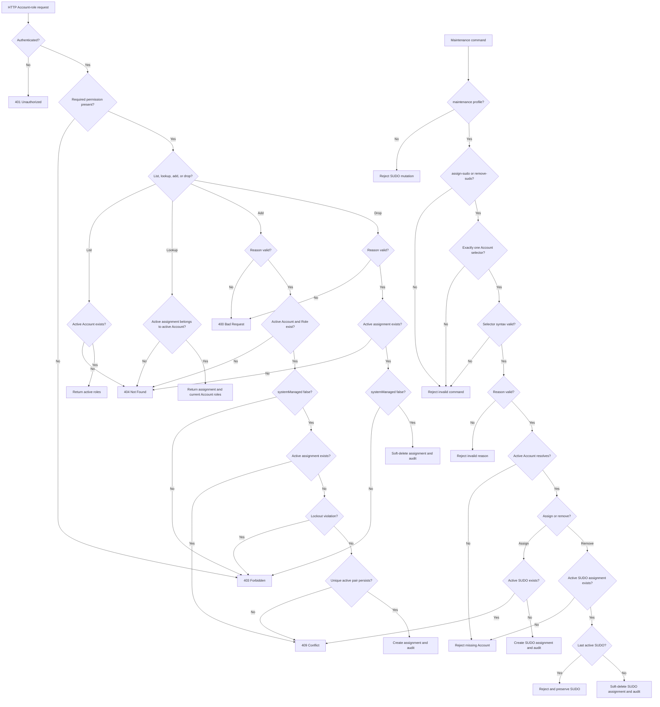

# Requirement: Account Role Management

## Status
Accepted

## Context

GAM needs a protected API for managing the active roles assigned to an Account. The workflow must make security intent explicit, preserve the history of Account-role assignments, and prevent duplicate active assignments or security lockout.

This Requirement Specification was created after the Account-role implementation and tests already existed. Those artifacts were used only as discovery material and conversation prompts. This document defines the intended behavior for the feature.

Roles remain permission bundles; authorization decisions must use permissions rather than role names. The `ACCOUNT_ROLE_MANAGE` permission is part of the RBAC catalog and shall be seeded for the baseline `SUDO` and `COORD` roles, but not for `MEMBER` or `VISITOR`.

`SUDO` is a developer-controlled unrestricted-access role. Its assignment and removal require a separate maintenance workflow because ordinary Account-role administration must not be able to remove the application's developer recovery path.

`COORD`, `MEMBER`, and `VISITOR` are lifecycle-owned roles. Member registration, membership-solicitation approval, reactivation, deactivation, and Coordinator designation workflows synchronize them from Member state and Coordinator responsibility. Generic Account-role administration must not assign or remove them independently.

## Ubiquitous Language

- `active Account`: An Account that is not soft-deleted and is visible through ordinary application reads.
- `active Role`: A Role that is not soft-deleted and is visible through ordinary application reads; a system-managed Role must also be current rather than stale under `REQ-RBAC-005`.
- `active Account-role assignment`: A non-deleted association between an active Account and an active Role.
- `Account-role collection`: The active roles assigned to one Account, returned as a top-level `roles` list.
- `Account-role assignment resource`: One active Account-to-Role association identified by its own stable assignment UUID.
- `drop`: The user-facing action that removes an active Account-role assignment while preserving the historical assignment through the technical soft-delete mechanism.
- `active SUDO assignment`: An active Account-role assignment whose Role is `SUDO`.
- `SUDO maintenance operation`: A developer-controlled assignment or removal of an active SUDO assignment through the dedicated maintenance workflow.
- `maintenance Account selector`: Exactly one Account UUID or Account email supplied to identify the target Account for a SUDO maintenance operation.

## Functional requirements

### REQ-ACCOUNT-ROLE-001: Protected Account-role API

The system shall expose these routes:

| Method | Route | Required permission | Purpose |
| --- | --- | --- | --- |
| `GET` | `/accounts/{accountId}/roles` | `ACCOUNT_GET` | List the Account's active roles. |
| `GET` | `/accounts/{accountId}/role-assignments/{assignmentId}` | `ACCOUNT_GET` | Read one active Account-role assignment. |
| `POST` | `/accounts/{accountId}/roles` | `ACCOUNT_ROLE_MANAGE` | Add one active custom Role to the Account. |
| `PATCH` | `/accounts/{accountId}/roles/{roleId}/drop` | `ACCOUNT_ROLE_MANAGE` | Drop one active custom Role from the Account. |

All four routes shall require authentication. An unauthenticated request shall return `401 Unauthorized`. An authenticated caller without the required permission shall return `403 Forbidden`.

The self-view exception for direct Account lookup shall not grant access to Account-role collection reads, assignment lookup, or Account-role mutations.

Rationale:
Account-role changes are security-sensitive mutations and must be separated from ordinary Account reads. The explicit drop action keeps the user-facing contract distinct from the internal soft-delete operation.

Valid examples:
- A caller with `ACCOUNT_GET` lists an Account's active roles.
- A caller with `ACCOUNT_ROLE_MANAGE` adds or drops an active custom Role.

Invalid examples:
- A caller with only self-view access lists another Account's roles.
- A caller is authorized by `hasRole('COORD')` instead of the required permission authority.

---

### REQ-ACCOUNT-ROLE-002: List active Account roles

`GET /accounts/{accountId}/roles` shall return `200 OK` with this shape:

```json
{
  "roles": [
    {
      "id": "<role UUID>",
      "name": "COORD",
      "description": "Coordinator access to GAM operational administration",
      "systemManaged": true
    }
  ]
}
```

The requested Account shall be active. A missing or soft-deleted Account shall return `404 Not Found`.

The response shall include only roles from active Account-role assignments whose Account and Role are active. An Account with no active assignments shall return `{"roles": []}`.

Rationale:
Role visibility must reflect current authorization state while keeping historical and soft-deleted assignments out of ordinary reads.

Valid examples:
- An active Account with `MEMBER` and `COORD` assignments receives both active Role records.
- An active Account with no active assignments receives an empty `roles` list.

Invalid examples:
- An unknown Account returns an empty list instead of `404 Not Found`.
- A dropped assignment appears in the list.

---

### REQ-ACCOUNT-ROLE-003: Add an Account role (role eligibility superseded)

The Role-eligibility portions of this requirement are superseded by `REQ-ACCOUNT-ROLE-016`. Its request, response, duplicate-assignment, concurrency, history, and audit-facing contract remains accepted for eligible custom Roles.

`POST /accounts/{accountId}/roles` shall accept:

```json
{
  "roleId": "<role UUID>",
  "reason": "Grant coordinator access for the new responsibility"
}
```

The system shall require an active Account and an active Role. A missing or soft-deleted Account shall return `404 Not Found` for the Account resource. A missing or soft-deleted Role shall return `404 Not Found` for the Role resource.

The system shall reject adding `SUDO` through this API with `403 Forbidden`. SUDO assignment is developer-controlled maintenance behavior; see `REQ-ACCOUNT-ROLE-009` through `REQ-ACCOUNT-ROLE-013` and `REQ-ACCOUNT-ROLE-015`.

The system shall reject adding the lifecycle-owned `MEMBER` or `VISITOR` Roles through this API with `403 Forbidden`. Those assignments shall be created only by the Member lifecycle workflows defined in the Member Records and Lifecycle and Membership Solicitations Requirement Specifications.

The system shall reject an existing active Account-role assignment with `409 Conflict` and shall not create a second active assignment or activity-log record.

The database shall enforce the one-active-assignment invariant with a Flyway-managed partial unique index on `(account_id, role_id)` for rows whose `deleted_at` is null. The add workflow shall translate a uniqueness conflict caused by a concurrent add into `409 Conflict`. The failed transaction shall create neither a second active assignment nor an activity-log record.

If an earlier assignment for the same Account and Role was dropped, a later add shall create a new active assignment identity rather than restore or reuse the historical assignment.

On success, the system shall return `201 Created`. The `Location` response header shall be `/api/accounts/{accountId}/role-assignments/{assignmentId}`, where `assignmentId` is the UUID of the newly created assignment. That URI shall be immediately retrievable according to `REQ-ACCOUNT-ROLE-014`.

The response shall include the assignment UUID and return the Account using the full Account response contract from `REQ-ACCOUNT-006`. The Account's `roles` list shall contain all current active roles, including the role just added:

```json
{
  "id": "<assignment UUID>",
  "account": {
    "id": "<account UUID>",
    "email": "account@example.com",
    "displayName": "Account",
    "roles": [
      {
        "id": "<role UUID>",
        "name": "COORD",
        "description": "Coordinator access to GAM operational administration",
        "systemManaged": true
      }
    ]
  },
  "role": {
    "id": "<role UUID>",
    "name": "COORD",
    "description": "Coordinator access to GAM operational administration",
    "systemManaged": true
  }
}
```

The response shall not expose passwords, tokens, sessions, soft-delete fields, row audit metadata, or the audit reason.

Rationale:
An Account can hold at most one active assignment for a given Role. Re-adding after a drop must preserve the historical fact that the earlier assignment ended.

Valid examples:
- An Account with `ACCOUNT_ROLE_MANAGE` adds an active custom Role to an Account that does not currently have it.
- A previously dropped `COORD` assignment is added again as a new active assignment when lockout rules permit it.

Invalid examples:
- Adding a Role to a missing Account.
- Adding a missing Role.
- Adding a Role that is already actively assigned.
- Two concurrent adds both create an active assignment for the same Account and Role.
- Adding `SUDO` through the HTTP API.
- Adding `MEMBER` or `VISITOR` through the Account-role HTTP API.

---

### REQ-ACCOUNT-ROLE-004: Drop an Account role (role eligibility superseded)

The Role-eligibility portions of this requirement are superseded by `REQ-ACCOUNT-ROLE-017`. Its request, response, missing-assignment, history, and audit-facing contract remains accepted for eligible custom Roles.

`PATCH /accounts/{accountId}/roles/{roleId}/drop` shall accept:

```json
{
  "reason": "Remove coordinator access after responsibility change"
}
```

The system shall require an active Account-role assignment for the requested Account and Role. If the Account, Role, or active assignment is missing or soft-deleted, the API shall return `404 Not Found` and shall not mutate data.

The system shall reject dropping `SUDO` through this API with `403 Forbidden`. SUDO removal is developer-controlled maintenance behavior; see `REQ-ACCOUNT-ROLE-009` through `REQ-ACCOUNT-ROLE-013` and `REQ-ACCOUNT-ROLE-015`.

The system shall reject dropping the lifecycle-owned `MEMBER` or `VISITOR` Roles through this API with `403 Forbidden`. Those assignments shall be removed only by Member lifecycle workflows.

On success, the system shall soft-delete the active assignment, return `204 No Content`, and make the assignment absent from subsequent Account-role lists. The historical assignment shall remain available only to developer-controlled maintenance workflows.

Rationale:
Dropping a role changes current authority but must preserve the historical security change for audit and recovery purposes.

Valid examples:
- A caller with `ACCOUNT_ROLE_MANAGE` drops an active custom Role assignment.
- A caller drops an active `COORD` assignment when the lockout-prevention rule permits it.

Invalid examples:
- Dropping a pair that has no active assignment.
- Dropping a soft-deleted assignment through the HTTP API.
- Dropping `SUDO` through the HTTP API.
- Dropping `MEMBER` or `VISITOR` through the Account-role HTTP API.

---

### REQ-ACCOUNT-ROLE-005: Required and bounded audit reason

The `reason` field shall be required for direct Account-role add and drop requests and for SUDO maintenance assignment and removal commands. The system shall trim leading and trailing whitespace before validation and audit logging.

After trimming, `reason` shall contain between 1 and 2,000 characters. For direct HTTP requests, a null, empty, whitespace-only, or over-2,000-character reason shall return `400 Bad Request`. For SUDO maintenance commands, the same invalid values shall reject the command before Account or Role loading, data mutation, or activity-event publication.

The maximum is an application-level request limit. The current `activity_logs.reason` database column is `TEXT` and therefore does not define a smaller numeric column limit.

The list operation shall not accept or require a reason. Invalid SUDO maintenance reasons shall be rejected before the target Account or Role is loaded or any mutation is attempted.

Rationale:
Security changes require explicit human intent. A bounded reason keeps the API payload and audit entry useful while remaining independent of an unbounded database `TEXT` column.

Valid examples:
- `" Grant access "` is accepted and audited as `"Grant access"`.
- A reason containing exactly 2,000 characters after trimming is accepted.

Invalid examples:
- A missing reason.
- A reason containing only spaces or line breaks.
- A reason containing 2,001 characters after trimming.

---

### REQ-ACCOUNT-ROLE-006: Account-role error semantics

The API shall use these outcomes:

| Condition | Response |
| --- | --- |
| Unauthenticated request | `401 Unauthorized` |
| Authenticated caller lacks the route permission | `403 Forbidden` |
| Missing or soft-deleted Account, Role, or active Account-role assignment | `404 Not Found` |
| Active Account-role assignment already exists during add | `409 Conflict` |
| Invalid reason or other command validation failure | `400 Bad Request` |
| SUDO or lifecycle-owned Role API mutation, or lockout-prevention violation | `403 Forbidden` |

Failed requests shall not create, drop, restore, or audit an Account-role assignment.

Rationale:
Clients need stable distinctions between authentication, authorization, missing resources, duplicate state, and invalid commands.

---

### REQ-ACCOUNT-ROLE-007: Account-role activity audit

A successful direct Account-role add shall emit exactly one `ACCOUNT_ROLE_ADDED` activity event. A successful direct Account-role drop shall emit exactly one `ACCOUNT_ROLE_REMOVED` activity event.

Each event shall capture the actor, Account-role assignment identifier, Account identifier, Role identifier, Role name, trimmed reason, and request metadata according to the activity-audit policy. The business mutation and activity-log row shall commit together.

Failed or forbidden operations shall not emit Account-role activity events. A higher-level workflow such as direct Member registration, membership-solicitation approval, Member reactivation, or Member deactivation shall emit its own high-level activity event and shall not emit unrelated duplicate Account-role events for the same workflow.

Rationale:
The audit log records security intent rather than every repository write. One high-level event per direct security action keeps the history meaningful and consistent.

---

### REQ-ACCOUNT-ROLE-008: Lockout prevention (COORD ownership superseded)

The SUDO rules in this requirement remain accepted. Its COORD-specific generic-drop rules are superseded by `REQ-ACCOUNT-ROLE-018` and the Member lifecycle requirements because generic Account-role management no longer manages COORD.

All Account-role mutation workflows shall enforce these protections transactionally:

- HTTP callers shall not add or drop `SUDO`.
- HTTP Account-role callers shall not add or drop the lifecycle-owned `MEMBER` or `VISITOR` Roles.
- Developer-controlled SUDO maintenance shall not drop the last active Account-role assignment for `SUDO`.
- An Account with an active `COORD` assignment shall not drop `COORD` from its own Account when no other active Account has an active `COORD` assignment.
- An Account with an active `SUDO` assignment is exempt from the self-`COORD` protection and may remove the final active `COORD` assignment, including from its own Account.

Violations shall return or raise a forbidden-operation outcome and shall not mutate the assignment.

Rationale:
The system must preserve a developer recovery path and avoid removing the last active `COORD` capability through self-administration.

Valid examples:
- Developer maintenance removes one SUDO assignment while another active SUDO Account remains.
- An Account with an active `COORD` assignment drops its own `COORD` assignment while another active Account still has an active `COORD` assignment.

Invalid examples:
- Developer maintenance drops the last active SUDO assignment.
- An Account drops its own `COORD` assignment when it is the only active Account with an active `COORD` assignment.

The SUDO protection in this Requirement Specification applies to explicit SUDO role assignment and removal only. Account deactivation, disabling, deletion, and restoration policies are outside this feature.

---

### REQ-ACCOUNT-ROLE-009: Maintenance-only SUDO management

The system shall make SUDO assignment and removal available only through the dedicated maintenance workflow running with the `maintenance` profile.

The HTTP Account-role API and ordinary application workflows shall reject SUDO assignment and removal with a forbidden-operation outcome. The dedicated maintenance workflow shall support only the `assign-sudo` and `remove-sudo` actions.

Rationale:
SUDO grants unrestricted system access and must not be manageable through ordinary authenticated administration or an accidental general-purpose application path.

Valid examples:
- A Developer invokes the dedicated maintenance workflow with `assign-sudo`.
- A Developer invokes the dedicated maintenance workflow with `remove-sudo`.

Invalid examples:
- An Account with `ACCOUNT_ROLE_MANAGE` assigns SUDO through the Account-role HTTP API.
- An ordinary application workflow invokes SUDO assignment or removal.
- A maintenance invocation uses an unsupported action name.

---

### REQ-ACCOUNT-ROLE-010: SUDO maintenance target selection

Each SUDO maintenance operation shall require exactly one `maintenance Account selector`: either the target Account UUID or the target Account email.

The system shall reject an invocation that supplies both selectors, neither selector, or a blank selector before any SUDO mutation. The selected Account shall be an active Account; an Account that cannot be resolved through ordinary active-record visibility shall not receive or lose SUDO through this workflow.

Rationale:
An explicit, exclusive target selector prevents ambiguous maintenance commands and reduces the risk of changing the wrong Account.

Valid examples:
- `assign-sudo` identifies an active Account by UUID.
- `remove-sudo` identifies an active Account by email.

Invalid examples:
- Supplying both Account UUID and Account email.
- Supplying neither selector.
- Supplying a blank selector.
- Selecting a missing or soft-deleted Account.

---

### REQ-ACCOUNT-ROLE-011: SUDO maintenance assignment

The `assign-sudo` maintenance action shall create one active SUDO assignment for the selected active Account.

If the Account already has an active SUDO assignment, the system shall reject the operation with a conflict outcome, shall not create a duplicate assignment, and shall not emit an Account-role activity event. If a previous SUDO assignment was dropped, a later assignment shall create a new active assignment identity.

On success, the system shall emit exactly one `ACCOUNT_ROLE_ADDED` activity event containing the selected Account, the SUDO Role, and the normalized audit reason.

Rationale:
SUDO assignment must be explicit and auditable while preserving the history of previously removed authority.

Valid examples:
- Maintenance assigns SUDO to an active Account without an active SUDO assignment.
- Maintenance assigns SUDO again after an earlier SUDO assignment was dropped, creating a new assignment identity.

Invalid examples:
- Maintenance assigns SUDO to an Account that already has active SUDO.
- Maintenance assigns SUDO to a missing or soft-deleted Account.

---

### REQ-ACCOUNT-ROLE-012: SUDO maintenance removal

The `remove-sudo` maintenance action shall remove only an active SUDO assignment from the selected Account.

If the selected Account has no active SUDO assignment, the system shall reject the operation with a not-found outcome, shall not mutate any assignment, and shall not emit an Account-role activity event.

On success, the system shall soft-delete the active SUDO assignment and emit exactly one `ACCOUNT_ROLE_REMOVED` activity event containing the selected Account, the SUDO Role, and the normalized audit reason.

Rationale:
Removal must target a currently effective SUDO assignment and preserve the historical security change without making a missing removal appear successful.

Valid examples:
- Maintenance removes SUDO from one of several active SUDO Accounts.

Invalid examples:
- Maintenance removes SUDO from an Account that does not currently have SUDO.
- Maintenance removes a non-SUDO Role through the SUDO maintenance workflow.

---

### REQ-ACCOUNT-ROLE-013: Last-SUDO protection

The system shall reject a SUDO removal that would leave no active SUDO assignment. The rejected operation shall not mutate the assignment or emit an Account-role activity event.

The system shall evaluate and serialize this invariant transactionally so concurrent SUDO maintenance removals cannot remove every active SUDO assignment. At least one active SUDO assignment shall remain after every committed SUDO removal.

This requirement governs explicit SUDO role removal only. It does not govern Account deactivation, disabling, deletion, or restoration.

Rationale:
The application must retain a developer recovery path even when multiple maintenance operations are attempted concurrently.

Valid examples:
- Maintenance removes one SUDO assignment while another active SUDO assignment remains.

Invalid examples:
- Maintenance removes the last active SUDO assignment.
- Two concurrent removals both succeed when only two active SUDO assignments existed.

---

### REQ-ACCOUNT-ROLE-014: Direct Account-role assignment lookup

`GET /accounts/{accountId}/role-assignments/{assignmentId}` shall return the active Account-role assignment identified by `assignmentId` only when it belongs to the Account identified by `accountId`.

The Account, assignment, and Role shall all be active. A missing or soft-deleted Account, assignment, or Role, or an assignment that belongs to a different Account, shall return `404 Not Found`.

The response shall use the same assignment shape as a successful add. It shall include the assignment `id`, the Account record with its complete current active `roles` list, and the assigned Role record. It shall not expose the audit reason, row audit metadata, credentials, tokens, or sessions.

The lookup shall not mutate or audit the assignment. A successful `POST /accounts/{accountId}/roles` shall set `Location` to this route for the newly created assignment.

Rationale:
The creation response needs a canonical, retrievable URI for the assignment identity without exposing dropped assignment history through ordinary HTTP reads.

Valid examples:
- Immediately following the `Location` header from a successful add returns the created active assignment.
- Looking up an active assignment returns the Account's complete current role list, including the assigned Role.

Invalid examples:
- Looking up a dropped assignment returns its historical record.
- An assignment is returned under an `accountId` that does not own it.

---

### REQ-ACCOUNT-ROLE-015: Observable SUDO maintenance CLI contract

The SUDO maintenance workflow shall be a one-shot command invoked with the `maintenance` profile and the `sudo` maintenance job. Supported invocations follow these concrete command shapes:

```text
mvn spring-boot:run -Dspring-boot.run.profiles=maintenance -Dspring-boot.run.arguments="--maintenance.job=sudo --maintenance.action=assign-sudo --maintenance.account-email=dev@example.com --maintenance.reason=developer-recovery-access"
mvn spring-boot:run -Dspring-boot.run.profiles=maintenance -Dspring-boot.run.arguments="--maintenance.job=sudo --maintenance.action=remove-sudo --maintenance.account-id=123e4567-e89b-12d3-a456-426614174000 --maintenance.reason=developer-access-revoked"
```

The SUDO job shall accept only these single-valued maintenance options:

| Option | Contract |
| --- | --- |
| `--maintenance.job` | Required exactly once with the value `sudo`. |
| `--maintenance.action` | Required exactly once with `assign-sudo` or `remove-sudo`. |
| `--maintenance.account-id` | Optional alternative Account selector; when present, the value shall be one syntactically valid UUID. |
| `--maintenance.account-email` | Optional alternative Account selector; when present, the value shall be one syntactically valid `GamEmail`. |
| `--maintenance.reason` | Required exactly once and validated according to `REQ-ACCOUNT-ROLE-005`. |

Exactly one of `--maintenance.account-id` and `--maintenance.account-email` shall be supplied. A missing value, blank value, repeated option, unsupported action, unsupported `maintenance.*` option, malformed UUID, malformed email, both selectors, or neither selector is an invalid command.

The process shall use these exit codes:

| Exit code | Outcome |
| --- | --- |
| `0` | The requested mutation and its activity event committed successfully. |
| `1` | An unexpected application or infrastructure failure occurred. |
| `2` | The command shape, option, selector, action, or reason is invalid. |
| `3` | The selected active Account or requested active SUDO assignment was not found. |
| `4` | `assign-sudo` conflicts with an existing active SUDO assignment. |
| `5` | The operation is forbidden, including removal of the last active SUDO assignment. |

For an expected outcome, the maintenance job shall emit one terminal result line and shall not emit an expected-failure stack trace:

- success to standard output as `SUDO_MAINTENANCE_OK action=<action> accountId=<account UUID>`; or
- failure to standard error as `SUDO_MAINTENANCE_ERROR category=<INVALID_COMMAND|NOT_FOUND|CONFLICT|FORBIDDEN> message="<concise explanation>"`.

The success line and exit code `0` shall be emitted only after the mutation and activity event commit. Expected failures shall not mutate or audit an assignment. Unexpected failures may emit diagnostic logging and shall exit with code `1`.

When an invocation contains more than one defect, validation and outcome precedence shall be:

1. required maintenance profile/job, supported action, supported options, and single-value option cardinality;
2. exactly one Account selector and valid selector syntax;
3. normalized audit-reason validation;
4. active Account resolution; and
5. action-specific state: duplicate assignment, missing assignment, and last-SUDO protection.

No later lookup or mutation shall run after an earlier-precedence failure.

Rationale:
Developer recovery operations need stable automation behavior. Flags, output, exit codes, and precedence must be observable without interpreting framework exceptions or application startup logs.

Valid examples:
- A successful `assign-sudo` exits `0` and prints the normalized Account UUID in the success line.
- A malformed Account UUID exits `2` before reason validation or Account lookup.
- Removing SUDO from an Account without an active SUDO assignment exits `3`.
- Removing the last active SUDO assignment exits `5`.

Invalid examples:
- A duplicate assignment and an invalid reason produce different outcomes depending on repository timing.
- An expected conflict prints a Java stack trace and exits with an unspecified nonzero value.
- Supplying the same selector option twice silently uses the first value.

---

### REQ-ACCOUNT-ROLE-016: Add only active custom Roles

`POST /accounts/{accountId}/roles` shall accept only an active Role whose `systemManaged` value is `false`. This requirement supersedes the Role-eligibility rules in `REQ-ACCOUNT-ROLE-003`; all unchanged request, response, duplicate-assignment, concurrency, history, and audit behavior from that requirement remains accepted.

An active system-managed Role shall return `403 Forbidden` without assignment mutation or activity logging. The rejection shall apply to `COORD`, `MEMBER`, `VISITOR`, `SUDO`, and every future system-managed Role without requiring a name-specific denylist. Missing, soft-deleted, or stale Role identifiers shall remain `404 Not Found` under ordinary active/current visibility.

The request shall continue to receive `roleId` and a reason satisfying `REQ-ACCOUNT-ROLE-005`. A successful eligible custom-Role assignment shall return `201 Created`, create a new assignment UUID when no active duplicate exists, set `Location` to `/api/accounts/{accountId}/role-assignments/{assignmentId}`, return the assignment response established by `REQ-ACCOUNT-ROLE-003`, and emit exactly one `ACCOUNT_ROLE_ADDED` event.

Rationale:
Member lifecycle owns every ordinary system Role, SUDO remains maintenance-only, and `systemManaged: false` gives generic Account-role administration one future-proof eligibility rule.

Valid examples:
- An authorized caller assigns an active custom Role and receives the assignment UUID and Location.
- A previously dropped custom Role receives a new assignment identity when assigned again.

Invalid examples:
- Generic Account-role administration assigns COORD because the caller has `ACCOUNT_ROLE_MANAGE`.
- A future system-managed Role is assignable until its name is added to a denylist.

---

### REQ-ACCOUNT-ROLE-017: Drop only active custom Roles

`PATCH /accounts/{accountId}/roles/{roleId}/drop` shall drop only an active assignment to an active Role whose `systemManaged` value is `false`. This requirement supersedes the Role-eligibility rules in `REQ-ACCOUNT-ROLE-004`; all unchanged request, response, missing-assignment, history, and audit behavior from that requirement remains accepted.

An active assignment to any system-managed Role shall return `403 Forbidden` without mutation or activity logging. Missing, soft-deleted, or stale Account, Role, or active assignment targets shall remain `404 Not Found`.

The request shall continue to require a reason satisfying `REQ-ACCOUNT-ROLE-005`. A successful eligible custom-Role drop shall return `204 No Content`, soft-delete the active assignment, preserve its history, and emit exactly one `ACCOUNT_ROLE_REMOVED` event.

Rationale:
System Role removal must pass through its owning lifecycle or maintenance workflow, while custom Role administration preserves the established Account-role contract.

Valid examples:
- An authorized caller drops an active custom Role with a valid reason.

Invalid examples:
- Generic Account-role administration drops MEMBER, VISITOR, or COORD.
- Generic Account-role administration drops SUDO.

---

### REQ-ACCOUNT-ROLE-018: System Role workflow ownership and lockout routing

System Role assignment and removal shall be routed by ownership:

| System Role | Owning workflow |
| --- | --- |
| `SUDO` | Developer-controlled SUDO maintenance under `REQ-ACCOUNT-ROLE-009` through `REQ-ACCOUNT-ROLE-015`. |
| `MEMBER`, `VISITOR`, `COORD` | Member lifecycle under `REQ-MEMBER-016` through `REQ-MEMBER-020`. |

The last-SUDO protection in `REQ-ACCOUNT-ROLE-008` and `REQ-ACCOUNT-ROLE-013` remains unchanged. The COORD-specific generic-drop rules in `REQ-ACCOUNT-ROLE-008` are superseded by the Member lifecycle's final-Coordinator rule because only Member lifecycle operations may now remove COORD.

Generic Account-role requests that target a system-managed Role shall fail before duplicate, missing-assignment, or lockout evaluation and shall not create low-level activity events. The owning workflow shall enforce its own state, concurrency, audit, and lockout rules transactionally.

Rationale:
One explicit owner per system Role prevents generic security administration from bypassing domain lifecycle invariants while retaining the developer recovery path.

## Acceptance scenarios

```gherkin
Scenario: Authorized caller lists active Account roles
  Given an active Account has active MEMBER and COORD assignments
  And the caller has the ACCOUNT_GET permission
  When the caller requests GET /accounts/{accountId}/roles
  Then the system returns 200 OK
  And the response contains the active MEMBER and COORD roles

Scenario: Listing an unknown Account returns not found
  Given no active Account exists with the requested identifier
  And the caller has the ACCOUNT_GET permission
  When the caller requests GET /accounts/{accountId}/roles
  Then the system returns 404 Not Found

Scenario: Authorized caller adds a custom role
  Given an active Account and active custom Role exist
  And the Account does not have an active assignment for the Role
  And the caller has the ACCOUNT_ROLE_MANAGE permission
  When the caller posts the Role identifier and a valid reason
  Then the system returns 201 Created
  And the response contains the assignment UUID
  And the Account roles contain the newly assigned Role
  And Location is /api/accounts/{accountId}/role-assignments/{assignmentId}
  And the response contains the created Account-role assignment
  And one ACCOUNT_ROLE_ADDED activity event is recorded

Scenario: Account-role API cannot manage system roles
  Given the caller has ACCOUNT_ROLE_MANAGE
  When the caller tries to add or drop COORD, MEMBER, VISITOR, or SUDO through the Account-role API
  Then the system returns 403 Forbidden
  And no assignment is mutated
  And no Account-role activity event is recorded

Scenario: Authorized caller follows the assignment Location
  Given an active Account-role assignment was created
  And the caller has the ACCOUNT_GET permission
  When the caller requests the Location returned by the add operation
  Then the system returns the active assignment by its assignment UUID
  And the assignment belongs to the Account in the route

Scenario: Duplicate active assignment returns conflict
  Given an Account already has an active assignment for the Role
  And the caller has the ACCOUNT_ROLE_MANAGE permission
  When the caller tries to add the same Role with a valid reason
  Then the system returns 409 Conflict
  And no second active assignment is created
  And no Account-role activity event is recorded

Scenario: Concurrent adds preserve one active assignment
  Given an Account has no active assignment for an active Role
  And two authorized callers concurrently add that Role to the Account
  When both transactions attempt to commit
  Then exactly one request returns 201 Created
  And the other request returns 409 Conflict
  And exactly one active assignment exists for the Account and Role
  And exactly one ACCOUNT_ROLE_ADDED activity event is recorded

Scenario: Missing Account or Role returns not found during add
  Given the caller has the ACCOUNT_ROLE_MANAGE permission
  When the caller adds a Role for a missing Account or missing Role
  Then the system returns 404 Not Found
  And no assignment is created

Scenario: Missing reason is rejected before mutation
  Given the caller has the ACCOUNT_ROLE_MANAGE permission
  When the caller adds or drops a Role without a nonblank reason
  Then the system returns 400 Bad Request
  And no Account, Role, or assignment is loaded for mutation
  And no activity event is recorded

Scenario: Authorized caller drops an active custom role
  Given an active custom Account-role assignment exists
  And the caller has the ACCOUNT_ROLE_MANAGE permission
  When the caller drops the assignment with a valid reason
  Then the system returns 204 No Content
  And the assignment is absent from the Account-role collection
  And one ACCOUNT_ROLE_REMOVED activity event is recorded

Scenario: Missing active assignment returns not found during drop
  Given no active Account-role assignment exists for the requested Account and Role
  And the caller has the ACCOUNT_ROLE_MANAGE permission
  When the caller drops the Role with a valid reason
  Then the system returns 404 Not Found
  And no assignment is mutated

Scenario: SUDO management requires the maintenance workflow
  Given a SUDO assignment or removal is requested
  When the request is not made through the dedicated maintenance workflow
  Then the system rejects the operation with a forbidden-operation outcome
  And no assignment is mutated

Scenario: Maintenance requires exactly one Account selector
  Given a Developer invokes a SUDO maintenance action
  When the invocation supplies both an Account UUID and an Account email, or supplies neither
  Then the command exits with code 2
  And the system rejects the invocation before mutation

Scenario: Malformed selector wins before reason and lookup failures
  Given a Developer invokes a SUDO maintenance action
  And the Account UUID is malformed
  And the reason is invalid
  When the command is validated
  Then the command exits with code 2 for the malformed selector
  And no Account lookup or mutation occurs

Scenario: Successful SUDO maintenance has an observable outcome
  Given a valid SUDO maintenance command is permitted to mutate the selected Account
  When the mutation and activity event commit
  Then the command prints SUDO_MAINTENANCE_OK with the action and Account UUID
  And the process exits with code 0

Scenario: Expected SUDO maintenance failure has a stable error outcome
  Given a valid assign-sudo command targets an Account that already has active SUDO
  When the command runs
  Then standard error contains SUDO_MAINTENANCE_ERROR with category CONFLICT
  And the process exits with code 4
  And no expected-failure stack trace is emitted

Scenario: Duplicate SUDO assignment is rejected
  Given an active Account already has an active SUDO assignment
  When maintenance invokes `assign-sudo` for that Account with a valid reason
  Then the system rejects the operation with a conflict outcome
  And no second active assignment is created
  And no Account-role activity event is recorded

Scenario: Missing SUDO assignment cannot be removed
  Given an active Account has no active SUDO assignment
  When maintenance invokes `remove-sudo` for that Account with a valid reason
  Then the system rejects the operation with a not-found outcome
  And no assignment is mutated
  And no Account-role activity event is recorded

Scenario: Last active SUDO cannot be removed by maintenance
  Given exactly one active Account has the SUDO role
  When developer maintenance tries to drop that SUDO assignment
  Then the system rejects the operation with a forbidden-operation outcome
  And the SUDO assignment remains active

Scenario: Concurrent SUDO removals preserve one active SUDO assignment
  Given exactly two active Accounts have the SUDO role
  When maintenance concurrently tries to remove SUDO from both Accounts
  Then at most one removal succeeds
  And at least one SUDO assignment remains active

```

## Diagrams



## Open questions

* Should the Account-role collection define a stable ordering for its roles?

## Out of scope

* Role creation, editing, disabling, deletion, or restoration.
* Permission creation, editing, disabling, deletion, or restoration.
* Role-permission assignment and removal.
* Reading activity logs or developer-only soft-deleted assignments through HTTP.
* Account registration, authentication, deactivation, restoration, or deletion.
* Member registration, membership-solicitation decisions, reactivation, deactivation, and Coordinator designation beyond the prohibition on manually mutating their lifecycle-owned Roles.
* Account search and pagination or filtering of Account-role assignments.
* Role collection and name search, which are owned by the RBAC Catalog Requirement Specification.
* Reading dropped or otherwise historical Account-role assignments through HTTP.
* Backward-compatibility aliases or migration paths for unreleased permission names.

## Related ADRs

* [ADR-0002: Serialize last-SUDO removal decisions](../../decisions/0002-serialize-last-sudo-removal.md)
* [ADR-0013: Make Member lifecycle own Coordinator designation](../../decisions/0013-make-member-lifecycle-own-coordinator-designation.md)

## Related requirements

* [RBAC Catalog](rbac-catalog.md)
* [Account Records](../accounts/account-records.md)
* [Member Records and Lifecycle](../members/member-records-and-lifecycle.md)
* [Membership Solicitations](../members/membership-solicitations.md)

## Related videos

* None.
