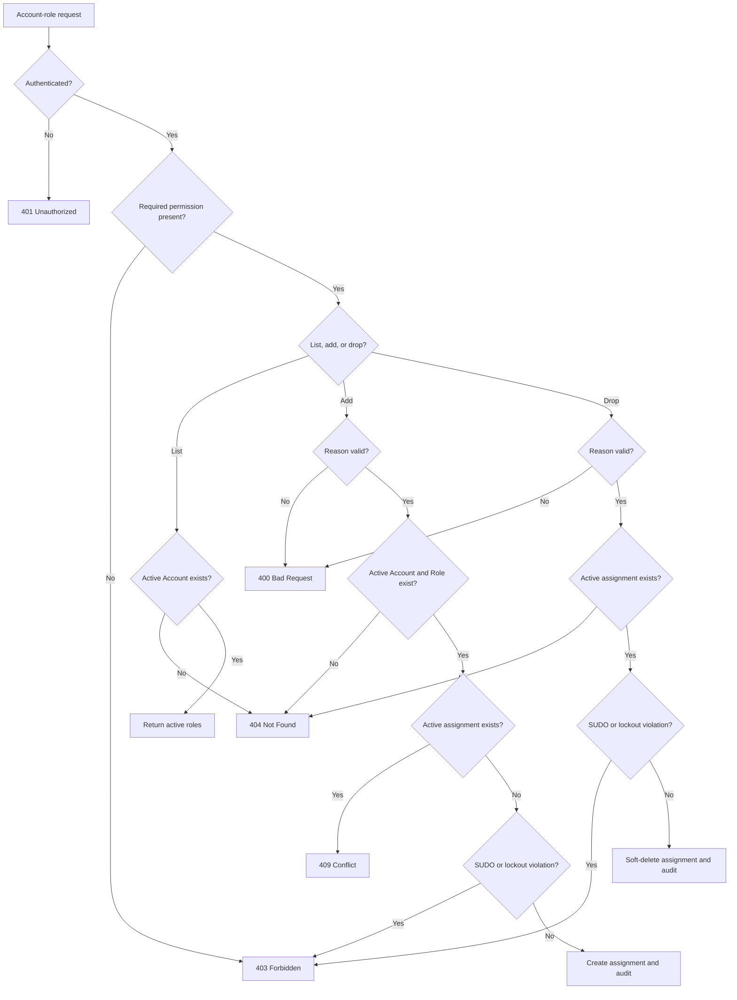

# Requirement: Account Role Management

## Status
Accepted

## Context

GAM needs a protected API for managing the active roles assigned to an Account. The workflow must make security intent explicit, preserve the history of Account-role assignments, and prevent duplicate active assignments or security lockout.

This Requirement Specification was created after the Account-role implementation and tests already existed. Those artifacts were used only as discovery material and conversation prompts. This document defines the intended behavior for the feature.

Roles remain permission bundles; authorization decisions must use permissions rather than role names. The `ACCOUNT_ROLE_MANAGE` permission is part of the RBAC catalog and shall be seeded for the baseline `SUDO` and `COORD` roles, but not for `MEMBER` or `VISITOR`.

## Ubiquitous Language

- `active Account-role assignment`: A non-deleted association between an active Account and an active Role.
- `Account-role collection`: The active roles assigned to one Account, returned as a top-level `roles` list.
- `drop`: The user-facing action that removes an active Account-role assignment while preserving the historical assignment through the technical soft-delete mechanism.

## Functional requirements

### REQ-ACCOUNT-ROLE-001: Protected Account-role API

The system shall expose these routes:

| Method | Route | Required permission | Purpose |
| --- | --- | --- | --- |
| `GET` | `/accounts/{accountId}/roles` | `ACCOUNT_GET` | List the Account's active roles. |
| `POST` | `/accounts/{accountId}/roles` | `ACCOUNT_ROLE_MANAGE` | Add one role to the Account. |
| `PATCH` | `/accounts/{accountId}/roles/{roleId}/drop` | `ACCOUNT_ROLE_MANAGE` | Drop one role from the Account. |

All three routes shall require authentication. An unauthenticated request shall return `401 Unauthorized`. An authenticated caller without the required permission shall return `403 Forbidden`.

The self-view exception for direct Account lookup shall not grant access to the Account-role collection or Account-role mutations.

Rationale:
Account-role changes are security-sensitive mutations and must be separated from ordinary Account reads. The explicit drop action keeps the user-facing contract distinct from the internal soft-delete operation.

Valid examples:
- A caller with `ACCOUNT_GET` lists an Account's active roles.
- A caller with `ACCOUNT_ROLE_MANAGE` adds or drops an ordinary role.

Invalid examples:
- A caller with only self-view access lists another Account's roles.
- A caller is authorized by `hasRole('COORD')` instead of the required permission authority.

---

### REQ-ACCOUNT-ROLE-002: List active Account roles

`GET /accounts/{accountId}/roles` shall return `200 OK` with this shape:

```json
{
  "roles": [
    {
      "id": "<role UUID>",
      "name": "COORD",
      "description": "Coordinator access to GAM operational administration",
      "systemManaged": true
    }
  ]
}
```

The requested Account shall be active. A missing or soft-deleted Account shall return `404 Not Found`.

The response shall include only roles from active Account-role assignments whose Account and Role are active. An Account with no active assignments shall return `{"roles": []}`.

Rationale:
Role visibility must reflect current authorization state while keeping historical and soft-deleted assignments out of ordinary reads.

Valid examples:
- An active Account with `MEMBER` and `COORD` assignments receives both active Role records.
- An active Account with no active assignments receives an empty `roles` list.

Invalid examples:
- An unknown Account returns an empty list instead of `404 Not Found`.
- A dropped assignment appears in the list.

---

### REQ-ACCOUNT-ROLE-003: Add an Account role

`POST /accounts/{accountId}/roles` shall accept:

```json
{
  "roleId": "<role UUID>",
  "reason": "Grant coordinator access for the new responsibility"
}
```

The system shall require an active Account and an active Role. A missing or soft-deleted Account shall return `404 Not Found` for the Account resource. A missing or soft-deleted Role shall return `404 Not Found` for the Role resource.

The system shall reject adding `SUDO` through this API with `403 Forbidden`. SUDO assignment is developer-controlled maintenance behavior.

The system shall reject an existing active Account-role assignment with `409 Conflict` and shall not create a second active assignment or activity-log record.

If an earlier assignment for the same Account and Role was dropped, a later add shall create a new active assignment identity rather than restore or reuse the historical assignment.

On success, the system shall return `201 Created`, identify the created nested assignment through the `Location` response header, and return the created assignment in this shape:

```json
{
  "account": {
    "id": "<account UUID>",
    "email": "account@example.com",
    "displayName": "Account",
    "roles": []
  },
  "role": {
    "id": "<role UUID>",
    "name": "COORD",
    "description": "Coordinator access to GAM operational administration",
    "systemManaged": true
  }
}
```

The response shall not expose passwords, tokens, sessions, soft-delete fields, row audit metadata, or the audit reason.

Rationale:
An Account can hold at most one active assignment for a given Role. Re-adding after a drop must preserve the historical fact that the earlier assignment ended.

Valid examples:
- A Coordinator adds an active custom Role to an Account that does not currently have it.
- A previously dropped `MEMBER` assignment is added again as a new active assignment.

Invalid examples:
- Adding a Role to a missing Account.
- Adding a missing Role.
- Adding a Role that is already actively assigned.
- Adding `SUDO` through the HTTP API.

---

### REQ-ACCOUNT-ROLE-004: Drop an Account role

`PATCH /accounts/{accountId}/roles/{roleId}/drop` shall accept:

```json
{
  "reason": "Remove coordinator access after responsibility change"
}
```

The system shall require an active Account-role assignment for the requested Account and Role. If the Account, Role, or active assignment is missing or soft-deleted, the API shall return `404 Not Found` and shall not mutate data.

The system shall reject dropping `SUDO` through this API with `403 Forbidden`. SUDO removal is developer-controlled maintenance behavior.

On success, the system shall soft-delete the active assignment, return `204 No Content`, and make the assignment absent from subsequent Account-role lists. The historical assignment shall remain available only to developer-controlled maintenance workflows.

Rationale:
Dropping a role changes current authority but must preserve the historical security change for audit and recovery purposes.

Valid examples:
- A caller with `ACCOUNT_ROLE_MANAGE` drops an active custom Role assignment.
- A caller drops an active `COORD` assignment when the lockout-prevention rule permits it.

Invalid examples:
- Dropping a pair that has no active assignment.
- Dropping a soft-deleted assignment through the HTTP API.
- Dropping `SUDO` through the HTTP API.

---

### REQ-ACCOUNT-ROLE-005: Required and bounded audit reason

The `reason` field shall be required for both add and drop requests. The system shall trim leading and trailing whitespace before validation and audit logging.

After trimming, `reason` shall contain between 1 and 2,000 characters. A null, empty, whitespace-only, or over-2,000-character reason shall return `400 Bad Request` before Account or Role loading, data mutation, or activity-event publication.

The maximum is an application-level request limit. The current `activity_logs.reason` database column is `TEXT` and therefore does not define a smaller numeric column limit.

The list operation shall not accept or require a reason.

Rationale:
Security changes require explicit human intent. A bounded reason keeps the API payload and audit entry useful while remaining independent of an unbounded database `TEXT` column.

Valid examples:
- `" Grant access "` is accepted and audited as `"Grant access"`.
- A reason containing exactly 2,000 characters after trimming is accepted.

Invalid examples:
- A missing reason.
- A reason containing only spaces or line breaks.
- A reason containing 2,001 characters after trimming.

---

### REQ-ACCOUNT-ROLE-006: Account-role error semantics

The API shall use these outcomes:

| Condition | Response |
| --- | --- |
| Unauthenticated request | `401 Unauthorized` |
| Authenticated caller lacks the route permission | `403 Forbidden` |
| Missing or soft-deleted Account, Role, or active Account-role assignment | `404 Not Found` |
| Active Account-role assignment already exists during add | `409 Conflict` |
| Invalid reason or other command validation failure | `400 Bad Request` |
| SUDO API mutation or lockout-prevention violation | `403 Forbidden` |

Failed requests shall not create, drop, restore, or audit an Account-role assignment.

Rationale:
Clients need stable distinctions between authentication, authorization, missing resources, duplicate state, and invalid commands.

---

### REQ-ACCOUNT-ROLE-007: Account-role activity audit

A successful direct Account-role add shall emit exactly one `ACCOUNT_ROLE_ADDED` activity event. A successful direct Account-role drop shall emit exactly one `ACCOUNT_ROLE_REMOVED` activity event.

Each event shall capture the actor, Account-role assignment identifier, Account identifier, Role identifier, Role name, trimmed reason, and request metadata according to the activity-audit policy. The business mutation and activity-log row shall commit together.

Failed or forbidden operations shall not emit Account-role activity events. A higher-level workflow such as Member activation or deactivation shall emit its own high-level activity event and shall not emit unrelated duplicate Account-role events for the same workflow.

Rationale:
The audit log records security intent rather than every repository write. One high-level event per direct security action keeps the history meaningful and consistent.

---

### REQ-ACCOUNT-ROLE-008: Lockout prevention

All Account-role mutation workflows shall enforce these protections transactionally:

- HTTP callers shall not add or drop `SUDO`.
- Developer-controlled SUDO maintenance shall not drop the last active Account-role assignment for `SUDO`.
- A Coordinator shall not drop the `COORD` role from their own Account when no other active Account has the `COORD` role.

Violations shall return or raise a forbidden-operation outcome and shall not mutate the assignment.

Rationale:
The system must preserve a developer recovery path and avoid removing the last active Coordinator capability through self-administration.

Valid examples:
- Developer maintenance removes one SUDO assignment while another active SUDO Account remains.
- A Coordinator drops their own COORD role while another active Account still has COORD.

Invalid examples:
- Developer maintenance drops the last active SUDO assignment.
- A Coordinator drops their own COORD role when they are the only active COORD Account.

## Acceptance scenarios

```gherkin
Scenario: Authorized caller lists active Account roles
  Given an active Account has active MEMBER and COORD assignments
  And the caller has the ACCOUNT_GET permission
  When the caller requests GET /accounts/{accountId}/roles
  Then the system returns 200 OK
  And the response contains the active MEMBER and COORD roles

Scenario: Listing an unknown Account returns not found
  Given no active Account exists with the requested identifier
  And the caller has the ACCOUNT_GET permission
  When the caller requests GET /accounts/{accountId}/roles
  Then the system returns 404 Not Found

Scenario: Authorized caller adds an ordinary role
  Given an active Account and active Role exist
  And the Account does not have an active assignment for the Role
  And the caller has the ACCOUNT_ROLE_MANAGE permission
  When the caller posts the Role identifier and a valid reason
  Then the system returns 201 Created
  And the response contains the created Account-role assignment
  And one ACCOUNT_ROLE_ADDED activity event is recorded

Scenario: Duplicate active assignment returns conflict
  Given an Account already has an active assignment for the Role
  And the caller has the ACCOUNT_ROLE_MANAGE permission
  When the caller tries to add the same Role with a valid reason
  Then the system returns 409 Conflict
  And no second active assignment is created
  And no Account-role activity event is recorded

Scenario: Missing Account or Role returns not found during add
  Given the caller has the ACCOUNT_ROLE_MANAGE permission
  When the caller adds a Role for a missing Account or missing Role
  Then the system returns 404 Not Found
  And no assignment is created

Scenario: Missing reason is rejected before mutation
  Given the caller has the ACCOUNT_ROLE_MANAGE permission
  When the caller adds or drops a Role without a nonblank reason
  Then the system returns 400 Bad Request
  And no Account, Role, or assignment is loaded for mutation
  And no activity event is recorded

Scenario: Authorized caller drops an active role
  Given an active Account-role assignment exists
  And the caller has the ACCOUNT_ROLE_MANAGE permission
  When the caller drops the assignment with a valid reason
  Then the system returns 204 No Content
  And the assignment is absent from the Account-role collection
  And one ACCOUNT_ROLE_REMOVED activity event is recorded

Scenario: Missing active assignment returns not found during drop
  Given no active Account-role assignment exists for the requested Account and Role
  And the caller has the ACCOUNT_ROLE_MANAGE permission
  When the caller drops the Role with a valid reason
  Then the system returns 404 Not Found
  And no assignment is mutated

Scenario: HTTP cannot manage SUDO
  Given the caller has the ACCOUNT_ROLE_MANAGE permission
  When the caller tries to add or drop SUDO through the HTTP API
  Then the system returns 403 Forbidden
  And no assignment is mutated

Scenario: Last active SUDO cannot be removed by maintenance
  Given exactly one active Account has the SUDO role
  When developer maintenance tries to drop that SUDO assignment
  Then the system rejects the operation with a forbidden-operation outcome
  And the SUDO assignment remains active

Scenario: Coordinator cannot remove the only COORD capability from self
  Given the caller is a Coordinator
  And the caller's Account has the COORD role
  And no other active Account has the COORD role
  When the caller drops COORD from their own Account
  Then the system rejects the operation with a forbidden-operation outcome
  And the COORD assignment remains active
```

## Diagrams



## Open questions

* What display label and description should the RBAC catalog use for `ACCOUNT_ROLE_MANAGE`?
* Should a future API expose direct `GET /accounts/{accountId}/roles/{roleId}` lookup, or is collection listing sufficient?
* Should the Account-role collection define a stable ordering for its roles?

## Out of scope

* Role creation, editing, disabling, deletion, or restoration.
* Permission creation, editing, disabling, deletion, or restoration.
* Role-permission assignment and removal.
* Reading activity logs or developer-only soft-deleted assignments through HTTP.
* Account registration, authentication, deactivation, restoration, or deletion.
* Account search, role search, pagination, and filtering.
* A direct Account-role lookup endpoint beyond the required list, add, and drop routes.
* Backward-compatibility aliases or migration paths for unreleased permission names.

## Related ADRs

* None at this time.

## Related requirements

* [RBAC Catalog](rbac-catalog.md)
* [Account Records](../accounts/account-records.md)

## Related videos

* None.
