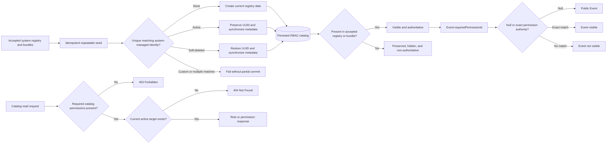

# Requirement: RBAC Catalog

## Status
Accepted

## Context

GAM needs a documented contract for the role and permission catalog that supports permission-based authorization, event visibility, and authorization administration.

The role, permission, and role-permission persistence model already exists. The current implementation and tests predate the Requirement Specification workflow and were used only as discovery material. This document records the intended behavior agreed during planning; it is not a description of implementation details.

This Requirement Specification is the accepted contract for the current permission registry and baseline role-permission bundles. Future registry or bundle changes require an explicit update to this specification; adding a permission to the code registry alone shall not expand the `COORD` bundle.

## Ubiquitous Language

- `system role`: A role defined by the application registry and synchronized as a `systemManaged` role.
- `system permission`: A capability defined by the application permission registry and synchronized as a `systemManaged` permission.
- `role-permission link`: An active association granting one permission to one role.
- `catalog read`: A read of a role, a permission, or the permissions linked to a role.
- `audience-tier permission`: An event-view permission whose code identifies the minimum intended audience tier, such as `EVENT_GET_MEMBER` or `EVENT_GET_COORD`.
- `public event`: An Event whose `requiredPermissionId` is null.
- `restricted event`: An Event whose `requiredPermissionId` references a permission; visibility requires that exact permission authority.
- `stale registry record`: A persisted system-managed Role or Permission whose stable role name or permission code is absent from the current accepted registry.
- `stale registry link`: A persisted role-permission link that involves a stale registry record or is absent from the current accepted bundle for a system role.
- `registry collision`: More than one persisted record with the same registry key, or a system registry key already used by a custom record.

## Functional requirements

### REQ-RBAC-001: Baseline system roles

The RBAC catalog shall define these baseline system role codes:

| Role code | Intended capability |
| --- | --- |
| `SUDO` | Developer-controlled unrestricted system access. |
| `COORD` | Coordinator access to GAM operational administration. |
| `MEMBER` | Standard authenticated member access. |
| `VISITOR` | No baseline permission; public visibility is represented by a null event `requiredPermissionId`. |

System roles shall be permission bundles. Roles shall not be used as authorization authorities directly.

Rationale:
The application authorizes capabilities through permissions while retaining named role bundles for administration and assignment.

Valid examples:
- An Account with `COORD` receives the permissions seeded for `COORD`.
- An event with no required permission is public even though the `VISITOR` role has no permissions.

Invalid examples:
- An endpoint authorizes an Account with `hasRole('COORD')` instead of checking a permission.
- A `VISITOR` role is treated as an implicit permission authority for anonymous requests.

---

### REQ-RBAC-002: Code-defined system permission registry

The RBAC catalog shall maintain a code-defined registry of system permissions. The accepted registry is:

| Area | Permission codes |
| --- | --- |
| Members | `MEMBER_GET`, `MEMBER_SEARCH`, `MEMBER_ACTIVATION`, `MEMBER_GET_NON_ACTIVE`, `MEMBER_MANAGE` |
| Accounts | `ACCOUNT_GET`, `ACCOUNT_SEARCH`, `ACCOUNT_ROLE_MANAGE` |
| Events | `EVENT_CREATE`, `EVENT_SEARCH`, `EVENT_GET_PRESENCES`, `EVENT_GET_MEMBER`, `EVENT_GET_COORD`, `EVENT_MANAGE` |
| GamLocations | `GAM_LOCATION_GET`, `GAM_LOCATION_CREATE`, `GAM_LOCATION_MANAGE` |
| Presences | `PRESENCES_SEARCH`, `PRESENCE_REGISTER`, `PRESENCE_EDIT`, `PRESENCE_REMOVE` |
| RBAC catalog | `ROLE_GET`, `PERMISSION_GET` |

Each system permission shall have a stable machine `code`, a human-readable `label`, and a `description`. Permission codes shall not be renamed after this Requirement Specification is accepted.

`EVENT_GET_VISITOR` is not part of the baseline because a null `requiredPermissionId` already represents public event visibility.

The accepted display metadata for every system permission is:

| Permission code | Label | Description |
| --- | --- | --- |
| `MEMBER_GET` | `View members` | `Allows viewing active members` |
| `MEMBER_SEARCH` | `Search members` | `Allows searching members` |
| `MEMBER_ACTIVATION` | `Activate members` | `Allows activating and deactivating members` |
| `MEMBER_GET_NON_ACTIVE` | `View inactive members` | `Allows viewing non-active members` |
| `MEMBER_MANAGE` | `Manage members` | `Allows managing members` |
| `ACCOUNT_GET` | `View accounts` | `Allows viewing accounts` |
| `ACCOUNT_SEARCH` | `Search accounts` | `Allows searching accounts` |
| `ACCOUNT_ROLE_MANAGE` | `Manage account roles` | `Allows adding and removing account roles` |
| `EVENT_CREATE` | `Create events` | `Allows creating events` |
| `EVENT_SEARCH` | `Search events` | `Allows searching events` |
| `EVENT_GET_PRESENCES` | `View event presences` | `Allows viewing presences for an event` |
| `EVENT_GET_MEMBER` | `View member events` | `Allows viewing events requiring member access` |
| `EVENT_GET_COORD` | `View coordinator events` | `Allows viewing events requiring coordinator access` |
| `EVENT_MANAGE` | `Manage events` | `Allows managing events` |
| `GAM_LOCATION_GET` | `View GAM locations` | `Allows directly viewing active GamLocation records` |
| `GAM_LOCATION_CREATE` | `Create GAM locations` | `Allows creating GamLocation records` |
| `GAM_LOCATION_MANAGE` | `Manage GAM locations` | `Allows updating and removing GamLocation records` |
| `PRESENCES_SEARCH` | `Search presences` | `Allows searching presences` |
| `PRESENCE_REGISTER` | `Register presences` | `Allows recording Member attendance at Events` |
| `PRESENCE_EDIT` | `Edit presences` | `Allows editing observations on Member attendance records` |
| `PRESENCE_REMOVE` | `Remove presences` | `Allows removing mistaken Member attendance records` |
| `ROLE_GET` | `View roles` | `Allows reading role catalog entries` |
| `PERMISSION_GET` | `View permissions` | `Allows reading permission catalog entries` |

Any addition, removal, or metadata change shall update this registry, the role-permission matrix, and the seeding contract in the same change.

Rationale:
Authorization code and event permission references require stable capability identifiers, while labels and descriptions may be synchronized display metadata.

Valid examples:
- An event references `EVENT_GET_MEMBER` through its permission identifier.
- A client displays a permission using its `label` and `description` without using those fields for authorization.

Invalid examples:
- Renaming a permission code while existing authorization checks still use the old code.
- Creating an administrator-defined custom permission.

---

### REQ-RBAC-003: Baseline role-permission bundles

The current baseline shall seed these active permission bundles:

| Role | Permissions |
| --- | --- |
| `SUDO` | Every permission in the accepted system permission registry. |
| `COORD` | `MEMBER_GET`, `MEMBER_SEARCH`, `MEMBER_ACTIVATION`, `MEMBER_GET_NON_ACTIVE`, `MEMBER_MANAGE`, `ACCOUNT_GET`, `ACCOUNT_SEARCH`, `ACCOUNT_ROLE_MANAGE`, `EVENT_CREATE`, `EVENT_SEARCH`, `EVENT_GET_PRESENCES`, `EVENT_GET_MEMBER`, `EVENT_GET_COORD`, `EVENT_MANAGE`, `GAM_LOCATION_GET`, `GAM_LOCATION_CREATE`, `GAM_LOCATION_MANAGE`, `PRESENCES_SEARCH`, `PRESENCE_REGISTER`, `PRESENCE_EDIT`, `PRESENCE_REMOVE`, `ROLE_GET`, and `PERMISSION_GET`. |
| `MEMBER` | `MEMBER_GET`, `ACCOUNT_GET`, `EVENT_SEARCH`, `EVENT_GET_PRESENCES`, `EVENT_GET_MEMBER`, and `GAM_LOCATION_GET`. |
| `VISITOR` | No permissions. |

`SUDO` shall receive a newly accepted system permission automatically. `COORD` shall receive only the permissions explicitly listed above; a future permission shall not be added to `COORD` unless this requirement is deliberately updated. `ACCOUNT_ROLE_MANAGE` is explicitly included in `COORD` and is not included in `MEMBER` or `VISITOR`.

The cumulative event-view behavior shall be produced by seeded links, not by runtime role inheritance:

- An event requiring `EVENT_GET_MEMBER` is visible to Accounts with `EVENT_GET_MEMBER`, including baseline `MEMBER`, `COORD`, and `SUDO` Accounts.
- An event requiring `EVENT_GET_COORD` is visible to Accounts with `EVENT_GET_COORD`, including baseline `COORD` and `SUDO` Accounts.
- An Account or custom role that receives one of these permissions directly follows the same exact-permission rule.

Rationale:
Permission links make the minimum audience explicit while preserving the project rule that authorization is permission-based.

Valid examples:
- A `COORD` Account can view an event requiring `EVENT_GET_MEMBER` or `EVENT_GET_COORD`.
- A `MEMBER` Account can view an event requiring `EVENT_GET_MEMBER` but not one requiring only `EVENT_GET_COORD`.

Invalid examples:
- A `MEMBER` Account can view a coordinator-only event merely because the Account is authenticated.
- A `VISITOR` Account receives an event-view permission through an implicit role hierarchy.

---

### REQ-RBAC-004: Repeatable registry seeding

The system shall synchronize the code-defined system role and permission registry through an idempotent repeatable seed.

The seed shall:

- create missing system roles and permissions;
- match registry records by stable role name or permission code across both active and soft-deleted rows;
- preserve the identifier of a unique matching system-managed record;
- restore a unique soft-deleted system-managed match when its registry entry reappears;
- reject a registry collision without converting, deleting, or overwriting the conflicting record;
- mark newly created registry-owned roles and permissions as `systemManaged`;
- synchronize role descriptions, permission labels, and permission descriptions;
- create each missing active role-permission link exactly once or restore its unique soft-deleted registry-owned link when the bundle entry reappears; and
- seed the bundles defined by `REQ-RBAC-003`.

Running the seed repeatedly with the same registry shall not create duplicate roles, permissions, or active role-permission links. A matching custom record, whether active or soft-deleted, shall be treated as a registry collision. Multiple persisted matches for one registry key or bundle pair shall also be treated as a registry collision. A collision shall fail synchronization before any partial catalog mutation commits.

Rationale:
System roles and permissions are required security data. Repeatable synchronization must repair missing registry data without changing identifiers referenced by Accounts, Events, or other persisted records.

Valid examples:
- A missing `ROLE_GET` permission is created on the next seed run.
- A changed permission description is synchronized without replacing the permission identifier.
- Running the seed twice leaves one active link for a role-permission pair.

Invalid examples:
- A seed run creates a second active permission with the same code.
- A seed run replaces an existing permission identifier referenced by an Event.

---

### REQ-RBAC-005: Non-destructive registry changes

Removing a role, permission, or role-permission link from the code registry shall not automatically delete or soft-delete the existing database record or link.

The removed record or link shall become stale immediately and shall no longer be authoritative. Stale registry data shall:

- contribute no permission authority to an Account security context;
- be unavailable for new Account-role, role-permission, or Event-permission configuration;
- be excluded from ordinary role, permission, and role-permission catalog reads; and
- remain persisted only to preserve identity, references, and history until an explicit developer-controlled cleanup action is performed.

An active custom Role linked to a stale system Permission shall not grant that Permission. An Account assigned a stale system Role shall receive no authority from that Role. An active persisted link omitted from the accepted bundle of a system Role shall not grant the omitted Permission through that system Role.

An existing Event reference to a Permission that becomes stale shall remain persisted for referential integrity, but no caller shall satisfy the restriction through that stale Permission. The Event shall remain fail-closed until an explicit developer-controlled action replaces or clears the reference under an accepted Event lifecycle requirement.

If a stale registry entry or link later reappears in the accepted registry or bundle, repeatable seeding shall reuse the unique preserved system-managed identity, restore it when soft-deleted, synchronize its metadata, and make it authoritative again. A custom/system-managed collision shall never be resolved by converting the custom record.

Removal, conversion, or permanent cleanup of preserved registry data shall require an explicit developer-controlled maintenance action.

Because GAM is pre-production, registry changes shall be applied directly to the current schema setup, development fixtures, test fixtures, and local database setup. No versioned production migration, compatibility alias, fallback, dual-read path, or dual-write path shall be introduced solely to preserve unreleased behavior.

The repeatable seed shall seed only the current accepted registry and its bundles. The current source tree, schema setup, development fixtures, test fixtures, and newly initialized databases shall contain only current registry codes and references. Existing preserved stale rows are permitted only under the fail-closed behavior above.

Rationale:
Automatic security-data deletion during repeatable seeding could invalidate Event references, Account assignments, or administrative recovery paths.

Valid examples:
- Removing a permission from the registry immediately stops it from granting authority while preserving its row for explicit cleanup or later reappearance.
- Reintroducing a previously removed system permission reuses its preserved UUID and synchronizes its accepted metadata.
- Replacing an event-view permission updates the current code, schema setup, development fixtures, and test fixtures directly.

Invalid examples:
- Application startup silently deletes a permission because its enum value was removed.
- A repeatable seed removes a role-permission link solely because the registry mapping changed.
- A stale permission continues to authorize an endpoint because its database row or custom-role link remains active.
- A compatibility alias or fallback preserves an unreleased permission code.

---

### REQ-RBAC-006: Direct role catalog read

The system shall expose `GET /roles/{roleId}` for an authenticated caller with the `ROLE_GET` permission.

The endpoint shall read any current active system Role or active custom Role and return its role record.

Missing, soft-deleted, and stale system Roles shall not be returned through this endpoint.

Rationale:
Authorization administration needs to inspect both seeded roles and custom roles without exposing deleted configuration through ordinary API reads.

Valid examples:
- A caller with `ROLE_GET` reads an active `COORD` role.
- A caller with `ROLE_GET` reads an active custom role and receives `systemManaged: false`.

Invalid examples:
- A caller without `ROLE_GET` reads a role because the caller has another permission.
- The endpoint returns a soft-deleted role.
- The endpoint returns a stale system Role that is absent from the accepted registry.

---

### REQ-RBAC-007: Direct permission catalog read

The system shall expose `GET /permissions/{permissionId}` for an authenticated caller with the `PERMISSION_GET` permission.

The endpoint shall return any current active system Permission record, including its stable code and display metadata. System permission definitions remain owned by the accepted RBAC registry and implemented by the code-defined registry. Custom permission creation and editing are not supported by this Requirement Specification. Removed permission definitions follow the fail-closed lifecycle in `REQ-RBAC-005`.

Missing, soft-deleted, and stale permissions shall not be returned through this endpoint.

Rationale:
Clients need to resolve permission metadata for authorization administration and Event configuration. System permission definitions remain owned by the code registry, while this catalog read does not add permission creation or editing capabilities.

Valid examples:
- A caller with `PERMISSION_GET` reads `EVENT_GET_COORD`.
- A caller with `PERMISSION_GET` reads a permission and receives its `systemManaged` value.

Invalid examples:
- A caller without `PERMISSION_GET` reads a permission because the caller has `ROLE_GET` only.
- The endpoint exposes a soft-deleted permission as an active catalog entry.
- The endpoint exposes a stale Permission because its preserved database row remains active.

---

### REQ-RBAC-008: Role permission catalog read

The system shall expose `GET /roles/{roleId}/permissions` for an authenticated caller with both `ROLE_GET` and `PERMISSION_GET`.

The endpoint shall accept an active system or custom Role and return its active permissions in this shape:

```json
{
  "permissions": [
    {
      "id": "<permission UUID>",
      "code": "EVENT_GET_MEMBER",
      "label": "View member events",
      "description": "Allows viewing events requiring member access",
      "systemManaged": true
    }
  ]
}
```

The response shall exclude soft-deleted or stale role-permission links and soft-deleted or stale permissions. An active Role with no current authoritative permission links shall return an empty `permissions` list.

Rationale:
The nested route exposes both the role relationship and permission records, so both catalog-read permissions are required.

Valid examples:
- A caller with both catalog permissions reads a custom role and receives its active permissions.
- A role with no active links returns `{ "permissions": [] }`.

Invalid examples:
- A caller with only `ROLE_GET` reads the nested permission list.
- The response returns a nested wrapper such as `{ "permissions": { "permissions": [] } }`.

---

### REQ-RBAC-009: Catalog authorization and visibility responses

All RBAC catalog endpoints shall require authentication.

The system shall return:

- `401 Unauthorized` when the caller is unauthenticated;
- `403 Forbidden` when the caller is authenticated but lacks the required catalog permission or permissions; and
- `404 Not Found` when the requested Role, Permission, or parent Role is missing, soft-deleted, or stale.

The API shall not expose soft-deleted catalog records through ordinary HTTP reads.

Rationale:
Catalog reads are protected configuration reads. Missing resources are not visible through ordinary application reads, while an authenticated caller lacking the required capability has a forbidden action.

---

### REQ-RBAC-010: Catalog response contract

Direct Role responses shall contain exactly the catalog-facing fields needed by this Requirement Specification:

```json
{
  "id": "<role UUID>",
  "name": "COORD",
  "description": "Coordinator access to GAM operational administration",
  "systemManaged": true
}
```

Direct Permission responses and permission entries in a role-permission response shall contain:

```json
{
  "id": "<permission UUID>",
  "code": "PERMISSION_GET",
  "label": "View permissions",
  "description": "Allows reading permission catalog entries",
  "systemManaged": true
}
```

Catalog responses shall not expose passwords, tokens, authentication sessions, soft-delete fields, or row audit metadata.

Rationale:
Catalog clients need stable identifiers, authorization codes, display metadata, and system/custom visibility without receiving persistence or security-internal data.

---

### REQ-RBAC-011: Event permission references

The RBAC catalog shall provide `EVENT_GET_MEMBER` and `EVENT_GET_COORD` as permissions that an Event may reference through its nullable `requiredPermissionId` relationship.

Event visibility shall follow these rules:

- `requiredPermissionId = null` means the Event is public;
- a non-null `requiredPermissionId` means the caller must hold the exact permission identified by that relationship; and
- the role name of the caller shall not substitute for the required permission.

`EVENT_GET_VISITOR` is not required. An Event shall reference only `EVENT_GET_MEMBER` or `EVENT_GET_COORD`; no other current or future registry permission is an allowed Event audience permission unless this requirement is explicitly updated.

The Event creation and editing Requirement Specification shall define request validation and lifecycle behavior for the nullable `requiredPermissionId` field.

Rationale:
Event restrictions are declared per Event. The permission code identifies the required capability; it does not globally classify every restricted Event.

Valid examples:
- An Event with no required permission is visible to an anonymous caller.
- An Event referencing the `EVENT_GET_MEMBER` permission is visible to a `MEMBER`, `COORD`, or `SUDO` Account under the baseline bundles.
- An Event referencing `EVENT_GET_COORD` is visible to a `COORD` or `SUDO` Account under the baseline bundles.

Invalid examples:
- Every restricted Event requires one global `EVENT_GET` permission.
- An Event references a Role identifier instead of a Permission identifier.
- An Event references `ACCOUNT_ROLE_MANAGE` or another non-audience permission.
- A caller with `EVENT_GET_MEMBER` views an Event requiring `EVENT_GET_COORD`.

## Acceptance scenarios

```gherkin
Scenario: Repeatable seeding creates the current RBAC catalog
  Given the current system role and permission registry is configured
  When the repeatable RBAC seed runs
  Then the four baseline system roles exist as system-managed roles
  And the current system permission registry exists as system-managed permissions
  And the baseline role-permission bundles are present

Scenario: Repeatable seeding is idempotent
  Given the RBAC catalog has already been seeded
  When the repeatable RBAC seed runs again without registry changes
  Then no duplicate role, permission, or active role-permission link is created

Scenario: Future permission does not automatically expand COORD authority
  Given a new system permission has been accepted into the permission registry
  And REQ-RBAC-003 has not added that permission to the COORD allowlist
  When the repeatable RBAC seed runs
  Then SUDO receives the new permission
  And COORD does not receive the new permission

Scenario: Baseline Coordinator receives Presence mutation permissions
  Given PRESENCE_REGISTER, PRESENCE_EDIT, and PRESENCE_REMOVE are in the accepted permission registry
  When the repeatable RBAC seed synchronizes the baseline COORD bundle
  Then COORD receives all three Presence mutation permissions
  And MEMBER and VISITOR receive none of them through their baseline bundles

Scenario: Stale registry data is fail-closed
  Given a persisted system Permission or system-role bundle link is absent from the accepted registry
  When an Account authenticates or an authorized caller reads the ordinary RBAC catalog
  Then the stale data grants no permission authority
  And the stale data is absent from the ordinary catalog response

Scenario: Event with a stale permission reference remains restricted
  Given an existing Event references a Permission that is now stale
  When any caller attempts to view the Event through that stale permission
  Then the stale Permission does not authorize the caller
  And the persisted Event reference is not removed automatically

Scenario: Reappearing system permission preserves identity
  Given one preserved system-managed Permission matches a permission reintroduced to the accepted registry
  When the repeatable RBAC seed runs
  Then the Permission keeps its preserved UUID
  And its accepted metadata and authority are restored

Scenario: Soft-deleted system registry match is restored
  Given one soft-deleted system-managed Permission matches a current accepted registry code
  When the repeatable RBAC seed runs
  Then the matching Permission is restored with its existing UUID
  And no second Permission is created for that code

Scenario: Custom registry-key collision fails synchronization
  Given a custom Role or Permission uses a stable key owned by the accepted system registry
  When the repeatable RBAC seed runs
  Then synchronization fails without converting the custom record
  And no partial catalog mutation commits

Scenario: Account with COORD receives cumulative event-view permissions
  Given an Account has the baseline COORD role
  When the Account attempts to read Events
  Then the Account can read an Event requiring EVENT_GET_MEMBER
  And the Account can read an Event requiring EVENT_GET_COORD

Scenario: Member cannot read a coordinator-only Event
  Given an Account has the baseline MEMBER role
  And an Event requires EVENT_GET_COORD
  When the Account reads the Event
  Then the Event is not visible to the Account

Scenario: Public Event has no required permission
  Given an Event has a null requiredPermissionId
  When an anonymous caller reads the Event
  Then the Event is visible to the caller

Scenario: Event rejects a non-audience permission
  Given ACCOUNT_ROLE_MANAGE is an active system Permission
  When an Event command supplies ACCOUNT_ROLE_MANAGE as requiredPermissionId
  Then the command is rejected as invalid

Scenario: Authorized caller reads an active custom Role
  Given an active custom Role exists
  And the caller has ROLE_GET and PERMISSION_GET
  When the caller requests GET /roles/{roleId}
  Then the system returns the custom Role record
  And the response contains systemManaged: false

Scenario: Catalog read requires its dedicated permission
  Given the caller is authenticated
  And the caller lacks PERMISSION_GET
  When the caller requests GET /permissions/{permissionId}
  Then the system returns 403 Forbidden

Scenario: Nested catalog read requires both permissions
  Given an active Role has active permission links
  And the caller has ROLE_GET and PERMISSION_GET
  When the caller requests GET /roles/{roleId}/permissions
  Then the system returns the active permission records in a top-level permissions list

Scenario: Missing, soft-deleted, or stale catalog data is not visible
  Given the requested Role, Permission, or parent Role is missing, soft-deleted, or stale
  When an authorized caller requests the corresponding catalog endpoint
  Then the system returns 404 Not Found
```

## Diagrams



## Open questions

* None.

## Out of scope

* Role creation, editing, disabling, deletion, or restoration.
* Permission creation, editing, disabling, deletion, or restoration.
* Collection, search, or pagination endpoints for roles or permissions.
* Event creation, editing, cancellation, and request validation beyond the permission-reference contract in `REQ-RBAC-011`.
* Tier-ordering rules for future custom-role administration workflows.
* Reading soft-deleted records through HTTP.
* Row audit metadata and activity-log reads.
* Backward-compatibility migrations, aliases, and fallback paths for removed registry entries.

## Related ADRs

* [ADR-0003: Keep stale RBAC registry data fail-closed](../../decisions/0003-keep-stale-rbac-registry-data-fail-closed.md)

## Related requirements

* [Member Event Presences](../presences/member-event-presences.md)

## Related videos

* None.
