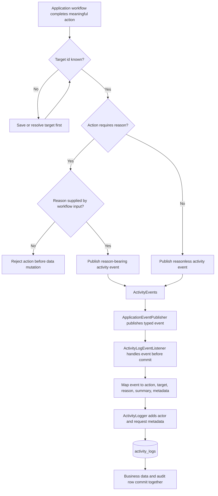

# Activity Audit Log Guidelines

## 1. Purpose

This document defines the custom activity-log policy for `gam-api`.

While Spring Data JPA Auditing manages low-level row metadata (`createdAt`, `updatedBy`, `deletedAt`), the custom activity log is strictly responsible for capturing **business and security intent**: *who performed which action, against which target, for which reason, and with what relevant context.*

## 2. Core Architecture Rules

### 2.1. Audit User Intent, Not Database Writes

Activity logs are initiated from application workflows, never from repositories. Workflows publish explicit activity events that represent meaningful business actions.

When a single workflow causes multiple database writes, it must emit **one high-level activity event**.

* **Correct:** Emitting a single `MEMBER_ACTIVATED` event, placing the resulting account role changes (e.g., `roleAdded: MEMBER`) inside the JSON `metadata`.
* **Forbidden:** Emitting a `MEMBER_UPDATED` event immediately followed by unrelated `ACCOUNT_ROLE_ADDED` and `ACCOUNT_ROLE_REMOVED` events for the same activation workflow.

### 2.2. Event-Driven Execution Flow

Activity logging operates synchronously within the business transaction to ensure consistency.

1. **Workflow:** Validates inputs (including the `reason` if required) and publishes a typed activity event via an internal publisher (e.g., `ActivityEvents`).
2. **Listener:** A `@TransactionalEventListener(phase = TransactionPhase.BEFORE_COMMIT)` catches the event.
3. **Logger:** The `ActivityLogger` enriches the event with HTTP request metadata (actor ID, IP address, User-Agent) and persists the row.
4. **Commit:** The business data and the audit row commit together.

### 2.3. Neutral Action Naming & Data Safety

Action names must be stable, neutral strings or enums that describe *what* happened, not *why* it happened. The *why* is handled by the `reason` and `metadata` fields.

* **Valid:** `PRESENCE_REMOVED`, `EVENT_DELETED`.
* **Forbidden:** `PRESENCE_REMOVED_AS_MISTAKE`.

**Data Safety:** The activity log must be append-only. Administrators cannot edit or delete logs. The `metadata` JSON payload must **never** contain sensitive data such as passwords, JWTs, refresh tokens, or unnecessary PII.

---

## 3. The Reason Policy

Not every activity event requires an explicit reason. A `null` reason is perfectly valid for routine workflows whose purpose is self-evident. However, a non-null reason is **strictly required** when an action is corrective, destructive, security-sensitive, or executed outside the normal public API.

When a reason is required, it must be supplied by the user via the HTTP request payload; the system must never invent a reason.

### Reason Requirement Matrix

| Action Category                     | Reason Requirement | Examples                                                       | Rationale                                                                                      |
|-------------------------------------|--------------------|----------------------------------------------------------------|------------------------------------------------------------------------------------------------|
| **Routine Creations & Transitions** | `null` (Optional)  | `EVENT_CREATED`, `PRESENCE_REGISTERED`                          | The intent is fully represented by the action name and the payload metadata.                   |
| **Member Registration & Activation** | **Required**      | `MEMBER_REGISTERED`, `MEMBERSHIP_SOLICITATION_APPROVED`, `MEMBER_ACTIVATED` | Establishing active membership also synchronizes authorization-facing lifecycle roles and requires explicit Coordinator intent. |
| **Deactivations & Removals**        | **Required**       | `MEMBER_DEACTIVATED`, `MEMBERSHIP_SOLICITATION_REJECTED`, `PRESENCE_REMOVED`, `EVENT_DELETED` | Removing active participation, rejecting a membership request, or removing historical facts requires explicit justification. |
| **Security & RBAC Changes**         | **Required**       | `ACCOUNT_ROLE_ADDED`, `COORDINATOR_GRANTED`, `COORDINATOR_REVOKED`, `PERMISSION_DELETED` | Direct modifications to system authority or access control must be audited with intent.        |
| **Developer Maintenance**           | **Required**       | `DEVELOPER_RESTORE_EXECUTED`, `DEVELOPER_HARD_DELETE_EXECUTED` | Exceptional operations performed via CLI bypass normal rules and demand strict accountability. |

An owning Requirement Specification may impose a stricter reason rule than the general category. The Member requirements require a normalized reason for direct registration, solicitation approval or rejection, reactivation, and deactivation. A membership-solicitation submission stores the applicant's justification on the solicitation record; its `MEMBERSHIP_SOLICITATION_SUBMITTED` activity event uses a null activity reason and does not duplicate the justification as audit metadata.

---

## 4. Audited vs. Non-Audited Scope

The system focuses on high-value business and security events to prevent log bloat.

### 4.1. In-Scope for Auditing

The following domains emit activity events upon creation, modification, or removal/deactivation:

* **Identity & People:** `Account`, `Member`, membership solicitation, `Oratoriano`.
* **Operations:** `Event`, `Missa`, `Oratorio`, `Presence`, `GamLocation`.
* **Security:** `Role`, `Permission`, `AccountRole`, `RolePermission`.

### 4.2. Strictly Out-of-Scope (Do Not Audit)

Do not emit activity logs for the following:

* Normal `GET` requests, searches, or list endpoints.
* Authentication and session flows (Login success/failure, logout, refresh token rotation).
* Internal loader or helper method executions.
* Validation failures (DTO `@Valid` rejections).
