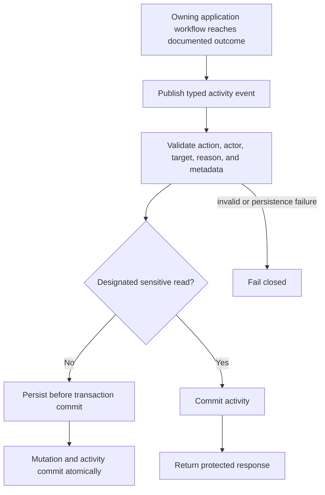

# Activity Audit Log Guidelines

## 1. Purpose and source of truth

This document provides implementation guidance for GAM activity logging.

The normative cross-domain behavior is defined by the [Activity Audit Log Requirement Specification](../requirements/platform/activity-audit-log.md). Owning feature Requirement Specifications define their workflow triggers, action-to-target assignments, reason modes, and exact metadata schemas. This guideline shall not independently add actions, targets, reason rules, or metadata fields.

Spring Data JPA auditing remains responsible for low-level row audit metadata. Activity entries record meaningful business and security intent.

## 2. Application-owned activity events

### 2.1. Publish intent from the owning workflow

Application workflows shall publish explicit typed activity events after they have validated and produced the documented meaningful outcome. Repositories, JPA callbacks, generic entity listeners, loaders, and helper methods shall not infer business activities from row changes.

When one high-level workflow changes multiple rows, publish the one high-level activity required by its owner. Do not duplicate internal lifecycle-owned Role or relationship changes as unrelated lower-level activities.

Examples:

- Member activation publishes `MEMBER_ACTIVATED`; its internal lifecycle Role synchronization does not also publish generic Account-role activities.
- A normalized no-op publishes nothing.
- A failed authorization or validation publishes nothing.

### 2.2. Keep activity persistence synchronous

For state-changing workflows, handle and persist the activity synchronously in the business transaction. A `@TransactionalEventListener(phase = TransactionPhase.BEFORE_COMMIT)` or an equivalently atomic application mechanism is appropriate.

The listener shall validate the registered action, actor form, target form, reason policy, and closed metadata schema before persistence. Failure shall propagate so the business mutation rolls back.

For a designated sensitive read, persist its activity before returning protected form details, generated documents, or attachment bytes. Do not use an after-response or best-effort audit path for those reads.

```mermaid
flowchart TD
    Workflow["Owning application workflow reaches documented outcome"] --> Event["Publish typed activity event"]
    Event --> Validate["Validate action, actor, target, reason, and metadata"]
    Validate --> Sensitive{"Designated sensitive read?"}
    Sensitive -- "No" --> BeforeCommit["Persist before transaction commit"]
    BeforeCommit --> Atomic["Mutation and activity commit atomically"]
    Sensitive -- "Yes" --> CommitRead["Commit activity"]
    CommitRead --> Disclose["Return protected response"]
    Validate -->|invalid or persistence failure| Fail["Fail closed"]
```

## 3. Typed envelope

### 3.1. Closed action and target identifiers

Represent actions and target types with closed application types backed by the registries in the Activity Audit Log Requirement Specification. Unknown database values shall fail visibly rather than map to a generic fallback.

Use stable, neutral action names that state what happened. Put the documented explanation in `reason`; do not encode the reason in the action name.

- Valid: `PRESENCE_REMOVED`, `EVENT_DELETED`.
- Invalid: `PRESENCE_REMOVED_AS_MISTAKE`.

Do not add an enum constant until the registry and owning feature requirement are updated.

### 3.2. Actor as a discriminated form

Resolve actors only from trusted server-side context:

- authenticated security context for `ACCOUNT`;
- no identifier for `ANONYMOUS`;
- configured execution context for `SYSTEM`; and
- explicitly established maintenance context for `DEVELOPER`.

Do not take `actorAccountId` or `actorReference` from a request DTO, reason, metadata, or untrusted header. Model the four forms so invalid combinations cannot be constructed accidentally.

An activity's recorded Account UUID is historical data, not an ordinary relationship that requires the Account row to remain present.

### 3.3. Target as a discriminated form

Model resource and scope targets explicitly.

- A resource target contains a registered domain target type and real resource UUID.
- A scope target contains a registered domain target type and owner-defined stable scope reference.

Do not create placeholder UUIDs or generic `MAINTENANCE_RECORD` targets. Developer restoration and hard deletion identify the actual resource. Developer deleted-record inspection identifies the actual domain resource type and a scope.

Feature owners, not this guideline, decide which form and target type an action uses.

## 4. Reason handling

Expose the four cross-domain reason modes in one reusable policy type:

- `NONE`;
- `OPTIONAL`;
- `REQUIRED`; and
- `CONDITIONAL`.

The action's owning feature requirement assigns the mode and, for `CONDITIONAL`, supplies the condition. Do not derive reason policy from naming conventions such as `_DELETED`.

Normalize every supplied reason once by trimming surrounding Unicode whitespace and measuring 1 through 2,000 Unicode code points. Reuse that normalized value when the workflow also stores it in domain state.

Do not invent fallback reasons.

## 5. Metadata safety

Implement an action-specific typed metadata value or schema validator. Serialize only documented keys. Avoid accepting a generic `Map<String, Object>` from feature or web input as the persisted contract.

Metadata may contain owner-approved identifiers, catalog codes, enum states, changed-field names, booleans, and counts.

Treat user-authored text as default-denied. Implement a text snapshot only when the owning Requirement Specification defines its exact key, historical purpose, normalized source-domain field, maximum length, non-sensitive classification, and append-only snapshot semantics. Copy the normalized domain value; do not accept a second audit-only text input. Prefer names such as `eventTitleAtTimeOfAction` that cannot be mistaken for current state.

Do not use this exception for secrets, binary data, full snapshots, sensitive personal text, arbitrary commentary, or copies of top-level fields.

In particular:

- do not copy Presence observation values;
- do not copy form answers, signed attachments, or personal profile values; and
- do not put reasons, justifications, or general-purpose notes into metadata.

Event titles, GamLocation names, Role names, and comparable display text shall remain excluded unless their owning Requirement Specification explicitly approves a bounded `AtTimeOfAction` snapshot. Permission in the platform requirement alone does not opt a feature into storing text.

An empty metadata object is preferred when action, target, actor, and reason already explain the outcome.

## 6. Request correlation

Implement the two deployment-configured modes from `REQ-ACTIVITY-007` and `REQ-WEB-012`:

- `APPLICATION_GENERATED` ignores inbound `X-Request-Id` and generates UUID version 7; and
- `TRUSTED_PROXY` accepts a syntactically valid value only from the configured proxy boundary, otherwise generating UUID version 7.

Return the resulting value in `X-Request-Id` and make the same value available to every activity in the request.

Do not infer trusted-proxy mode from `X-Forwarded-*` values. The proxy must strip or overwrite public client request identifiers.

Do not persist raw network addresses or User-Agent values in activity entries. If operations later require those values, define a separate security-log policy with access and retention requirements.

## 7. Append-only persistence

Do not expose update, soft-delete, batch-delete, or physical-delete operations for committed activity entries through ordinary repositories or administration workflows.

Corrections append a new, separately registered activity. They never mutate the original.

Append-only application behavior does not claim cryptographic tamper evidence or write-once infrastructure. Do not describe it as WORM storage unless a future requirement and architecture decision add those controls.

## 8. Verification focus

Agent T should derive tests from both the platform and owner requirements. At minimum, verify:

- registry closure and stable persistence values;
- all valid and invalid actor-field combinations;
- resource-versus-scope target exclusivity;
- reason-mode and Unicode code-point boundaries;
- rejection of undocumented metadata keys and prohibited values;
- enforcement of every owner-approved text snapshot's source, normalization, length, and exact key;
- mutation/activity rollback atomicity;
- no activity for failures and normalized no-ops;
- audit-before-disclosure for designated sensitive reads;
- request-id behavior in both configured modes;
- preservation of recorded actor UUID after Account physical deletion; and
- absence of ordinary mutation and deletion paths for committed entries.

## 9. Related requirements and decisions

- [Activity Audit Log](../requirements/platform/activity-audit-log.md)
- [Persistence Auditing and Soft Delete](../requirements/platform/persistence-auditing-and-soft-delete.md)
- [Web Delivery and Frontend Contract](../requirements/platform/web-delivery-and-frontend-contract.md)
- [ADR-0019: Model activity history as typed append-only entries](../decisions/0019-model-activity-history-as-typed-append-only-entries.md)
